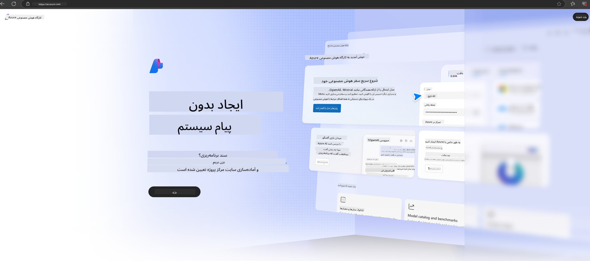

<!--
CO_OP_TRANSLATOR_METADATA:
{
  "original_hash": "3a1e48b628022485aac989c9f733e792",
  "translation_date": "2025-03-27T13:23:22+00:00",
  "source_file": "md\\02.QuickStart\\AzureAIFoundry_QuickStart.md",
  "language_code": "fa"
}
-->
# **استفاده از Phi-3 در Azure AI Foundry**

با توسعه هوش مصنوعی تولیدی، امیدواریم از یک پلتفرم یکپارچه برای مدیریت مدل‌های بزرگ زبانی (LLM) و مدل‌های کوچک زبانی (SLM)، یکپارچه‌سازی داده‌های سازمانی، عملیات تنظیم دقیق/RAG، و ارزیابی کسب‌وکارهای مختلف سازمانی پس از ادغام LLM و SLM استفاده کنیم تا برنامه‌های هوش مصنوعی تولیدی به صورت هوشمندانه‌تر پیاده‌سازی شوند. [Azure AI Foundry](https://ai.azure.com) یک پلتفرم برنامه‌های هوش مصنوعی تولیدی در سطح سازمانی است.

با استفاده از Azure AI Foundry، می‌توانید پاسخ‌های مدل‌های بزرگ زبانی (LLM) را ارزیابی کرده و اجزای برنامه‌های درخواست را با جریان درخواست هماهنگ کنید تا عملکرد بهتری داشته باشید. این پلتفرم امکان مقیاس‌پذیری را فراهم می‌کند تا اثبات مفهوم‌ها به سادگی به تولید کامل تبدیل شوند. نظارت و اصلاح مداوم از موفقیت بلندمدت حمایت می‌کند.

ما می‌توانیم مدل Phi-3 را به سرعت از طریق مراحل ساده‌ای در Azure AI Foundry مستقر کنیم و سپس از Azure AI Foundry برای انجام کارهای مرتبط با Phi-3 مانند Playground/Chat، تنظیم دقیق، ارزیابی و سایر موارد استفاده کنیم.

## **۱. آماده‌سازی**

اگر [Azure Developer CLI](https://learn.microsoft.com/azure/developer/azure-developer-cli/overview?WT.mc_id=aiml-138114-kinfeylo) را روی دستگاه خود نصب کرده‌اید، استفاده از این قالب به سادگی اجرای این دستور در یک پوشه جدید است.

## ایجاد دستی

ایجاد یک پروژه و هاب در Microsoft Azure AI Foundry راهی عالی برای سازماندهی و مدیریت کارهای هوش مصنوعی شماست. در اینجا یک راهنمای گام‌به‌گام برای شروع آورده شده است:

### ایجاد پروژه در Azure AI Foundry

1. **رفتن به Azure AI Foundry**: وارد پورتال Azure AI Foundry شوید.
2. **ایجاد پروژه**:
   - اگر در یک پروژه هستید، گزینه "Azure AI Foundry" را در بالای سمت چپ صفحه انتخاب کنید تا به صفحه اصلی بروید.
   - گزینه "+ Create project" را انتخاب کنید.
   - نامی برای پروژه وارد کنید.
   - اگر یک هاب دارید، به صورت پیش‌فرض انتخاب می‌شود. اگر به بیش از یک هاب دسترسی دارید، می‌توانید یک هاب دیگر را از منوی کشویی انتخاب کنید. اگر می‌خواهید یک هاب جدید ایجاد کنید، گزینه "Create new hub" را انتخاب کرده و یک نام وارد کنید.
   - گزینه "Create" را انتخاب کنید.

### ایجاد هاب در Azure AI Foundry

1. **رفتن به Azure AI Foundry**: با حساب Azure خود وارد شوید.
2. **ایجاد هاب**:
   - مرکز مدیریت را از منوی سمت چپ انتخاب کنید.
   - گزینه "All resources" را انتخاب کنید، سپس فلش پایین کنار "+ New project" را انتخاب کرده و گزینه "+ New hub" را انتخاب کنید.
   - در پنجره "Create a new hub"، نامی برای هاب خود وارد کنید (مثلاً contoso-hub) و سایر فیلدها را مطابق میل خود تغییر دهید.
   - گزینه "Next" را انتخاب کنید، اطلاعات را بررسی کنید و سپس گزینه "Create" را انتخاب کنید.

برای دستورالعمل‌های دقیق‌تر، می‌توانید به [مستندات رسمی مایکروسافت](https://learn.microsoft.com/azure/ai-studio/how-to/create-projects) مراجعه کنید.

پس از ایجاد موفقیت‌آمیز، می‌توانید به استودیویی که ایجاد کرده‌اید از طریق [ai.azure.com](https://ai.azure.com/) دسترسی پیدا کنید.

در یک AI Foundry می‌تواند چندین پروژه وجود داشته باشد. برای آماده‌سازی، یک پروژه در AI Foundry ایجاد کنید.

ایجاد [QuickStarts](https://learn.microsoft.com/azure/ai-studio/quickstarts/get-started-code) در Azure AI Foundry

## **۲. استقرار مدل Phi در Azure AI Foundry**

گزینه Explore پروژه را انتخاب کنید تا وارد کاتالوگ مدل شوید و Phi-3 را انتخاب کنید.

مدل Phi-3-mini-4k-instruct را انتخاب کنید.

روی 'Deploy' کلیک کنید تا مدل Phi-3-mini-4k-instruct مستقر شود.

> [!NOTE]
>
> هنگام استقرار می‌توانید قدرت محاسباتی را انتخاب کنید.

## **۳. گفتگوی Playground Phi در Azure AI Foundry**

به صفحه استقرار بروید، گزینه Playground را انتخاب کنید و با Phi-3 در Azure AI Foundry گفتگو کنید.

## **۴. استقرار مدل از Azure AI Foundry**

برای استقرار یک مدل از کاتالوگ مدل Azure، می‌توانید مراحل زیر را دنبال کنید:

- وارد Azure AI Foundry شوید.
- مدل مورد نظر خود را از کاتالوگ مدل Azure AI Foundry انتخاب کنید.
- در صفحه جزئیات مدل، گزینه Deploy را انتخاب کنید و سپس گزینه Serverless API با Azure AI Content Safety را انتخاب کنید.
- پروژه‌ای را که می‌خواهید مدل‌های خود را در آن مستقر کنید، انتخاب کنید. برای استفاده از گزینه Serverless API، فضای کاری شما باید متعلق به منطقه East US 2 یا Sweden Central باشد. می‌توانید نام استقرار را سفارشی کنید.
- در جادوگر استقرار، گزینه Pricing and terms را انتخاب کنید تا درباره قیمت‌گذاری و شرایط استفاده اطلاعات کسب کنید.
- گزینه Deploy را انتخاب کنید. صبر کنید تا استقرار آماده شود و به صفحه استقرار هدایت شوید.
- گزینه Open in playground را انتخاب کنید تا تعامل با مدل را شروع کنید.
- می‌توانید به صفحه استقرار بازگردید، استقرار را انتخاب کنید و URL هدف و کلید مخفی را یادداشت کنید که می‌توانید برای فراخوانی استقرار و تولید نتایج استفاده کنید.
- همیشه می‌توانید جزئیات URL و کلیدهای دسترسی را با رفتن به تب Build و انتخاب گزینه Deployments از بخش Components پیدا کنید.

> [!NOTE]
> لطفاً توجه داشته باشید که حساب شما باید دارای مجوزهای نقش Azure AI Developer در گروه منابع باشد تا بتوانید این مراحل را انجام دهید.

## **۵. استفاده از API Phi در Azure AI Foundry**

می‌توانید از طریق Postman GET به آدرس https://{Your project name}.region.inference.ml.azure.com/swagger.json دسترسی پیدا کنید و با ترکیب آن با کلید، درباره رابط‌های ارائه‌شده اطلاعات کسب کنید.

می‌توانید به راحتی پارامترهای درخواست و همچنین پارامترهای پاسخ را دریافت کنید.

**سلب مسئولیت**:  
این سند با استفاده از سرویس ترجمه هوش مصنوعی [Co-op Translator](https://github.com/Azure/co-op-translator) ترجمه شده است. در حالی که ما تلاش می‌کنیم دقت را حفظ کنیم، لطفاً توجه داشته باشید که ترجمه‌های خودکار ممکن است شامل اشتباهات یا نادقتی‌ها باشند. سند اصلی به زبان اصلی آن باید به عنوان منبع معتبر در نظر گرفته شود. برای اطلاعات حیاتی، توصیه می‌شود از ترجمه حرفه‌ای انسانی استفاده کنید. ما هیچ مسئولیتی در قبال سوءتفاهم‌ها یا تفسیرهای نادرست ناشی از استفاده از این ترجمه نداریم.