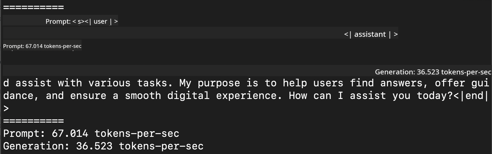
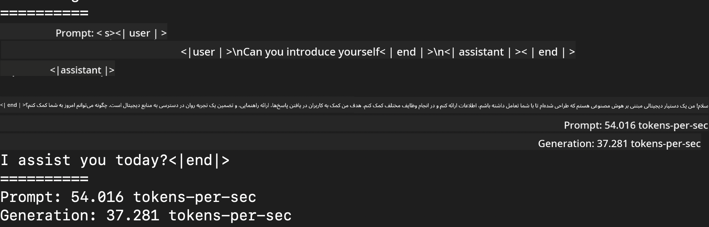
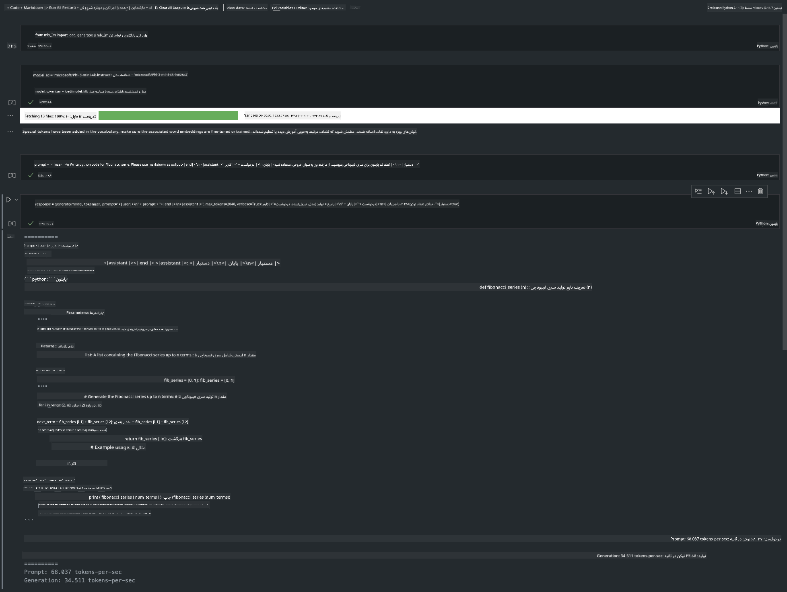

<!--
CO_OP_TRANSLATOR_METADATA:
{
  "original_hash": "dcb656f3d206fc4968e236deec5d4384",
  "translation_date": "2025-03-27T16:09:08+00:00",
  "source_file": "md\\03.FineTuning\\03.Inference\\MLX_Inference.md",
  "language_code": "fa"
}
-->
# **استنتاج Phi-3 با استفاده از فریمورک MLX اپل**

## **فریمورک MLX چیست؟**

MLX یک فریمورک آرایه‌ای برای تحقیقات یادگیری ماشین بر روی سیلیکون اپل است که توسط تیم تحقیقاتی یادگیری ماشین اپل ارائه شده است.

MLX توسط محققان یادگیری ماشین و برای محققان یادگیری ماشین طراحی شده است. این فریمورک به گونه‌ای طراحی شده که هم استفاده از آن راحت باشد و هم در آموزش و پیاده‌سازی مدل‌ها کارآمد باشد. طراحی این فریمورک به صورت مفهومی ساده است. هدف ما این است که محققان بتوانند به راحتی MLX را گسترش داده و بهبود دهند تا بتوانند ایده‌های جدید را سریع‌تر بررسی کنند.

مدل‌های زبان بزرگ (LLMs) می‌توانند بر روی دستگاه‌های سیلیکون اپل با استفاده از MLX سرعت بالایی داشته باشند و مدل‌ها به راحتی به صورت محلی اجرا شوند.

## **استفاده از MLX برای استنتاج Phi-3-mini**

### **1. تنظیم محیط MLX**

1. پایتون 3.11.x  
2. نصب کتابخانه MLX  

```bash

pip install mlx-lm

```

### **2. اجرای Phi-3-mini در ترمینال با MLX**

```bash

python -m mlx_lm.generate --model microsoft/Phi-3-mini-4k-instruct --max-token 2048 --prompt  "<|user|>\nCan you introduce yourself<|end|>\n<|assistant|>"

```

نتیجه (محیط من Apple M1 Max با 64 گیگابایت رم) به صورت زیر است:



### **3. کوانتیزه کردن Phi-3-mini با MLX در ترمینال**

```bash

python -m mlx_lm.convert --hf-path microsoft/Phi-3-mini-4k-instruct

```

***توجه:*** مدل از طریق mlx_lm.convert قابل کوانتیزه شدن است و کوانتیزه پیش‌فرض INT4 است. این مثال مدل Phi-3-mini را به INT4 کوانتیزه می‌کند.

مدل از طریق mlx_lm.convert قابل کوانتیزه شدن است و کوانتیزه پیش‌فرض INT4 است. این مثال مدل Phi-3-mini را به INT4 کوانتیزه می‌کند. پس از کوانتیزه شدن، مدل در دایرکتوری پیش‌فرض ./mlx_model ذخیره خواهد شد.

می‌توانیم مدل کوانتیزه‌شده با MLX را از طریق ترمینال آزمایش کنیم:

```bash

python -m mlx_lm.generate --model ./mlx_model/ --max-token 2048 --prompt  "<|user|>\nCan you introduce yourself<|end|>\n<|assistant|>"

```

نتیجه به صورت زیر است:



### **4. اجرای Phi-3-mini با MLX در Jupyter Notebook**



***توجه:*** لطفاً این نمونه را مطالعه کنید [بر روی این لینک کلیک کنید](../../../../../code/03.Inference/MLX/MLX_DEMO.ipynb)

## **منابع**

1. اطلاعات بیشتر درباره فریمورک MLX اپل [https://ml-explore.github.io](https://ml-explore.github.io/mlx/build/html/index.html)

2. مخزن گیت‌هاب MLX اپل [https://github.com/ml-explore](https://github.com/ml-explore)

**سلب مسئولیت**:  
این سند با استفاده از سرویس ترجمه هوش مصنوعی [Co-op Translator](https://github.com/Azure/co-op-translator) ترجمه شده است. در حالی که ما برای دقت تلاش می‌کنیم، لطفاً توجه داشته باشید که ترجمه‌های خودکار ممکن است شامل اشتباهات یا نواقص باشند. سند اصلی به زبان مادری باید به عنوان منبع معتبر در نظر گرفته شود. برای اطلاعات حیاتی، توصیه می‌شود از ترجمه حرفه‌ای انسانی استفاده کنید. ما مسئولیتی در قبال سوء تفاهم‌ها یا برداشت‌های نادرست ناشی از استفاده از این ترجمه نداریم.