<!--
CO_OP_TRANSLATOR_METADATA:
{
  "original_hash": "c1559c5af6caccf6f623fd43a6b3a9a3",
  "translation_date": "2025-03-27T13:47:30+00:00",
  "source_file": "md\\03.FineTuning\\FineTuning_AIFoundry.md",
  "language_code": "fa"
}
-->
# تنظیم مدل Phi-3 با استفاده از Azure AI Foundry

بیایید بررسی کنیم چگونه می‌توان مدل زبان کوچک Phi-3 Mini مایکروسافت را با استفاده از Azure AI Foundry تنظیم کرد. تنظیم مدل به شما امکان می‌دهد تا Phi-3 Mini را برای وظایف خاصی سفارشی کنید و قدرت و آگاهی بیشتری به آن ببخشید.

## ملاحظات

- **توانایی‌ها:** کدام مدل‌ها قابلیت تنظیم دارند؟ مدل پایه چه کارهایی را می‌تواند انجام دهد؟
- **هزینه:** مدل قیمت‌گذاری برای تنظیم چگونه است؟
- **سفارشی‌سازی:** تا چه حد می‌توان مدل پایه را تغییر داد و به چه روش‌هایی؟
- **سهولت:** فرآیند تنظیم چگونه انجام می‌شود؟ آیا نیاز به نوشتن کد سفارشی دارم؟ آیا باید از منابع محاسباتی خود استفاده کنم؟
- **ایمنی:** مدل‌های تنظیم‌شده ممکن است خطرات ایمنی داشته باشند. آیا اقدامات محافظتی برای جلوگیری از آسیب‌های ناخواسته وجود دارد؟

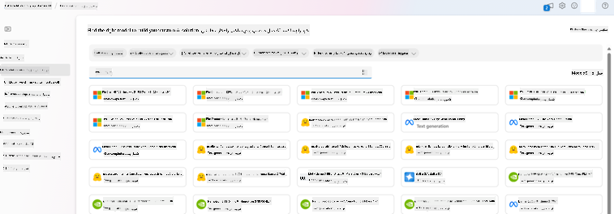

## آماده‌سازی برای تنظیم مدل

### پیش‌نیازها

> [!NOTE]  
> برای مدل‌های خانواده Phi-3، تنظیم مدل با روش پرداخت بر اساس استفاده فقط در هاب‌های ایجاد شده در مناطق **East US 2** موجود است.

- یک اشتراک Azure. اگر اشتراک Azure ندارید، یک [حساب Azure پولی](https://azure.microsoft.com/pricing/purchase-options/pay-as-you-go) ایجاد کنید تا شروع کنید.

- یک [پروژه AI Foundry](https://ai.azure.com?WT.mc_id=aiml-138114-kinfeylo).
- کنترل‌های دسترسی مبتنی بر نقش Azure (Azure RBAC) برای اعطای دسترسی به عملیات در Azure AI Foundry استفاده می‌شوند. برای انجام مراحل این مقاله، حساب کاربری شما باید به نقش __Azure AI Developer__ در گروه منابع اختصاص داده شده باشد.

### ثبت ارائه‌دهنده اشتراک

تایید کنید که اشتراک برای ارائه‌دهنده منابع `Microsoft.Network` ثبت شده است.

1. وارد [پورتال Azure](https://portal.azure.com) شوید.  
1. از منوی سمت چپ گزینه **Subscriptions** را انتخاب کنید.  
1. اشتراکی را که می‌خواهید استفاده کنید انتخاب کنید.  
1. از منوی سمت چپ گزینه **AI project settings** > **Resource providers** را انتخاب کنید.  
1. تایید کنید که **Microsoft.Network** در لیست ارائه‌دهندگان منابع موجود است. در غیر این صورت، آن را اضافه کنید.  

### آماده‌سازی داده‌ها

داده‌های آموزشی و اعتبارسنجی خود را برای تنظیم مدل آماده کنید. مجموعه داده‌های آموزشی و اعتبارسنجی شامل نمونه‌های ورودی و خروجی است که نشان می‌دهد مدل چگونه باید عمل کند.

اطمینان حاصل کنید که همه نمونه‌های آموزشی شما از فرمت مورد انتظار برای پیش‌بینی پیروی می‌کنند. برای تنظیم موثر مدل‌ها، از یک مجموعه داده متعادل و متنوع استفاده کنید.

این شامل حفظ تعادل داده‌ها، گنجاندن سناریوهای مختلف و بهبود دوره‌ای داده‌های آموزشی برای تطابق با انتظارات دنیای واقعی است که در نهایت منجر به پاسخ‌های دقیق‌تر و متعادل‌تر مدل می‌شود.

مدل‌های مختلف نیاز به فرمت‌های متفاوتی از داده‌های آموزشی دارند.

### تکمیل چت

داده‌های آموزشی و اعتبارسنجی شما **باید** به صورت سند JSON Lines (JSONL) فرمت شده باشد. برای `Phi-3-mini-128k-instruct` مجموعه داده تنظیم باید در فرمت مکالمه‌ای که توسط API تکمیل چت استفاده می‌شود، باشد.

### نمونه فرمت فایل

```json
    {"messages": [{"role": "system", "content": "You are an Xbox customer support agent whose primary goal is to help users with issues they are experiencing with their Xbox devices. You are friendly and concise. You only provide factual answers to queries, and do not provide answers that are not related to Xbox."}, {"role": "user", "content": "Is Xbox better than PlayStation?"}, {"role": "assistant", "content": "I apologize, but I cannot provide personal opinions. My primary job is to assist you with any issues related to your Xbox device. Do you have any Xbox-related issues that need addressing?"}]}
    {"messages": [{"role": "system", "content": "You are an Xbox customer support agent whose primary goal is to help users with issues they are experiencing with their Xbox devices. You are friendly and concise. You only provide factual answers to queries, and do not provide answers that are not related to Xbox."}, {"role": "user", "content": "Can I play PC games on my Xbox?"}, {"role": "assistant", "content": "While Xbox consoles don't natively support PC games, they can play an array of Xbox games, many of which are also available on PC. Can I assist you with finding games compatible with your Xbox device?"}]}
    {"messages": [{"role": "system", "content": "You are an Xbox customer support agent whose primary goal is to help users with issues they are experiencing with their Xbox devices. You are friendly and concise. You only provide factual answers to queries, and do not provide answers that are not related to Xbox."}, {"role": "user", "content": "I'm having trouble connecting my Xbox to the Wi-Fi."}, {"role": "assistant", "content": "No worries, let's go through the network settings on your Xbox. Can you please tell me what happens when you try to connect it to the Wi-Fi?"}]}
```

نوع فایل پشتیبانی‌شده JSON Lines است. فایل‌ها به datastore پیش‌فرض آپلود شده و در پروژه شما قابل دسترس هستند.

## تنظیم مدل Phi-3 با Azure AI Foundry

Azure AI Foundry به شما امکان می‌دهد مدل‌های زبان بزرگ را به مجموعه داده‌های شخصی خود تنظیم کنید. تنظیم مدل ارزش قابل توجهی ایجاد می‌کند، زیرا امکان سفارشی‌سازی و بهینه‌سازی برای وظایف و کاربردهای خاص را فراهم می‌کند. این فرآیند منجر به عملکرد بهتر، صرفه‌جویی در هزینه، کاهش تأخیر و خروجی‌های سفارشی می‌شود.

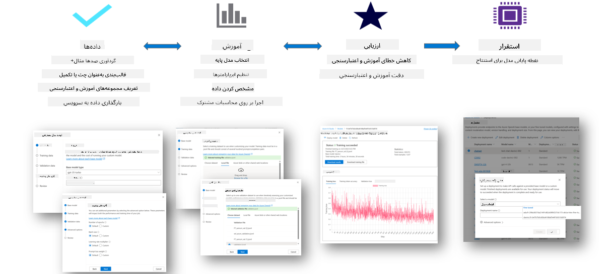

### ایجاد یک پروژه جدید

1. وارد [Azure AI Foundry](https://ai.azure.com) شوید.

1. گزینه **+New project** را برای ایجاد یک پروژه جدید در Azure AI Foundry انتخاب کنید.

    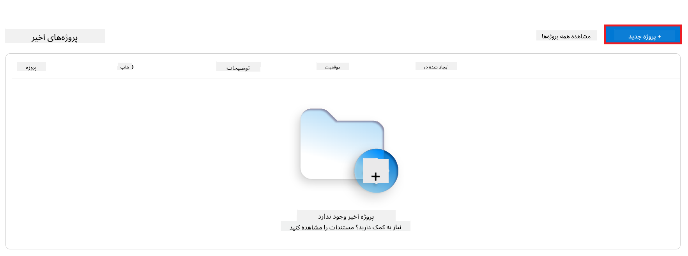

1. اقدامات زیر را انجام دهید:

    - **نام هاب پروژه**. باید یک مقدار منحصر به فرد باشد.
    - **هاب** مورد نظر را انتخاب کنید (در صورت نیاز یک هاب جدید ایجاد کنید).

    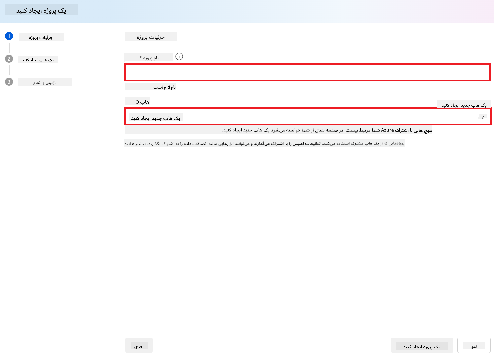

1. اقدامات زیر را برای ایجاد یک هاب جدید انجام دهید:

    - **نام هاب** را وارد کنید. باید یک مقدار منحصر به فرد باشد.
    - **اشتراک Azure** خود را انتخاب کنید.
    - **گروه منابع** مورد نظر را انتخاب کنید (در صورت نیاز یک گروه جدید ایجاد کنید).
    - **موقعیت مکانی** مورد نظر خود را انتخاب کنید.
    - گزینه **اتصال خدمات Azure AI** را انتخاب کنید (در صورت نیاز یک اتصال جدید ایجاد کنید).
    - گزینه **اتصال جستجوی Azure AI** را به **رد اتصال** تنظیم کنید.

    

1. گزینه **Next** را انتخاب کنید.  
1. گزینه **Create a project** را انتخاب کنید.  

### آماده‌سازی داده‌ها

قبل از تنظیم مدل، یک مجموعه داده مرتبط با وظیفه خود جمع‌آوری یا ایجاد کنید، مانند دستورالعمل‌های چت، جفت‌های پرسش و پاسخ، یا هر داده متنی دیگر. این داده‌ها را با حذف نویز، مدیریت مقادیر گمشده و توکن‌سازی متن پاکسازی و پیش‌پردازش کنید.

### تنظیم مدل‌های Phi-3 در Azure AI Foundry

> [!NOTE]  
> تنظیم مدل‌های Phi-3 در پروژه‌های واقع در East US 2 پشتیبانی می‌شود.

1. از تب سمت چپ گزینه **Model catalog** را انتخاب کنید.  

1. در **نوار جستجو** عبارت *phi-3* را وارد کنید و مدل phi-3 مورد نظر خود را انتخاب کنید.  

    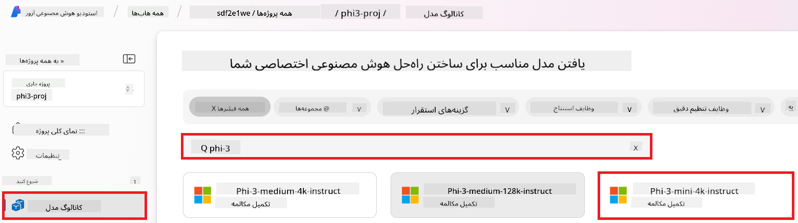

1. گزینه **Fine-tune** را انتخاب کنید.  

    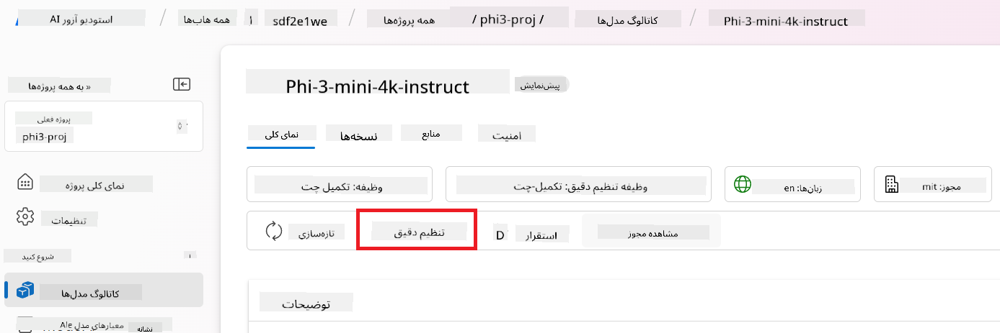

1. **نام مدل تنظیم‌شده** را وارد کنید.  

    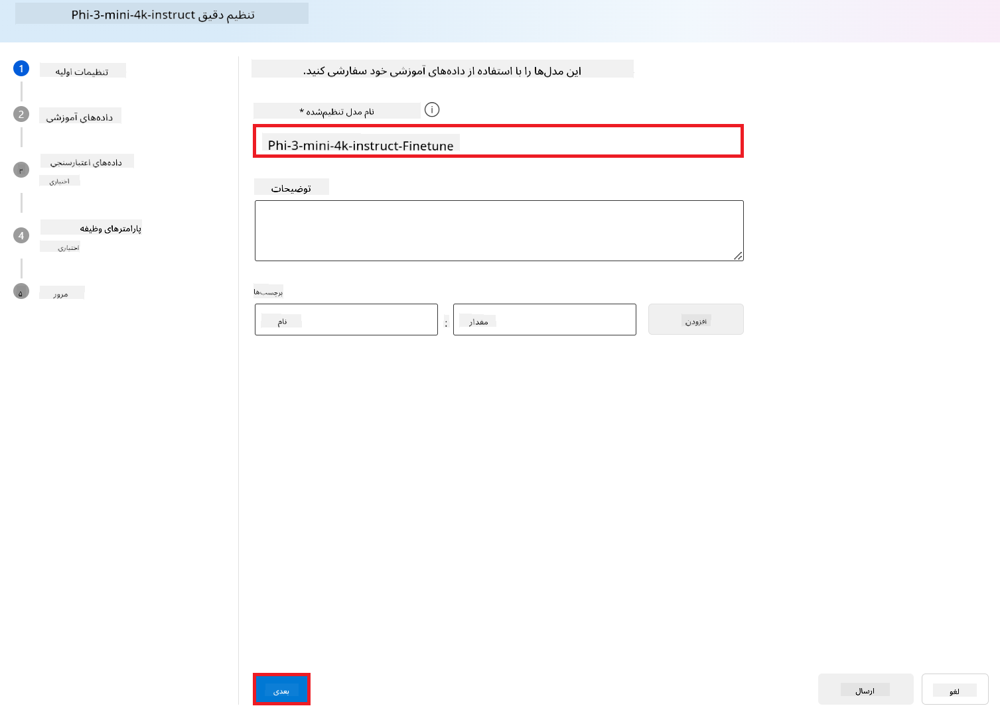

1. گزینه **Next** را انتخاب کنید.  

1. اقدامات زیر را انجام دهید:

    - **نوع وظیفه** را به **تکمیل چت** تنظیم کنید.
    - **داده‌های آموزشی** مورد نظر خود را انتخاب کنید. می‌توانید آن را از طریق داده‌های Azure AI Foundry یا محیط محلی خود آپلود کنید.

    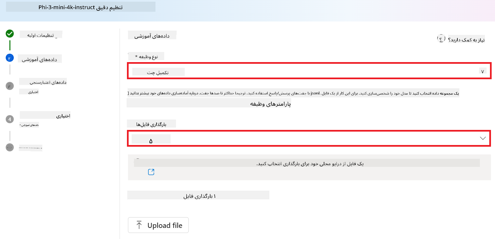

1. گزینه **Next** را انتخاب کنید.  

1. **داده‌های اعتبارسنجی** مورد نظر خود را آپلود کنید یا گزینه **تقسیم خودکار داده‌های آموزشی** را انتخاب کنید.  

    

1. گزینه **Next** را انتخاب کنید.  

1. اقدامات زیر را انجام دهید:

    - **ضریب اندازه دسته** مورد نظر خود را انتخاب کنید.
    - **نرخ یادگیری** مورد نظر خود را انتخاب کنید.
    - **تعداد دوره‌ها** مورد نظر خود را انتخاب کنید.

    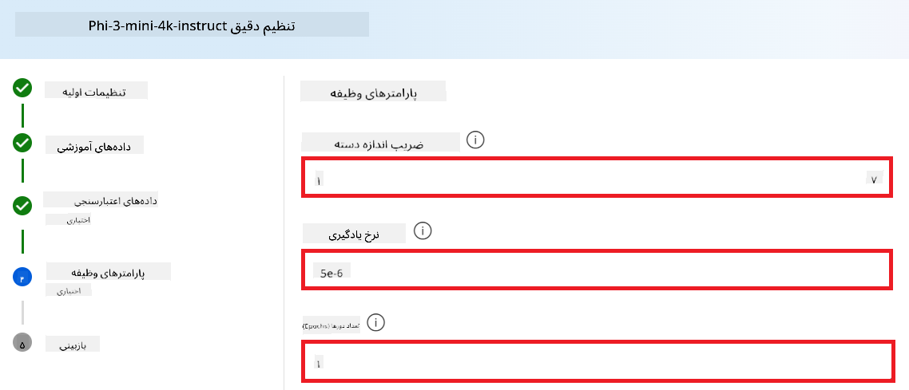

1. گزینه **Submit** را برای شروع فرآیند تنظیم انتخاب کنید.  

    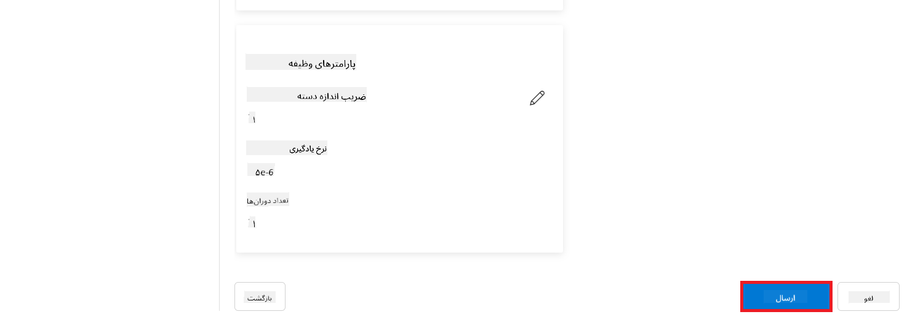

1. پس از تنظیم مدل، وضعیت آن به عنوان **Completed** نمایش داده می‌شود، همانطور که در تصویر زیر نشان داده شده است. اکنون می‌توانید مدل را مستقر کرده و از آن در برنامه خود، محیط آزمایش یا جریان دستورات استفاده کنید. برای اطلاعات بیشتر، به [چگونه مدل‌های خانواده Phi-3 را با Azure AI Foundry مستقر کنیم](https://learn.microsoft.com/azure/ai-studio/how-to/deploy-models-phi-3?tabs=phi-3-5&pivots=programming-language-python) مراجعه کنید.

    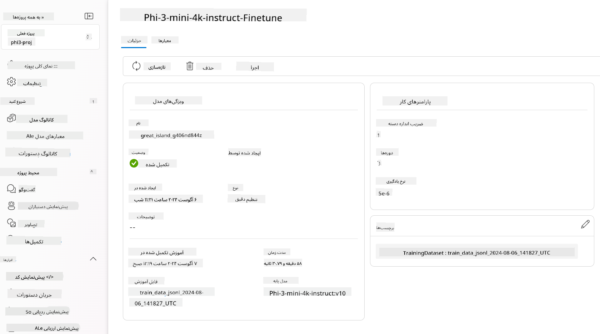

> [!NOTE]  
> برای اطلاعات بیشتر در مورد تنظیم مدل‌های Phi-3، لطفاً به [تنظیم مدل‌های Phi-3 در Azure AI Foundry](https://learn.microsoft.com/azure/ai-studio/how-to/fine-tune-phi-3?tabs=phi-3-mini) مراجعه کنید.

## پاکسازی مدل‌های تنظیم‌شده

می‌توانید یک مدل تنظیم‌شده را از لیست مدل‌های تنظیم‌شده در [Azure AI Foundry](https://ai.azure.com) یا از صفحه جزئیات مدل حذف کنید. مدل تنظیم‌شده مورد نظر را از صفحه تنظیم انتخاب کنید و سپس دکمه حذف را برای حذف مدل تنظیم‌شده انتخاب کنید.

> [!NOTE]  
> نمی‌توانید یک مدل سفارشی را حذف کنید اگر استقرار فعلی دارد. ابتدا باید استقرار مدل خود را حذف کنید تا بتوانید مدل سفارشی خود را حذف کنید.

## هزینه و سهمیه‌ها

### ملاحظات هزینه و سهمیه برای مدل‌های Phi-3 تنظیم‌شده به عنوان سرویس

مدل‌های Phi که به عنوان سرویس تنظیم شده‌اند توسط مایکروسافت ارائه شده و با Azure AI Foundry یکپارچه شده‌اند. شما می‌توانید قیمت‌گذاری را هنگام [استقرار](https://learn.microsoft.com/azure/ai-studio/how-to/deploy-models-phi-3?tabs=phi-3-5&pivots=programming-language-python) یا تنظیم مدل‌ها در تب قیمت‌گذاری و شرایط در جادوگر استقرار پیدا کنید.

## فیلتر کردن محتوا

مدل‌هایی که به عنوان سرویس با روش پرداخت بر اساس استفاده مستقر شده‌اند توسط ایمنی محتوای Azure AI محافظت می‌شوند. هنگام استقرار به نقاط پایانی زمان واقعی، می‌توانید از این قابلیت انصراف دهید. با ایمنی محتوای Azure AI فعال، هم درخواست و هم پاسخ از طریق مجموعه‌ای از مدل‌های طبقه‌بندی عبور می‌کنند که هدف آن تشخیص و جلوگیری از خروجی محتوای مضر است. سیستم فیلتر کردن محتوا اقدامات لازم را بر اساس دسته‌های خاصی از محتوای بالقوه مضر در درخواست‌ها و پاسخ‌ها انجام می‌دهد. اطلاعات بیشتر را در [ایمنی محتوای Azure AI](https://learn.microsoft.com/azure/ai-studio/concepts/content-filtering) بخوانید.

**پیکربندی تنظیم**

هایپرپارامترها: هایپرپارامترهایی مانند نرخ یادگیری، اندازه دسته، و تعداد دوره‌های آموزشی را تعریف کنید.

**تابع زیان**

یک تابع زیان مناسب برای وظیفه خود انتخاب کنید (مثلاً cross-entropy).

**بهینه‌ساز**

یک بهینه‌ساز (مثلاً Adam) برای به‌روزرسانی گرادیان‌ها در طول آموزش انتخاب کنید.

**فرآیند تنظیم**

- بارگذاری مدل پیش‌آموزش‌دیده: نقطه بررسی Phi-3 Mini را بارگذاری کنید.
- افزودن لایه‌های سفارشی: لایه‌های خاص وظیفه (مثلاً سر طبقه‌بندی برای دستورالعمل‌های چت) را اضافه کنید.

**آموزش مدل**
مدل را با استفاده از مجموعه داده آماده‌شده خود تنظیم کنید. پیشرفت آموزش را نظارت کرده و هایپرپارامترها را در صورت نیاز تنظیم کنید.

**ارزیابی و اعتبارسنجی**

مجموعه اعتبارسنجی: داده‌های خود را به مجموعه‌های آموزشی و اعتبارسنجی تقسیم کنید.

**ارزیابی عملکرد**

از معیارهایی مانند دقت، F1-score یا perplexity برای ارزیابی عملکرد مدل استفاده کنید.

## ذخیره مدل تنظیم‌شده

**نقطه بررسی**
مدل تنظیم‌شده را برای استفاده‌های آینده ذخیره کنید.

## استقرار

- استقرار به عنوان یک سرویس وب: مدل تنظیم‌شده خود را به عنوان یک سرویس وب در Azure AI Foundry مستقر کنید.
- آزمایش نقطه پایانی: درخواست‌های آزمایشی به نقطه پایانی مستقر شده ارسال کنید تا عملکرد آن را بررسی کنید.

## تکرار و بهبود

تکرار: اگر عملکرد رضایت‌بخش نیست، با تنظیم هایپرپارامترها، افزودن داده‌های بیشتر یا تنظیم مدل برای دوره‌های اضافی تکرار کنید.

## نظارت و اصلاح

به طور مداوم رفتار مدل را نظارت کرده و در صورت نیاز اصلاح کنید.

## سفارشی‌سازی و گسترش

وظایف سفارشی: Phi-3 Mini می‌تواند برای وظایف مختلف فراتر از دستورالعمل‌های چت تنظیم شود. موارد استفاده دیگر را بررسی کنید!  
آزمایش: معماری‌ها، ترکیب لایه‌ها و تکنیک‌های مختلف را برای بهبود عملکرد امتحان کنید.

> [!NOTE]  
> تنظیم مدل یک فرآیند تکراری است. آزمایش کنید، یاد بگیرید و مدل خود را برای دستیابی به بهترین نتایج برای وظیفه خاص خود تطبیق دهید!

**سلب مسئولیت**:  
این سند با استفاده از سرویس ترجمه هوش مصنوعی [Co-op Translator](https://github.com/Azure/co-op-translator) ترجمه شده است. در حالی که ما تلاش می‌کنیم دقت را رعایت کنیم، لطفاً توجه داشته باشید که ترجمه‌های خودکار ممکن است حاوی خطاها یا نادرستی‌هایی باشند. سند اصلی به زبان بومی آن باید به عنوان منبع معتبر در نظر گرفته شود. برای اطلاعات حساس، ترجمه حرفه‌ای انسانی توصیه می‌شود. ما هیچ مسئولیتی در قبال سوءتفاهم‌ها یا تفسیرهای نادرست ناشی از استفاده از این ترجمه نداریم.