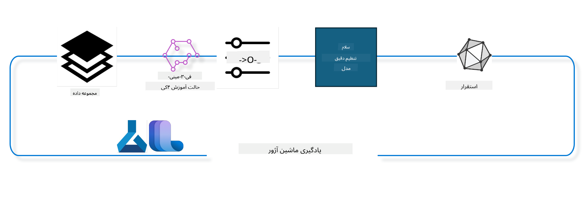

<!--
CO_OP_TRANSLATOR_METADATA:
{
  "original_hash": "944949f040e61b2ea25b3460f7394fd4",
  "translation_date": "2025-03-27T14:50:35+00:00",
  "source_file": "md\\03.FineTuning\\FineTuning_MLSDK.md",
  "language_code": "fa"
}
-->
## نحوه استفاده از کامپوننت‌های تکمیل گفتگو از رجیستری سیستم Azure ML برای تنظیم دقیق مدل

در این مثال، تنظیم دقیق مدل Phi-3-mini-4k-instruct را برای تکمیل یک مکالمه بین دو نفر با استفاده از مجموعه داده ultrachat_200k انجام خواهیم داد.



این مثال به شما نشان می‌دهد که چگونه با استفاده از Azure ML SDK و پایتون تنظیم دقیق را انجام دهید و سپس مدل تنظیم شده را به یک نقطه پایانی آنلاین برای استنتاج در زمان واقعی مستقر کنید.

### داده‌های آموزشی

ما از مجموعه داده ultrachat_200k استفاده خواهیم کرد. این نسخه بسیار فیلتر شده‌ای از مجموعه داده UltraChat است و برای آموزش مدل Zephyr-7B-β، یک مدل چت پیشرفته 7 میلیاردی، استفاده شده است.

### مدل

ما از مدل Phi-3-mini-4k-instruct استفاده می‌کنیم تا نشان دهیم چگونه کاربران می‌توانند مدل را برای وظیفه تکمیل گفتگو تنظیم کنند. اگر این دفترچه را از یک کارت مدل خاص باز کرده‌اید، به یاد داشته باشید که نام مدل خاص را جایگزین کنید.

### وظایف

- انتخاب یک مدل برای تنظیم دقیق.
- انتخاب و بررسی داده‌های آموزشی.
- پیکربندی کار تنظیم دقیق.
- اجرای کار تنظیم دقیق.
- بررسی معیارهای آموزشی و ارزیابی.
- ثبت مدل تنظیم شده.
- استقرار مدل تنظیم شده برای استنتاج در زمان واقعی.
- پاکسازی منابع.

## 1. تنظیم پیش‌نیازها

- نصب وابستگی‌ها
- اتصال به AzureML Workspace. اطلاعات بیشتر در مورد تنظیم احراز هویت SDK. <WORKSPACE_NAME>، <RESOURCE_GROUP> و <SUBSCRIPTION_ID> را در زیر جایگزین کنید.
- اتصال به رجیستری سیستم azureml
- تنظیم یک نام آزمایش اختیاری
- بررسی یا ایجاد محاسبات.

> [!NOTE]
> الزامات: یک گره GPU می‌تواند دارای چندین کارت GPU باشد. برای مثال، در یک گره از Standard_NC24rs_v3 چهار GPU NVIDIA V100 وجود دارد، در حالی که در Standard_NC12s_v3 دو GPU NVIDIA V100 وجود دارد. به اسناد برای این اطلاعات مراجعه کنید. تعداد کارت‌های GPU در هر گره در پارامتر gpus_per_node در زیر تنظیم شده است. تنظیم صحیح این مقدار استفاده از همه GPU‌های موجود در گره را تضمین می‌کند. SKU‌های محاسبات GPU توصیه شده را می‌توانید اینجا و اینجا پیدا کنید.

### کتابخانه‌های پایتون

وابستگی‌ها را با اجرای سلول زیر نصب کنید. این مرحله در صورتی که در محیط جدید اجرا شود اختیاری نیست.

```bash
pip install azure-ai-ml
pip install azure-identity
pip install datasets==2.9.0
pip install mlflow
pip install azureml-mlflow
```

### تعامل با Azure ML

1. این اسکریپت پایتون برای تعامل با سرویس Azure Machine Learning (Azure ML) استفاده می‌شود. در اینجا خلاصه‌ای از عملکرد آن آمده است:

    - ماژول‌های مورد نیاز از بسته‌های azure.ai.ml، azure.identity و azure.ai.ml.entities را وارد می‌کند. همچنین ماژول time را وارد می‌کند.

    - سعی می‌کند با استفاده از DefaultAzureCredential() احراز هویت کند که تجربه احراز هویت ساده‌ای را برای شروع سریع توسعه برنامه‌ها در فضای ابری Azure فراهم می‌کند. اگر این روش شکست بخورد، به InteractiveBrowserCredential() که یک پیام ورود تعاملی ارائه می‌دهد، برمی‌گردد.

    - سپس تلاش می‌کند یک نمونه MLClient با استفاده از متد from_config ایجاد کند که پیکربندی را از فایل پیکربندی پیش‌فرض (config.json) می‌خواند. اگر این روش شکست بخورد، یک نمونه MLClient با ارائه دستی subscription_id، resource_group_name و workspace_name ایجاد می‌کند.

    - یک نمونه دیگر MLClient ایجاد می‌کند، این بار برای رجیستری Azure ML به نام "azureml". این رجیستری جایی است که مدل‌ها، خطوط لوله تنظیم دقیق و محیط‌ها ذخیره می‌شوند.

    - experiment_name را به "chat_completion_Phi-3-mini-4k-instruct" تنظیم می‌کند.

    - یک timestamp منحصر به فرد با تبدیل زمان فعلی (به ثانیه از زمان مبدأ، به عنوان عدد اعشاری) به عدد صحیح و سپس به رشته ایجاد می‌کند. این timestamp می‌تواند برای ایجاد نام‌ها و نسخه‌های منحصر به فرد استفاده شود.

    ```python
    # Import necessary modules from Azure ML and Azure Identity
    from azure.ai.ml import MLClient
    from azure.identity import (
        DefaultAzureCredential,
        InteractiveBrowserCredential,
    )
    from azure.ai.ml.entities import AmlCompute
    import time  # Import time module
    
    # Try to authenticate using DefaultAzureCredential
    try:
        credential = DefaultAzureCredential()
        credential.get_token("https://management.azure.com/.default")
    except Exception as ex:  # If DefaultAzureCredential fails, use InteractiveBrowserCredential
        credential = InteractiveBrowserCredential()
    
    # Try to create an MLClient instance using the default config file
    try:
        workspace_ml_client = MLClient.from_config(credential=credential)
    except:  # If that fails, create an MLClient instance by manually providing the details
        workspace_ml_client = MLClient(
            credential,
            subscription_id="<SUBSCRIPTION_ID>",
            resource_group_name="<RESOURCE_GROUP>",
            workspace_name="<WORKSPACE_NAME>",
        )
    
    # Create another MLClient instance for the Azure ML registry named "azureml"
    # This registry is where models, fine-tuning pipelines, and environments are stored
    registry_ml_client = MLClient(credential, registry_name="azureml")
    
    # Set the experiment name
    experiment_name = "chat_completion_Phi-3-mini-4k-instruct"
    
    # Generate a unique timestamp that can be used for names and versions that need to be unique
    timestamp = str(int(time.time()))
    ```

## 2. انتخاب یک مدل پایه برای تنظیم دقیق

1. Phi-3-mini-4k-instruct یک مدل سبک با 3.8 میلیارد پارامتر است که بر اساس مجموعه داده‌هایی که برای Phi-2 استفاده شده‌اند، ساخته شده است. این مدل متعلق به خانواده مدل‌های Phi-3 است و نسخه Mini در دو نوع 4K و 128K عرضه می‌شود که طول زمینه (بر اساس توکن‌ها) را که می‌تواند پشتیبانی کند نشان می‌دهد. ما نیاز داریم مدل را برای هدف خاص خود تنظیم دقیق کنیم تا بتوانیم از آن استفاده کنیم. شما می‌توانید این مدل‌ها را در کاتالوگ مدل در AzureML Studio مرور کنید، با فیلتر کردن بر اساس وظیفه تکمیل گفتگو. در این مثال، ما از مدل Phi-3-mini-4k-instruct استفاده می‌کنیم. اگر این دفترچه را برای مدل دیگری باز کرده‌اید، نام مدل و نسخه را مطابق نیاز جایگزین کنید.

    > [!NOTE]
    > ویژگی id مدل. این ویژگی به عنوان ورودی به کار تنظیم دقیق ارسال خواهد شد. همچنین این ویژگی به عنوان فیلد Asset ID در صفحه جزئیات مدل در کاتالوگ مدل AzureML Studio موجود است.

2. این اسکریپت پایتون با سرویس Azure Machine Learning (Azure ML) تعامل دارد. در اینجا خلاصه‌ای از عملکرد آن آمده است:

    - model_name را به "Phi-3-mini-4k-instruct" تنظیم می‌کند.

    - از متد get متعلق به ویژگی models از شیء registry_ml_client برای بازیابی آخرین نسخه مدل با نام مشخص از رجیستری Azure ML استفاده می‌کند. متد get با دو آرگومان فراخوانی می‌شود: نام مدل و برچسبی که مشخص می‌کند آخرین نسخه مدل باید بازیابی شود.

    - پیامی به کنسول چاپ می‌کند که نشان می‌دهد نام، نسخه و id مدل که برای تنظیم دقیق استفاده خواهد شد چیست. متد format رشته برای درج نام، نسخه و id مدل در پیام استفاده می‌شود. نام، نسخه و id مدل به عنوان ویژگی‌های شیء foundation_model قابل دسترسی هستند.

    ```python
    # Set the model name
    model_name = "Phi-3-mini-4k-instruct"
    
    # Get the latest version of the model from the Azure ML registry
    foundation_model = registry_ml_client.models.get(model_name, label="latest")
    
    # Print the model name, version, and id
    # This information is useful for tracking and debugging
    print(
        "\n\nUsing model name: {0}, version: {1}, id: {2} for fine tuning".format(
            foundation_model.name, foundation_model.version, foundation_model.id
        )
    )
    ```

## 3. ایجاد محاسبات برای استفاده در کار

کار تنظیم دقیق فقط با محاسبات GPU کار می‌کند. اندازه محاسبات به بزرگی مدل بستگی دارد و در بیشتر موارد تشخیص محاسبات مناسب برای کار دشوار می‌شود. در این سلول، ما کاربران را برای انتخاب محاسبات مناسب برای کار راهنمایی می‌کنیم.

> [!NOTE]
> محاسبات ذکر شده در زیر با پیکربندی بهینه‌ترین حالت کار می‌کنند. هرگونه تغییر در پیکربندی ممکن است منجر به خطای Cuda Out Of Memory شود. در چنین مواردی، سعی کنید محاسبات را به اندازه بزرگتری ارتقا دهید.

> [!NOTE]
> هنگام انتخاب compute_cluster_size در زیر، مطمئن شوید که محاسبات در گروه منابع شما موجود است. اگر محاسبات خاصی در دسترس نیست، می‌توانید درخواست دسترسی به منابع محاسباتی را ارسال کنید.

### بررسی مدل برای پشتیبانی تنظیم دقیق

1. این اسکریپت پایتون با یک مدل Azure Machine Learning (Azure ML) تعامل دارد. در اینجا خلاصه‌ای از عملکرد آن آمده است:

    - ماژول ast را وارد می‌کند که توابعی برای پردازش درخت‌های گرامر نحو انتزاعی پایتون ارائه می‌دهد.

    - بررسی می‌کند آیا شیء foundation_model (که نمایانگر یک مدل در Azure ML است) دارای یک برچسب به نام finetune_compute_allow_list است یا خیر. برچسب‌ها در Azure ML جفت‌های کلید-مقدار هستند که می‌توانید آنها را ایجاد کنید و برای فیلتر و مرتب‌سازی مدل‌ها استفاده کنید.

    - اگر برچسب finetune_compute_allow_list موجود باشد، از تابع ast.literal_eval برای تجزیه ایمن مقدار برچسب (یک رشته) به یک لیست پایتون استفاده می‌کند. این لیست سپس به متغیر computes_allow_list اختصاص داده می‌شود. سپس پیامی چاپ می‌کند که نشان می‌دهد یک محاسبات باید از لیست ایجاد شود.

    - اگر برچسب finetune_compute_allow_list موجود نباشد، computes_allow_list را به None تنظیم می‌کند و پیامی چاپ می‌کند که نشان می‌دهد برچسب finetune_compute_allow_list بخشی از برچسب‌های مدل نیست.

    - به طور خلاصه، این اسکریپت برچسب خاصی را در فراداده مدل بررسی می‌کند، مقدار برچسب را به لیست تبدیل می‌کند اگر موجود باشد، و بازخورد مناسب به کاربر ارائه می‌دهد.

    ```python
    # Import the ast module, which provides functions to process trees of the Python abstract syntax grammar
    import ast
    
    # Check if the 'finetune_compute_allow_list' tag is present in the model's tags
    if "finetune_compute_allow_list" in foundation_model.tags:
        # If the tag is present, use ast.literal_eval to safely parse the tag's value (a string) into a Python list
        computes_allow_list = ast.literal_eval(
            foundation_model.tags["finetune_compute_allow_list"]
        )  # convert string to python list
        # Print a message indicating that a compute should be created from the list
        print(f"Please create a compute from the above list - {computes_allow_list}")
    else:
        # If the tag is not present, set computes_allow_list to None
        computes_allow_list = None
        # Print a message indicating that the 'finetune_compute_allow_list' tag is not part of the model's tags
        print("`finetune_compute_allow_list` is not part of model tags")
    ```

### بررسی نمونه محاسبات

1. این اسکریپت پایتون با سرویس Azure Machine Learning (Azure ML) تعامل دارد و چندین بررسی روی یک نمونه محاسبات انجام می‌دهد. در اینجا خلاصه‌ای از عملکرد آن آمده است:

    - تلاش می‌کند نمونه محاسبات با نام ذخیره شده در compute_cluster را از فضای کاری Azure ML بازیابی کند. اگر حالت آماده‌سازی نمونه محاسبات "failed" باشد، یک ValueError ایجاد می‌کند.

    - بررسی می‌کند آیا computes_allow_list None نیست. اگر نیست، همه اندازه‌های محاسبات در لیست را به حروف کوچک تبدیل می‌کند و بررسی می‌کند آیا اندازه نمونه محاسبات فعلی در لیست موجود است یا خیر. اگر نیست، یک ValueError ایجاد می‌کند.

    - اگر computes_allow_list برابر با None باشد، بررسی می‌کند آیا اندازه نمونه محاسبات در لیست اندازه‌های VM GPU پشتیبانی نشده موجود است یا خیر. اگر هست، یک ValueError ایجاد می‌کند.

    - لیستی از همه اندازه‌های محاسبات موجود در فضای کاری را بازیابی می‌کند. سپس بر روی این لیست تکرار می‌کند و برای هر اندازه محاسبات بررسی می‌کند آیا نام آن با اندازه نمونه محاسبات فعلی مطابقت دارد یا خیر. اگر مطابقت داشته باشد، تعداد GPU‌ها برای آن اندازه محاسبات را بازیابی می‌کند و gpu_count_found را به True تنظیم می‌کند.

    - اگر gpu_count_found برابر با True باشد، تعداد GPU‌ها در نمونه محاسبات را چاپ می‌کند. اگر gpu_count_found برابر با False باشد، یک ValueError ایجاد می‌کند.

    - به طور خلاصه، این اسکریپت چندین بررسی روی یک نمونه محاسبات در فضای کاری Azure ML انجام می‌دهد، شامل بررسی حالت آماده‌سازی، اندازه آن در مقابل لیست مجاز یا لیست ممنوع، و تعداد GPU‌هایی که دارد.

    ```python
    # Print the exception message
    print(e)
    # Raise a ValueError if the compute size is not available in the workspace
    raise ValueError(
        f"WARNING! Compute size {compute_cluster_size} not available in workspace"
    )
    
    # Retrieve the compute instance from the Azure ML workspace
    compute = workspace_ml_client.compute.get(compute_cluster)
    # Check if the provisioning state of the compute instance is "failed"
    if compute.provisioning_state.lower() == "failed":
        # Raise a ValueError if the provisioning state is "failed"
        raise ValueError(
            f"Provisioning failed, Compute '{compute_cluster}' is in failed state. "
            f"please try creating a different compute"
        )
    
    # Check if computes_allow_list is not None
    if computes_allow_list is not None:
        # Convert all compute sizes in computes_allow_list to lowercase
        computes_allow_list_lower_case = [x.lower() for x in computes_allow_list]
        # Check if the size of the compute instance is in computes_allow_list_lower_case
        if compute.size.lower() not in computes_allow_list_lower_case:
            # Raise a ValueError if the size of the compute instance is not in computes_allow_list_lower_case
            raise ValueError(
                f"VM size {compute.size} is not in the allow-listed computes for finetuning"
            )
    else:
        # Define a list of unsupported GPU VM sizes
        unsupported_gpu_vm_list = [
            "standard_nc6",
            "standard_nc12",
            "standard_nc24",
            "standard_nc24r",
        ]
        # Check if the size of the compute instance is in unsupported_gpu_vm_list
        if compute.size.lower() in unsupported_gpu_vm_list:
            # Raise a ValueError if the size of the compute instance is in unsupported_gpu_vm_list
            raise ValueError(
                f"VM size {compute.size} is currently not supported for finetuning"
            )
    
    # Initialize a flag to check if the number of GPUs in the compute instance has been found
    gpu_count_found = False
    # Retrieve a list of all available compute sizes in the workspace
    workspace_compute_sku_list = workspace_ml_client.compute.list_sizes()
    available_sku_sizes = []
    # Iterate over the list of available compute sizes
    for compute_sku in workspace_compute_sku_list:
        available_sku_sizes.append(compute_sku.name)
        # Check if the name of the compute size matches the size of the compute instance
        if compute_sku.name.lower() == compute.size.lower():
            # If it does, retrieve the number of GPUs for that compute size and set gpu_count_found to True
            gpus_per_node = compute_sku.gpus
            gpu_count_found = True
    # If gpu_count_found is True, print the number of GPUs in the compute instance
    if gpu_count_found:
        print(f"Number of GPU's in compute {compute.size}: {gpus_per_node}")
    else:
        # If gpu_count_found is False, raise a ValueError
        raise ValueError(
            f"Number of GPU's in compute {compute.size} not found. Available skus are: {available_sku_sizes}."
            f"This should not happen. Please check the selected compute cluster: {compute_cluster} and try again."
        )
    ```

## 4. انتخاب مجموعه داده برای تنظیم دقیق مدل

1. ما از مجموعه داده ultrachat_200k استفاده می‌کنیم. این مجموعه داده دارای چهار تقسیم‌بندی است که برای تنظیم دقیق تحت نظارت (sft) مناسب هستند.
رتبه‌بندی تولید (gen). تعداد مثال‌ها در هر تقسیم‌بندی به شرح زیر است:

    ```bash
    train_sft test_sft  train_gen  test_gen
    207865  23110  256032  28304
    ```

1. سلول‌های بعدی آماده‌سازی پایه‌ای داده‌ها برای تنظیم دقیق را نشان می‌دهند:

### مشاهده برخی از سطرهای داده

ما می‌خواهیم این نمونه سریع اجرا شود، بنابراین فایل‌های train_sft و test_sft را که حاوی 5% از سطرهای قبلاً کوتاه شده هستند ذخیره کنید. این بدان معناست که مدل تنظیم دقیق شده دقت کمتری خواهد داشت، بنابراین نباید برای استفاده در دنیای واقعی قرار گیرد.
اسکریپت download-dataset.py برای دانلود مجموعه داده ultrachat_200k و تبدیل مجموعه داده به فرمت قابل مصرف توسط کامپوننت خط لوله تنظیم دقیق استفاده می‌شود. همچنین، چون مجموعه داده بزرگ است، در اینجا فقط بخشی از مجموعه داده را داریم.

1. اجرای اسکریپت زیر فقط 5% از داده‌ها را دانلود می‌کند. این مقدار را می‌توان با تغییر پارامتر dataset_split_pc به درصد مورد نظر افزایش داد.

    > [!NOTE]
    > برخی مدل‌های زبان کدهای زبانی متفاوتی دارند و بنابراین نام ستون‌ها در مجموعه داده باید این تفاوت را منعکس کند.

1. در اینجا مثالی از نحوه نمایش داده‌ها آمده است:
مجموعه داده تکمیل گفتگو در فرمت پارکت ذخیره شده است و هر ورودی از ساختار زیر استفاده می‌کند:

    - این یک سند JSON (JavaScript Object Notation) است که یک فرمت محبوب برای تبادل داده است. این کد اجرایی نیست، بلکه راهی برای ذخیره و انتقال داده‌ها است. در اینجا خلاصه‌ای از ساختار آن آمده است:

    - "prompt": این کلید یک مقدار رشته‌ای را نگه می‌دارد که نمایانگر یک وظیفه یا سؤال مطرح شده به یک دستیار هوش مصنوعی است.

    - "messages": این کلید یک آرایه از اشیاء را نگه می‌دارد. هر شیء نمایانگر یک پیام در مکالمه بین کاربر و دستیار هوش مصنوعی است. هر شیء پیام دارای دو کلید است:

    - "content": این کلید یک مقدار رشته‌ای را نگه می‌دارد که نمایانگر محتوای پیام است.
    - "role": این کلید یک مقدار رشته‌ای را نگه می‌دارد که نمایانگر نقش موجودی است که پیام را ارسال کرده است. می‌تواند "user" یا "assistant" باشد.
    - "prompt_id": این کلید یک مقدار رشته‌ای را نگه می‌دارد که نمایانگر شناسه منحصر به فرد برای prompt است.

1. در این سند JSON خاص، یک مکالمه نمایان شده است که در آن کاربر از دستیار هوش مصنوعی می‌خواهد یک شخصیت اصلی برای یک داستان دیستوپیایی ایجاد کند. دستیار پاسخ می‌دهد و سپس کاربر درخواست جزئیات بیشتری می‌کند. دستیار موافقت می‌کند که جزئیات بیشتری ارائه دهد. کل مکالمه با یک شناسه خاص prompt مرتبط است.

    ```python
    {
        // The task or question posed to an AI assistant
        "prompt": "Create a fully-developed protagonist who is challenged to survive within a dystopian society under the rule of a tyrant. ...",
        
        // An array of objects, each representing a message in a conversation between a user and an AI assistant
        "messages":[
            {
                // The content of the user's message
                "content": "Create a fully-developed protagonist who is challenged to survive within a dystopian society under the rule of a tyrant. ...",
                // The role of the entity that sent the message
                "role": "user"
            },
            {
                // The content of the assistant's message
                "content": "Name: Ava\n\n Ava was just 16 years old when the world as she knew it came crashing down. The government had collapsed, leaving behind a chaotic and lawless society. ...",
                // The role of the entity that sent the message
                "role": "assistant"
            },
            {
                // The content of the user's message
                "content": "Wow, Ava's story is so intense and inspiring! Can you provide me with more details.  ...",
                // The role of the entity that sent the message
                "role": "user"
            }, 
            {
                // The content of the assistant's message
                "content": "Certainly! ....",
                // The role of the entity that sent the message
                "role": "assistant"
            }
        ],
        
        // A unique identifier for the prompt
        "prompt_id": "d938b65dfe31f05f80eb8572964c6673eddbd68eff3db6bd234d7f1e3b86c2af"
    }
    ```

### دانلود داده‌ها

1. این اسکریپت پایتون برای دانلود یک مجموعه داده با استفاده از یک اسکریپت کمکی به نام download-dataset.py استفاده می‌شود. در اینجا خلاصه‌ای از عملکرد آن آمده است:

    - ماژول os را وارد می‌کند که راهی قابل حمل برای استفاده از قابلیت‌های وابسته به سیستم عامل فراهم می‌کند.

    - از تابع os.system برای اجرای اسکریپت download-dataset.py در پوسته با آرگومان‌های خط فرمان خاص استفاده می‌کند. آرگومان‌ها مجموعه داده‌ای که باید دانلود شود (HuggingFaceH4/ultrachat_200k)، دایرکتوری که باید به آن دانلود شود (ultrachat_200k_dataset)، و درصد تقسیم‌بندی مجموعه داده (5) را مشخص می‌کنند. تابع os.system وضعیت خروج دستور اجرا شده را برمی‌گرداند؛ این وضعیت در متغیر exit_status ذخیره می‌شود.

    - بررسی می‌کند آیا exit_status برابر با 0 نیست. در سیستم‌های عامل شبیه یونیکس، وضعیت خروج برابر با 0 معمولاً نشان‌دهنده موفقیت دستور است، در حالی که هر عدد دیگری نشان‌دهنده خطاست. اگر exit_status برابر با 0 نیست، یک Exception با پیام نشان‌دهنده وجود خطا در دانلود مجموعه داده ایجاد می‌کند.

    - به طور خلاصه، این اسکریپت یک دستور برای دانلود مجموعه داده با استفاده از یک اسکریپت کمکی اجرا می‌کند و اگر دستور شکست بخورد، یک استثناء ایجاد می‌کند.

    ```python
    # Import the os module, which provides a way of using operating system dependent functionality
    import os
    
    # Use the os.system function to run the download-dataset.py script in the shell with specific command-line arguments
    # The arguments specify the dataset to download (HuggingFaceH4/ultrachat_200k), the directory to download it to (ultrachat_200k_dataset), and the percentage of the dataset to split (5)
    # The os.system function returns the exit status of the command it executed; this status is stored in the exit_status variable
    exit_status = os.system(
        "python ./download-dataset.py --dataset HuggingFaceH4/ultrachat_200k --download_dir ultrachat_200k_dataset --dataset_split_pc 5"
    )
    
    # Check if exit_status is not 0
    # In Unix-like operating systems, an exit status of 0 usually indicates that a command has succeeded, while any other number indicates an error
    # If exit_status is not 0, raise an Exception with a message indicating that there was an error downloading the dataset
    if exit_status != 0:
        raise Exception("Error downloading dataset")
    ```

### بارگذاری داده‌ها در یک DataFrame

1. این اسکریپت پایتون یک فایل JSON Lines را در یک DataFrame پانداس بارگذاری می‌کند و پنج سطر اول را نمایش می‌دهد. در اینجا خلاصه‌ای از عملکرد آن آمده است:

    - کتابخانه pandas را وارد می‌کند که یک کتابخانه قدرتمند برای دستکاری و تحلیل داده‌ها است.

    - عرض ستون‌های نمایش داده شده برای گزینه‌های نمایش پانداس را به 0 تنظیم می‌کند. این بدان معناست که متن کامل هر ستون هنگام چاپ DataFrame بدون کوتاه شدن نمایش داده می‌شود.

    - از تابع pd.read_json برای بارگذاری فایل train_sft.jsonl از دایرکتوری ultrachat_200k_dataset در یک DataFrame استفاده می‌کند. آرگومان lines=True نشان می‌دهد که فایل در فرمت JSON Lines است که هر خط یک شیء JSON جداگانه است.

    - از متد head برای نمایش پنج سطر اول DataFrame استفاده می‌کند. اگر DataFrame کمتر از پنج سطر داشته باشد، همه آنها را نمایش می‌دهد.

    - به طور خلاصه، این اسکریپت یک فایل JSON Lines را در یک DataFrame بارگذاری می‌کند و پنج سطر اول را با متن کامل ستون نمایش می‌دهد.

    ```python
    # Import the pandas library, which is a powerful data manipulation and analysis library
    import pandas as pd
    
    # Set the maximum column width for pandas' display options to 0
    # This means that the full text of each column will be displayed without truncation when the DataFrame is printed
    pd.set_option("display.max_colwidth", 0)
    
    # Use the pd.read_json function to load the train_sft.jsonl file from the ultrachat_200k_dataset directory into a DataFrame
    # The lines=True argument indicates that the file is in JSON Lines format, where each line is a separate JSON object
    df = pd.read_json("./ultrachat_200k_dataset/train_sft.jsonl", lines=True)
    
    # Use the head method to display the first 5 rows of the DataFrame
    # If the DataFrame has less than 5 rows, it will display all of them
    df.head()
    ```

## 5. ارسال کار تنظیم دقیق با استفاده از مدل و داده‌ها به عنوان ورودی‌ها

ایجاد کاری که از کامپوننت خط لوله تکمیل گفتگو استفاده کند. اطلاعات بیشتر در مورد همه پارامترهای پشتیبانی شده برای تنظیم دقیق.

### تعریف پارامترهای تنظیم دقیق

1. پارامترهای تنظیم دقیق را می‌توان به دو دسته تقسیم کرد - پارامترهای آموزشی، پارامترهای بهینه‌سازی.

1. پارامترهای آموزشی جنبه‌های آموزشی مانند موارد زیر را تعریف می‌کنند:

    - بهینه‌ساز، برنامه‌ریز برای استفاده
    - متریک برای بهینه‌سازی تنظیم دقیق
    - تعداد مراحل آموزشی و اندازه دسته‌ها و غیره
    - پارامترهای بهینه‌سازی به بهینه‌سازی حافظه GPU و استفاده مؤثر از منابع محاسباتی کمک می‌کنند.

1. در زیر چند نمونه از پارامترهایی که به این دسته تعلق دارند آمده است. پارامترهای بهینه‌سازی برای هر مدل متفاوت است و با مدل بسته‌بندی شده‌اند تا این تفاوت‌ها را مدیریت کنند.

    - فعال کردن deepspeed و LoRA
    - فعال کردن آموزش با دقت مختلط
    - فعال کردن آموزش چند گره‌ای

> [!NOTE]
> تنظیم دقیق تحت نظارت ممکن است منجر به از دست دادن تطابق یا فراموشی فاجعه‌بار شود. ما توصیه می‌کنیم برای این مسئله بررسی انجام دهید و یک مرحله تطابق پس از تنظیم دقیق اجرا کنید.

### پارامترهای تنظیم دقیق

1. این اسکریپت پایتون پارامترهایی برای تنظیم دقیق یک مدل یادگیری ماشین تنظیم می‌کند. در اینجا خلاصه‌ای از عملکرد آن آمده است:


### پیکربندی خط لوله

این اسکریپت پایتون یک خط لوله یادگیری ماشین را با استفاده از Azure Machine Learning SDK تعریف و پیکربندی می‌کند. در اینجا توضیحی از عملکرد آن آورده شده است:

1. ماژول‌های ضروری را از Azure AI ML SDK وارد می‌کند.  
1. یک مؤلفه خط لوله به نام "chat_completion_pipeline" را از رجیستری بازیابی می‌کند.  
1. یک کار خط لوله تعریف می‌کند که از `@pipeline` decorator and the function `create_pipeline`. The name of the pipeline is set to `pipeline_display_name`.

1. Inside the `create_pipeline` function, it initializes the fetched pipeline component with various parameters, including the model path, compute clusters for different stages, dataset splits for training and testing, the number of GPUs to use for fine-tuning, and other fine-tuning parameters.

1. It maps the output of the fine-tuning job to the output of the pipeline job. This is done so that the fine-tuned model can be easily registered, which is required to deploy the model to an online or batch endpoint.

1. It creates an instance of the pipeline by calling the `create_pipeline` function.

1. It sets the `force_rerun` setting of the pipeline to `True`, meaning that cached results from previous jobs will not be used.

1. It sets the `continue_on_step_failure` setting of the pipeline to `False` استفاده می‌کند، به این معنا که اگر هر مرحله‌ای شکست بخورد، خط لوله متوقف خواهد شد.  

به طور خلاصه، این اسکریپت یک خط لوله یادگیری ماشین را برای یک وظیفه تکمیل چت با استفاده از Azure Machine Learning SDK تعریف و پیکربندی می‌کند.  

```python
    # Import necessary modules from the Azure AI ML SDK
    from azure.ai.ml.dsl import pipeline
    from azure.ai.ml import Input
    
    # Fetch the pipeline component named "chat_completion_pipeline" from the registry
    pipeline_component_func = registry_ml_client.components.get(
        name="chat_completion_pipeline", label="latest"
    )
    
    # Define the pipeline job using the @pipeline decorator and the function create_pipeline
    # The name of the pipeline is set to pipeline_display_name
    @pipeline(name=pipeline_display_name)
    def create_pipeline():
        # Initialize the fetched pipeline component with various parameters
        # These include the model path, compute clusters for different stages, dataset splits for training and testing, the number of GPUs to use for fine-tuning, and other fine-tuning parameters
        chat_completion_pipeline = pipeline_component_func(
            mlflow_model_path=foundation_model.id,
            compute_model_import=compute_cluster,
            compute_preprocess=compute_cluster,
            compute_finetune=compute_cluster,
            compute_model_evaluation=compute_cluster,
            # Map the dataset splits to parameters
            train_file_path=Input(
                type="uri_file", path="./ultrachat_200k_dataset/train_sft.jsonl"
            ),
            test_file_path=Input(
                type="uri_file", path="./ultrachat_200k_dataset/test_sft.jsonl"
            ),
            # Training settings
            number_of_gpu_to_use_finetuning=gpus_per_node,  # Set to the number of GPUs available in the compute
            **finetune_parameters
        )
        return {
            # Map the output of the fine tuning job to the output of pipeline job
            # This is done so that we can easily register the fine tuned model
            # Registering the model is required to deploy the model to an online or batch endpoint
            "trained_model": chat_completion_pipeline.outputs.mlflow_model_folder
        }
    
    # Create an instance of the pipeline by calling the create_pipeline function
    pipeline_object = create_pipeline()
    
    # Don't use cached results from previous jobs
    pipeline_object.settings.force_rerun = True
    
    # Set continue on step failure to False
    # This means that the pipeline will stop if any step fails
    pipeline_object.settings.continue_on_step_failure = False
    ```  

### ارسال کار

1. این اسکریپت پایتون یک کار خط لوله یادگیری ماشین را به یک فضای کاری Azure Machine Learning ارسال می‌کند و سپس منتظر می‌ماند تا کار به اتمام برسد. در اینجا توضیحی از عملکرد آن آورده شده است:  

   - از متد `create_or_update` در شیء jobs در `workspace_ml_client` استفاده می‌کند تا کار خط لوله را ارسال کند. خط لوله‌ای که باید اجرا شود با `pipeline_object` مشخص شده است، و آزمایشی که کار تحت آن اجرا می‌شود با `experiment_name` مشخص شده است.  
   - سپس از متد `stream` در شیء jobs در `workspace_ml_client` استفاده می‌کند تا منتظر بماند تا کار خط لوله به اتمام برسد. کاری که باید منتظر آن بماند با ویژگی `name` از شیء `pipeline_job` مشخص شده است.  

به طور خلاصه، این اسکریپت یک کار خط لوله یادگیری ماشین را به یک فضای کاری Azure Machine Learning ارسال می‌کند و سپس منتظر اتمام آن می‌ماند.  

```python
    # Submit the pipeline job to the Azure Machine Learning workspace
    # The pipeline to be run is specified by pipeline_object
    # The experiment under which the job is run is specified by experiment_name
    pipeline_job = workspace_ml_client.jobs.create_or_update(
        pipeline_object, experiment_name=experiment_name
    )
    
    # Wait for the pipeline job to complete
    # The job to wait for is specified by the name attribute of the pipeline_job object
    workspace_ml_client.jobs.stream(pipeline_job.name)
    ```  

## 6. ثبت مدل بهینه‌سازی‌شده در فضای کاری  

ما مدل را از خروجی کار بهینه‌سازی ثبت خواهیم کرد. این کار ارتباط بین مدل بهینه‌سازی‌شده و کار بهینه‌سازی را ردیابی می‌کند. کار بهینه‌سازی، همچنین، ارتباط با مدل پایه، داده‌ها و کد آموزشی را ردیابی می‌کند.  

### ثبت مدل یادگیری ماشین  

1. این اسکریپت پایتون یک مدل یادگیری ماشین که در یک خط لوله Azure Machine Learning آموزش دیده است را ثبت می‌کند. در اینجا توضیحی از عملکرد آن آورده شده است:  

   - ماژول‌های ضروری را از Azure AI ML SDK وارد می‌کند.  
   - بررسی می‌کند که آیا خروجی `trained_model` از کار خط لوله در دسترس است یا خیر، با استفاده از متد `get` از شیء jobs در `workspace_ml_client` و دسترسی به ویژگی `outputs` آن.  
   - مسیری برای مدل آموزش‌دیده ایجاد می‌کند با قالب‌بندی یک رشته که شامل نام کار خط لوله و نام خروجی ("trained_model") است.  
   - نامی برای مدل بهینه‌سازی‌شده تعریف می‌کند که با افزودن "-ultrachat-200k" به نام مدل اصلی و جایگزینی هر اسلش با خط تیره ایجاد می‌شود.  
   - برای ثبت مدل آماده می‌شود با ایجاد یک شیء `Model` با پارامترهای مختلف، شامل مسیر مدل، نوع مدل (مدل MLflow)، نام و نسخه مدل، و توضیحی درباره مدل.  
   - مدل را با استفاده از متد `create_or_update` در شیء models در `workspace_ml_client` با شیء Model به عنوان آرگومان ثبت می‌کند.  
   - مدل ثبت‌شده را چاپ می‌کند.  

به طور خلاصه، این اسکریپت یک مدل یادگیری ماشین که در یک خط لوله Azure Machine Learning آموزش دیده است را ثبت می‌کند.  

```python
    # Import necessary modules from the Azure AI ML SDK
    from azure.ai.ml.entities import Model
    from azure.ai.ml.constants import AssetTypes
    
    # Check if the `trained_model` output is available from the pipeline job
    print("pipeline job outputs: ", workspace_ml_client.jobs.get(pipeline_job.name).outputs)
    
    # Construct a path to the trained model by formatting a string with the name of the pipeline job and the name of the output ("trained_model")
    model_path_from_job = "azureml://jobs/{0}/outputs/{1}".format(
        pipeline_job.name, "trained_model"
    )
    
    # Define a name for the fine-tuned model by appending "-ultrachat-200k" to the original model name and replacing any slashes with hyphens
    finetuned_model_name = model_name + "-ultrachat-200k"
    finetuned_model_name = finetuned_model_name.replace("/", "-")
    
    print("path to register model: ", model_path_from_job)
    
    # Prepare to register the model by creating a Model object with various parameters
    # These include the path to the model, the type of the model (MLflow model), the name and version of the model, and a description of the model
    prepare_to_register_model = Model(
        path=model_path_from_job,
        type=AssetTypes.MLFLOW_MODEL,
        name=finetuned_model_name,
        version=timestamp,  # Use timestamp as version to avoid version conflict
        description=model_name + " fine tuned model for ultrachat 200k chat-completion",
    )
    
    print("prepare to register model: \n", prepare_to_register_model)
    
    # Register the model by calling the create_or_update method of the models object in the workspace_ml_client with the Model object as the argument
    registered_model = workspace_ml_client.models.create_or_update(
        prepare_to_register_model
    )
    
    # Print the registered model
    print("registered model: \n", registered_model)
    ```  

## 7. استقرار مدل بهینه‌سازی‌شده در یک نقطه پایانی آنلاین  

نقاط پایانی آنلاین یک API پایدار REST ارائه می‌دهند که می‌توان برای ادغام با برنامه‌هایی که نیاز به استفاده از مدل دارند، از آن استفاده کرد.  

### مدیریت نقطه پایانی  

1. این اسکریپت پایتون یک نقطه پایانی آنلاین مدیریت‌شده در Azure Machine Learning برای یک مدل ثبت‌شده ایجاد می‌کند. در اینجا توضیحی از عملکرد آن آورده شده است:  

   - ماژول‌های ضروری را از Azure AI ML SDK وارد می‌کند.  
   - نامی منحصربه‌فرد برای نقطه پایانی آنلاین تعریف می‌کند که با افزودن یک زمان‌سنج به رشته "ultrachat-completion-" ایجاد می‌شود.  
   - برای ایجاد نقطه پایانی آنلاین آماده می‌شود با ایجاد یک شیء `ManagedOnlineEndpoint` با پارامترهای مختلف، شامل نام نقطه پایانی، توضیح نقطه پایانی، و حالت احراز هویت ("key").  
   - نقطه پایانی آنلاین را با استفاده از متد `begin_create_or_update` در `workspace_ml_client` با شیء `ManagedOnlineEndpoint` به عنوان آرگومان ایجاد می‌کند. سپس منتظر می‌ماند تا عملیات ایجاد با استفاده از متد `wait` تکمیل شود.  

به طور خلاصه، این اسکریپت یک نقطه پایانی آنلاین مدیریت‌شده در Azure Machine Learning برای یک مدل ثبت‌شده ایجاد می‌کند.  

```python
    # Import necessary modules from the Azure AI ML SDK
    from azure.ai.ml.entities import (
        ManagedOnlineEndpoint,
        ManagedOnlineDeployment,
        ProbeSettings,
        OnlineRequestSettings,
    )
    
    # Define a unique name for the online endpoint by appending a timestamp to the string "ultrachat-completion-"
    online_endpoint_name = "ultrachat-completion-" + timestamp
    
    # Prepare to create the online endpoint by creating a ManagedOnlineEndpoint object with various parameters
    # These include the name of the endpoint, a description of the endpoint, and the authentication mode ("key")
    endpoint = ManagedOnlineEndpoint(
        name=online_endpoint_name,
        description="Online endpoint for "
        + registered_model.name
        + ", fine tuned model for ultrachat-200k-chat-completion",
        auth_mode="key",
    )
    
    # Create the online endpoint by calling the begin_create_or_update method of the workspace_ml_client with the ManagedOnlineEndpoint object as the argument
    # Then wait for the creation operation to complete by calling the wait method
    workspace_ml_client.begin_create_or_update(endpoint).wait()
    ```  

> [!NOTE]  
> می‌توانید فهرست SKU‌های پشتیبانی‌شده برای استقرار را اینجا پیدا کنید - [Managed online endpoints SKU list](https://learn.microsoft.com/azure/machine-learning/reference-managed-online-endpoints-vm-sku-list)  

### استقرار مدل یادگیری ماشین  

1. این اسکریپت پایتون یک مدل یادگیری ماشین ثبت‌شده را به یک نقطه پایانی آنلاین مدیریت‌شده در Azure Machine Learning مستقر می‌کند. در اینجا توضیحی از عملکرد آن آورده شده است:  

   - ماژول `ast` را وارد می‌کند، که توابعی برای پردازش درخت‌های گرامر نحوی انتزاعی پایتون ارائه می‌دهد.  
   - نوع نمونه برای استقرار را به "Standard_NC6s_v3" تنظیم می‌کند.  
   - بررسی می‌کند که آیا برچسب `inference_compute_allow_list` در مدل پایه موجود است یا خیر. اگر موجود باشد، مقدار برچسب را از یک رشته به یک لیست پایتون تبدیل می‌کند و به `inference_computes_allow_list` اختصاص می‌دهد. در غیر این صورت، `inference_computes_allow_list` را به None تنظیم می‌کند.  
   - بررسی می‌کند که آیا نوع نمونه مشخص‌شده در لیست مجاز موجود است یا خیر. اگر نباشد، پیامی چاپ می‌کند که از کاربر می‌خواهد نوع نمونه‌ای از لیست مجاز انتخاب کند.  
   - برای ایجاد استقرار آماده می‌شود با ایجاد یک شیء `ManagedOnlineDeployment` با پارامترهای مختلف، شامل نام استقرار، نام نقطه پایانی، شناسه مدل، نوع و تعداد نمونه‌ها، تنظیمات بررسی زنده بودن، و تنظیمات درخواست.  
   - استقرار را با استفاده از متد `begin_create_or_update` در `workspace_ml_client` با شیء `ManagedOnlineDeployment` به عنوان آرگومان ایجاد می‌کند. سپس منتظر می‌ماند تا عملیات ایجاد با استفاده از متد `wait` تکمیل شود.  
   - ترافیک نقطه پایانی را به سمت استقرار "demo" هدایت می‌کند تا 100٪ ترافیک به آن هدایت شود.  
   - نقطه پایانی را با استفاده از متد `begin_create_or_update` در `workspace_ml_client` با شیء نقطه پایانی به عنوان آرگومان به‌روزرسانی می‌کند. سپس منتظر می‌ماند تا عملیات به‌روزرسانی با استفاده از متد `result` تکمیل شود.  

به طور خلاصه، این اسکریپت یک مدل یادگیری ماشین ثبت‌شده را به یک نقطه پایانی آنلاین مدیریت‌شده در Azure Machine Learning مستقر می‌کند.  

```python
    # Import the ast module, which provides functions to process trees of the Python abstract syntax grammar
    import ast
    
    # Set the instance type for the deployment
    instance_type = "Standard_NC6s_v3"
    
    # Check if the `inference_compute_allow_list` tag is present in the foundation model
    if "inference_compute_allow_list" in foundation_model.tags:
        # If it is, convert the tag value from a string to a Python list and assign it to `inference_computes_allow_list`
        inference_computes_allow_list = ast.literal_eval(
            foundation_model.tags["inference_compute_allow_list"]
        )
        print(f"Please create a compute from the above list - {computes_allow_list}")
    else:
        # If it's not, set `inference_computes_allow_list` to `None`
        inference_computes_allow_list = None
        print("`inference_compute_allow_list` is not part of model tags")
    
    # Check if the specified instance type is in the allow list
    if (
        inference_computes_allow_list is not None
        and instance_type not in inference_computes_allow_list
    ):
        print(
            f"`instance_type` is not in the allow listed compute. Please select a value from {inference_computes_allow_list}"
        )
    
    # Prepare to create the deployment by creating a `ManagedOnlineDeployment` object with various parameters
    demo_deployment = ManagedOnlineDeployment(
        name="demo",
        endpoint_name=online_endpoint_name,
        model=registered_model.id,
        instance_type=instance_type,
        instance_count=1,
        liveness_probe=ProbeSettings(initial_delay=600),
        request_settings=OnlineRequestSettings(request_timeout_ms=90000),
    )
    
    # Create the deployment by calling the `begin_create_or_update` method of the `workspace_ml_client` with the `ManagedOnlineDeployment` object as the argument
    # Then wait for the creation operation to complete by calling the `wait` method
    workspace_ml_client.online_deployments.begin_create_or_update(demo_deployment).wait()
    
    # Set the traffic of the endpoint to direct 100% of the traffic to the "demo" deployment
    endpoint.traffic = {"demo": 100}
    
    # Update the endpoint by calling the `begin_create_or_update` method of the `workspace_ml_client` with the `endpoint` object as the argument
    # Then wait for the update operation to complete by calling the `result` method
    workspace_ml_client.begin_create_or_update(endpoint).result()
    ```  

## 8. تست نقطه پایانی با داده‌های نمونه  

ما داده‌های نمونه‌ای از مجموعه داده تست دریافت می‌کنیم و به نقطه پایانی آنلاین برای استنتاج ارسال می‌کنیم. سپس برچسب‌های پیش‌بینی‌شده را در کنار برچسب‌های واقعی نمایش خواهیم داد.  

### خواندن نتایج  

1. این اسکریپت پایتون یک فایل JSON Lines را به یک DataFrame از pandas می‌خواند، یک نمونه تصادفی می‌گیرد و شاخص را تنظیم مجدد می‌کند. در اینجا توضیحی از عملکرد آن آورده شده است:  

   - فایل `./ultrachat_200k_dataset/test_gen.jsonl` را به یک DataFrame از pandas می‌خواند. تابع `read_json` با آرگومان `lines=True` استفاده می‌شود زیرا فایل در قالب JSON Lines است، جایی که هر خط یک شیء JSON جداگانه است.  
   - یک نمونه تصادفی از 1 سطر از DataFrame می‌گیرد. تابع `sample` با آرگومان `n=1` برای مشخص کردن تعداد سطرهای تصادفی انتخاب‌شده استفاده می‌شود.  
   - شاخص DataFrame را تنظیم مجدد می‌کند. تابع `reset_index` با آرگومان `drop=True` استفاده می‌شود تا شاخص اصلی حذف شود و با یک شاخص جدید از مقادیر عددی پیش‌فرض جایگزین شود.  
   - دو سطر اول DataFrame را با استفاده از تابع `head` با آرگومان 2 نمایش می‌دهد. با این حال، از آنجا که DataFrame پس از نمونه‌گیری فقط شامل یک سطر است، این فقط همان یک سطر را نمایش می‌دهد.  

به طور خلاصه، این اسکریپت یک فایل JSON Lines را به یک DataFrame از pandas می‌خواند، یک نمونه تصادفی از 1 سطر می‌گیرد، شاخص را تنظیم مجدد می‌کند و اولین سطر را نمایش می‌دهد.  

```python
    # Import pandas library
    import pandas as pd
    
    # Read the JSON Lines file './ultrachat_200k_dataset/test_gen.jsonl' into a pandas DataFrame
    # The 'lines=True' argument indicates that the file is in JSON Lines format, where each line is a separate JSON object
    test_df = pd.read_json("./ultrachat_200k_dataset/test_gen.jsonl", lines=True)
    
    # Take a random sample of 1 row from the DataFrame
    # The 'n=1' argument specifies the number of random rows to select
    test_df = test_df.sample(n=1)
    
    # Reset the index of the DataFrame
    # The 'drop=True' argument indicates that the original index should be dropped and replaced with a new index of default integer values
    # The 'inplace=True' argument indicates that the DataFrame should be modified in place (without creating a new object)
    test_df.reset_index(drop=True, inplace=True)
    
    # Display the first 2 rows of the DataFrame
    # However, since the DataFrame only contains one row after the sampling, this will only display that one row
    test_df.head(2)
    ```  

### ایجاد شیء JSON  

1. این اسکریپت پایتون یک شیء JSON با پارامترهای خاص ایجاد کرده و آن را در یک فایل ذخیره می‌کند. در اینجا توضیحی از عملکرد آن آورده شده است:  

   - ماژول `json` را وارد می‌کند، که توابعی برای کار با داده‌های JSON ارائه می‌دهد.  
   - یک دیکشنری به نام `parameters` ایجاد می‌کند که شامل کلیدها و مقادیری است که پارامترهای یک مدل یادگیری ماشین را نشان می‌دهند. کلیدها عبارتند از "temperature"، "top_p"، "do_sample"، و "max_new_tokens"، و مقادیر مربوطه آنها به ترتیب 0.6، 0.9، True، و 200 هستند.  
   - یک دیکشنری دیگر به نام `test_json` ایجاد می‌کند که دو کلید دارد: "input_data" و "params". مقدار "input_data" یک دیکشنری دیگر با کلیدهای "input_string" و "parameters" است. مقدار "input_string" یک لیست شامل اولین پیام از DataFrame `test_df` است. مقدار "parameters" دیکشنری `parameters` است که قبلاً ایجاد شده است. مقدار "params" یک دیکشنری خالی است.  
   - یک فایل به نام `sample_score.json` باز می‌کند.  

```python
    # Import the json module, which provides functions to work with JSON data
    import json
    
    # Create a dictionary `parameters` with keys and values that represent parameters for a machine learning model
    # The keys are "temperature", "top_p", "do_sample", and "max_new_tokens", and their corresponding values are 0.6, 0.9, True, and 200 respectively
    parameters = {
        "temperature": 0.6,
        "top_p": 0.9,
        "do_sample": True,
        "max_new_tokens": 200,
    }
    
    # Create another dictionary `test_json` with two keys: "input_data" and "params"
    # The value of "input_data" is another dictionary with keys "input_string" and "parameters"
    # The value of "input_string" is a list containing the first message from the `test_df` DataFrame
    # The value of "parameters" is the `parameters` dictionary created earlier
    # The value of "params" is an empty dictionary
    test_json = {
        "input_data": {
            "input_string": [test_df["messages"][0]],
            "parameters": parameters,
        },
        "params": {},
    }
    
    # Open a file named `sample_score.json` in the `./ultrachat_200k_dataset` directory in write mode
    with open("./ultrachat_200k_dataset/sample_score.json", "w") as f:
        # Write the `test_json` dictionary to the file in JSON format using the `json.dump` function
        json.dump(test_json, f)
    ```  

### فراخوانی نقطه پایانی  

1. این اسکریپت پایتون یک نقطه پایانی آنلاین در Azure Machine Learning را برای امتیازدهی به یک فایل JSON فراخوانی می‌کند. در اینجا توضیحی از عملکرد آن آورده شده است:  

   - از متد `invoke` در ویژگی `online_endpoints` از شیء `workspace_ml_client` استفاده می‌کند. این متد برای ارسال یک درخواست به یک نقطه پایانی آنلاین و دریافت پاسخ استفاده می‌شود.  
   - نام نقطه پایانی و استقرار را با آرگومان‌های `endpoint_name` و `deployment_name` مشخص می‌کند. در اینجا، نام نقطه پایانی در متغیر `online_endpoint_name` ذخیره شده است و نام استقرار "demo" است.  
   - مسیر فایل JSON برای امتیازدهی را با آرگومان `request_file` مشخص می‌کند. در اینجا، فایل `./ultrachat_200k_dataset/sample_score.json` است.  
   - پاسخ از نقطه پایانی را در متغیر `response` ذخیره می‌کند.  
   - پاسخ خام را چاپ می‌کند.  

به طور خلاصه، این اسکریپت یک نقطه پایانی آنلاین در Azure Machine Learning را برای امتیازدهی به یک فایل JSON فراخوانی کرده و پاسخ را چاپ می‌کند.  

```python
    # Invoke the online endpoint in Azure Machine Learning to score the `sample_score.json` file
    # The `invoke` method of the `online_endpoints` property of the `workspace_ml_client` object is used to send a request to an online endpoint and get a response
    # The `endpoint_name` argument specifies the name of the endpoint, which is stored in the `online_endpoint_name` variable
    # The `deployment_name` argument specifies the name of the deployment, which is "demo"
    # The `request_file` argument specifies the path to the JSON file to be scored, which is `./ultrachat_200k_dataset/sample_score.json`
    response = workspace_ml_client.online_endpoints.invoke(
        endpoint_name=online_endpoint_name,
        deployment_name="demo",
        request_file="./ultrachat_200k_dataset/sample_score.json",
    )
    
    # Print the raw response from the endpoint
    print("raw response: \n", response, "\n")
    ```  

## 9. حذف نقطه پایانی آنلاین  

1. فراموش نکنید که نقطه پایانی آنلاین را حذف کنید، در غیر این صورت، هزینه محاسباتی مورد استفاده توسط نقطه پایانی همچنان ادامه خواهد داشت. این خط کد پایتون یک نقطه پایانی آنلاین در Azure Machine Learning را حذف می‌کند. در اینجا توضیحی از عملکرد آن آورده شده است:  

   - از متد `begin_delete` در ویژگی `online_endpoints` از شیء `workspace_ml_client` استفاده می‌کند. این متد برای شروع حذف یک نقطه پایانی آنلاین استفاده می‌شود.  
   - نام نقطه پایانی که باید حذف شود را با آرگومان `name` مشخص می‌کند. در اینجا، نام نقطه پایانی در متغیر `online_endpoint_name` ذخیره شده است.  
   - متد `wait` را فراخوانی می‌کند تا منتظر بماند عملیات حذف تکمیل شود. این یک عملیات مسدودکننده است، به این معنا که مانع از ادامه اسکریپت تا تکمیل حذف می‌شود.  

به طور خلاصه، این خط کد حذف یک نقطه پایانی آنلاین در Azure Machine Learning را شروع کرده و منتظر تکمیل عملیات می‌ماند.  

```python
    # Delete the online endpoint in Azure Machine Learning
    # The `begin_delete` method of the `online_endpoints` property of the `workspace_ml_client` object is used to start the deletion of an online endpoint
    # The `name` argument specifies the name of the endpoint to be deleted, which is stored in the `online_endpoint_name` variable
    # The `wait` method is called to wait for the deletion operation to complete. This is a blocking operation, meaning that it will prevent the script from continuing until the deletion is finished
    workspace_ml_client.online_endpoints.begin_delete(name=online_endpoint_name).wait()
    ```  

**سلب مسئولیت**:  
این سند با استفاده از سرویس ترجمه هوش مصنوعی [Co-op Translator](https://github.com/Azure/co-op-translator) ترجمه شده است. در حالی که ما برای دقت تلاش می‌کنیم، لطفاً توجه داشته باشید که ترجمه‌های خودکار ممکن است شامل خطاها یا نادقتی‌ها باشند. سند اصلی به زبان اصلی آن باید به عنوان منبع معتبر در نظر گرفته شود. برای اطلاعات حساس، توصیه می‌شود از ترجمه انسانی حرفه‌ای استفاده کنید. ما هیچ مسئولیتی در قبال سوءتفاهم‌ها یا تفسیرهای نادرست ناشی از استفاده از این ترجمه نداریم.