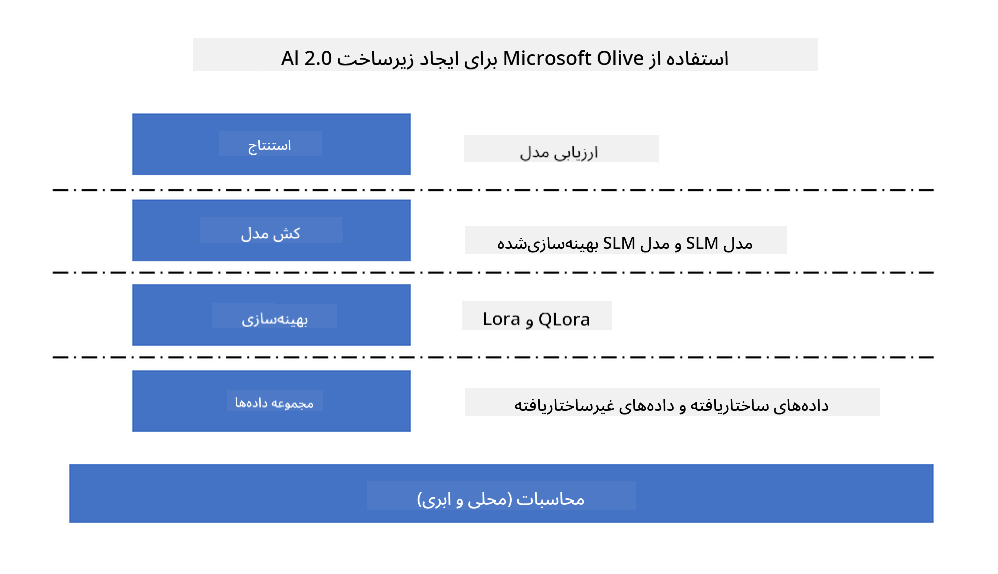

<!--
CO_OP_TRANSLATOR_METADATA:
{
  "original_hash": "5764be88ad2eb4f341e742eb8f14fab1",
  "translation_date": "2025-03-27T14:13:07+00:00",
  "source_file": "md\\03.FineTuning\\FineTuning_MicrosoftOlive.md",
  "language_code": "fa"
}
-->
# **تنظیم دقیق Phi-3 با Microsoft Olive**

[Olive](https://github.com/microsoft/OLive?WT.mc_id=aiml-138114-kinfeylo) یک ابزار بهینه‌سازی مدل آگاه به سخت‌افزار و کاربرپسند است که تکنیک‌های پیشرو در صنعت را در زمینه فشرده‌سازی، بهینه‌سازی و کامپایل مدل گرد هم می‌آورد.

این ابزار برای ساده‌سازی فرآیند بهینه‌سازی مدل‌های یادگیری ماشین طراحی شده است و تضمین می‌کند که این مدل‌ها از معماری‌های سخت‌افزاری خاص به بهترین نحو استفاده کنند.

چه در حال کار بر روی برنامه‌های ابری باشید و چه دستگاه‌های لبه‌ای، Olive به شما این امکان را می‌دهد که مدل‌های خود را به‌راحتی و به‌صورت مؤثر بهینه کنید.

## ویژگی‌های کلیدی:
- Olive تکنیک‌های بهینه‌سازی را برای اهداف سخت‌افزاری مورد نظر جمع‌آوری و خودکارسازی می‌کند.
- هیچ تکنیک بهینه‌سازی واحدی برای تمام سناریوها مناسب نیست، بنابراین Olive قابلیت گسترش را با امکان افزودن نوآوری‌های بهینه‌سازی توسط کارشناسان صنعت فراهم می‌کند.

## کاهش تلاش مهندسی:
- توسعه‌دهندگان معمولاً باید چندین ابزار زنجیره‌ای خاص به فروشندگان سخت‌افزار را بیاموزند و برای آماده‌سازی و بهینه‌سازی مدل‌های آموزش‌دیده برای استقرار از آنها استفاده کنند.
- Olive این فرآیند را با خودکارسازی تکنیک‌های بهینه‌سازی برای سخت‌افزار مورد نظر ساده می‌کند.

## راه‌حل آماده برای بهینه‌سازی کامل:

با ترکیب و تنظیم تکنیک‌های یکپارچه، Olive یک راه‌حل یکپارچه برای بهینه‌سازی از ابتدا تا انتها ارائه می‌دهد.
این ابزار هنگام بهینه‌سازی مدل‌ها، محدودیت‌هایی مانند دقت و تأخیر را در نظر می‌گیرد.

## استفاده از Microsoft Olive برای تنظیم دقیق

Microsoft Olive یک ابزار منبع‌باز بسیار کاربرپسند برای بهینه‌سازی مدل است که هم تنظیم دقیق و هم مرجع‌سازی را در حوزه هوش مصنوعی مولد پوشش می‌دهد. تنها با یک پیکربندی ساده، به همراه استفاده از مدل‌های کوچک زبان منبع‌باز و محیط‌های اجرایی مرتبط (AzureML / GPU محلی، CPU، DirectML)، می‌توانید تنظیم دقیق یا مرجع‌سازی مدل را از طریق بهینه‌سازی خودکار انجام دهید و بهترین مدل را برای استقرار در فضای ابری یا دستگاه‌های لبه‌ای پیدا کنید. این ابزار به شرکت‌ها اجازه می‌دهد مدل‌های عمودی صنعتی خود را به‌صورت محلی و در فضای ابری بسازند.



## تنظیم دقیق Phi-3 با Microsoft Olive 


## کد نمونه و مثال Phi-3 Olive
در این مثال، شما از Olive برای موارد زیر استفاده خواهید کرد:

- تنظیم دقیق یک LoRA adapter برای طبقه‌بندی عبارات به دسته‌های غم، شادی، ترس، و شگفتی.
- ادغام وزن‌های آداپتور در مدل پایه.
- بهینه‌سازی و کوانتیزه‌کردن مدل به int4.

[کد نمونه](../../code/03.Finetuning/olive-ort-example/README.md)

### نصب Microsoft Olive

نصب Microsoft Olive بسیار ساده است و می‌توان آن را برای CPU، GPU، DirectML، و Azure ML انجام داد.

```bash
pip install olive-ai
```

اگر قصد دارید یک مدل ONNX را با CPU اجرا کنید، می‌توانید از این استفاده کنید:

```bash
pip install olive-ai[cpu]
```

اگر قصد دارید یک مدل ONNX را با GPU اجرا کنید، می‌توانید از این استفاده کنید:

```python
pip install olive-ai[gpu]
```

اگر قصد دارید از Azure ML استفاده کنید، از این استفاده کنید:

```python
pip install git+https://github.com/microsoft/Olive#egg=olive-ai[azureml]
```

**توجه**
نیازمندی سیستم‌عامل: Ubuntu 20.04 / 22.04 

### **Config.json در Microsoft Olive**

پس از نصب، می‌توانید تنظیمات مختلف مرتبط با مدل را از طریق فایل Config پیکربندی کنید، از جمله داده، محاسبات، آموزش، استقرار و تولید مدل.

**1. داده**

در Microsoft Olive، آموزش بر روی داده‌های محلی و داده‌های ابری پشتیبانی می‌شود و می‌توان آن را در تنظیمات پیکربندی کرد.

*تنظیمات داده‌های محلی*

شما می‌توانید به‌سادگی مجموعه داده‌ای که نیاز به آموزش برای تنظیم دقیق دارد را تنظیم کنید، معمولاً در فرمت json، و آن را با قالب داده تطبیق دهید. این مورد باید بر اساس نیازهای مدل تنظیم شود (برای مثال، آن را با فرمتی که توسط Microsoft Phi-3-mini مورد نیاز است تطبیق دهید. اگر مدل‌های دیگری دارید، لطفاً به فرمت‌های مورد نیاز تنظیم دقیق مدل‌های دیگر مراجعه کنید).

```json

    "data_configs": [
        {
            "name": "dataset_default_train",
            "type": "HuggingfaceContainer",
            "load_dataset_config": {
                "params": {
                    "data_name": "json", 
                    "data_files":"dataset/dataset-classification.json",
                    "split": "train"
                }
            },
            "pre_process_data_config": {
                "params": {
                    "dataset_type": "corpus",
                    "text_cols": [
                            "phrase",
                            "tone"
                    ],
                    "text_template": "### Text: {phrase}\n### The tone is:\n{tone}",
                    "corpus_strategy": "join",
                    "source_max_len": 2048,
                    "pad_to_max_len": false,
                    "use_attention_mask": false
                }
            }
        }
    ],
```

**تنظیمات منبع داده ابری**

با لینک‌کردن datastore در Azure AI Studio / Azure Machine Learning Service به داده‌های ابری، می‌توانید منابع داده مختلفی را از طریق Microsoft Fabric و Azure Data به Azure AI Studio / Azure Machine Learning Service معرفی کنید تا از داده‌ها برای تنظیم دقیق پشتیبانی کنید.

```json

    "data_configs": [
        {
            "name": "dataset_default_train",
            "type": "HuggingfaceContainer",
            "load_dataset_config": {
                "params": {
                    "data_name": "json", 
                    "data_files": {
                        "type": "azureml_datastore",
                        "config": {
                            "azureml_client": {
                                "subscription_id": "Your Azure Subscrition ID",
                                "resource_group": "Your Azure Resource Group",
                                "workspace_name": "Your Azure ML Workspaces name"
                            },
                            "datastore_name": "workspaceblobstore",
                            "relative_path": "Your train_data.json Azure ML Location"
                        }
                    },
                    "split": "train"
                }
            },
            "pre_process_data_config": {
                "params": {
                    "dataset_type": "corpus",
                    "text_cols": [
                            "Question",
                            "Best Answer"
                    ],
                    "text_template": "<|user|>\n{Question}<|end|>\n<|assistant|>\n{Best Answer}\n<|end|>",
                    "corpus_strategy": "join",
                    "source_max_len": 2048,
                    "pad_to_max_len": false,
                    "use_attention_mask": false
                }
            }
        }
    ],
    
```

**2. پیکربندی محاسبات**

اگر نیاز به استفاده محلی دارید، می‌توانید به‌طور مستقیم از منابع داده محلی استفاده کنید. اگر به منابع Azure AI Studio / Azure Machine Learning Service نیاز دارید، باید پارامترهای مرتبط Azure، نام محاسباتی و غیره را پیکربندی کنید.

```json

    "systems": {
        "aml": {
            "type": "AzureML",
            "config": {
                "accelerators": ["gpu"],
                "hf_token": true,
                "aml_compute": "Your Azure AI Studio / Azure Machine Learning Service Compute Name",
                "aml_docker_config": {
                    "base_image": "Your Azure AI Studio / Azure Machine Learning Service docker",
                    "conda_file_path": "conda.yaml"
                }
            }
        },
        "azure_arc": {
            "type": "AzureML",
            "config": {
                "accelerators": ["gpu"],
                "aml_compute": "Your Azure AI Studio / Azure Machine Learning Service Compute Name",
                "aml_docker_config": {
                    "base_image": "Your Azure AI Studio / Azure Machine Learning Service docker",
                    "conda_file_path": "conda.yaml"
                }
            }
        }
    },
```

***توجه***

زیرا این فرآیند از طریق یک کانتینر در Azure AI Studio / Azure Machine Learning Service اجرا می‌شود، محیط مورد نیاز باید پیکربندی شود. این مورد در محیط conda.yaml پیکربندی می‌شود.

```yaml

name: project_environment
channels:
  - defaults
dependencies:
  - python=3.8.13
  - pip=22.3.1
  - pip:
      - einops
      - accelerate
      - azure-keyvault-secrets
      - azure-identity
      - bitsandbytes
      - datasets
      - huggingface_hub
      - peft
      - scipy
      - sentencepiece
      - torch>=2.2.0
      - transformers
      - git+https://github.com/microsoft/Olive@jiapli/mlflow_loading_fix#egg=olive-ai[gpu]
      - --extra-index-url https://aiinfra.pkgs.visualstudio.com/PublicPackages/_packaging/ORT-Nightly/pypi/simple/ 
      - ort-nightly-gpu==1.18.0.dev20240307004
      - --extra-index-url https://aiinfra.pkgs.visualstudio.com/PublicPackages/_packaging/onnxruntime-genai/pypi/simple/
      - onnxruntime-genai-cuda

    

```

**3. انتخاب SLM**

شما می‌توانید مدل را مستقیماً از Hugging Face استفاده کنید یا آن را با Model Catalog در Azure AI Studio / Azure Machine Learning ترکیب کرده و مدل مورد نظر را انتخاب کنید. در مثال کد زیر، از Microsoft Phi-3-mini استفاده خواهد شد.

اگر مدل را به‌صورت محلی دارید، می‌توانید از این روش استفاده کنید:

```json

    "input_model":{
        "type": "PyTorchModel",
        "config": {
            "hf_config": {
                "model_name": "model-cache/microsoft/phi-3-mini",
                "task": "text-generation",
                "model_loading_args": {
                    "trust_remote_code": true
                }
            }
        }
    },
```

اگر می‌خواهید از مدلی در Azure AI Studio / Azure Machine Learning Service استفاده کنید، می‌توانید از این روش استفاده کنید:

```json

    "input_model":{
        "type": "PyTorchModel",
        "config": {
            "model_path": {
                "type": "azureml_registry_model",
                "config": {
                    "name": "microsoft/Phi-3-mini-4k-instruct",
                    "registry_name": "azureml-msr",
                    "version": "11"
                }
            },
             "model_file_format": "PyTorch.MLflow",
             "hf_config": {
                "model_name": "microsoft/Phi-3-mini-4k-instruct",
                "task": "text-generation",
                "from_pretrained_args": {
                    "trust_remote_code": true
                }
            }
        }
    },
```

**توجه:**
ما باید با Azure AI Studio / Azure Machine Learning Service یکپارچه شویم، بنابراین هنگام تنظیم مدل، لطفاً به شماره نسخه و نام‌گذاری مرتبط توجه کنید.

تمام مدل‌ها در Azure باید به PyTorch.MLflow تنظیم شوند.

شما نیاز به داشتن یک حساب Hugging Face دارید و باید کلید آن را به مقدار Key در Azure AI Studio / Azure Machine Learning متصل کنید.

**4. الگوریتم**

Microsoft Olive الگوریتم‌های تنظیم دقیق Lora و QLora را به‌خوبی کپسوله کرده است. تنها چیزی که نیاز دارید، پیکربندی برخی پارامترهای مرتبط است. در اینجا از QLora به‌عنوان مثال استفاده می‌کنیم.

```json
        "lora": {
            "type": "LoRA",
            "config": {
                "target_modules": [
                    "o_proj",
                    "qkv_proj"
                ],
                "double_quant": true,
                "lora_r": 64,
                "lora_alpha": 64,
                "lora_dropout": 0.1,
                "train_data_config": "dataset_default_train",
                "eval_dataset_size": 0.3,
                "training_args": {
                    "seed": 0,
                    "data_seed": 42,
                    "per_device_train_batch_size": 1,
                    "per_device_eval_batch_size": 1,
                    "gradient_accumulation_steps": 4,
                    "gradient_checkpointing": false,
                    "learning_rate": 0.0001,
                    "num_train_epochs": 3,
                    "max_steps": 10,
                    "logging_steps": 10,
                    "evaluation_strategy": "steps",
                    "eval_steps": 187,
                    "group_by_length": true,
                    "adam_beta2": 0.999,
                    "max_grad_norm": 0.3
                }
            }
        },
```

اگر به تبدیل کوانتیزه نیاز دارید، شاخه اصلی Microsoft Olive از روش onnxruntime-genai پشتیبانی می‌کند. می‌توانید آن را بر اساس نیاز خود تنظیم کنید:

1. ادغام وزن‌های آداپتور در مدل پایه
2. تبدیل مدل به مدل ONNX با دقت مورد نیاز توسط ModelBuilder

برای مثال، تبدیل به INT4 کوانتیزه‌شده:

```json

        "merge_adapter_weights": {
            "type": "MergeAdapterWeights"
        },
        "builder": {
            "type": "ModelBuilder",
            "config": {
                "precision": "int4"
            }
        }
```

**توجه** 
- اگر از QLoRA استفاده می‌کنید، تبدیل کوانتیزه توسط ONNXRuntime-genai در حال حاضر پشتیبانی نمی‌شود.

- باید اشاره کرد که می‌توانید مراحل بالا را بر اساس نیازهای خود تنظیم کنید. لازم نیست تمام مراحل بالا را به‌طور کامل پیکربندی کنید. بسته به نیاز خود، می‌توانید مستقیماً از مراحل الگوریتم بدون تنظیم دقیق استفاده کنید. در نهایت، باید موتورهای مرتبط را پیکربندی کنید.

```json

    "engine": {
        "log_severity_level": 0,
        "host": "aml",
        "target": "aml",
        "search_strategy": false,
        "execution_providers": ["CUDAExecutionProvider"],
        "cache_dir": "../model-cache/models/phi3-finetuned/cache",
        "output_dir" : "../model-cache/models/phi3-finetuned"
    }
```

**5. اتمام تنظیم دقیق**

در خط فرمان، در دایرکتوری olive-config.json اجرا کنید:

```bash
olive run --config olive-config.json  
```

**سلب مسئولیت**:  
این سند با استفاده از سرویس ترجمه هوش مصنوعی [Co-op Translator](https://github.com/Azure/co-op-translator) ترجمه شده است. در حالی که تلاش ما بر دقت است، لطفاً توجه داشته باشید که ترجمه‌های خودکار ممکن است شامل خطاها یا نواقصی باشند. سند اصلی به زبان مادری آن باید به عنوان منبع معتبر در نظر گرفته شود. برای اطلاعات حساس، توصیه می‌شود از ترجمه حرفه‌ای انسانی استفاده کنید. ما مسئولیتی در قبال سوء تفاهم‌ها یا برداشت‌های نادرست ناشی از استفاده از این ترجمه نداریم.