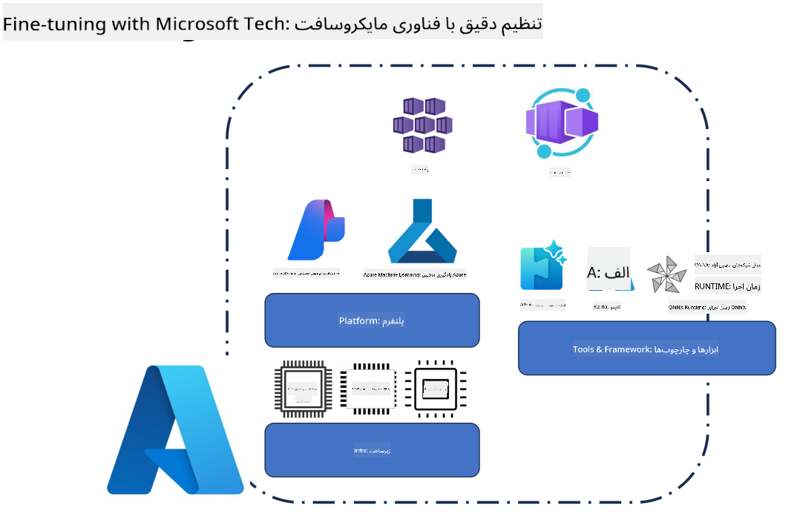
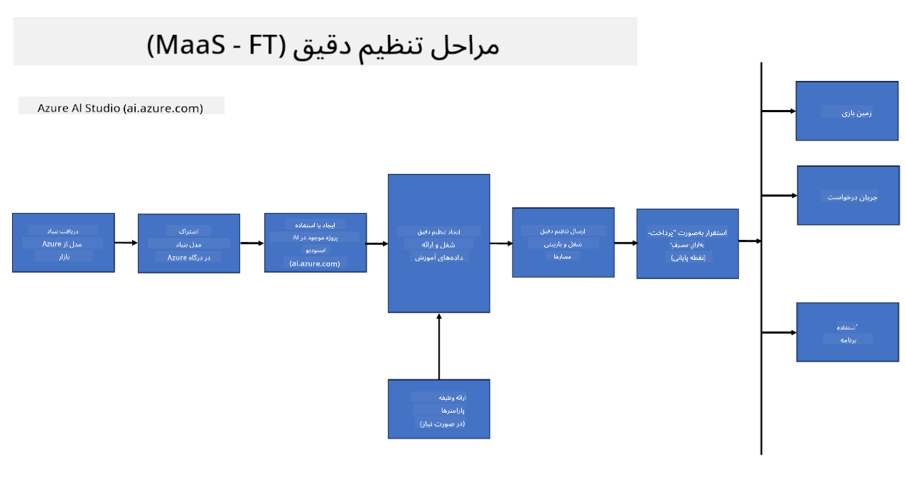
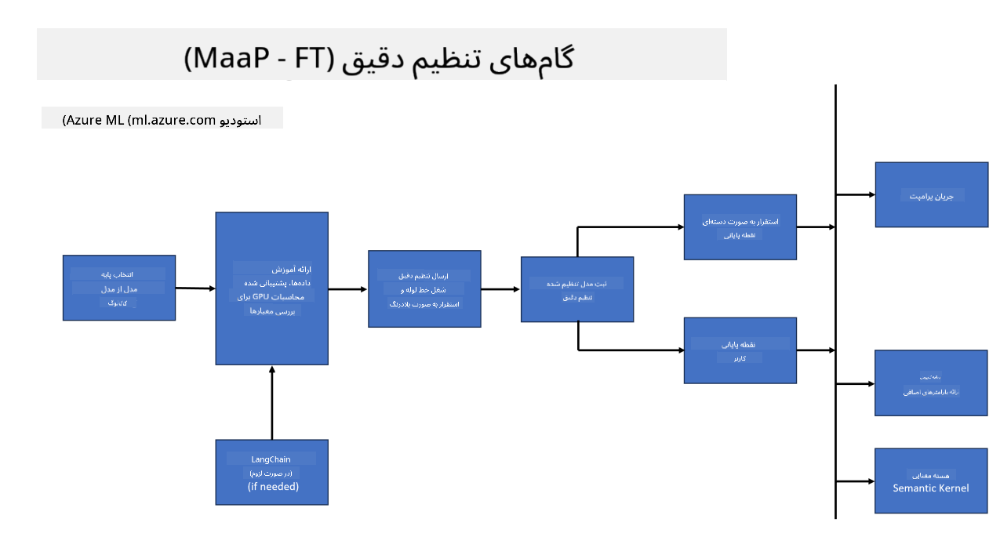
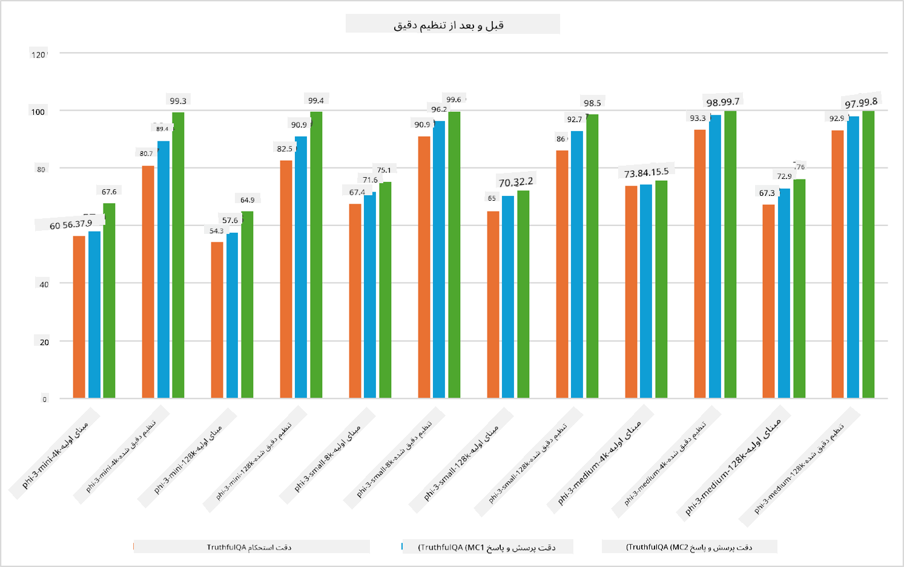

<!--
CO_OP_TRANSLATOR_METADATA:
{
  "original_hash": "cb5648935f63edc17e95ce38f23adc32",
  "translation_date": "2025-03-27T15:17:07+00:00",
  "source_file": "md\\03.FineTuning\\FineTuning_Scenarios.md",
  "language_code": "fa"
}
-->
## سناریوهای تنظیم دقیق

**پلتفرم** این شامل فناوری‌های مختلفی مانند Azure AI Foundry، Azure Machine Learning، AI Tools، Kaito و ONNX Runtime می‌شود.

**زیرساخت** این شامل CPU و FPGA است که برای فرآیند تنظیم دقیق ضروری هستند. اجازه دهید نمادهای هر یک از این فناوری‌ها را به شما نشان دهم.

**ابزارها و چارچوب‌ها** این شامل ONNX Runtime و ONNX Runtime می‌شود. اجازه دهید نمادهای هر یک از این فناوری‌ها را به شما نشان دهم.
[نمادهای ONNX Runtime و ONNX Runtime را درج کنید]

فرآیند تنظیم دقیق با فناوری‌های مایکروسافت شامل اجزا و ابزارهای مختلفی است. با درک و استفاده از این فناوری‌ها، می‌توانیم برنامه‌های خود را به طور مؤثر تنظیم دقیق کنیم و راه‌حل‌های بهتری ایجاد کنیم.

## مدل به عنوان سرویس

مدل را با استفاده از تنظیم دقیق میزبانی‌شده، بدون نیاز به ایجاد و مدیریت محاسبات، تنظیم دقیق کنید.

تنظیم دقیق بدون سرور برای مدل‌های Phi-3-mini و Phi-3-medium در دسترس است، که به توسعه‌دهندگان این امکان را می‌دهد تا به سرعت و به راحتی مدل‌ها را برای سناریوهای ابری و لبه سفارشی‌سازی کنند بدون اینکه نیاز به تنظیم محاسبات داشته باشند. همچنین اعلام کرده‌ایم که مدل Phi-3-small اکنون از طریق ارائه مدل‌ها به عنوان سرویس در دسترس است تا توسعه‌دهندگان بتوانند به سرعت و به راحتی کار خود را در توسعه هوش مصنوعی آغاز کنند بدون اینکه نیاز به مدیریت زیرساخت‌های پایه داشته باشند.

## مدل به عنوان پلتفرم

کاربران محاسبات خود را مدیریت می‌کنند تا مدل‌های خود را تنظیم دقیق کنند.

[نمونه تنظیم دقیق](https://github.com/Azure/azureml-examples/blob/main/sdk/python/foundation-models/system/finetune/chat-completion/chat-completion.ipynb)

## سناریوهای تنظیم دقیق

| | | | | | | |
|-|-|-|-|-|-|-|
|سناریو|LoRA|QLoRA|PEFT|DeepSpeed|ZeRO|DORA|
|تطبیق مدل‌های زبان بزرگ پیش‌آموزش داده‌شده با وظایف یا حوزه‌های خاص|بله|بله|بله|بله|بله|بله|
|تنظیم دقیق برای وظایف NLP مانند طبقه‌بندی متن، شناسایی موجودیت‌های نام‌دار، و ترجمه ماشینی|بله|بله|بله|بله|بله|بله|
|تنظیم دقیق برای وظایف پرسش و پاسخ|بله|بله|بله|بله|بله|بله|
|تنظیم دقیق برای تولید پاسخ‌های انسانی‌مانند در چت‌بات‌ها|بله|بله|بله|بله|بله|بله|
|تنظیم دقیق برای تولید موسیقی، هنر یا دیگر اشکال خلاقیت|بله|بله|بله|بله|بله|بله|
|کاهش هزینه‌های محاسباتی و مالی|بله|بله|خیر|بله|بله|خیر|
|کاهش استفاده از حافظه|خیر|بله|خیر|بله|بله|بله|
|استفاده از پارامترهای کمتر برای تنظیم دقیق کارآمد|خیر|بله|بله|خیر|خیر|بله|
|شکل حافظه-کارآمد از موازی‌سازی داده که دسترسی به حافظه GPU جمعی تمام دستگاه‌های GPU موجود را فراهم می‌کند|خیر|خیر|خیر|بله|بله|بله|

## مثال‌های عملکرد تنظیم دقیق

**سلب مسئولیت**:  
این سند با استفاده از سرویس ترجمه هوش مصنوعی [Co-op Translator](https://github.com/Azure/co-op-translator) ترجمه شده است. در حالی که ما برای دقت تلاش می‌کنیم، لطفاً توجه داشته باشید که ترجمه‌های خودکار ممکن است شامل خطاها یا نادقتی‌ها باشند. سند اصلی به زبان بومی آن باید به عنوان منبع معتبر در نظر گرفته شود. برای اطلاعات حساس، ترجمه حرفه‌ای انسانی توصیه می‌شود. ما هیچ مسئولیتی در قبال سوءتفاهم‌ها یا تفسیرهای نادرست ناشی از استفاده از این ترجمه نداریم.