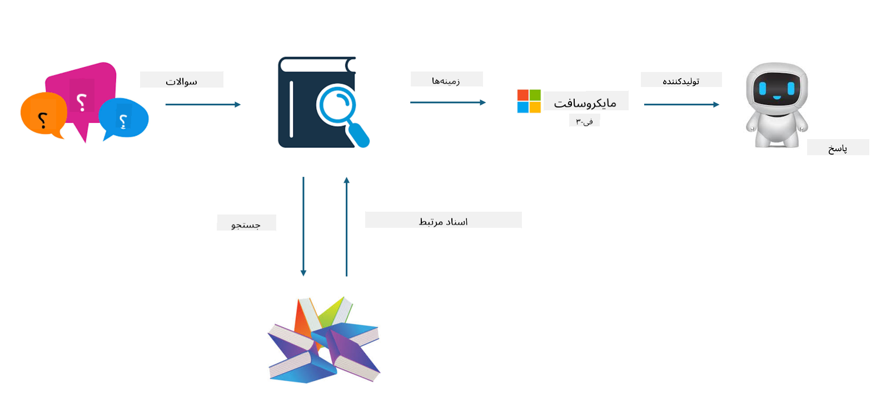

<!--
CO_OP_TRANSLATOR_METADATA:
{
  "original_hash": "e4e010400c2918557b36bb932a14004c",
  "translation_date": "2025-03-27T15:42:23+00:00",
  "source_file": "md\\03.FineTuning\\FineTuning_vs_RAG.md",
  "language_code": "fa"
}
-->
## تنظیم مدل در مقابل RAG

## تولید تقویت‌شده با بازیابی

RAG ترکیبی از بازیابی داده و تولید متن است. داده‌های ساختاریافته و غیرساختاریافته سازمان در پایگاه داده برداری ذخیره می‌شوند. هنگام جستجوی محتوای مرتبط، خلاصه و محتوای مرتبط یافت می‌شوند تا یک زمینه تشکیل شود و سپس با قابلیت تکمیل متن LLM/SLM ترکیب می‌شوند تا محتوا تولید شود.

## فرآیند RAG

## تنظیم مدل
تنظیم مدل بر اساس بهبود یک مدل خاص انجام می‌شود. نیازی به شروع از الگوریتم مدل نیست، اما داده‌ها باید به طور مداوم جمع‌آوری شوند. اگر به اصطلاحات دقیق‌تر و بیان زبانی در کاربردهای صنعتی نیاز دارید، تنظیم مدل انتخاب بهتری است. اما اگر داده‌های شما به طور مکرر تغییر می‌کنند، تنظیم مدل می‌تواند پیچیده شود.

## چگونه انتخاب کنیم
اگر پاسخ ما نیاز به استفاده از داده‌های خارجی دارد، RAG بهترین انتخاب است.

اگر نیاز دارید دانش صنعتی پایدار و دقیقی تولید کنید، تنظیم مدل انتخاب خوبی خواهد بود. RAG تمرکز بر بازیابی محتوای مرتبط دارد، اما ممکن است همیشه به جزئیات تخصصی به درستی نپردازد.

تنظیم مدل نیاز به یک مجموعه داده با کیفیت بالا دارد و اگر داده‌ها در محدوده کوچکی باشند، تفاوت زیادی ایجاد نمی‌کند. RAG انعطاف‌پذیری بیشتری دارد.  
تنظیم مدل یک جعبه سیاه است، نوعی متافیزیک، و درک مکانیسم داخلی آن دشوار است. اما RAG می‌تواند یافتن منبع داده را آسان‌تر کند، و به این ترتیب، خطاها یا توهمات را به طور مؤثرتری اصلاح کرده و شفافیت بهتری ارائه دهد.

**سلب مسئولیت**:  
این سند با استفاده از سرویس ترجمه هوش مصنوعی [Co-op Translator](https://github.com/Azure/co-op-translator) ترجمه شده است. در حالی که ما تلاش می‌کنیم تا دقت را رعایت کنیم، لطفاً توجه داشته باشید که ترجمه‌های خودکار ممکن است شامل اشتباهات یا نواقصی باشند. سند اصلی به زبان اصلی باید به‌عنوان منبع معتبر در نظر گرفته شود. برای اطلاعات حیاتی، توصیه می‌شود از ترجمه حرفه‌ای انسانی استفاده کنید. ما مسئولیتی در قبال سوء تفاهم‌ها یا تفسیرهای اشتباه ناشی از استفاده از این ترجمه نداریم.