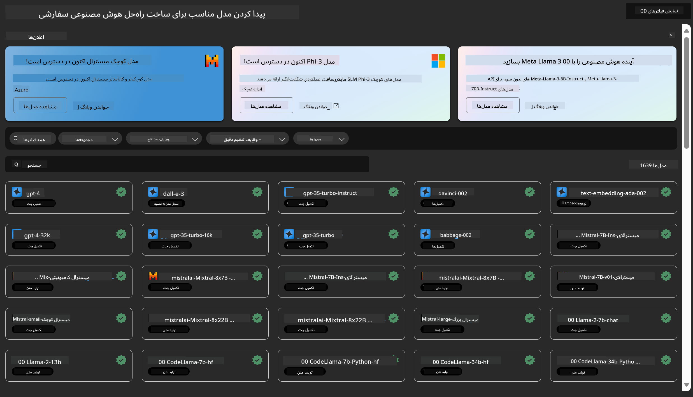
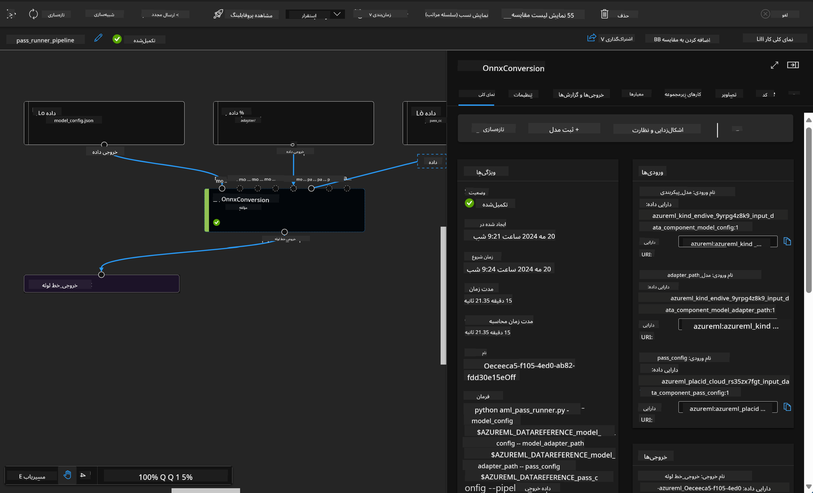

<!--
CO_OP_TRANSLATOR_METADATA:
{
  "original_hash": "7fe541373802e33568e94e13226d463c",
  "translation_date": "2025-03-27T15:55:40+00:00",
  "source_file": "md\\03.FineTuning\\Introduce_AzureML.md",
  "language_code": "fa"
}
-->
# **معرفی سرویس Azure Machine Learning**

[Azure Machine Learning](https://ml.azure.com?WT.mc_id=aiml-138114-kinfeylo) یک سرویس ابری برای تسریع و مدیریت چرخه عمر پروژه‌های یادگیری ماشین (ML) است.

متخصصان ML، دانشمندان داده و مهندسان می‌توانند از آن در جریان‌های کاری روزمره خود استفاده کنند تا:

- مدل‌ها را آموزش داده و مستقر کنند.
- عملیات یادگیری ماشین (MLOps) را مدیریت کنند.
- می‌توانید مدلی را در Azure Machine Learning ایجاد کنید یا از مدلی که با استفاده از پلتفرم‌های متن‌باز مانند PyTorch، TensorFlow یا scikit-learn ساخته شده، بهره ببرید.
- ابزارهای MLOps به شما کمک می‌کنند مدل‌ها را پایش، بازآموزی و دوباره مستقر کنید.

## Azure Machine Learning برای چه کسانی مناسب است؟

**دانشمندان داده و مهندسان ML**

آن‌ها می‌توانند از ابزارهایی برای تسریع و خودکارسازی جریان‌های کاری روزمره خود استفاده کنند.  
Azure ML قابلیت‌هایی برای عدالت، توضیح‌پذیری، ردیابی و قابلیت حسابرسی فراهم می‌کند.  

**توسعه‌دهندگان برنامه‌ها**

آن‌ها می‌توانند مدل‌ها را به‌صورت یکپارچه در برنامه‌ها یا خدمات ادغام کنند.

**توسعه‌دهندگان پلتفرم**

آن‌ها به مجموعه‌ای قوی از ابزارها که توسط APIهای پایدار Azure Resource Manager پشتیبانی می‌شود، دسترسی دارند.  
این ابزارها امکان ساخت ابزارهای پیشرفته یادگیری ماشین را فراهم می‌کنند.

**شرکت‌ها**

با کار در فضای ابری Microsoft Azure، شرکت‌ها از امنیت آشنا و کنترل دسترسی مبتنی بر نقش بهره‌مند می‌شوند.  
پروژه‌هایی را تنظیم کنید که دسترسی به داده‌های محافظت‌شده و عملیات خاص را کنترل کند.

## بهره‌وری برای همه اعضای تیم  
پروژه‌های ML اغلب نیازمند تیمی با مهارت‌های متنوع برای ساخت و نگهداری هستند.  

Azure ML ابزارهایی را ارائه می‌دهد که به شما امکان می‌دهد:  
- با تیم خود از طریق نوت‌بوک‌های مشترک، منابع محاسباتی، محاسبات بدون سرور، داده‌ها و محیط‌ها همکاری کنید.  
- مدل‌هایی با عدالت، توضیح‌پذیری، ردیابی و قابلیت حسابرسی توسعه دهید تا الزامات مربوط به شفافیت و تطابق حسابرسی را برآورده کنید.  
- مدل‌های ML را به‌سرعت و به‌آسانی در مقیاس مستقر کرده و آن‌ها را با کارایی و بهره‌وری بالا با استفاده از MLOps مدیریت و نظارت کنید.  
- بارهای کاری یادگیری ماشین را در هر مکانی با حاکمیت، امنیت و تطابق داخلی اجرا کنید.

## ابزارهای پلتفرمی متقابل

هر کسی در تیم ML می‌تواند از ابزارهای مورد علاقه خود برای انجام کار استفاده کند.  
چه در حال اجرای آزمایش‌های سریع، تنظیم ابرپارامترها، ساخت خطوط لوله یا مدیریت استنتاج‌ها باشید، می‌توانید از رابط‌های آشنایی استفاده کنید از جمله:  
- Azure Machine Learning Studio  
- Python SDK (نسخه ۲)  
- Azure CLI (نسخه ۲)  
- Azure Resource Manager REST APIs  

هنگامی که مدل‌ها را بهبود می‌بخشید و در طول چرخه توسعه همکاری می‌کنید، می‌توانید دارایی‌ها، منابع و معیارها را در رابط کاربری Azure Machine Learning Studio به اشتراک بگذارید و پیدا کنید.

## **LLM/SLM در Azure ML**

Azure ML قابلیت‌های زیادی مرتبط با LLM/SLM اضافه کرده است و با ترکیب LLMOps و SLMOps، یک پلتفرم فناوری هوش مصنوعی مولد در سطح سازمانی ایجاد کرده است.

### **کاتالوگ مدل**

کاربران سازمانی می‌توانند بر اساس سناریوهای مختلف کسب‌وکار، مدل‌های متفاوتی را از طریق کاتالوگ مدل مستقر کنند و خدماتی به‌صورت Model as Service ارائه دهند تا توسعه‌دهندگان یا کاربران سازمان به آن‌ها دسترسی داشته باشند.

کاتالوگ مدل در Azure Machine Learning Studio مرکز کشف و استفاده از طیف گسترده‌ای از مدل‌ها است که به شما امکان می‌دهد برنامه‌های هوش مصنوعی مولد بسازید. کاتالوگ مدل شامل صدها مدل از ارائه‌دهندگان مختلف مانند Azure OpenAI Service، Mistral، Meta، Cohere، Nvidia، Hugging Face و همچنین مدل‌های آموزش‌دیده توسط مایکروسافت است. مدل‌های ارائه‌شده توسط سایر ارائه‌دهندگان، محصولات غیرمایکروسافتی هستند که بر اساس شرایط محصول مایکروسافت تعریف شده‌اند و تابع شرایط ارائه‌شده همراه با مدل هستند.

### **خط لوله کارها**

هسته یک خط لوله یادگیری ماشین تقسیم یک وظیفه کامل یادگیری ماشین به یک جریان کاری چندمرحله‌ای است. هر مرحله یک مؤلفه قابل مدیریت است که می‌توان آن را به‌صورت جداگانه توسعه داد، بهینه‌سازی کرد، پیکربندی کرد و خودکارسازی کرد. مراحل از طریق رابط‌های تعریف‌شده به هم متصل می‌شوند. سرویس خط لوله Azure Machine Learning به‌طور خودکار تمام وابستگی‌ها بین مراحل خط لوله را هماهنگ می‌کند.

در تنظیم دقیق SLM / LLM، می‌توانیم فرآیندهای داده، آموزش و تولید خود را از طریق خط لوله مدیریت کنیم.

### **جریان پرامپت**

مزایای استفاده از جریان پرامپت در Azure Machine Learning  
جریان پرامپت Azure Machine Learning مجموعه‌ای از مزایا را ارائه می‌دهد که به کاربران کمک می‌کند از ایده‌پردازی به آزمایش و در نهایت به برنامه‌های آماده تولید مبتنی بر LLM برسند:

**چابکی در مهندسی پرامپت**

تجربه نویسندگی تعاملی: جریان پرامپت Azure Machine Learning نمایشی بصری از ساختار جریان ارائه می‌دهد و به کاربران امکان می‌دهد پروژه‌های خود را به‌آسانی درک و پیمایش کنند. همچنین تجربه کدنویسی شبیه به نوت‌بوک را برای توسعه و اشکال‌زدایی مؤثر جریان فراهم می‌کند.  
ایجاد انواع مختلف پرامپت: کاربران می‌توانند انواع مختلف پرامپت را ایجاد و مقایسه کنند و فرآیند بهینه‌سازی تکراری را تسهیل کنند.  

ارزیابی: جریان‌های ارزیابی داخلی به کاربران امکان می‌دهند کیفیت و اثربخشی پرامپت‌ها و جریان‌های خود را ارزیابی کنند.  

منابع جامع: جریان پرامپت Azure Machine Learning شامل کتابخانه‌ای از ابزارهای داخلی، نمونه‌ها و الگوها است که به‌عنوان نقطه شروعی برای توسعه عمل می‌کنند و خلاقیت را الهام بخشیده و فرآیند را تسریع می‌کنند.

**آمادگی سازمانی برای برنامه‌های مبتنی بر LLM**

همکاری: جریان پرامپت Azure Machine Learning از همکاری تیمی پشتیبانی می‌کند و به کاربران متعدد امکان می‌دهد به‌صورت مشترک روی پروژه‌های مهندسی پرامپت کار کنند، دانش را به اشتراک بگذارند و کنترل نسخه را حفظ کنند.  

پلتفرم یکپارچه: جریان پرامپت Azure Machine Learning کل فرآیند مهندسی پرامپت را ساده می‌کند، از توسعه و ارزیابی گرفته تا استقرار و نظارت. کاربران می‌توانند جریان‌های خود را به‌راحتی به‌عنوان نقاط پایانی Azure Machine Learning مستقر کنند و عملکرد آن‌ها را به‌صورت بلادرنگ نظارت کنند و از عملیات بهینه و بهبود مستمر اطمینان حاصل کنند.  

راه‌حل‌های آمادگی سازمانی Azure Machine Learning: جریان پرامپت از راه‌حل‌های قوی آمادگی سازمانی Azure Machine Learning استفاده می‌کند و پایه‌ای امن، مقیاس‌پذیر و قابل‌اعتماد برای توسعه، آزمایش و استقرار جریان‌ها فراهم می‌کند.

با استفاده از جریان پرامپت Azure Machine Learning، کاربران می‌توانند چابکی مهندسی پرامپت خود را آزاد کنند، به‌صورت مؤثر همکاری کنند و از راه‌حل‌های در سطح سازمانی برای توسعه و استقرار موفق برنامه‌های مبتنی بر LLM بهره‌مند شوند.

با ترکیب قدرت محاسباتی، داده‌ها و اجزای مختلف Azure ML، توسعه‌دهندگان سازمانی می‌توانند به‌آسانی برنامه‌های هوش مصنوعی خود را بسازند.

**سلب مسئولیت**:  
این سند با استفاده از سرویس ترجمه هوش مصنوعی [Co-op Translator](https://github.com/Azure/co-op-translator) ترجمه شده است. در حالی که ما تلاش می‌کنیم دقت را حفظ کنیم، لطفاً توجه داشته باشید که ترجمه‌های خودکار ممکن است شامل خطاها یا نادرستی‌ها باشند. سند اصلی به زبان اصلی آن باید به عنوان منبع معتبر در نظر گرفته شود. برای اطلاعات حیاتی، ترجمه حرفه‌ای انسانی توصیه می‌شود. ما هیچ مسئولیتی در قبال سوءتفاهم‌ها یا تفسیرهای نادرست ناشی از استفاده از این ترجمه نداریم.