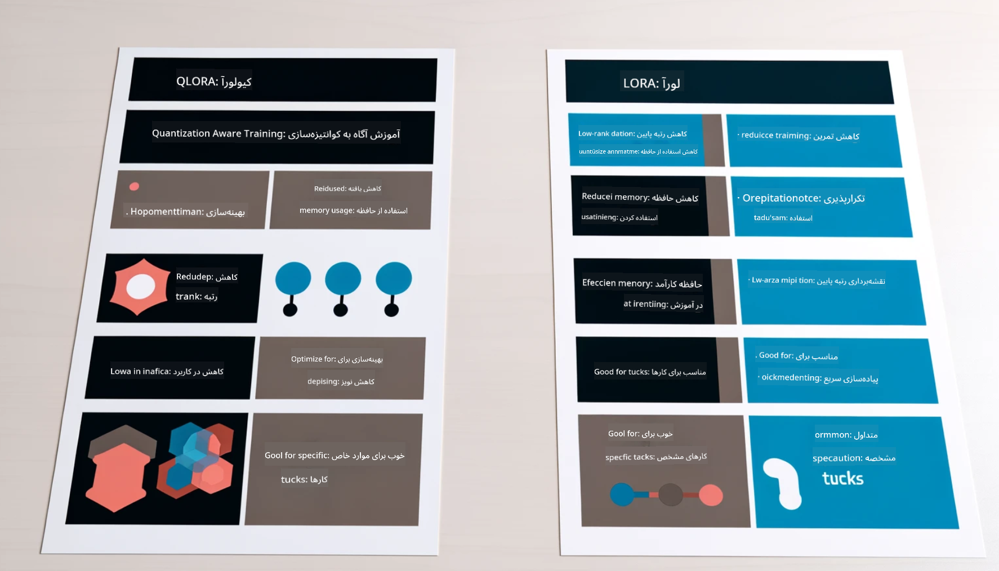

<!--
CO_OP_TRANSLATOR_METADATA:
{
  "original_hash": "743d7e9cb9c4e8ea642d77bee657a7fa",
  "translation_date": "2025-03-27T16:02:56+00:00",
  "source_file": "md\\03.FineTuning\\LetPhi3gotoIndustriy.md",
  "language_code": "fa"
}
-->
# **بگذارید Phi-3 یک متخصص صنعتی شود**

برای استفاده از مدل Phi-3 در یک صنعت خاص، باید داده‌های تجاری صنعتی را به مدل Phi-3 اضافه کنید. ما دو گزینه مختلف داریم: اول RAG (تولید تقویت‌شده با بازیابی) و دوم Fine-Tuning.

## **RAG در مقابل Fine-Tuning**

### **تولید تقویت‌شده با بازیابی (RAG)**

RAG ترکیبی از بازیابی داده و تولید متن است. داده‌های ساختاریافته و غیرساختاریافته شرکت در پایگاه داده برداری ذخیره می‌شوند. هنگام جستجوی محتوای مرتبط، خلاصه و محتوای مرتبط پیدا شده و یک زمینه ایجاد می‌شود، سپس توانایی تکمیل متن LLM/SLM برای تولید محتوا به کار گرفته می‌شود.

### **Fine-Tuning**

Fine-Tuning به معنای بهبود یک مدل خاص است. نیازی به شروع از الگوریتم مدل نیست، اما باید داده‌ها به طور مداوم جمع‌آوری شوند. اگر در کاربردهای صنعتی به اصطلاحات دقیق‌تر و بیان تخصصی‌تری نیاز دارید، Fine-Tuning انتخاب بهتری است. اما اگر داده‌های شما به طور مکرر تغییر می‌کنند، Fine-Tuning می‌تواند پیچیده شود.

### **چگونه انتخاب کنیم**

1. اگر پاسخ ما نیاز به معرفی داده‌های خارجی دارد، RAG بهترین انتخاب است.

2. اگر نیاز دارید دانش صنعتی دقیق و پایدار تولید کنید، Fine-Tuning انتخاب خوبی خواهد بود. RAG اولویت را به بازیابی محتوای مرتبط می‌دهد اما ممکن است همیشه به جزئیات تخصصی نپردازد.

3. Fine-Tuning به یک مجموعه داده با کیفیت بالا نیاز دارد و اگر دامنه داده‌ها کوچک باشد، تفاوت چندانی ایجاد نمی‌کند. RAG انعطاف‌پذیرتر است.

4. Fine-Tuning یک جعبه سیاه است و درک مکانیزم داخلی آن دشوار است. اما RAG می‌تواند منبع داده را راحت‌تر پیدا کند و به این ترتیب خطاهای توهمی یا محتوایی را به طور مؤثر تنظیم کرده و شفافیت بهتری ارائه دهد.

### **موارد استفاده**

1. صنایع عمودی که به واژگان و بیان تخصصی نیاز دارند، ***Fine-Tuning*** بهترین انتخاب است.

2. سیستم‌های پرسش و پاسخ که شامل ترکیب نقاط دانش مختلف هستند، ***RAG*** بهترین انتخاب است.

3. ترکیب جریان‌های خودکار تجاری ***RAG + Fine-Tuning*** بهترین انتخاب است.

## **چگونه از RAG استفاده کنیم**

پایگاه داده برداری مجموعه‌ای از داده‌هاست که به صورت ریاضی ذخیره شده‌اند. پایگاه‌های داده برداری استفاده از مدل‌های یادگیری ماشین را برای به خاطر سپردن ورودی‌های قبلی آسان‌تر می‌کنند و امکان استفاده از یادگیری ماشین برای مواردی مانند جستجو، توصیه‌ها و تولید متن را فراهم می‌کنند. داده‌ها می‌توانند بر اساس معیارهای شباهت شناسایی شوند، نه تطابق دقیق، که این امکان را به مدل‌های کامپیوتری می‌دهد تا زمینه داده‌ها را درک کنند.

پایگاه داده برداری کلید تحقق RAG است. ما می‌توانیم داده‌ها را از طریق مدل‌های برداری مانند text-embedding-3، jina-ai-embedding و غیره به ذخیره‌سازی برداری تبدیل کنیم.

اطلاعات بیشتر در مورد ایجاد برنامه RAG [https://github.com/microsoft/Phi-3CookBook](https://github.com/microsoft/Phi-3CookBook?WT.mc_id=aiml-138114-kinfeylo)

## **چگونه از Fine-Tuning استفاده کنیم**

الگوریتم‌های متداول در Fine-Tuning شامل Lora و QLora هستند. کدام را انتخاب کنیم؟
- [اطلاعات بیشتر با این دفترچه نمونه](../../../../code/04.Finetuning/Phi_3_Inference_Finetuning.ipynb)
- [نمونه‌ای از Fine-Tuning در پایتون](../../../../code/04.Finetuning/FineTrainingScript.py)

### **Lora و QLora**

LoRA (تطبیق با رتبه پایین) و QLoRA (تطبیق با رتبه پایین کمیت‌شده) هر دو تکنیک‌هایی برای Fine-Tuning مدل‌های زبان بزرگ (LLM) با استفاده از تنظیمات کارآمد پارامتر (PEFT) هستند. تکنیک‌های PEFT برای آموزش مدل‌ها به طور کارآمدتر از روش‌های سنتی طراحی شده‌اند.  
LoRA یک تکنیک مستقل برای Fine-Tuning است که با استفاده از تقریب رتبه پایین برای ماتریس به‌روزرسانی وزن، مصرف حافظه را کاهش می‌دهد. این روش زمان آموزش سریع و عملکردی نزدیک به روش‌های سنتی Fine-Tuning ارائه می‌دهد.  

QLoRA نسخه توسعه‌یافته‌ای از LoRA است که تکنیک‌های کمیت‌سازی را برای کاهش بیشتر مصرف حافظه به کار می‌گیرد. QLoRA دقت پارامترهای وزن در مدل LLM پیش‌آموزش‌دیده را به دقت 4 بیت کاهش می‌دهد که از نظر حافظه کارآمدتر از LoRA است. با این حال، آموزش QLoRA حدود 30٪ کندتر از آموزش LoRA است به دلیل مراحل اضافی کمیت‌سازی و رفع کمیت‌سازی.  

QLoRA از LoRA به عنوان مکملی برای اصلاح خطاهای ناشی از کمیت‌سازی استفاده می‌کند. QLoRA امکان Fine-Tuning مدل‌های عظیم با میلیاردها پارامتر را بر روی GPUهای نسبتاً کوچک و در دسترس فراهم می‌کند. به عنوان مثال، QLoRA می‌تواند یک مدل 70 میلیارد پارامتری را که نیاز به 36 GPU دارد، تنها با 2 GPU تنظیم کند.

**سلب مسئولیت**:  
این سند با استفاده از سرویس ترجمه هوش مصنوعی [Co-op Translator](https://github.com/Azure/co-op-translator) ترجمه شده است. در حالی که ما برای دقت تلاش می‌کنیم، لطفاً توجه داشته باشید که ترجمه‌های خودکار ممکن است حاوی خطاها یا نواقصی باشند. سند اصلی به زبان اصلی باید به عنوان منبع معتبر در نظر گرفته شود. برای اطلاعات حیاتی، ترجمه حرفه‌ای انسانی توصیه می‌شود. ما هیچ مسئولیتی در قبال سوء تفاهم‌ها یا تفسیرهای نادرست ناشی از استفاده از این ترجمه نداریم.