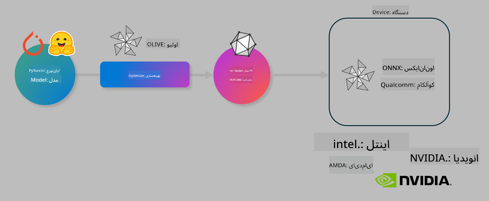

<!--
CO_OP_TRANSLATOR_METADATA:
{
  "original_hash": "6bbe47de3b974df7eea29dfeccf6032b",
  "translation_date": "2025-03-27T16:20:22+00:00",
  "source_file": "md\\03.FineTuning\\olive-lab\\readme.md",
  "language_code": "fa"
}
-->
# آزمایشگاه: بهینه‌سازی مدل‌های هوش مصنوعی برای استنتاج روی دستگاه

## مقدمه

> [!IMPORTANT]
> این آزمایشگاه نیاز به یک **کارت گرافیک Nvidia A10 یا A100** با درایورها و کیت ابزار CUDA (نسخه ۱۲ یا بالاتر) دارد.

> [!NOTE]
> این یک آزمایشگاه **۳۵ دقیقه‌ای** است که شما را با مفاهیم اصلی بهینه‌سازی مدل‌ها برای استنتاج روی دستگاه با استفاده از OLIVE آشنا می‌کند.

## اهداف آموزشی

در پایان این آزمایشگاه، شما قادر خواهید بود از OLIVE برای انجام موارد زیر استفاده کنید:

- کوانتایز کردن یک مدل هوش مصنوعی با استفاده از روش کوانتایز AWQ.
- تنظیم دقیق یک مدل هوش مصنوعی برای یک وظیفه خاص.
- تولید آداپتورهای LoRA (مدل تنظیم‌شده) برای استنتاج کارآمد روی دستگاه با ONNX Runtime.

### OLIVE چیست؟

Olive (*O*NNX *live*) یک ابزار بهینه‌سازی مدل با یک رابط خط فرمان (CLI) است که به شما امکان می‌دهد مدل‌هایی برای ONNX Runtime +++https://onnxruntime.ai+++ با کیفیت و عملکرد بالا تولید کنید.



ورودی OLIVE معمولاً یک مدل PyTorch یا Hugging Face است و خروجی آن یک مدل ONNX بهینه‌سازی‌شده است که روی یک دستگاه (هدف استقرار) با اجرای ONNX Runtime اجرا می‌شود. OLIVE مدل را برای شتاب‌دهنده هوش مصنوعی هدف استقرار (NPU، GPU، CPU) ارائه‌شده توسط سازنده سخت‌افزار مانند Qualcomm، AMD، Nvidia یا Intel بهینه می‌کند.

OLIVE یک *گردش کار* اجرا می‌کند که یک توالی مرتب از وظایف بهینه‌سازی مدل است که به آن‌ها *پاس* گفته می‌شود. مثال‌هایی از پاس‌ها شامل فشرده‌سازی مدل، گرفتن گراف، کوانتایز کردن، و بهینه‌سازی گراف هستند. هر پاس مجموعه‌ای از پارامترها دارد که می‌توان آن‌ها را برای دستیابی به بهترین معیارها، مانند دقت و تأخیر، که توسط ارزیاب مربوطه ارزیابی می‌شوند، تنظیم کرد. OLIVE از یک استراتژی جستجو استفاده می‌کند که از یک الگوریتم جستجو برای تنظیم خودکار هر پاس به صورت جداگانه یا مجموعه‌ای از پاس‌ها به صورت همزمان بهره می‌برد.

#### مزایای OLIVE

- **کاهش ناامیدی و زمان** ناشی از آزمایش دستی و خطا با تکنیک‌های مختلف برای بهینه‌سازی گراف، فشرده‌سازی و کوانتایز کردن. محدودیت‌های کیفیت و عملکرد خود را تعریف کنید و اجازه دهید OLIVE بهترین مدل را برای شما پیدا کند.
- **بیش از ۴۰ کامپوننت بهینه‌سازی مدل داخلی** که تکنیک‌های پیشرفته‌ای در کوانتایز کردن، فشرده‌سازی، بهینه‌سازی گراف و تنظیم دقیق را پوشش می‌دهند.
- **رابط خط فرمان آسان برای استفاده** برای وظایف رایج بهینه‌سازی مدل. به عنوان مثال، دستوراتی مانند olive quantize، olive auto-opt، olive finetune.
- بسته‌بندی و استقرار مدل به صورت داخلی.
- پشتیبانی از تولید مدل‌ها برای **Multi LoRA serving**.
- ساخت گردش کارها با استفاده از YAML/JSON برای هماهنگ‌سازی وظایف بهینه‌سازی و استقرار مدل.
- یکپارچگی با **Hugging Face** و **Azure AI**.
- مکانیسم **کش داخلی** برای **صرفه‌جویی در هزینه‌ها**.

## دستورالعمل‌های آزمایشگاه

> [!NOTE]
> لطفاً مطمئن شوید که Azure AI Hub و پروژه خود را پیکربندی کرده‌اید و کامپیوتر A100 خود را مطابق با آزمایشگاه ۱ تنظیم کرده‌اید.

### مرحله ۰: اتصال به Azure AI Compute

شما از قابلیت ریموت در **VS Code** برای اتصال به Azure AI Compute استفاده خواهید کرد.

۱. برنامه دسکتاپ **VS Code** خود را باز کنید:
۲. **پالت دستورات** را با استفاده از **Shift+Ctrl+P** باز کنید.
۳. در پالت دستورات، عبارت **AzureML - remote: Connect to compute instance in New Window** را جستجو کنید.
۴. دستورالعمل‌های روی صفحه را دنبال کنید تا به Compute متصل شوید. این فرآیند شامل انتخاب اشتراک Azure، گروه منابع، پروژه و نام Compute است که در آزمایشگاه ۱ تنظیم کرده‌اید.
۵. پس از اتصال به نود Azure ML Compute، این اتصال در **پایین سمت چپ VS Code** نمایش داده می‌شود `><Azure ML: Compute Name`

### مرحله ۱: کلون کردن این مخزن

در VS Code، می‌توانید با **Ctrl+J** یک ترمینال جدید باز کنید و این مخزن را کلون کنید:

در ترمینال باید اعلان زیر را مشاهده کنید

```
azureuser@computername:~/cloudfiles/code$ 
```
مخزن را کلون کنید 

```bash
cd ~/localfiles
git clone https://github.com/microsoft/phi-3cookbook.git
```

### مرحله ۲: باز کردن پوشه در VS Code

برای باز کردن VS Code در پوشه مربوطه، دستور زیر را در ترمینال اجرا کنید که یک پنجره جدید باز می‌کند:

```bash
code phi-3cookbook/code/04.Finetuning/Olive-lab
```

یا می‌توانید با انتخاب **File** > **Open Folder** پوشه را باز کنید.

### مرحله ۳: وابستگی‌ها

یک پنجره ترمینال در VS Code در Azure AI Compute Instance خود باز کنید (نکته: **Ctrl+J**) و دستورات زیر را برای نصب وابستگی‌ها اجرا کنید:

```bash
conda create -n olive-ai python=3.11 -y
conda activate olive-ai
pip install -r requirements.txt
az extension remove -n azure-cli-ml
az extension add -n ml
```

> [!NOTE]
> نصب تمام وابستگی‌ها حدود ~۵ دقیقه طول می‌کشد.

در این آزمایشگاه، شما مدل‌ها را از کاتالوگ مدل Azure AI دانلود و آپلود خواهید کرد. برای دسترسی به کاتالوگ مدل، باید با استفاده از دستور زیر به Azure وارد شوید:

```bash
az login
```

> [!NOTE]
> در زمان ورود، از شما خواسته می‌شود اشتراک خود را انتخاب کنید. مطمئن شوید که اشتراک اختصاص داده‌شده برای این آزمایشگاه را انتخاب کرده‌اید.

### مرحله ۴: اجرای دستورات OLIVE

یک پنجره ترمینال در VS Code در Azure AI Compute Instance خود باز کنید (نکته: **Ctrl+J**) و مطمئن شوید که محیط کاندا `olive-ai` فعال است:

```bash
conda activate olive-ai
```

سپس دستورات زیر را در خط فرمان اجرا کنید.

۱. **بررسی داده‌ها:** در این مثال، شما قصد دارید مدل Phi-3.5-Mini را تنظیم کنید تا در پاسخ به سوالات مرتبط با سفر تخصصی شود. کد زیر چند رکورد اول مجموعه داده که در فرمت JSON lines هستند را نمایش می‌دهد:

    ```bash
    head data/data_sample_travel.jsonl
    ```
۲. **کوانتایز کردن مدل:** قبل از آموزش مدل، ابتدا آن را با دستور زیر که از تکنیکی به نام کوانتایز آگاه از فعالیت (AWQ) استفاده می‌کند، کوانتایز کنید +++https://arxiv.org/abs/2306.00978+++. AWQ وزن‌های مدل را با در نظر گرفتن فعالیت‌های تولیدشده در طول استنتاج کوانتایز می‌کند. این به این معناست که فرآیند کوانتایز توزیع داده واقعی در فعالیت‌ها را در نظر می‌گیرد، که منجر به حفظ بهتر دقت مدل در مقایسه با روش‌های سنتی کوانتایز وزن می‌شود.

    ```bash
    olive quantize \
       --model_name_or_path microsoft/Phi-3.5-mini-instruct \
       --trust_remote_code \
       --algorithm awq \
       --output_path models/phi/awq \
       --log_level 1
    ```

    این فرآیند حدود **۸ دقیقه** طول می‌کشد و **اندازه مدل را از ~۷.۵ گیگابایت به ~۲.۵ گیگابایت کاهش می‌دهد**.

    در این آزمایشگاه، به شما نشان می‌دهیم که چگونه مدل‌ها را از Hugging Face وارد کنید (برای مثال: `microsoft/Phi-3.5-mini-instruct`). However, Olive also allows you to input models from the Azure AI catalog by updating the `model_name_or_path` argument to an Azure AI asset ID (for example:  `azureml://registries/azureml/models/Phi-3.5-mini-instruct/versions/4`). 

1. **Train the model:** Next, the `olive finetune` دستور، مدل کوانتایز شده را تنظیم می‌کند. کوانتایز کردن مدل *قبل از* تنظیم دقیق، به جای بعد از آن، دقت بهتری به همراه دارد زیرا فرآیند تنظیم دقیق برخی از کاهش دقت ناشی از کوانتایز را بازیابی می‌کند.

    ```bash
    olive finetune \
        --method lora \
        --model_name_or_path models/phi/awq \
        --data_files "data/data_sample_travel.jsonl" \
        --data_name "json" \
        --text_template "<|user|>\n{prompt}<|end|>\n<|assistant|>\n{response}<|end|>" \
        --max_steps 100 \
        --output_path ./models/phi/ft \
        --log_level 1
    ```

    تنظیم دقیق حدود **۶ دقیقه** طول می‌کشد (با ۱۰۰ مرحله).

۳. **بهینه‌سازی:** با مدل آموزش‌دیده، اکنون می‌توانید مدل را با استفاده از دستور `auto-opt` command, which will capture the ONNX graph and automatically perform a number of optimizations to improve the model performance for CPU by compressing the model and doing fusions. It should be noted, that you can also optimize for other devices such as NPU or GPU by just updating the `--device` and `--provider` OLIVE بهینه‌سازی کنید - اما برای اهداف این آزمایشگاه از CPU استفاده خواهیم کرد.

    ```bash
    olive auto-opt \
       --model_name_or_path models/phi/ft/model \
       --adapter_path models/phi/ft/adapter \
       --device cpu \
       --provider CPUExecutionProvider \
       --use_ort_genai \
       --output_path models/phi/onnx-ao \
       --log_level 1
    ```

    این فرآیند حدود **۵ دقیقه** طول می‌کشد.

### مرحله ۵: آزمایش سریع استنتاج مدل

برای آزمایش استنتاج مدل، یک فایل پایتون در پوشه خود به نام **app.py** ایجاد کنید و کد زیر را در آن کپی کنید:

```python
import onnxruntime_genai as og
import numpy as np

print("loading model and adapters...", end="", flush=True)
model = og.Model("models/phi/onnx-ao/model")
adapters = og.Adapters(model)
adapters.load("models/phi/onnx-ao/model/adapter_weights.onnx_adapter", "travel")
print("DONE!")

tokenizer = og.Tokenizer(model)
tokenizer_stream = tokenizer.create_stream()

params = og.GeneratorParams(model)
params.set_search_options(max_length=100, past_present_share_buffer=False)
user_input = "what is the best thing to see in chicago"
params.input_ids = tokenizer.encode(f"<|user|>\n{user_input}<|end|>\n<|assistant|>\n")

generator = og.Generator(model, params)

generator.set_active_adapter(adapters, "travel")

print(f"{user_input}")

while not generator.is_done():
    generator.compute_logits()
    generator.generate_next_token()

    new_token = generator.get_next_tokens()[0]
    print(tokenizer_stream.decode(new_token), end='', flush=True)

print("\n")
```

کد را با استفاده از دستور زیر اجرا کنید:

```bash
python app.py
```

### مرحله ۶: آپلود مدل به Azure AI

آپلود مدل در یک مخزن مدل Azure AI باعث می‌شود مدل با سایر اعضای تیم توسعه شما به اشتراک گذاشته شود و همچنین نسخه‌بندی مدل را مدیریت می‌کند. برای آپلود مدل، دستور زیر را اجرا کنید:

> [!NOTE]
> `{}` placeholders with the name of your resource group and Azure AI Project Name. 

To find your resource group `"resourceGroup"` و نام پروژه Azure AI را به‌روزرسانی کنید و دستور زیر را اجرا کنید:

```
az ml workspace show
```

یا با مراجعه به +++ai.azure.com+++ و انتخاب **management center** **project** **overview**.

مقادیر `{}` را با نام گروه منابع و نام پروژه Azure AI خود جایگزین کنید.

```bash
az ml model create \
    --name ft-for-travel \
    --version 1 \
    --path ./models/phi/onnx-ao \
    --resource-group {RESOURCE_GROUP_NAME} \
    --workspace-name {PROJECT_NAME}
```
سپس می‌توانید مدل آپلودشده خود را مشاهده کنید و مدل خود را در https://ml.azure.com/model/list مستقر کنید.

**سلب مسئولیت**:  
این سند با استفاده از سرویس ترجمه هوش مصنوعی [Co-op Translator](https://github.com/Azure/co-op-translator) ترجمه شده است. در حالی که ما برای دقت تلاش می‌کنیم، لطفاً توجه داشته باشید که ترجمه‌های خودکار ممکن است شامل خطاها یا نارسایی‌هایی باشند. سند اصلی به زبان مادری باید به عنوان منبع معتبر در نظر گرفته شود. برای اطلاعات حساس، توصیه می‌شود از ترجمه حرفه‌ای انسانی استفاده کنید. ما هیچ مسئولیتی در قبال سوءتفاهم‌ها یا تفسیرهای اشتباه ناشی از استفاده از این ترجمه نداریم.