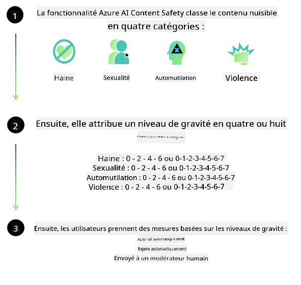
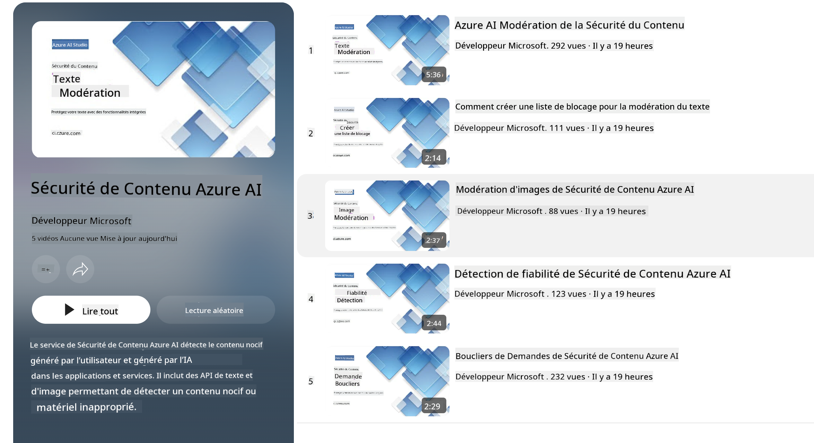

<!--
CO_OP_TRANSLATOR_METADATA:
{
  "original_hash": "c8273672cc57df2be675407a1383aaf0",
  "translation_date": "2025-03-27T05:11:27+00:00",
  "source_file": "md\\01.Introduction\\01\\01.AISafety.md",
  "language_code": "fr"
}
-->
# Sécurité de l'IA pour les modèles Phi

La famille de modèles Phi a été développée conformément au [Microsoft Responsible AI Standard](https://query.prod.cms.rt.microsoft.com/cms/api/am/binary/RE5cmFl), un ensemble d'exigences à l'échelle de l'entreprise basé sur les six principes suivants : responsabilité, transparence, équité, fiabilité et sécurité, confidentialité et inclusivité, qui forment les [principes d'IA responsable de Microsoft](https://www.microsoft.com/ai/responsible-ai).

Comme pour les modèles Phi précédents, une évaluation de sécurité multi-facettes et une approche de post-formation axée sur la sécurité ont été adoptées, avec des mesures supplémentaires prises pour tenir compte des capacités multilingues de cette version. Notre approche en matière de formation et d'évaluation de la sécurité, y compris les tests dans plusieurs langues et catégories de risques, est décrite dans le [Phi Safety Post-Training Paper](https://arxiv.org/abs/2407.13833). Bien que les modèles Phi bénéficient de cette approche, les développeurs doivent appliquer les meilleures pratiques en matière d'IA responsable, notamment en cartographiant, mesurant et atténuant les risques associés à leur cas d'utilisation spécifique ainsi qu'à leur contexte culturel et linguistique.

## Meilleures pratiques

Comme d'autres modèles, la famille de modèles Phi peut potentiellement se comporter de manière injuste, peu fiable ou offensante.

Certains comportements limitants des SLM et LLM à connaître incluent :

- **Qualité de service :** Les modèles Phi sont principalement entraînés sur des textes en anglais. Les langues autres que l'anglais auront des performances inférieures. Les variantes de l'anglais moins représentées dans les données d'entraînement pourraient également afficher des performances inférieures à celles de l'anglais américain standard.
- **Représentation des préjudices et perpétuation des stéréotypes :** Ces modèles peuvent sur-représenter ou sous-représenter certains groupes de personnes, effacer la représentation de certains groupes ou renforcer des stéréotypes dégradants ou négatifs. Malgré la post-formation axée sur la sécurité, ces limitations peuvent encore exister en raison de niveaux de représentation différents pour divers groupes ou de la prévalence d'exemples de stéréotypes négatifs dans les données d'entraînement reflétant des schémas réels et des biais sociétaux.
- **Contenu inapproprié ou offensant :** Ces modèles peuvent générer d'autres types de contenu inapproprié ou offensant, ce qui peut les rendre inadaptés à un déploiement dans des contextes sensibles sans mesures d'atténuation supplémentaires adaptées au cas d'utilisation.
- **Fiabilité de l'information :** Les modèles linguistiques peuvent produire du contenu insensé ou inventer des informations qui semblent raisonnables mais qui sont inexactes ou obsolètes.
- **Portée limitée pour le code :** La majorité des données d'entraînement de Phi-3 est basée sur Python et utilise des bibliothèques courantes telles que "typing, math, random, collections, datetime, itertools". Si le modèle génère des scripts Python utilisant d'autres bibliothèques ou des scripts dans d'autres langages, nous recommandons fortement aux utilisateurs de vérifier manuellement toutes les utilisations des API.

Les développeurs doivent appliquer les meilleures pratiques en matière d'IA responsable et s'assurer qu'un cas d'utilisation spécifique est conforme aux lois et réglementations applicables (par exemple, confidentialité, commerce, etc.).

## Considérations en matière d'IA responsable

Comme d'autres modèles linguistiques, les modèles de la série Phi peuvent potentiellement se comporter de manière injuste, peu fiable ou offensante. Certains des comportements limitants à connaître incluent :

**Qualité de service :** Les modèles Phi sont principalement entraînés sur des textes en anglais. Les langues autres que l'anglais auront des performances inférieures. Les variantes de l'anglais moins représentées dans les données d'entraînement pourraient également afficher des performances inférieures à celles de l'anglais américain standard.

**Représentation des préjudices et perpétuation des stéréotypes :** Ces modèles peuvent sur-représenter ou sous-représenter certains groupes de personnes, effacer la représentation de certains groupes ou renforcer des stéréotypes dégradants ou négatifs. Malgré la post-formation axée sur la sécurité, ces limitations peuvent encore exister en raison de niveaux de représentation différents pour divers groupes ou de la prévalence d'exemples de stéréotypes négatifs dans les données d'entraînement reflétant des schémas réels et des biais sociétaux.

**Contenu inapproprié ou offensant :** Ces modèles peuvent générer d'autres types de contenu inapproprié ou offensant, ce qui peut les rendre inadaptés à un déploiement dans des contextes sensibles sans mesures d'atténuation supplémentaires adaptées au cas d'utilisation.

**Fiabilité de l'information :** Les modèles linguistiques peuvent produire du contenu insensé ou inventer des informations qui semblent raisonnables mais qui sont inexactes ou obsolètes.

**Portée limitée pour le code :** La majorité des données d'entraînement de Phi-3 est basée sur Python et utilise des bibliothèques courantes telles que "typing, math, random, collections, datetime, itertools". Si le modèle génère des scripts Python utilisant d'autres bibliothèques ou des scripts dans d'autres langages, nous recommandons fortement aux utilisateurs de vérifier manuellement toutes les utilisations des API.

Les développeurs doivent appliquer les meilleures pratiques en matière d'IA responsable et s'assurer qu'un cas d'utilisation spécifique est conforme aux lois et réglementations applicables (par exemple, confidentialité, commerce, etc.). Les domaines importants à prendre en compte incluent :

**Allocation :** Les modèles peuvent ne pas convenir à des scénarios ayant un impact conséquent sur le statut juridique ou l'allocation de ressources ou d'opportunités de vie (ex : logement, emploi, crédit, etc.) sans évaluations supplémentaires et techniques de réduction des biais.

**Scénarios à haut risque :** Les développeurs doivent évaluer la pertinence de l'utilisation des modèles dans des scénarios à haut risque où des résultats injustes, peu fiables ou offensants pourraient avoir des conséquences graves ou causer des dommages. Cela inclut la fourniture de conseils dans des domaines sensibles ou nécessitant une expertise, où l'exactitude et la fiabilité sont cruciales (ex : conseils juridiques ou médicaux). Des garanties supplémentaires doivent être mises en œuvre au niveau de l'application en fonction du contexte de déploiement.

**Désinformation :** Les modèles peuvent produire des informations inexactes. Les développeurs doivent suivre les meilleures pratiques en matière de transparence et informer les utilisateurs finaux qu'ils interagissent avec un système d'IA. Au niveau de l'application, les développeurs peuvent intégrer des mécanismes de retour d'information et des pipelines pour ancrer les réponses dans des informations contextuelles spécifiques au cas d'utilisation, une technique connue sous le nom de génération augmentée par récupération (RAG).

**Génération de contenu nuisible :** Les développeurs doivent évaluer les résultats en fonction de leur contexte et utiliser les classificateurs de sécurité disponibles ou des solutions personnalisées adaptées à leur cas d'utilisation.

**Mauvaise utilisation :** D'autres formes de mauvaise utilisation, telles que la fraude, le spam ou la production de logiciels malveillants, peuvent être possibles, et les développeurs doivent s'assurer que leurs applications ne violent pas les lois et réglementations applicables.

### Ajustement fin et sécurité du contenu IA

Après avoir affiné un modèle, nous recommandons fortement d'utiliser les mesures [Azure AI Content Safety](https://learn.microsoft.com/azure/ai-services/content-safety/overview) pour surveiller le contenu généré par les modèles, identifier et bloquer les risques potentiels, les menaces et les problèmes de qualité.

[Azure AI Content Safety](https://learn.microsoft.com/azure/ai-services/content-safety/overview) prend en charge le contenu texte et image. Il peut être déployé dans le cloud, dans des conteneurs déconnectés et sur des appareils embarqués ou en périphérie.

## Aperçu de la sécurité du contenu Azure AI

Azure AI Content Safety n'est pas une solution universelle ; il peut être personnalisé pour s'aligner sur les politiques spécifiques des entreprises. De plus, ses modèles multilingues lui permettent de comprendre plusieurs langues simultanément.

- **Azure AI Content Safety**
- **Microsoft Developer**
- **5 vidéos**

Le service Azure AI Content Safety détecte le contenu nuisible généré par les utilisateurs ou par l'IA dans les applications et services. Il inclut des API texte et image permettant de détecter du contenu nuisible ou inapproprié.

[AI Content Safety Playlist](https://www.youtube.com/playlist?list=PLlrxD0HtieHjaQ9bJjyp1T7FeCbmVcPkQ)

**Clause de non-responsabilité** :  
Ce document a été traduit à l'aide du service de traduction automatique [Co-op Translator](https://github.com/Azure/co-op-translator). Bien que nous nous efforcions d'assurer l'exactitude, veuillez noter que les traductions automatisées peuvent contenir des erreurs ou des inexactitudes. Le document original dans sa langue d'origine doit être considéré comme la source faisant autorité. Pour des informations critiques, il est recommandé de recourir à une traduction professionnelle réalisée par un humain. Nous ne sommes pas responsables des malentendus ou des interprétations erronées résultant de l'utilisation de cette traduction.