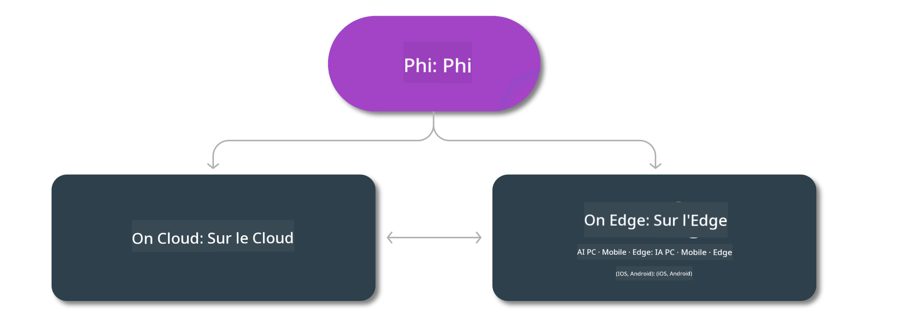

<!--
CO_OP_TRANSLATOR_METADATA:
{
  "original_hash": "777aa0ff38fceecc29a00834f2f7a2f0",
  "translation_date": "2025-03-27T05:28:48+00:00",
  "source_file": "md\\01.Introduction\\01\\01.Edgeandcloud.md",
  "language_code": "fr"
}
-->
# Modèles Phi & Disponibilité sur les plateformes

## Scénarios Edge & Cloud

## Disponibilité des modèles et ressources

| | | | | | | | | |
|-|-|-|-|-|-|-|-|-|
|Modèle|Entrée|Longueur du contenu|Azure AI (MaaS)|Azure ML (MaaP)|ONNX|Hugging Face|Ollama|Nvidia NIM|
|Phi-3-vision-128k-instruct|Texte+Image|128k|[Playground & Déploiement](https://ai.azure.com/explore/models/Phi-3-vision-128k-instruct/version/2/registry/azureml)|[Playground, Déploiement & Affinage](https://ml.azure.com/registries/azureml/models/Phi-3-vision-128k-instruct/version/2)|[CUDA](https://huggingface.co/microsoft/Phi-3-vision-128k-instruct-onnx-cuda/tree/main),[CPU](https://huggingface.co/microsoft/Phi-3-vision-128k-instruct-onnx-cpu/tree/main), [DirectML](https://huggingface.co/microsoft/Phi-3-vision-128k-instruct-onnx-directml/tree/main)|[Télécharger](https://huggingface.co/microsoft/Phi-3-vision-128k-instruct)|-NA-|[APIs NIM](https://build.nvidia.com/microsoft/phi-3-vision-128k-instruct)|
|Phi-3-mini-4k-instruct|Texte|4k|[Playground & Déploiement](https://aka.ms/phi3-mini-4k-azure-ml)|[Playground, Déploiement](https://aka.ms/phi3-mini-4k-azure-ml) & Affinage|[CUDA](https://huggingface.co/microsoft/Phi-3-mini-4k-instruct-onnx), [Web](https://huggingface.co/microsoft/Phi-3-mini-4k-instruct-onnx)|[Playground & Télécharger](https://huggingface.co/chat/models/microsoft/Phi-3-mini-4k-instruct)|[GGUF](https://huggingface.co/microsoft/Phi-3-mini-4k-instruct-gguf)|[APIs NIM](https://build.nvidia.com/microsoft/phi-3-mini-4k)|
|Phi-3-mini-128k-instruct|Texte|128k|[Playground & Déploiement](https://ai.azure.com/explore/models/Phi-3-mini-128k-instruct/version/9/registry/azureml)|[Playground, Déploiement](https://ai.azure.com/explore/models/Phi-3-mini-128k-instruct/version/9/registry/azureml) & Affinage|[CUDA](https://huggingface.co/microsoft/Phi-3-mini-128k-instruct-onnx)|[Télécharger](https://huggingface.co/microsoft/Phi-3-mini-128k-instruct-onnx)|-NA-|[APIs NIM](https://build.nvidia.com/microsoft/phi-3-mini)|
|Phi-3-small-8k-instruct|Texte|8k|[Playground & Déploiement](https://ml.azure.com/registries/azureml/models/Phi-3-small-8k-instruct/version/2)|[Playground, Déploiement](https://ai.azure.com/explore/models/Phi-3-small-8k-instruct/version/2/registry/azureml) & Affinage|[CUDA](https://huggingface.co/microsoft/Phi-3-small-8k-instruct-onnx-cuda)|[Télécharger](https://huggingface.co/microsoft/Phi-3-small-8k-instruct-onnx-cuda)|-NA-|[APIs NIM](https://build.nvidia.com/microsoft/phi-3-small-8k-instruct?docker=false)|
|Phi-3-small-128k-instruct|Texte|128k|[Playground & Déploiement](https://ai.azure.com/explore/models/Phi-3-small-128k-instruct/version/2/registry/azureml)|[Playground, Déploiement](https://ml.azure.com/registries/azureml/models/Phi-3-small-128k-instruct/version/2) & Affinage|[CUDA](https://huggingface.co/microsoft/Phi-3-medium-128k-instruct-onnx-cuda)|[Télécharger](https://huggingface.co/microsoft/Phi-3-small-128k-instruct)|-NA-|[APIs NIM](https://build.nvidia.com/microsoft/phi-3-small-128k-instruct?docker=false)|
|Phi-3-medium-4k-instruct|Texte|4k|[Playground et Déploiement](https://huggingface.co/microsoft/Phi-3-medium-4k-instruct)|[Playground, Déploiement](https://ml.azure.com/registries/azureml/models/Phi-3-medium-4k-instruct/version/2) et Ajustement fin|[CUDA](https://huggingface.co/microsoft/Phi-3-medium-4k-instruct-onnx-cuda/tree/main), [CPU](https://huggingface.co/microsoft/Phi-3-medium-4k-instruct-onnx-cpu/tree/main), [DirectML](https://huggingface.co/microsoft/Phi-3-medium-4k-instruct-onnx-directml/tree/main)|[Télécharger](https://huggingface.co/microsoft/Phi-3-medium-4k-instruct)|-N/A-|[APIs NIM](https://build.nvidia.com/microsoft/phi-3-medium-4k-instruct?docker=false)|
|Phi-3-medium-128k-instruct|Texte|128k|[Playground et Déploiement](https://ai.azure.com/explore/models/Phi-3-medium-128k-instruct/version/2)|[Playground, Déploiement](https://ml.azure.com/registries/azureml/models/Phi-3-medium-128k-instruct/version/2) et Ajustement fin|[CUDA](https://huggingface.co/microsoft/Phi-3-medium-128k-instruct-onnx-cuda/tree/main), [CPU](https://huggingface.co/microsoft/Phi-3-medium-128k-instruct-onnx-cpu/tree/main), [DirectML](https://huggingface.co/microsoft/Phi-3-medium-128k-instruct-onnx-directml/tree/main)|[Télécharger](https://huggingface.co/microsoft/Phi-3-medium-128k-instruct)|-N/A-|-N/A-|

**Avertissement** :  
Ce document a été traduit à l'aide du service de traduction automatique [Co-op Translator](https://github.com/Azure/co-op-translator). Bien que nous nous efforcions de garantir l'exactitude, veuillez noter que les traductions automatiques peuvent contenir des erreurs ou des inexactitudes. Le document original dans sa langue d'origine doit être considéré comme la source faisant autorité. Pour des informations critiques, une traduction professionnelle réalisée par un humain est recommandée. Nous ne sommes pas responsables des malentendus ou des interprétations erronées résultant de l'utilisation de cette traduction.