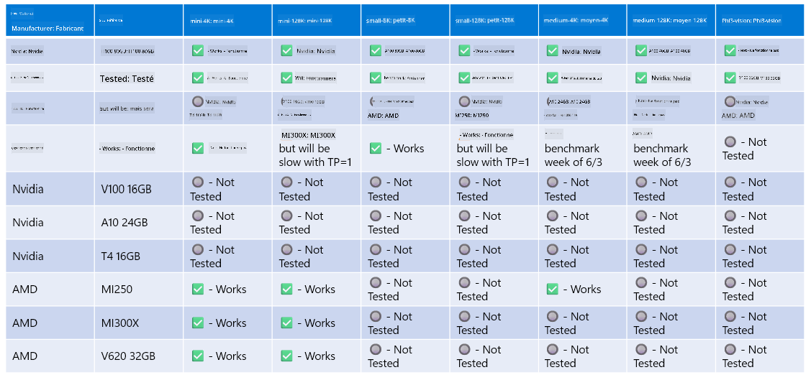

<!--
CO_OP_TRANSLATOR_METADATA:
{
  "original_hash": "8cdc17ce0f10535da30b53d23fe1a795",
  "translation_date": "2025-03-27T05:50:16+00:00",
  "source_file": "md\\01.Introduction\\01\\01.Hardwaresupport.md",
  "language_code": "fr"
}
-->
# Support matériel pour Phi

Microsoft Phi a été optimisé pour ONNX Runtime et prend en charge Windows DirectML. Il fonctionne efficacement sur divers types de matériel, y compris les GPU, les CPU, et même les appareils mobiles.

## Matériel des périphériques 
Plus précisément, le matériel pris en charge inclut :

- GPU SKU : RTX 4090 (DirectML)
- GPU SKU : 1 A100 80GB (CUDA)
- CPU SKU : Standard F64s v2 (64 vCPUs, 128 GiB de mémoire)

## SKU mobiles

- Android - Samsung Galaxy S21
- Apple iPhone 14 ou supérieur avec processeur A16/A17

## Spécifications matérielles pour Phi

- Configuration minimale requise.
- Windows : GPU compatible DirectX 12 et au moins 4 Go de RAM combinée

CUDA : GPU NVIDIA avec une capacité de calcul >= 7.02



## Exécution d’onnxruntime sur plusieurs GPU

Les modèles ONNX Phi actuellement disponibles sont uniquement conçus pour un GPU. Il est possible de prendre en charge plusieurs GPU pour les modèles Phi, mais l’utilisation d’ORT avec 2 GPU ne garantit pas nécessairement un débit supérieur par rapport à 2 instances distinctes d’ORT. Veuillez consulter [ONNX Runtime](https://onnxruntime.ai/) pour les dernières mises à jour.

Lors de [Build 2024, l'équipe GenAI ONNX](https://youtu.be/WLW4SE8M9i8?si=EtG04UwDvcjunyfC) a annoncé qu'ils avaient activé l'exécution multi-instance au lieu de multi-GPU pour les modèles Phi.

Actuellement, cela vous permet d’exécuter une instance d’onnxruntime ou d’onnxruntime-genai avec la variable d’environnement CUDA_VISIBLE_DEVICES comme suit.

```Python
CUDA_VISIBLE_DEVICES=0 python infer.py
CUDA_VISIBLE_DEVICES=1 python infer.py
```

N’hésitez pas à explorer Phi davantage sur [Azure AI Foundry](https://ai.azure.com)

**Avertissement** :  
Ce document a été traduit à l'aide du service de traduction IA [Co-op Translator](https://github.com/Azure/co-op-translator). Bien que nous nous efforcions d'assurer l'exactitude, veuillez noter que les traductions automatisées peuvent contenir des erreurs ou des imprécisions. Le document original dans sa langue d'origine doit être considéré comme la source faisant autorité. Pour les informations critiques, une traduction humaine professionnelle est recommandée. Nous ne sommes pas responsables des malentendus ou des interprétations erronées résultant de l'utilisation de cette traduction.