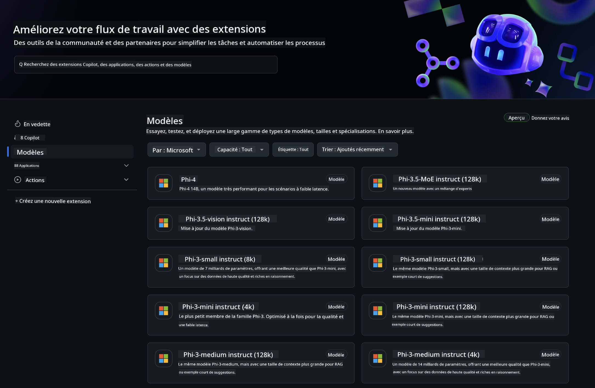
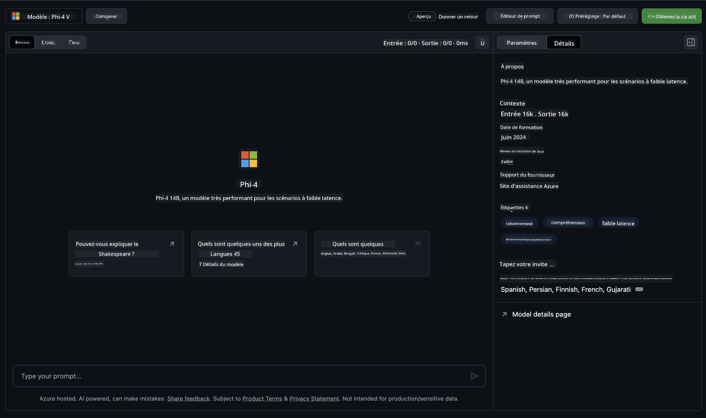
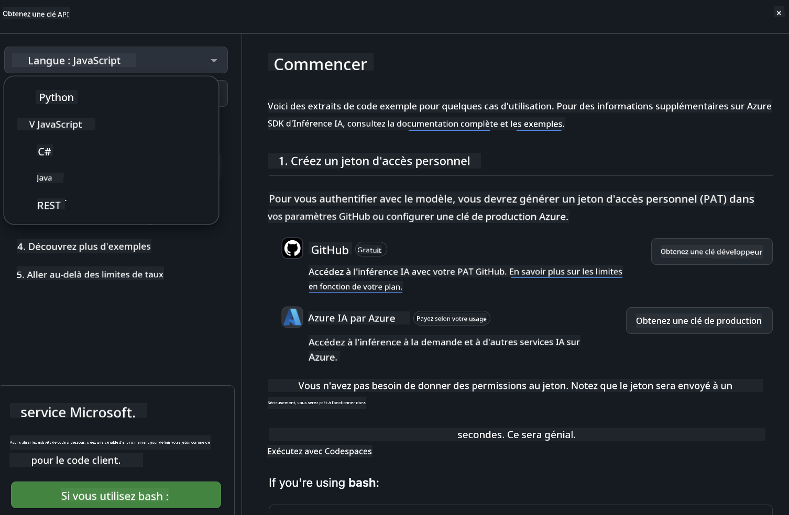
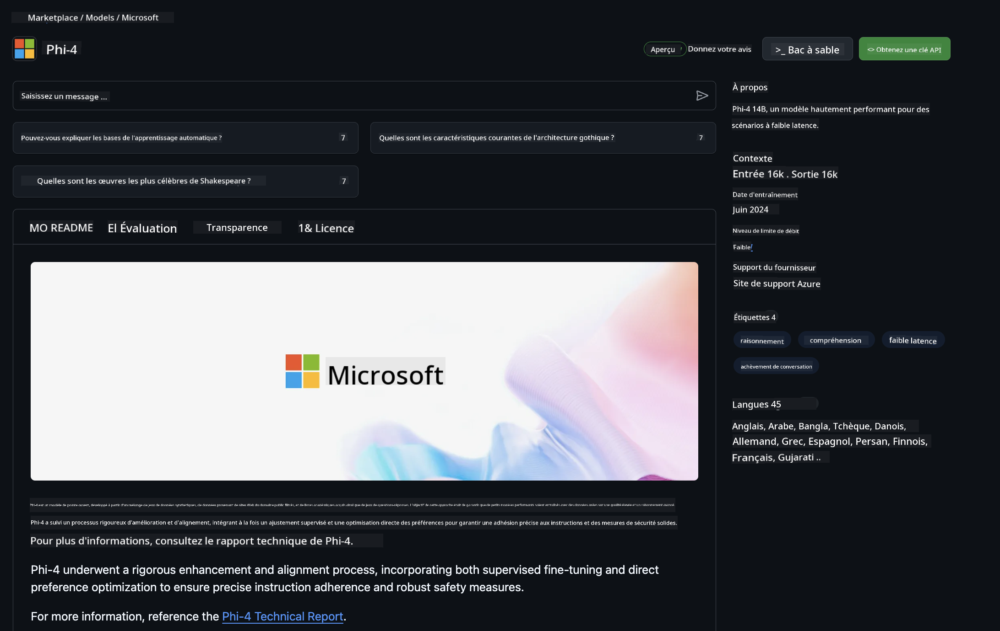

<!--
CO_OP_TRANSLATOR_METADATA:
{
  "original_hash": "fb67a08b9fc911a10ed58081fadef416",
  "translation_date": "2025-03-27T06:14:58+00:00",
  "source_file": "md\\01.Introduction\\02\\02.GitHubModel.md",
  "language_code": "fr"
}
-->
## Famille Phi dans les modèles GitHub

Bienvenue sur [GitHub Models](https://github.com/marketplace/models) ! Tout est prêt pour que vous puissiez explorer les modèles d'IA hébergés sur Azure AI.



Pour plus d'informations sur les modèles disponibles sur GitHub Models, consultez le [GitHub Model Marketplace](https://github.com/marketplace/models)

## Modèles disponibles

Chaque modèle dispose d'un espace de test dédié et de code d'exemple 



### Famille Phi dans le catalogue de modèles GitHub

- [Phi-4](https://github.com/marketplace/models/azureml/Phi-4)

- [Phi-3.5-MoE instruct (128k)](https://github.com/marketplace/models/azureml/Phi-3-5-MoE-instruct)

- [Phi-3.5-vision instruct (128k)](https://github.com/marketplace/models/azureml/Phi-3-5-vision-instruct)

- [Phi-3.5-mini instruct (128k)](https://github.com/marketplace/models/azureml/Phi-3-5-mini-instruct)

- [Phi-3-Medium-128k-Instruct](https://github.com/marketplace/models/azureml/Phi-3-medium-128k-instruct)

- [Phi-3-medium-4k-instruct](https://github.com/marketplace/models/azureml/Phi-3-medium-4k-instruct)

- [Phi-3-mini-128k-instruct](https://github.com/marketplace/models/azureml/Phi-3-mini-128k-instruct)

- [Phi-3-mini-4k-instruct](https://github.com/marketplace/models/azureml/Phi-3-mini-4k-instruct)

- [Phi-3-small-128k-instruct](https://github.com/marketplace/models/azureml/Phi-3-small-128k-instruct)

- [Phi-3-small-8k-instruct](https://github.com/marketplace/models/azureml/Phi-3-small-8k-instruct)

## Prise en main

Quelques exemples de base sont prêts à être exécutés. Vous pouvez les trouver dans le répertoire des exemples. Si vous souhaitez passer directement à votre langage préféré, vous trouverez des exemples dans les langages suivants :

- Python
- JavaScript
- C#
- Java
- cURL

Un environnement dédié Codespaces est également disponible pour exécuter les exemples et les modèles. 



## Code d'exemple 

Voici des extraits de code pour quelques cas d'utilisation. Pour plus d'informations sur Azure AI Inference SDK, consultez la documentation complète et les exemples.

## Configuration 

1. Créez un jeton d'accès personnel  
Vous n'avez pas besoin d'accorder de permissions au jeton. Notez que le jeton sera envoyé à un service Microsoft.

Pour utiliser les extraits de code ci-dessous, créez une variable d'environnement pour définir votre jeton comme clé pour le code client.

Si vous utilisez bash :  
```
export GITHUB_TOKEN="<your-github-token-goes-here>"
```  
Si vous êtes sous PowerShell :  

```
$Env:GITHUB_TOKEN="<your-github-token-goes-here>"
```  

Si vous utilisez l'invite de commande Windows :  

```
set GITHUB_TOKEN=<your-github-token-goes-here>
```  

## Exemple en Python

### Installer les dépendances  
Installez le SDK Azure AI Inference en utilisant pip (Requis : Python >=3.8) :  

```
pip install azure-ai-inference
```  

### Exécuter un exemple de code de base  

Cet exemple montre un appel basique à l'API de complétion de chat. Il utilise le point de terminaison d'inférence du modèle GitHub AI et votre jeton GitHub. L'appel est synchrone.  

```python
import os
from azure.ai.inference import ChatCompletionsClient
from azure.ai.inference.models import SystemMessage, UserMessage
from azure.core.credentials import AzureKeyCredential

endpoint = "https://models.inference.ai.azure.com"
model_name = "Phi-4"
token = os.environ["GITHUB_TOKEN"]

client = ChatCompletionsClient(
    endpoint=endpoint,
    credential=AzureKeyCredential(token),
)

response = client.complete(
    messages=[
        UserMessage(content="I have $20,000 in my savings account, where I receive a 4% profit per year and payments twice a year. Can you please tell me how long it will take for me to become a millionaire? Also, can you please explain the math step by step as if you were explaining it to an uneducated person?"),
    ],
    temperature=0.4,
    top_p=1.0,
    max_tokens=2048,
    model=model_name
)

print(response.choices[0].message.content)
```  

### Exécuter une conversation à plusieurs tours  

Cet exemple illustre une conversation à plusieurs tours avec l'API de complétion de chat. Lorsque vous utilisez le modèle pour une application de chat, vous devrez gérer l'historique de cette conversation et envoyer les messages les plus récents au modèle.  

```
import os
from azure.ai.inference import ChatCompletionsClient
from azure.ai.inference.models import AssistantMessage, SystemMessage, UserMessage
from azure.core.credentials import AzureKeyCredential

token = os.environ["GITHUB_TOKEN"]
endpoint = "https://models.inference.ai.azure.com"
# Replace Model_Name
model_name = "Phi-4"

client = ChatCompletionsClient(
    endpoint=endpoint,
    credential=AzureKeyCredential(token),
)

messages = [
    SystemMessage(content="You are a helpful assistant."),
    UserMessage(content="What is the capital of France?"),
    AssistantMessage(content="The capital of France is Paris."),
    UserMessage(content="What about Spain?"),
]

response = client.complete(messages=messages, model=model_name)

print(response.choices[0].message.content)
```  

### Diffuser la sortie  

Pour une meilleure expérience utilisateur, vous souhaiterez diffuser la réponse du modèle afin que le premier jeton s'affiche rapidement et que vous évitiez d'attendre les réponses longues.  

```
import os
from azure.ai.inference import ChatCompletionsClient
from azure.ai.inference.models import SystemMessage, UserMessage
from azure.core.credentials import AzureKeyCredential

token = os.environ["GITHUB_TOKEN"]
endpoint = "https://models.inference.ai.azure.com"
# Replace Model_Name
model_name = "Phi-4"

client = ChatCompletionsClient(
    endpoint=endpoint,
    credential=AzureKeyCredential(token),
)

response = client.complete(
    stream=True,
    messages=[
        SystemMessage(content="You are a helpful assistant."),
        UserMessage(content="Give me 5 good reasons why I should exercise every day."),
    ],
    model=model_name,
)

for update in response:
    if update.choices:
        print(update.choices[0].delta.content or "", end="")

client.close()
```  

## Utilisation GRATUITE et limites de taux pour les modèles GitHub  



Les [limites de taux pour l'espace de test et l'utilisation gratuite de l'API](https://docs.github.com/en/github-models/prototyping-with-ai-models#rate-limits) sont conçues pour vous aider à expérimenter avec les modèles et à prototyper votre application IA. Pour une utilisation au-delà de ces limites, et pour passer à l'échelle avec votre application, vous devez provisionner des ressources à partir d'un compte Azure et vous authentifier depuis ce dernier au lieu de votre jeton d'accès personnel GitHub. Vous n'avez pas besoin de modifier quoi que ce soit d'autre dans votre code. Utilisez ce lien pour découvrir comment dépasser les limites du niveau gratuit dans Azure AI.  

### Déclarations  

Rappelez-vous qu'en interagissant avec un modèle, vous expérimentez avec l'IA, donc des erreurs de contenu sont possibles.  

La fonctionnalité est soumise à diverses limites (y compris les requêtes par minute, par jour, les jetons par requête et les requêtes simultanées) et n'est pas conçue pour des cas d'utilisation en production.  

GitHub Models utilise Azure AI Content Safety. Ces filtres ne peuvent pas être désactivés dans le cadre de l'expérience GitHub Models. Si vous décidez d'utiliser des modèles via un service payant, veuillez configurer vos filtres de contenu pour répondre à vos besoins.  

Ce service est soumis aux conditions préalables de GitHub.  

**Avertissement** :  
Ce document a été traduit à l'aide du service de traduction automatique [Co-op Translator](https://github.com/Azure/co-op-translator). Bien que nous fassions de notre mieux pour garantir l'exactitude, veuillez noter que les traductions automatisées peuvent contenir des erreurs ou des inexactitudes. Le document original dans sa langue d'origine doit être considéré comme la source faisant autorité. Pour des informations critiques, il est recommandé de faire appel à une traduction humaine professionnelle. Nous déclinons toute responsabilité en cas de malentendus ou d'interprétations erronées résultant de l'utilisation de cette traduction.