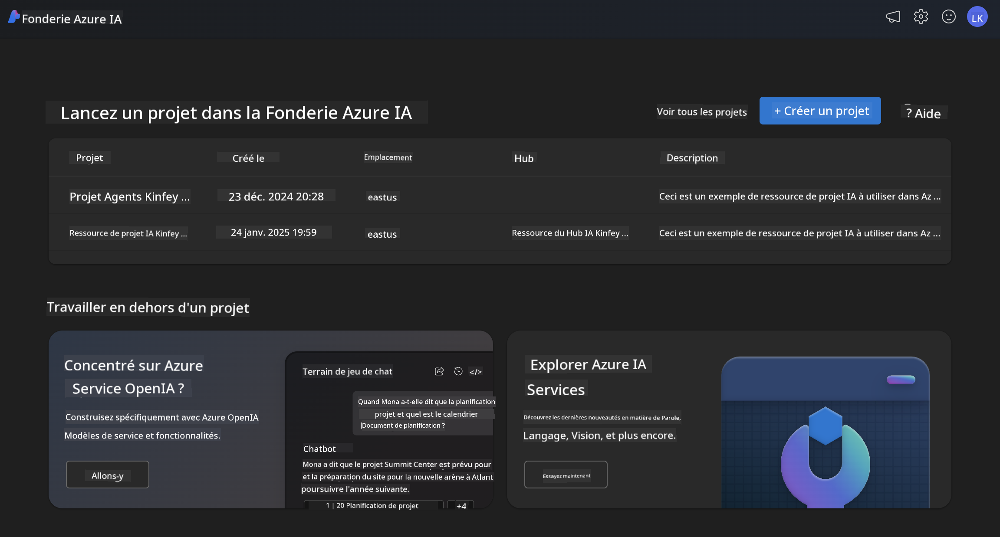
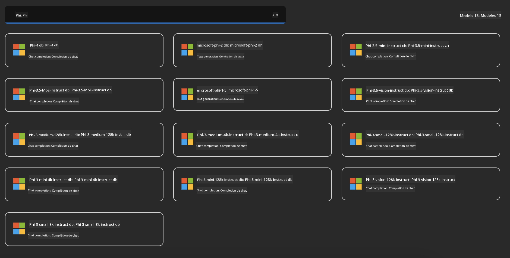
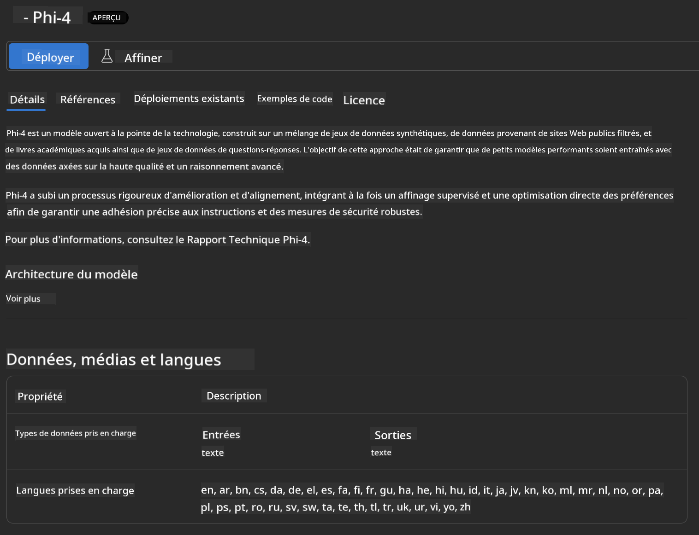
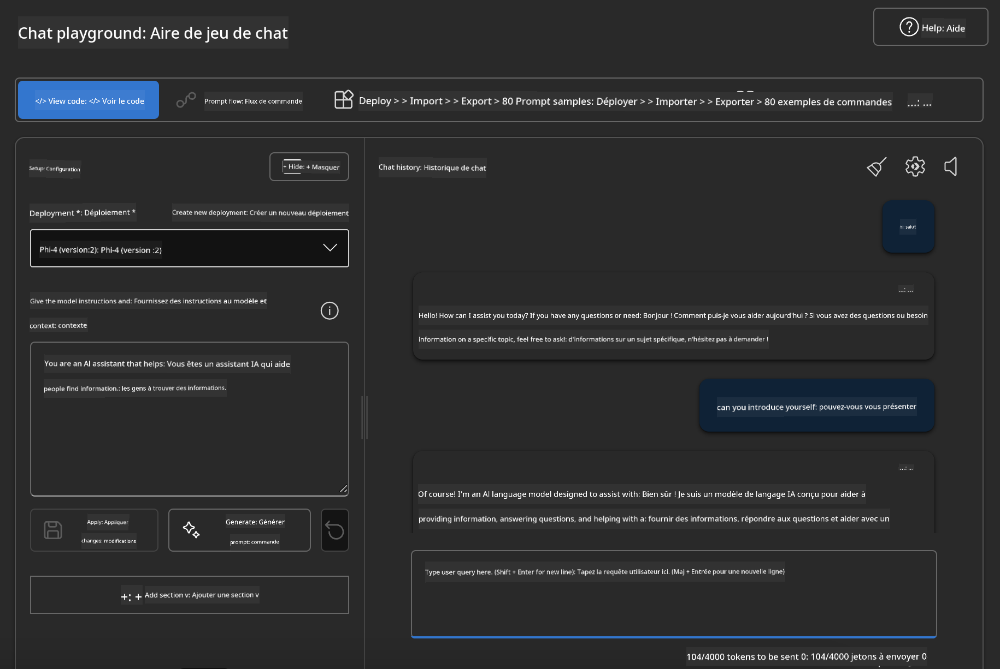

<!--
CO_OP_TRANSLATOR_METADATA:
{
  "original_hash": "e0855ebac4b4d8a402c75ddc0c7588c5",
  "translation_date": "2025-03-27T06:21:08+00:00",
  "source_file": "md\\01.Introduction\\02\\03.AzureAIFoundry.md",
  "language_code": "fr"
}
-->
## Famille Phi dans Azure AI Foundry

[Azure AI Foundry](https://ai.azure.com) est une plateforme de confiance qui permet aux développeurs de stimuler l'innovation et de façonner l'avenir avec l'IA de manière sûre, sécurisée et responsable.

[Azure AI Foundry](https://ai.azure.com) est conçu pour permettre aux développeurs de :

- Créer des applications d'IA générative sur une plateforme de niveau entreprise.
- Explorer, construire, tester et déployer en utilisant des outils d'IA et des modèles d'apprentissage automatique à la pointe de la technologie, tout en respectant les pratiques d'IA responsable.
- Collaborer avec une équipe tout au long du cycle de vie du développement d'applications.

Avec Azure AI Foundry, vous pouvez explorer une grande variété de modèles, services et capacités, et commencer à créer des applications d'IA qui répondent au mieux à vos objectifs. La plateforme Azure AI Foundry facilite l'évolutivité pour transformer des preuves de concept en applications de production complètes en toute simplicité. Une surveillance continue et des ajustements soutiennent le succès à long terme.



En plus d'utiliser le service Azure AOAI dans Azure AI Foundry, vous pouvez également utiliser des modèles tiers dans le catalogue de modèles d'Azure AI Foundry. C'est une excellente option si vous souhaitez utiliser Azure AI Foundry comme plateforme pour vos solutions d'IA.

Nous pouvons rapidement déployer des modèles de la famille Phi via le catalogue de modèles dans Azure AI Foundry.



### **Déployer Phi-4 dans Azure AI Foundry**



### **Tester Phi-4 dans le Playground d'Azure AI Foundry**



### **Exécuter du code Python pour appeler Phi-4 d'Azure AI Foundry**

```python

import os  
import base64
from openai import AzureOpenAI  
from azure.identity import DefaultAzureCredential, get_bearer_token_provider  
        
endpoint = os.getenv("ENDPOINT_URL", "Your Azure AOAI Service Endpoint")  
deployment = os.getenv("DEPLOYMENT_NAME", "Phi-4")  
      
token_provider = get_bearer_token_provider(  
    DefaultAzureCredential(),  
    "https://cognitiveservices.azure.com/.default"  
)  
  
client = AzureOpenAI(  
    azure_endpoint=endpoint,  
    azure_ad_token_provider=token_provider,  
    api_version="2024-05-01-preview",  
)  
  

chat_prompt = [
    {
        "role": "system",
        "content": "You are an AI assistant that helps people find information."
    },
    {
        "role": "user",
        "content": "can you introduce yourself"
    }
] 
    
# Include speech result if speech is enabled  
messages = chat_prompt 

completion = client.chat.completions.create(  
    model=deployment,  
    messages=messages,
    max_tokens=800,  
    temperature=0.7,  
    top_p=0.95,  
    frequency_penalty=0,  
    presence_penalty=0,
    stop=None,  
    stream=False  
)  
  
print(completion.to_json())  

```

**Clause de non-responsabilité** :  
Ce document a été traduit à l'aide du service de traduction par IA [Co-op Translator](https://github.com/Azure/co-op-translator). Bien que nous nous efforcions d'assurer l'exactitude, veuillez noter que les traductions automatisées peuvent contenir des erreurs ou des inexactitudes. Le document original dans sa langue d'origine doit être considéré comme la source faisant autorité. Pour des informations critiques, une traduction professionnelle réalisée par un humain est recommandée. Nous déclinons toute responsabilité en cas de malentendus ou d'interprétations erronées résultant de l'utilisation de cette traduction.