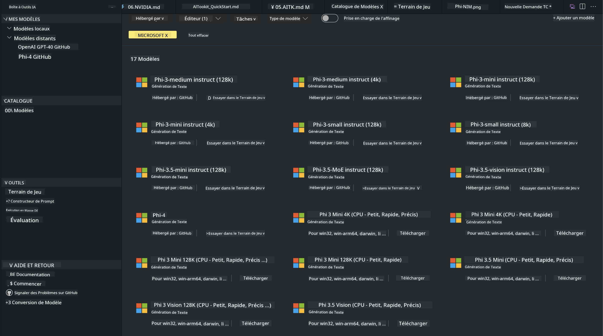
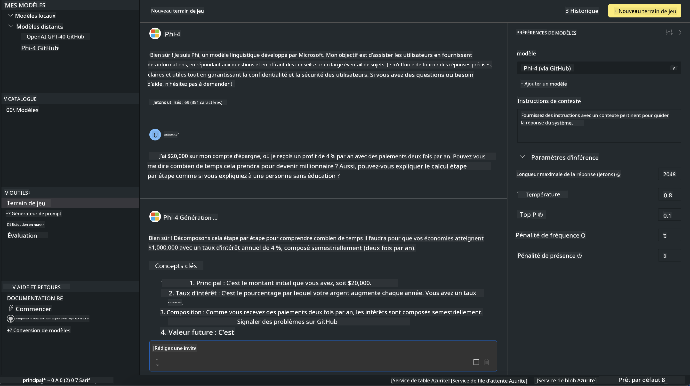

<!--
CO_OP_TRANSLATOR_METADATA:
{
  "original_hash": "4951d458c0b60c02cd1e751b40903877",
  "translation_date": "2025-03-27T06:33:25+00:00",
  "source_file": "md\\01.Introduction\\02\\05.AITK.md",
  "language_code": "fr"
}
-->
# Famille Phi dans AITK

[AI Toolkit pour VS Code](https://marketplace.visualstudio.com/items?itemName=ms-windows-ai-studio.windows-ai-studio) simplifie le développement d'applications d'IA générative en rassemblant des outils de développement IA de pointe et des modèles provenant du catalogue Azure AI Foundry et d'autres catalogues comme Hugging Face. Vous pourrez parcourir le catalogue de modèles IA alimenté par GitHub Models et Azure AI Foundry Model Catalogs, les télécharger localement ou à distance, les ajuster, les tester et les utiliser dans votre application.

AI Toolkit Preview fonctionnera localement. L'inférence locale ou l'ajustement dépend du modèle que vous avez sélectionné. Vous pourriez avoir besoin d'un GPU tel qu'un GPU NVIDIA CUDA. Vous pouvez également exécuter directement les modèles GitHub avec AITK.

## Premiers Pas

[Découvrez comment installer le sous-système Windows pour Linux](https://learn.microsoft.com/windows/wsl/install?WT.mc_id=aiml-137032-kinfeylo)

et [changer la distribution par défaut](https://learn.microsoft.com/windows/wsl/install#change-the-default-linux-distribution-installed).

[Repo GitHub AI Toolkit](https://github.com/microsoft/vscode-ai-toolkit/)

- Windows, Linux, macOS
  
- Pour l'ajustement sur Windows et Linux, vous aurez besoin d'un GPU Nvidia. En outre, **Windows** nécessite le sous-système pour Linux avec une distribution Ubuntu 18.4 ou supérieure. [Découvrez comment installer le sous-système Windows pour Linux](https://learn.microsoft.com/windows/wsl/install) et [changer la distribution par défaut](https://learn.microsoft.com/windows/wsl/install#change-the-default-linux-distribution-installed).

### Installer AI Toolkit

AI Toolkit est fourni sous forme d'[extension pour Visual Studio Code](https://code.visualstudio.com/docs/setup/additional-components#_vs-code-extensions), donc vous devez d'abord installer [VS Code](https://code.visualstudio.com/docs/setup/windows?WT.mc_id=aiml-137032-kinfeylo) et télécharger AI Toolkit depuis le [VS Marketplace](https://marketplace.visualstudio.com/items?itemName=ms-windows-ai-studio.windows-ai-studio).  
[AI Toolkit est disponible sur le Visual Studio Marketplace](https://marketplace.visualstudio.com/items?itemName=ms-windows-ai-studio.windows-ai-studio) et peut être installé comme toute autre extension VS Code.  

Si vous ne savez pas comment installer des extensions VS Code, suivez ces étapes :

### Connexion

1. Dans la barre d'activités de VS Code, sélectionnez **Extensions**.
2. Dans la barre de recherche des extensions, tapez "AI Toolkit".
3. Sélectionnez "AI Toolkit pour Visual Studio Code".
4. Cliquez sur **Installer**.

Vous êtes maintenant prêt à utiliser l'extension !

Vous serez invité à vous connecter à GitHub, cliquez donc sur "Autoriser" pour continuer. Vous serez redirigé vers la page de connexion GitHub.

Veuillez vous connecter et suivre les étapes du processus. Une fois terminé avec succès, vous serez redirigé vers VS Code.

Une fois l'extension installée, vous verrez l'icône AI Toolkit apparaître dans votre barre d'activités.

Explorons les actions disponibles !

### Actions Disponibles

La barre latérale principale d'AI Toolkit est organisée en  

- **Modèles**
- **Ressources**
- **Playground**  
- **Ajustement**
- **Évaluation**

Ces sections sont disponibles dans la partie Ressources. Pour commencer, sélectionnez **Catalogue de Modèles**.

### Télécharger un modèle depuis le catalogue

Après avoir lancé AI Toolkit depuis la barre latérale de VS Code, vous pouvez choisir parmi les options suivantes :



- Trouvez un modèle pris en charge dans le **Catalogue de Modèles** et téléchargez-le localement.
- Testez l'inférence du modèle dans le **Playground de Modèles**.
- Ajustez le modèle localement ou à distance dans **Ajustement de Modèles**.
- Déployez des modèles ajustés dans le cloud via la palette de commandes d'AI Toolkit.
- Évaluez les modèles.

> [!NOTE]
>
> **GPU Vs CPU**
>
> Vous remarquerez que les fiches des modèles indiquent la taille du modèle, la plateforme et le type d'accélérateur (CPU, GPU). Pour des performances optimisées sur **les appareils Windows équipés d'au moins un GPU**, sélectionnez les versions de modèles qui ciblent uniquement Windows.
>
> Cela garantit que vous disposez d'un modèle optimisé pour l'accélérateur DirectML.
>
> Les noms des modèles sont au format
>
> - `{model_name}-{accelerator}-{quantization}-{format}`.
>
>Pour vérifier si vous avez un GPU sur votre appareil Windows, ouvrez le **Gestionnaire des tâches** et sélectionnez l'onglet **Performances**. Si vous avez des GPU, ils seront listés sous des noms comme "GPU 0" ou "GPU 1".

### Exécuter le modèle dans le playground

Après avoir défini tous les paramètres, cliquez sur **Générer Projet**.

Une fois votre modèle téléchargé, sélectionnez **Charger dans le Playground** sur la fiche du modèle dans le catalogue :

- Lancez le téléchargement du modèle.
- Installez tous les prérequis et dépendances.
- Créez un espace de travail VS Code.



### Utiliser l'API REST dans votre application 

AI Toolkit inclut un serveur web local REST API **sur le port 5272** qui utilise le [format OpenAI chat completions](https://platform.openai.com/docs/api-reference/chat/create). 

Cela vous permet de tester votre application localement sans dépendre d'un service de modèles IA dans le cloud. Par exemple, le fichier JSON suivant montre comment configurer le corps de la requête :

```json
{
    "model": "Phi-4",
    "messages": [
        {
            "role": "user",
            "content": "what is the golden ratio?"
        }
    ],
    "temperature": 0.7,
    "top_p": 1,
    "top_k": 10,
    "max_tokens": 100,
    "stream": true
}
```

Vous pouvez tester l'API REST en utilisant (par exemple) [Postman](https://www.postman.com/) ou l'utilitaire CURL (Client URL) :

```bash
curl -vX POST http://127.0.0.1:5272/v1/chat/completions -H 'Content-Type: application/json' -d @body.json
```

### Utiliser la bibliothèque cliente OpenAI pour Python

```python
from openai import OpenAI

client = OpenAI(
    base_url="http://127.0.0.1:5272/v1/", 
    api_key="x" # required for the API but not used
)

chat_completion = client.chat.completions.create(
    messages=[
        {
            "role": "user",
            "content": "what is the golden ratio?",
        }
    ],
    model="Phi-4",
)

print(chat_completion.choices[0].message.content)
```

### Utiliser la bibliothèque cliente Azure OpenAI pour .NET

Ajoutez la [bibliothèque cliente Azure OpenAI pour .NET](https://www.nuget.org/packages/Azure.AI.OpenAI/) à votre projet en utilisant NuGet :

```bash
dotnet add {project_name} package Azure.AI.OpenAI --version 1.0.0-beta.17
```

Ajoutez un fichier C# nommé **OverridePolicy.cs** à votre projet et collez le code suivant :

```csharp
// OverridePolicy.cs
using Azure.Core.Pipeline;
using Azure.Core;

internal partial class OverrideRequestUriPolicy(Uri overrideUri)
    : HttpPipelineSynchronousPolicy
{
    private readonly Uri _overrideUri = overrideUri;

    public override void OnSendingRequest(HttpMessage message)
    {
        message.Request.Uri.Reset(_overrideUri);
    }
}
```

Ensuite, collez le code suivant dans votre fichier **Program.cs** :

```csharp
// Program.cs
using Azure.AI.OpenAI;

Uri localhostUri = new("http://localhost:5272/v1/chat/completions");

OpenAIClientOptions clientOptions = new();
clientOptions.AddPolicy(
    new OverrideRequestUriPolicy(localhostUri),
    Azure.Core.HttpPipelinePosition.BeforeTransport);
OpenAIClient client = new(openAIApiKey: "unused", clientOptions);

ChatCompletionsOptions options = new()
{
    DeploymentName = "Phi-4",
    Messages =
    {
        new ChatRequestSystemMessage("You are a helpful assistant. Be brief and succinct."),
        new ChatRequestUserMessage("What is the golden ratio?"),
    }
};

StreamingResponse<StreamingChatCompletionsUpdate> streamingChatResponse
    = await client.GetChatCompletionsStreamingAsync(options);

await foreach (StreamingChatCompletionsUpdate chatChunk in streamingChatResponse)
{
    Console.Write(chatChunk.ContentUpdate);
}
```

## Ajustement avec AI Toolkit

- Commencez par la découverte de modèles et le playground.
- Ajustement de modèles et inférence en utilisant des ressources informatiques locales.
- Ajustement et inférence à distance en utilisant des ressources Azure.

[Ajustement avec AI Toolkit](../../03.FineTuning/Finetuning_VSCodeaitoolkit.md)

## Ressources de Q&A pour AI Toolkit

Veuillez consulter notre [page Q&A](https://github.com/microsoft/vscode-ai-toolkit/blob/main/archive/QA.md) pour les problèmes et résolutions les plus courants.

**Avertissement** :  
Ce document a été traduit à l'aide du service de traduction automatique [Co-op Translator](https://github.com/Azure/co-op-translator). Bien que nous nous efforcions d'assurer l'exactitude, veuillez noter que les traductions automatisées peuvent contenir des erreurs ou des inexactitudes. Le document original dans sa langue d'origine doit être considéré comme la source faisant autorité. Pour des informations critiques, il est recommandé de faire appel à une traduction humaine professionnelle. Nous déclinons toute responsabilité en cas de malentendus ou d'interprétations erronées résultant de l'utilisation de cette traduction.