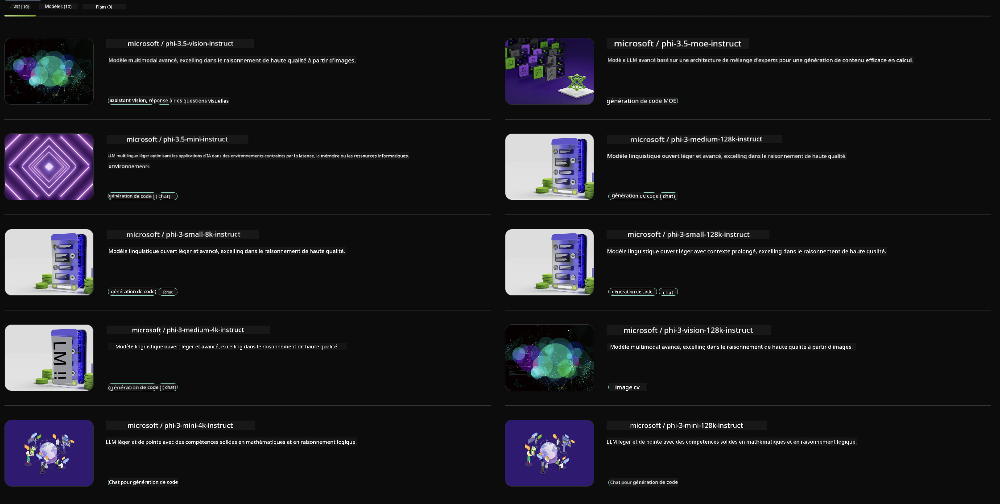

<!--
CO_OP_TRANSLATOR_METADATA:
{
  "original_hash": "7b08e277df2a9307f861ae54bc30c772",
  "translation_date": "2025-03-27T06:45:50+00:00",
  "source_file": "md\\01.Introduction\\02\\06.NVIDIA.md",
  "language_code": "fr"
}
-->
## Famille Phi dans NVIDIA NIM

NVIDIA NIM est un ensemble de microservices faciles à utiliser, conçus pour accélérer le déploiement de modèles d'IA générative dans le cloud, les centres de données et les stations de travail. Les NIMs sont classés par famille de modèles et par modèle spécifique. Par exemple, NVIDIA NIM pour les modèles de langage étendus (LLMs) apporte la puissance des LLMs de pointe aux applications d'entreprise, offrant des capacités inégalées de traitement et de compréhension du langage naturel.

NIM simplifie la tâche des équipes IT et DevOps en leur permettant d'héberger elles-mêmes des modèles de langage étendus (LLMs) dans leurs propres environnements gérés, tout en fournissant aux développeurs des API standard de l'industrie. Ces API leur permettent de créer des copilotes, des chatbots et des assistants IA puissants, capables de transformer leur entreprise. Grâce à l'accélération GPU de pointe de NVIDIA et à un déploiement évolutif, NIM offre le chemin le plus rapide vers l'inférence avec des performances inégalées.

Vous pouvez utiliser NVIDIA NIM pour effectuer des inférences avec les modèles de la famille Phi.



### **Exemples - Phi-3-Vision dans NVIDIA NIM**

Imaginez que vous avez une image (`demo.png`) et que vous souhaitez générer du code Python qui traite cette image et enregistre une nouvelle version de celle-ci (`phi-3-vision.jpg`).

Le code ci-dessus automatise ce processus en :

1. Configurant l'environnement et les paramètres nécessaires.
2. Créant une invite qui demande au modèle de générer le code Python requis.
3. Envoyant l'invite au modèle et récupérant le code généré.
4. Extrayant et exécutant le code généré.
5. Affichant les images originale et traitée.

Cette approche exploite la puissance de l'IA pour automatiser les tâches de traitement d'images, rendant le processus plus simple et plus rapide pour atteindre vos objectifs.

[Solution de code d'exemple](../../../../../code/06.E2E/E2E_Nvidia_NIM_Phi3_Vision.ipynb)

Décomposons ce que fait le code étape par étape :

1. **Installer le package requis** :
    ```python
    !pip install langchain_nvidia_ai_endpoints -U
    ```
    Cette commande installe le package `langchain_nvidia_ai_endpoints`, en s'assurant qu'il s'agit de la dernière version.

2. **Importer les modules nécessaires** :
    ```python
    from langchain_nvidia_ai_endpoints import ChatNVIDIA
    import getpass
    import os
    import base64
    ```
    Ces importations permettent d'utiliser les modules nécessaires pour interagir avec les points de terminaison NVIDIA AI, gérer les mots de passe de manière sécurisée, interagir avec le système d'exploitation et encoder/décoder les données au format base64.

3. **Configurer la clé API** :
    ```python
    if not os.getenv("NVIDIA_API_KEY"):
        os.environ["NVIDIA_API_KEY"] = getpass.getpass("Enter your NVIDIA API key: ")
    ```
    Ce code vérifie si la variable d'environnement `NVIDIA_API_KEY` est définie. Sinon, il demande à l'utilisateur de saisir sa clé API de manière sécurisée.

4. **Définir le modèle et le chemin de l'image** :
    ```python
    model = 'microsoft/phi-3-vision-128k-instruct'
    chat = ChatNVIDIA(model=model)
    img_path = './imgs/demo.png'
    ```
    Cela configure le modèle à utiliser, crée une instance de `ChatNVIDIA` avec le modèle spécifié, et définit le chemin du fichier image.

5. **Créer une invite textuelle** :
    ```python
    text = "Please create Python code for image, and use plt to save the new picture under imgs/ and name it phi-3-vision.jpg."
    ```
    Cela définit une invite textuelle qui demande au modèle de générer du code Python pour traiter une image.

6. **Encoder l'image en base64** :
    ```python
    with open(img_path, "rb") as f:
        image_b64 = base64.b64encode(f.read()).decode()
    image = f''
    ```
    Ce code lit le fichier image, l'encode en base64 et crée une balise HTML d'image avec les données encodées.

7. **Combiner le texte et l'image dans l'invite** :
    ```python
    prompt = f"{text} {image}"
    ```
    Cela combine l'invite textuelle et la balise HTML d'image en une seule chaîne.

8. **Générer du code avec ChatNVIDIA** :
    ```python
    code = ""
    for chunk in chat.stream(prompt):
        print(chunk.content, end="")
        code += chunk.content
    ```
    Ce code envoie l'invite à `ChatNVIDIA` model and collects the generated code in chunks, printing and appending each chunk to the `code` string.

9. **Extraire le code Python du contenu généré** :
    ```python
    begin = code.index('```python') + 9
    code = code[begin:]
    end = code.index('```')
    code = code[:end]
    ```
    Cela extrait le code Python réel du contenu généré en supprimant la mise en forme markdown.

10. **Exécuter le code généré** :
    ```python
    import subprocess
    result = subprocess.run(["python", "-c", code], capture_output=True)
    ```
    Cela exécute le code Python extrait en tant que sous-processus et capture sa sortie.

11. **Afficher les images** :
    ```python
    from IPython.display import Image, display
    display(Image(filename='./imgs/phi-3-vision.jpg'))
    display(Image(filename='./imgs/demo.png'))
    ```
    Ces lignes affichent les images en utilisant le module `IPython.display`.

**Clause de non-responsabilité** :  
Ce document a été traduit à l'aide du service de traduction automatique [Co-op Translator](https://github.com/Azure/co-op-translator). Bien que nous nous efforcions de garantir l'exactitude, veuillez noter que les traductions automatisées peuvent contenir des erreurs ou des imprécisions. Le document original dans sa langue d'origine doit être considéré comme la source faisant autorité. Pour les informations critiques, une traduction professionnelle réalisée par un humain est recommandée. Nous ne sommes pas responsables des malentendus ou des interprétations erronées résultant de l'utilisation de cette traduction.