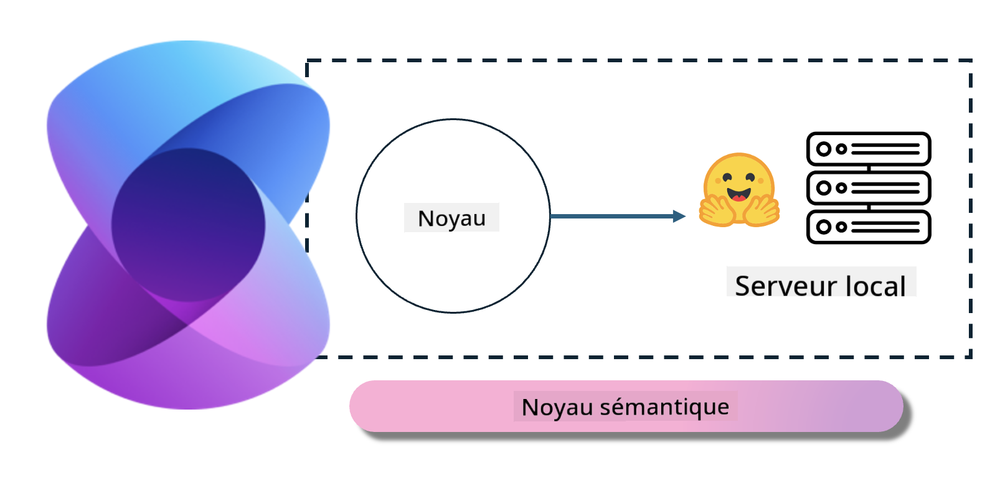
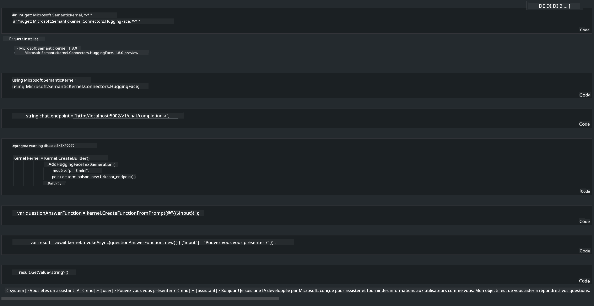

<!--
CO_OP_TRANSLATOR_METADATA:
{
  "original_hash": "bcf5dd7031db0031abdb9dd0c05ba118",
  "translation_date": "2025-03-27T07:39:52+00:00",
  "source_file": "md\\01.Introduction\\03\\Local_Server_Inference.md",
  "language_code": "fr"
}
-->
# **Inférence Phi-3 sur un serveur local**

Nous pouvons déployer Phi-3 sur un serveur local. Les utilisateurs peuvent choisir les solutions [Ollama](https://ollama.com) ou [LM Studio](https://llamaedge.com), ou écrire leur propre code. Vous pouvez connecter les services locaux de Phi-3 via [Semantic Kernel](https://github.com/microsoft/semantic-kernel?WT.mc_id=aiml-138114-kinfeylo) ou [Langchain](https://www.langchain.com/) pour créer des applications Copilot.

## **Utiliser Semantic Kernel pour accéder à Phi-3-mini**

Dans l'application Copilot, nous créons des applications via Semantic Kernel / LangChain. Ce type de framework applicatif est généralement compatible avec Azure OpenAI Service / modèles OpenAI, et peut également prendre en charge les modèles open source sur Hugging Face ainsi que les modèles locaux. Que faire si nous voulons utiliser Semantic Kernel pour accéder à Phi-3-mini ? En prenant .NET comme exemple, nous pouvons le combiner avec le connecteur Hugging Face dans Semantic Kernel. Par défaut, il peut correspondre à l'identifiant du modèle sur Hugging Face (la première fois que vous l'utilisez, le modèle sera téléchargé depuis Hugging Face, ce qui prend du temps). Vous pouvez également vous connecter au service local configuré. Comparé aux deux options, nous recommandons d'utiliser cette dernière car elle offre un degré d'autonomie plus élevé, en particulier dans les applications d'entreprise.

Sur l'image, accéder aux services locaux via Semantic Kernel permet de connecter facilement au serveur de modèle Phi-3-mini auto-hébergé. Voici le résultat de l'exécution :

***Exemple de code*** https://github.com/kinfey/Phi3MiniSamples/tree/main/semantickernel

**Avertissement** :  
Ce document a été traduit à l'aide du service de traduction IA [Co-op Translator](https://github.com/Azure/co-op-translator). Bien que nous fassions de notre mieux pour garantir l'exactitude, veuillez noter que les traductions automatisées peuvent contenir des erreurs ou des inexactitudes. Le document original dans sa langue d'origine doit être considéré comme la source faisant autorité. Pour des informations critiques, il est recommandé de faire appel à une traduction humaine professionnelle. Nous déclinons toute responsabilité en cas de malentendus ou d'interprétations erronées résultant de l'utilisation de cette traduction.