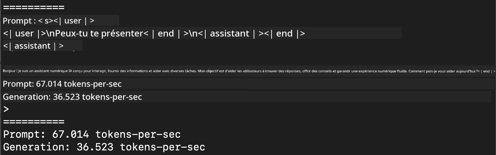
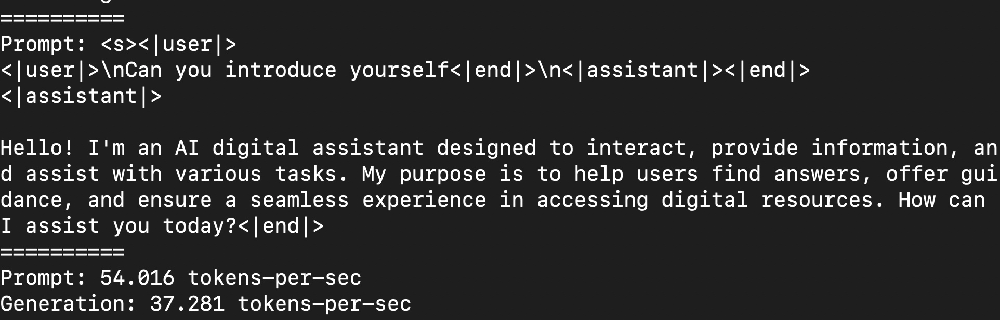
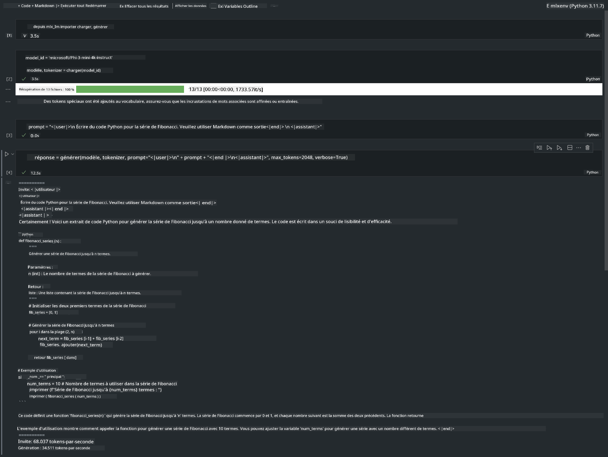

<!--
CO_OP_TRANSLATOR_METADATA:
{
  "original_hash": "dcb656f3d206fc4968e236deec5d4384",
  "translation_date": "2025-03-27T07:46:01+00:00",
  "source_file": "md\\01.Introduction\\03\\MLX_Inference.md",
  "language_code": "fr"
}
-->
# **Inférence Phi-3 avec le framework Apple MLX**

## **Qu'est-ce que le framework MLX**

MLX est un framework conçu pour la recherche en apprentissage automatique sur les appareils Apple Silicon, développé par les équipes de recherche en apprentissage automatique d'Apple.

MLX est conçu par des chercheurs en apprentissage automatique pour des chercheurs en apprentissage automatique. Ce framework se veut à la fois facile à utiliser et efficace pour entraîner et déployer des modèles. Sa conception est également pensée pour rester simple sur le plan conceptuel. Nous souhaitons faciliter l'extension et l'amélioration de MLX par les chercheurs afin de permettre une exploration rapide de nouvelles idées.

Les modèles de langage de grande taille (LLMs) peuvent être accélérés sur les appareils Apple Silicon grâce à MLX, et les modèles peuvent être exécutés localement de manière très pratique.

## **Utiliser MLX pour inférer Phi-3-mini**

### **1. Configurer votre environnement MLX**

1. Python 3.11.x  
2. Installer la bibliothèque MLX  

```bash

pip install mlx-lm

```

### **2. Exécuter Phi-3-mini dans le terminal avec MLX**

```bash

python -m mlx_lm.generate --model microsoft/Phi-3-mini-4k-instruct --max-token 2048 --prompt  "<|user|>\nCan you introduce yourself<|end|>\n<|assistant|>"

```

Le résultat (mon environnement est Apple M1 Max, 64GB) est :



### **3. Quantifier Phi-3-mini avec MLX dans le terminal**

```bash

python -m mlx_lm.convert --hf-path microsoft/Phi-3-mini-4k-instruct

```

***Note :*** Le modèle peut être quantifié via mlx_lm.convert, et la quantification par défaut est en INT4. Cet exemple quantifie Phi-3-mini en INT4.

Le modèle peut être quantifié via mlx_lm.convert, et la quantification par défaut est en INT4. Cet exemple montre la quantification de Phi-3-mini en INT4. Après la quantification, le modèle sera stocké dans le répertoire par défaut ./mlx_model.

Nous pouvons tester le modèle quantifié avec MLX depuis le terminal :

```bash

python -m mlx_lm.generate --model ./mlx_model/ --max-token 2048 --prompt  "<|user|>\nCan you introduce yourself<|end|>\n<|assistant|>"

```

Le résultat est :



### **4. Exécuter Phi-3-mini avec MLX dans Jupyter Notebook**



***Note :*** Veuillez consulter cet exemple [cliquez sur ce lien](../../../../../code/03.Inference/MLX/MLX_DEMO.ipynb)

## **Ressources**

1. En savoir plus sur le framework Apple MLX [https://ml-explore.github.io](https://ml-explore.github.io/mlx/build/html/index.html)

2. Dépôt GitHub Apple MLX [https://github.com/ml-explore](https://github.com/ml-explore)

**Avertissement** :  
Ce document a été traduit à l'aide du service de traduction automatisée [Co-op Translator](https://github.com/Azure/co-op-translator). Bien que nous fassions de notre mieux pour garantir l'exactitude, veuillez noter que les traductions automatisées peuvent contenir des erreurs ou des inexactitudes. Le document original dans sa langue d'origine doit être considéré comme la source faisant autorité. Pour des informations critiques, il est recommandé de faire appel à une traduction humaine professionnelle. Nous déclinons toute responsabilité en cas de malentendus ou d'interprétations erronées résultant de l'utilisation de cette traduction.