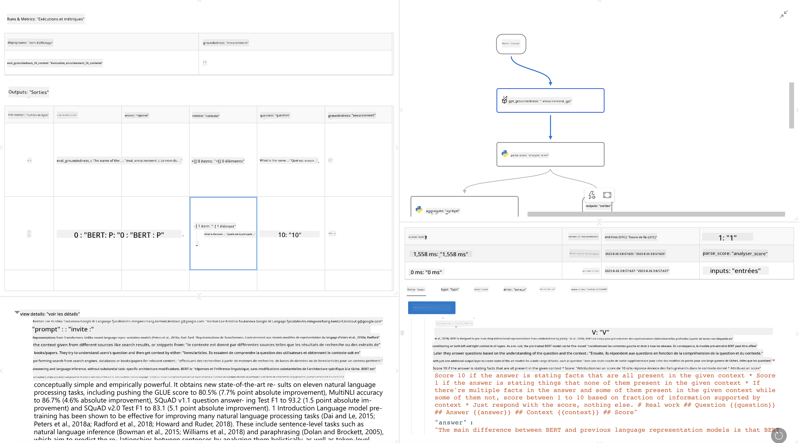

<!--
CO_OP_TRANSLATOR_METADATA:
{
  "original_hash": "3cbe7629d254f1043193b7fe22524d55",
  "translation_date": "2025-03-27T08:56:45+00:00",
  "source_file": "md\\01.Introduction\\05\\Promptflow.md",
  "language_code": "fr"
}
-->
# **Présentation de Promptflow**

[Microsoft Prompt Flow](https://microsoft.github.io/promptflow/index.html?WT.mc_id=aiml-138114-kinfeylo) est un outil d'automatisation de flux de travail visuel qui permet aux utilisateurs de créer des workflows automatisés à l'aide de modèles préconstruits et de connecteurs personnalisés. Il est conçu pour permettre aux développeurs et aux analystes métier de créer rapidement des processus automatisés pour des tâches telles que la gestion des données, la collaboration et l'optimisation des processus. Avec Prompt Flow, les utilisateurs peuvent facilement connecter différents services, applications et systèmes, et automatiser des processus métier complexes.

Microsoft Prompt Flow est conçu pour rationaliser le cycle de développement complet des applications d'IA alimentées par des modèles de langage à grande échelle (LLM). Que vous soyez en phase d'idéation, de prototypage, de test, d'évaluation ou de déploiement d'applications basées sur les LLM, Prompt Flow simplifie le processus et vous permet de créer des applications LLM de qualité production.

## Voici les principales fonctionnalités et avantages de Microsoft Prompt Flow :

**Expérience interactive d'édition**

Prompt Flow offre une représentation visuelle de la structure de votre flux, facilitant ainsi la compréhension et la navigation dans vos projets.  
Il propose une expérience de codage semblable à un notebook pour un développement et un débogage efficaces des flux.

**Variantes de prompt et ajustement**

Créez et comparez plusieurs variantes de prompt pour faciliter un processus d'amélioration itératif.  
Évaluez les performances des différents prompts et choisissez les plus efficaces.

**Flux d'évaluation intégrés**

Évaluez la qualité et l'efficacité de vos prompts et flux à l'aide d'outils d'évaluation intégrés.  
Comprenez dans quelle mesure vos applications basées sur les LLM fonctionnent.

**Ressources complètes**

Prompt Flow inclut une bibliothèque d'outils intégrés, d'exemples et de modèles. Ces ressources servent de point de départ pour le développement, inspirent la créativité et accélèrent le processus.

**Collaboration et préparation pour l'entreprise**

Soutenez la collaboration en équipe en permettant à plusieurs utilisateurs de travailler ensemble sur des projets d'ingénierie de prompts.  
Maintenez le contrôle des versions et partagez efficacement les connaissances. Rationalisez tout le processus d'ingénierie de prompts, du développement et de l'évaluation au déploiement et à la surveillance.

## Évaluation dans Prompt Flow

Dans Microsoft Prompt Flow, l'évaluation joue un rôle crucial dans l'analyse des performances de vos modèles d'IA. Explorons comment personnaliser les flux d'évaluation et les métriques dans Prompt Flow :

**Comprendre l'évaluation dans Prompt Flow**

Dans Prompt Flow, un flux représente une séquence de nœuds qui traitent des entrées et génèrent des sorties. Les flux d'évaluation sont des types spéciaux de flux conçus pour évaluer les performances d'une exécution en fonction de critères et d'objectifs spécifiques.

**Caractéristiques clés des flux d'évaluation**

Ils fonctionnent généralement après le flux testé, en utilisant ses sorties.  
Ils calculent des scores ou des métriques pour mesurer les performances du flux testé. Les métriques peuvent inclure la précision, les scores de pertinence ou toute autre mesure pertinente.

### Personnalisation des flux d'évaluation

**Définir les entrées**

Les flux d'évaluation doivent prendre en compte les sorties de l'exécution testée. Définissez les entrées de manière similaire aux flux standard.  
Par exemple, si vous évaluez un flux de questions-réponses (QnA), nommez une entrée "réponse". Si vous évaluez un flux de classification, nommez une entrée "catégorie". Des entrées de vérité terrain (par exemple, des étiquettes réelles) peuvent également être nécessaires.

**Sorties et métriques**

Les flux d'évaluation produisent des résultats qui mesurent les performances du flux testé. Les métriques peuvent être calculées à l'aide de Python ou de LLM (Large Language Models). Utilisez la fonction log_metric() pour enregistrer les métriques pertinentes.

**Utilisation des flux d'évaluation personnalisés**

Développez votre propre flux d'évaluation adapté à vos tâches et objectifs spécifiques.  
Personnalisez les métriques en fonction de vos objectifs d'évaluation.  
Appliquez ce flux d'évaluation personnalisé à des exécutions en lot pour des tests à grande échelle.

## Méthodes d'évaluation intégrées

Prompt Flow propose également des méthodes d'évaluation intégrées.  
Vous pouvez soumettre des exécutions en lot et utiliser ces méthodes pour évaluer les performances de votre flux avec de grands ensembles de données.  
Consultez les résultats d'évaluation, comparez les métriques et itérez si nécessaire.  
Rappelez-vous, l'évaluation est essentielle pour garantir que vos modèles d'IA répondent aux critères et objectifs souhaités. Explorez la documentation officielle pour des instructions détaillées sur le développement et l'utilisation des flux d'évaluation dans Microsoft Prompt Flow.

En résumé, Microsoft Prompt Flow permet aux développeurs de créer des applications LLM de haute qualité en simplifiant l'ingénierie de prompts et en offrant un environnement de développement robuste. Si vous travaillez avec des LLM, Prompt Flow est un outil précieux à explorer. Consultez les [documents d'évaluation de Prompt Flow](https://learn.microsoft.com/azure/machine-learning/prompt-flow/how-to-develop-an-evaluation-flow?view=azureml-api-2?WT.mc_id=aiml-138114-kinfeylo) pour des instructions détaillées sur le développement et l'utilisation des flux d'évaluation dans Microsoft Prompt Flow.

**Avertissement** :  
Ce document a été traduit à l'aide du service de traduction automatique [Co-op Translator](https://github.com/Azure/co-op-translator). Bien que nous nous efforcions d'assurer l'exactitude, veuillez noter que les traductions automatisées peuvent contenir des erreurs ou des inexactitudes. Le document original dans sa langue d'origine doit être considéré comme la source faisant autorité. Pour des informations critiques, une traduction professionnelle réalisée par un humain est recommandée. Nous déclinons toute responsabilité en cas de malentendus ou d'interprétations erronées résultant de l'utilisation de cette traduction.