<!--
CO_OP_TRANSLATOR_METADATA:
{
  "original_hash": "ecbd9179a21edbaafaf114d47f09f3e3",
  "translation_date": "2025-03-27T10:11:08+00:00",
  "source_file": "md\\02.Application\\01.TextAndChat\\Phi3\\E2E_Phi-3-FineTuning_PromptFlow_Integration_AIFoundry.md",
  "language_code": "fr"
}
-->
# Affiner et intégrer des modèles Phi-3 personnalisés avec Prompt Flow dans Azure AI Foundry

Cet exemple de bout en bout (E2E) est basé sur le guide "[Fine-Tune and Integrate Custom Phi-3 Models with Prompt Flow in Azure AI Foundry](https://techcommunity.microsoft.com/t5/educator-developer-blog/fine-tune-and-integrate-custom-phi-3-models-with-prompt-flow-in/ba-p/4191726?WT.mc_id=aiml-137032-kinfeylo)" de la communauté technique de Microsoft. Il présente les processus d'ajustement, de déploiement et d'intégration des modèles Phi-3 personnalisés avec Prompt Flow dans Azure AI Foundry.  
Contrairement à l'exemple E2E "[Fine-Tune and Integrate Custom Phi-3 Models with Prompt Flow](./E2E_Phi-3-FineTuning_PromptFlow_Integration.md)", qui impliquait l'exécution de code en local, ce tutoriel se concentre entièrement sur l'ajustement et l'intégration de votre modèle dans Azure AI / ML Studio.

## Aperçu

Dans cet exemple E2E, vous apprendrez à ajuster le modèle Phi-3 et à l'intégrer avec Prompt Flow dans Azure AI Foundry. En exploitant Azure AI / ML Studio, vous établirez un flux de travail pour déployer et utiliser des modèles d'IA personnalisés. Cet exemple E2E est divisé en trois scénarios :

**Scénario 1 : Configurer les ressources Azure et se préparer à l'ajustement**

**Scénario 2 : Ajuster le modèle Phi-3 et le déployer dans Azure Machine Learning Studio**

**Scénario 3 : Intégrer avec Prompt Flow et discuter avec votre modèle personnalisé dans Azure AI Foundry**

Voici une vue d'ensemble de cet exemple E2E.

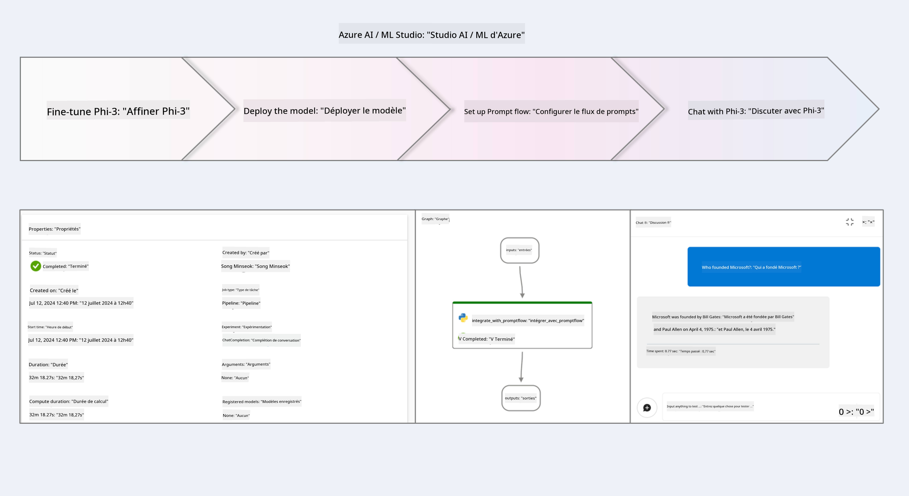

### Table des matières

1. **[Scénario 1 : Configurer les ressources Azure et se préparer à l'ajustement](../../../../../../md/02.Application/01.TextAndChat/Phi3)**
    - [Créer un espace de travail Azure Machine Learning](../../../../../../md/02.Application/01.TextAndChat/Phi3)
    - [Demander des quotas GPU dans l'abonnement Azure](../../../../../../md/02.Application/01.TextAndChat/Phi3)
    - [Ajouter une attribution de rôle](../../../../../../md/02.Application/01.TextAndChat/Phi3)
    - [Configurer le projet](../../../../../../md/02.Application/01.TextAndChat/Phi3)
    - [Préparer le jeu de données pour l'ajustement](../../../../../../md/02.Application/01.TextAndChat/Phi3)

1. **[Scénario 2 : Ajuster le modèle Phi-3 et le déployer dans Azure Machine Learning Studio](../../../../../../md/02.Application/01.TextAndChat/Phi3)**
    - [Ajuster le modèle Phi-3](../../../../../../md/02.Application/01.TextAndChat/Phi3)
    - [Déployer le modèle Phi-3 ajusté](../../../../../../md/02.Application/01.TextAndChat/Phi3)

1. **[Scénario 3 : Intégrer avec Prompt Flow et discuter avec votre modèle personnalisé dans Azure AI Foundry](../../../../../../md/02.Application/01.TextAndChat/Phi3)**
    - [Intégrer le modèle Phi-3 personnalisé avec Prompt Flow](../../../../../../md/02.Application/01.TextAndChat/Phi3)
    - [Discuter avec votre modèle Phi-3 personnalisé](../../../../../../md/02.Application/01.TextAndChat/Phi3)

## Scénario 1 : Configurer les ressources Azure et se préparer à l'ajustement

### Créer un espace de travail Azure Machine Learning

1. Tapez *azure machine learning* dans la **barre de recherche** en haut de la page du portail et sélectionnez **Azure Machine Learning** parmi les options proposées.

    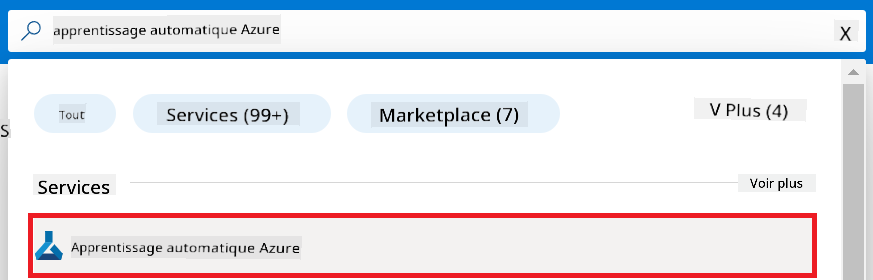

2. Sélectionnez **+ Créer** dans le menu de navigation.

3. Sélectionnez **Nouvel espace de travail** dans le menu de navigation.

    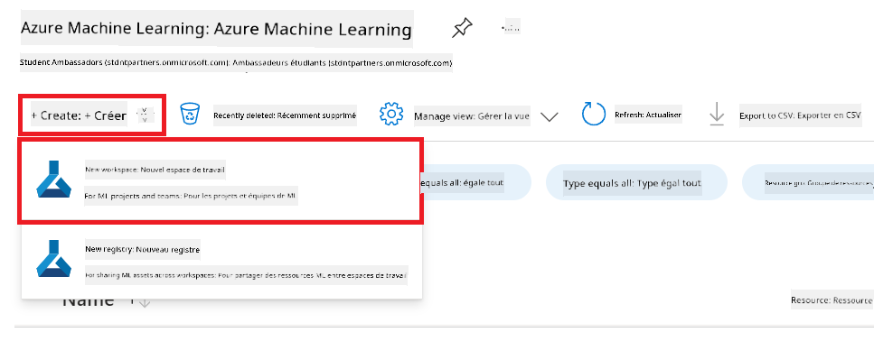

4. Effectuez les tâches suivantes :

    - Sélectionnez votre **Abonnement** Azure.
    - Sélectionnez le **Groupe de ressources** à utiliser (créez-en un nouveau si nécessaire).
    - Entrez un **Nom d'espace de travail**. Celui-ci doit être unique.
    - Sélectionnez la **Région** que vous souhaitez utiliser.
    - Sélectionnez le **Compte de stockage** à utiliser (créez-en un nouveau si nécessaire).
    - Sélectionnez le **Key Vault** à utiliser (créez-en un nouveau si nécessaire).
    - Sélectionnez **Application Insights** à utiliser (créez-en un nouveau si nécessaire).
    - Sélectionnez le **Registre de conteneurs** à utiliser (créez-en un nouveau si nécessaire).

    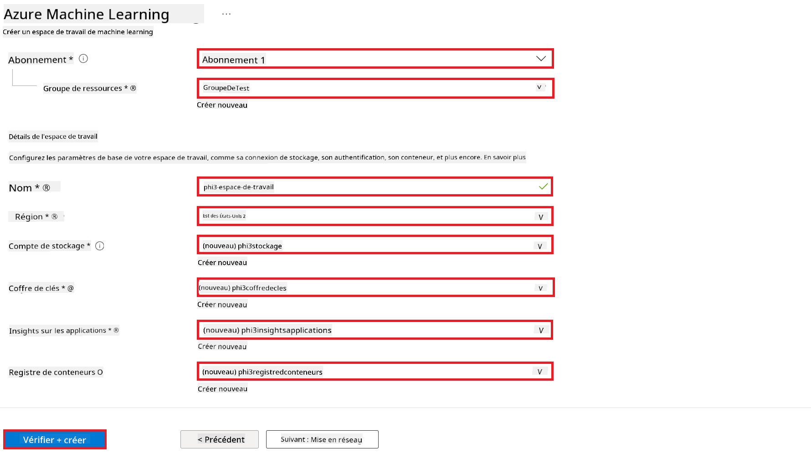

5. Sélectionnez **Vérifier + Créer**.

6. Sélectionnez **Créer**.

### Demander des quotas GPU dans l'abonnement Azure

Dans ce tutoriel, vous apprendrez à ajuster et déployer un modèle Phi-3 en utilisant des GPU. Pour l'ajustement, vous utiliserez le GPU *Standard_NC24ads_A100_v4*, qui nécessite une demande de quota. Pour le déploiement, vous utiliserez le GPU *Standard_NC6s_v3*, qui nécessite également une demande de quota.

> [!NOTE]
>
> Seuls les abonnements Pay-As-You-Go (le type d'abonnement standard) sont éligibles pour l'allocation GPU ; les abonnements avec avantages ne sont actuellement pas pris en charge.

1. Visitez [Azure ML Studio](https://ml.azure.com/home?wt.mc_id=studentamb_279723).

1. Effectuez les tâches suivantes pour demander un quota pour la famille *Standard NCADSA100v4* :

    - Sélectionnez **Quota** dans l'onglet de gauche.
    - Sélectionnez la **Famille de machines virtuelles** à utiliser. Par exemple, sélectionnez **Standard NCADSA100v4 Family Cluster Dedicated vCPUs**, qui inclut le GPU *Standard_NC24ads_A100_v4*.
    - Sélectionnez **Demander un quota** dans le menu de navigation.

        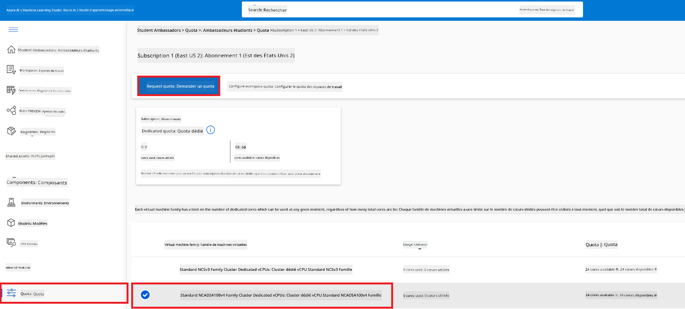

    - Sur la page de demande de quota, entrez la **Nouvelle limite de cœurs** que vous souhaitez utiliser. Par exemple, 24.
    - Sur la page de demande de quota, sélectionnez **Soumettre** pour demander le quota GPU.

1. Effectuez les tâches suivantes pour demander un quota pour la famille *Standard NCSv3* :

    - Sélectionnez **Quota** dans l'onglet de gauche.
    - Sélectionnez la **Famille de machines virtuelles** à utiliser. Par exemple, sélectionnez **Standard NCSv3 Family Cluster Dedicated vCPUs**, qui inclut le GPU *Standard_NC6s_v3*.
    - Sélectionnez **Demander un quota** dans le menu de navigation.
    - Sur la page de demande de quota, entrez la **Nouvelle limite de cœurs** que vous souhaitez utiliser. Par exemple, 24.
    - Sur la page de demande de quota, sélectionnez **Soumettre** pour demander le quota GPU.

### Ajouter une attribution de rôle

Pour ajuster et déployer vos modèles, vous devez d'abord créer une identité gérée affectée par l'utilisateur (UAI) et lui attribuer les autorisations appropriées. Cette UAI sera utilisée pour l'authentification lors du déploiement.

#### Créer une identité gérée affectée par l'utilisateur (UAI)

1. Tapez *identités gérées* dans la **barre de recherche** en haut de la page du portail et sélectionnez **Identités gérées** parmi les options proposées.

    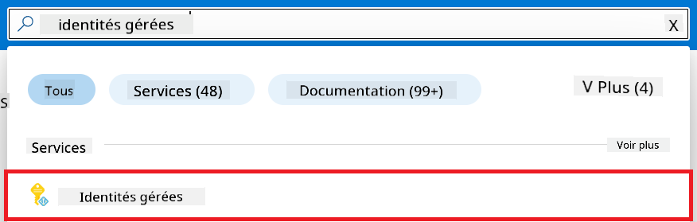

1. Sélectionnez **+ Créer**.

    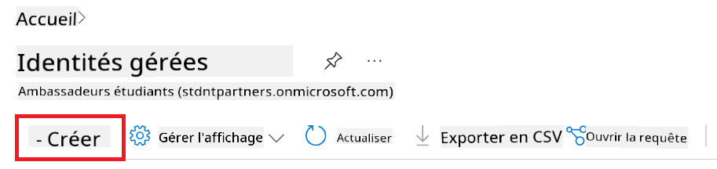

1. Effectuez les tâches suivantes :

    - Sélectionnez votre **Abonnement** Azure.
    - Sélectionnez le **Groupe de ressources** à utiliser (créez-en un nouveau si nécessaire).
    - Sélectionnez la **Région** que vous souhaitez utiliser.
    - Entrez le **Nom**. Celui-ci doit être unique.

    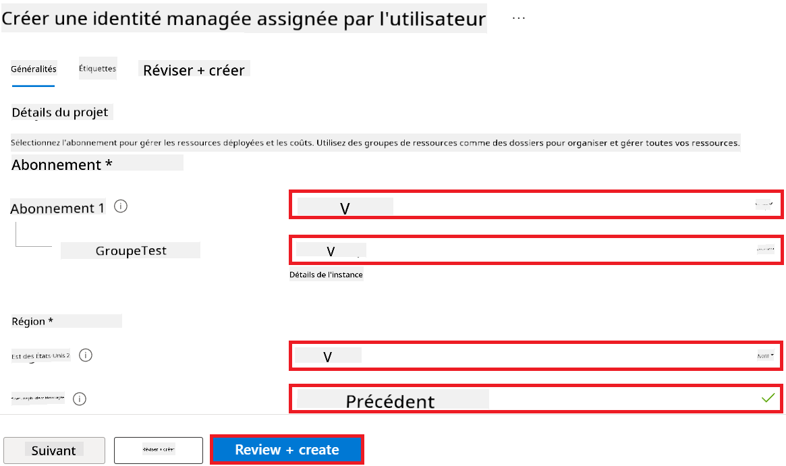

1. Sélectionnez **Vérifier + créer**.

1. Sélectionnez **Créer**.

#### Ajouter le rôle de contributeur à l'identité gérée

1. Accédez à la ressource d'identité gérée que vous avez créée.

1. Sélectionnez **Attributions de rôle Azure** dans l'onglet de gauche.

1. Sélectionnez **+ Ajouter une attribution de rôle** dans le menu de navigation.

1. Sur la page Ajouter une attribution de rôle, effectuez les tâches suivantes :
    - Sélectionnez l'**Étendue** comme **Groupe de ressources**.
    - Sélectionnez votre **Abonnement** Azure.
    - Sélectionnez le **Groupe de ressources** à utiliser.
    - Sélectionnez le **Rôle** comme **Contributeur**.

    

2. Sélectionnez **Enregistrer**.

#### Ajouter le rôle de lecteur de données de blob de stockage à l'identité gérée

1. Tapez *comptes de stockage* dans la **barre de recherche** en haut de la page du portail et sélectionnez **Comptes de stockage** parmi les options proposées.

    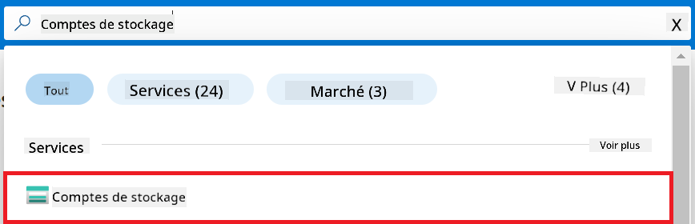

1. Sélectionnez le compte de stockage associé à l'espace de travail Azure Machine Learning que vous avez créé. Par exemple, *finetunephistorage*.

1. Effectuez les tâches suivantes pour accéder à la page Ajouter une attribution de rôle :

    - Accédez au compte de stockage Azure que vous avez créé.
    - Sélectionnez **Contrôle d'accès (IAM)** dans l'onglet de gauche.
    - Sélectionnez **+ Ajouter** dans le menu de navigation.
    - Sélectionnez **Ajouter une attribution de rôle** dans le menu de navigation.

    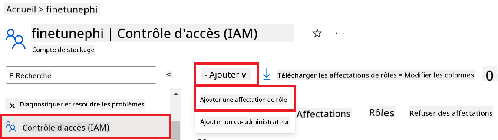

1. Sur la page Ajouter une attribution de rôle, effectuez les tâches suivantes :

    - Sur la page Rôle, tapez *Lecteur de données de blob de stockage* dans la **barre de recherche** et sélectionnez **Lecteur de données de blob de stockage** parmi les options proposées.
    - Sur la page Rôle, sélectionnez **Suivant**.
    - Sur la page Membres, sélectionnez **Attribuer un accès à** **Identité gérée**.
    - Sur la page Membres, sélectionnez **+ Sélectionner des membres**.
    - Sur la page Sélectionner des identités gérées, sélectionnez votre **Abonnement** Azure.
    - Sur la page Sélectionner des identités gérées, sélectionnez l'**Identité gérée** comme **Identité gérée**.
    - Sur la page Sélectionner des identités gérées, sélectionnez l'identité gérée que vous avez créée. Par exemple, *finetunephi-managedidentity*.
    - Sur la page Sélectionner des identités gérées, sélectionnez **Sélectionner**.

    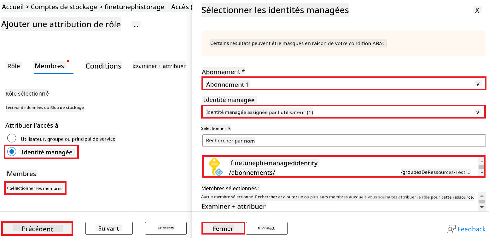

1. Sélectionnez **Vérifier + attribuer**.

#### Ajouter le rôle AcrPull à l'identité gérée

1. Tapez *registres de conteneurs* dans la **barre de recherche** en haut de la page du portail et sélectionnez **Registres de conteneurs** parmi les options proposées.

    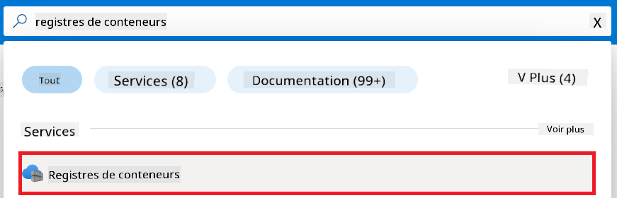

1. Sélectionnez le registre de conteneurs associé à l'espace de travail Azure Machine Learning. Par exemple, *finetunephicontainerregistry*.

1. Effectuez les tâches suivantes pour accéder à la page Ajouter une attribution de rôle :

    - Sélectionnez **Contrôle d'accès (IAM)** dans l'onglet de gauche.
    - Sélectionnez **+ Ajouter** dans le menu de navigation.
    - Sélectionnez **Ajouter une attribution de rôle** dans le menu de navigation.

1. Sur la page Ajouter une attribution de rôle, effectuez les tâches suivantes :

    - Sur la page Rôle, tapez *AcrPull* dans la **barre de recherche** et sélectionnez **AcrPull** parmi les options proposées.
    - Sur la page Rôle, sélectionnez **Suivant**.
    - Sur la page Membres, sélectionnez **Attribuer un accès à** **Identité gérée**.
    - Sur la page Membres, sélectionnez **+ Sélectionner des membres**.
    - Sur la page Sélectionner des identités gérées, sélectionnez votre **Abonnement** Azure.
    - Sur la page Sélectionner des identités gérées, sélectionnez l'**Identité gérée** comme **Identité gérée**.
    - Sur la page Sélectionner des identités gérées, sélectionnez l'identité gérée que vous avez créée. Par exemple, *finetunephi-managedidentity*.
    - Sur la page Sélectionner des identités gérées, sélectionnez **Sélectionner**.
    - Sélectionnez **Vérifier + attribuer**.

### Configurer le projet

Pour télécharger les jeux de données nécessaires à l'ajustement, vous allez configurer un environnement local.

Dans cet exercice, vous allez :

- Créer un dossier pour travailler à l'intérieur.
- Créer un environnement virtuel.
- Installer les packages requis.
- Créer un fichier *download_dataset.py* pour télécharger le jeu de données.

#### Créer un dossier pour travailler à l'intérieur

1. Ouvrez une fenêtre de terminal et tapez la commande suivante pour créer un dossier nommé *finetune-phi* dans le chemin par défaut.

    ```console
    mkdir finetune-phi
    ```

2. Tapez la commande suivante dans votre terminal pour accéder au dossier *finetune-phi* que vous avez créé.

    ```console
    cd finetune-phi
    ```

#### Créer un environnement virtuel

1. Tapez la commande suivante dans votre terminal pour créer un environnement virtuel nommé *.venv*.

    ```console
    python -m venv .venv
    ```

2. Tapez la commande suivante dans votre terminal pour activer l'environnement virtuel.

    ```console
    .venv\Scripts\activate.bat
    ```

> [!NOTE]
> Si cela a fonctionné, vous devriez voir *(.venv)* avant l'invite de commande.

#### Installer les packages requis

1. Tapez les commandes suivantes dans votre terminal pour installer les packages requis.

    ```console
    pip install datasets==2.19.1
    ```

#### Créer `download_dataset.py`

> [!NOTE]
> Structure complète du dossier :
>
> ```text
> └── YourUserName
> .    └── finetune-phi
> .        └── download_dataset.py
> ```

1. Ouvrez **Visual Studio Code**.

1. Sélectionnez **Fichier** dans la barre de menu.

1. Sélectionnez **Ouvrir un dossier**.

1. Sélectionnez le dossier *finetune-phi* que vous avez créé, situé à *C:\Users\yourUserName\finetune-phi*.

    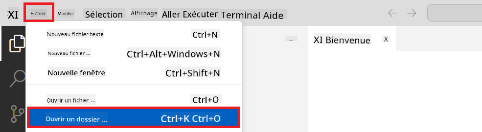

1. Dans le volet gauche de Visual Studio Code, cliquez avec le bouton droit et sélectionnez **Nouveau fichier** pour créer un nouveau fichier nommé *download_dataset.py*.

    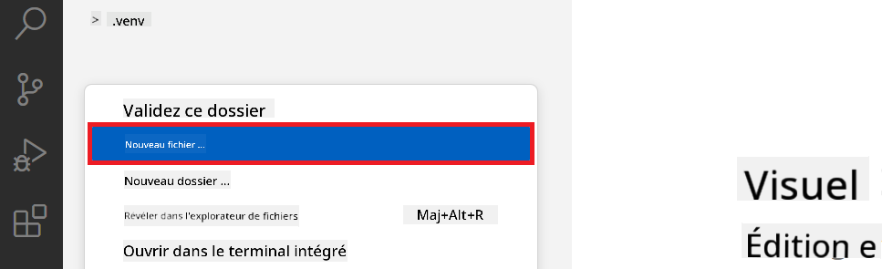

### Préparer le jeu de données pour l'ajustement

Dans cet exercice, vous exécuterez le fichier *download_dataset.py* pour télécharger les jeux de données *ultrachat_200k* dans votre environnement local. Vous utiliserez ensuite ces jeux de données pour ajuster le modèle Phi-3 dans Azure Machine Learning.

Dans cet exercice, vous allez :

- Ajouter du code au fichier *download_dataset.py* pour télécharger les jeux de données.
- Exécuter le fichier *download_dataset.py* pour télécharger les jeux de données dans votre environnement local.

#### Télécharger votre jeu de données avec *download_dataset.py*

1. Ouvrez le fichier *download_dataset.py* dans Visual Studio Code.

1. Ajoutez le code suivant dans le fichier *download_dataset.py*.

    ```python
    import json
    import os
    from datasets import load_dataset

    def load_and_split_dataset(dataset_name, config_name, split_ratio):
        """
        Load and split a dataset.
        """
        # Load the dataset with the specified name, configuration, and split ratio
        dataset = load_dataset(dataset_name, config_name, split=split_ratio)
        print(f"Original dataset size: {len(dataset)}")
        
        # Split the dataset into train and test sets (80% train, 20% test)
        split_dataset = dataset.train_test_split(test_size=0.2)
        print(f"Train dataset size: {len(split_dataset['train'])}")
        print(f"Test dataset size: {len(split_dataset['test'])}")
        
        return split_dataset

    def save_dataset_to_jsonl(dataset, filepath):
        """
        Save a dataset to a JSONL file.
        """
        # Create the directory if it does not exist
        os.makedirs(os.path.dirname(filepath), exist_ok=True)
        
        # Open the file in write mode
        with open(filepath, 'w', encoding='utf-8') as f:
            # Iterate over each record in the dataset
            for record in dataset:
                # Dump the record as a JSON object and write it to the file
                json.dump(record, f)
                # Write a newline character to separate records
                f.write('\n')
        
        print(f"Dataset saved to {filepath}")

    def main():
        """
        Main function to load, split, and save the dataset.
        """
        # Load and split the ULTRACHAT_200k dataset with a specific configuration and split ratio
        dataset = load_and_split_dataset("HuggingFaceH4/ultrachat_200k", 'default', 'train_sft[:1%]')
        
        # Extract the train and test datasets from the split
        train_dataset = dataset['train']
        test_dataset = dataset['test']

        # Save the train dataset to a JSONL file
        save_dataset_to_jsonl(train_dataset, "data/train_data.jsonl")
        
        # Save the test dataset to a separate JSONL file
        save_dataset_to_jsonl(test_dataset, "data/test_data.jsonl")

    if __name__ == "__main__":
        main()

    ```

1. Tapez la commande suivante dans votre terminal pour exécuter le script et télécharger le jeu de données dans votre environnement local.

    ```console
    python download_dataset.py
    ```

1. Vérifiez que les jeux de données ont été enregistrés avec succès dans votre répertoire local *finetune-phi/data*.

> [!NOTE]
>
> #### Remarque sur la taille du jeu de données et le temps d'ajustement
>
> Dans ce tutoriel, vous utilisez seulement 1 % du jeu de données (`split='train[:1%]'`). Cela réduit considérablement la quantité de données, accélérant à la fois le téléchargement et les processus d'ajustement. Vous pouvez ajuster le pourcentage pour trouver le bon équilibre entre
1. Rendez-vous sur [Azure ML Studio](https://ml.azure.com/home?wt.mc_id=studentamb_279723).

1. Sélectionnez **Compute** dans le menu latéral gauche.

1. Sélectionnez **Compute clusters** dans le menu de navigation.

1. Cliquez sur **+ New**.

    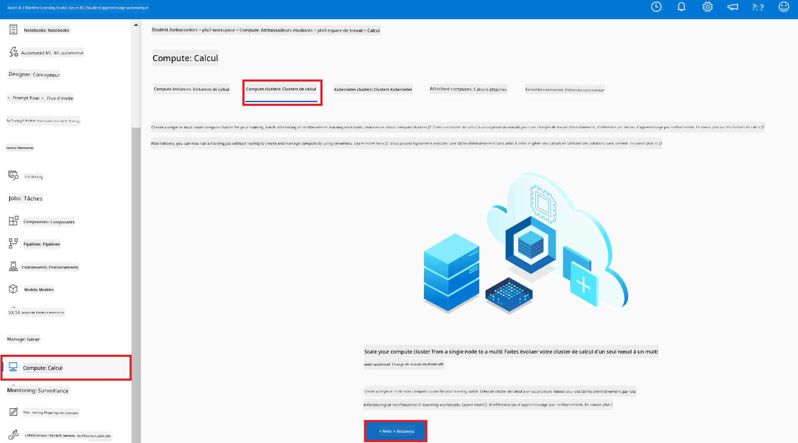

1. Effectuez les actions suivantes :

    - Sélectionnez la **Région** que vous souhaitez utiliser.
    - Réglez le **Niveau de machine virtuelle** sur **Dedicated**.
    - Réglez le **Type de machine virtuelle** sur **GPU**.
    - Appliquez le filtre **Taille de machine virtuelle** sur **Select from all options**.
    - Choisissez la **Taille de machine virtuelle** sur **Standard_NC24ads_A100_v4**.

    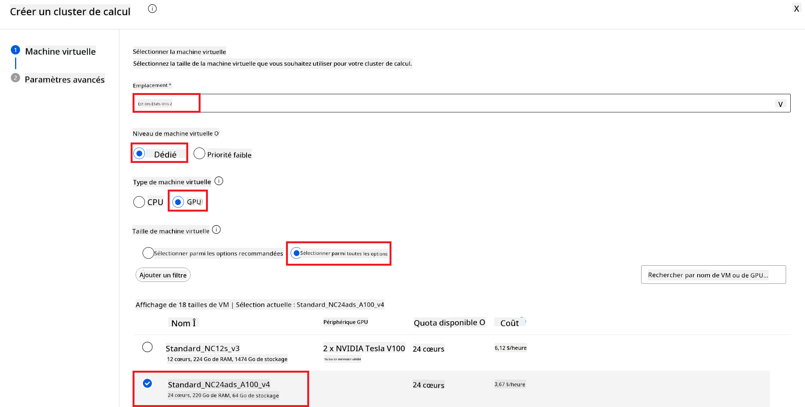

1. Cliquez sur **Next**.

1. Effectuez les actions suivantes :

    - Entrez un **Nom de calcul**. Il doit être unique.
    - Réglez le **Nombre minimum de nœuds** sur **0**.
    - Réglez le **Nombre maximum de nœuds** sur **1**.
    - Réglez les **Secondes d'inactivité avant réduction d'échelle** sur **120**.

    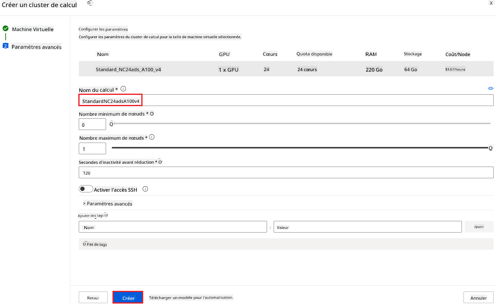

1. Cliquez sur **Create**.

#### Ajuster le modèle Phi-3

1. Rendez-vous sur [Azure ML Studio](https://ml.azure.com/home?wt.mc_id=studentamb_279723).

1. Sélectionnez l'espace de travail Azure Machine Learning que vous avez créé.

    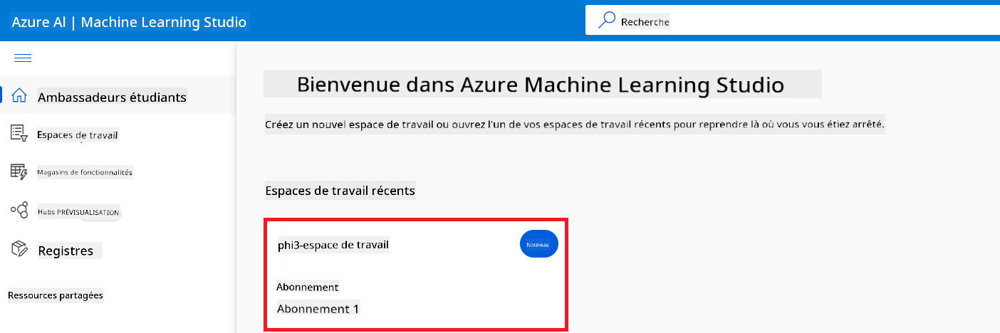

1. Effectuez les actions suivantes :

    - Sélectionnez **Model catalog** dans le menu latéral gauche.
    - Tapez *phi-3-mini-4k* dans la **barre de recherche** et sélectionnez **Phi-3-mini-4k-instruct** parmi les options proposées.

    

1. Sélectionnez **Fine-tune** dans le menu de navigation.

    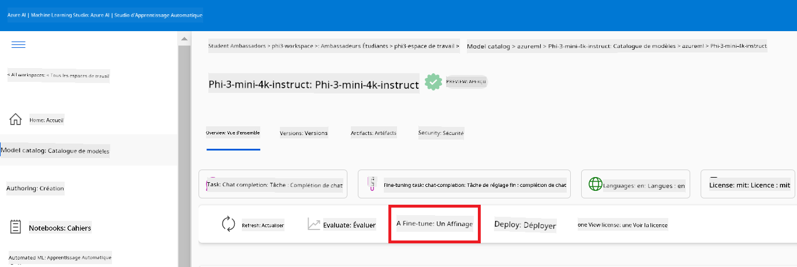

1. Effectuez les actions suivantes :

    - Réglez **Select task type** sur **Chat completion**.
    - Cliquez sur **+ Select data** pour télécharger les **Données d'entraînement**.
    - Réglez le type de téléchargement des données de validation sur **Provide different validation data**.
    - Cliquez sur **+ Select data** pour télécharger les **Données de validation**.

    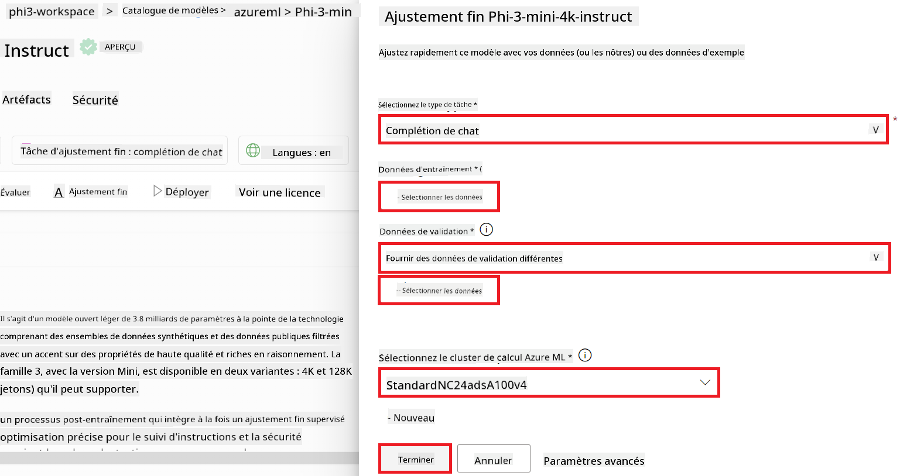

    > [!TIP]
    >
    > Vous pouvez sélectionner **Advanced settings** pour personnaliser des configurations comme **learning_rate** et **lr_scheduler_type** afin d'optimiser le processus d'ajustement selon vos besoins spécifiques.

1. Cliquez sur **Finish**.

1. Dans cet exercice, vous avez ajusté avec succès le modèle Phi-3 à l'aide d'Azure Machine Learning. Notez que le processus d'ajustement peut prendre un temps considérable. Après avoir lancé la tâche d'ajustement, vous devrez attendre qu'elle se termine. Vous pouvez surveiller l'état de la tâche en naviguant vers l'onglet Jobs dans le menu latéral de votre espace de travail Azure Machine Learning. Dans la prochaine série, vous déploierez le modèle ajusté et l'intégrerez à Prompt flow.

    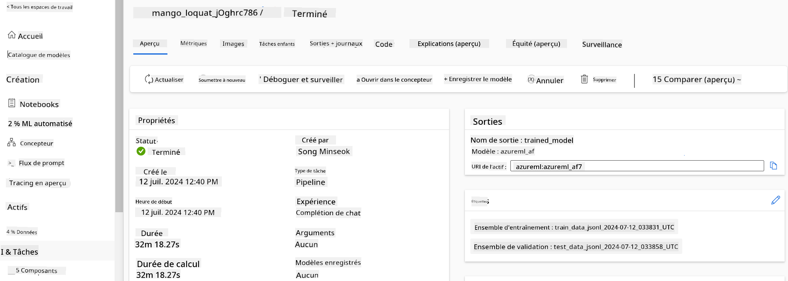

### Déployer le modèle Phi-3 ajusté

Pour intégrer le modèle Phi-3 ajusté à Prompt flow, vous devez déployer le modèle pour le rendre accessible en inférence en temps réel. Ce processus implique l'enregistrement du modèle, la création d'un point de terminaison en ligne et le déploiement du modèle.

Dans cet exercice, vous allez :

- Enregistrer le modèle ajusté dans l'espace de travail Azure Machine Learning.
- Créer un point de terminaison en ligne.
- Déployer le modèle Phi-3 ajusté enregistré.

#### Enregistrer le modèle ajusté

1. Rendez-vous sur [Azure ML Studio](https://ml.azure.com/home?wt.mc_id=studentamb_279723).

1. Sélectionnez l'espace de travail Azure Machine Learning que vous avez créé.

    

1. Sélectionnez **Models** dans le menu latéral gauche.
1. Cliquez sur **+ Register**.
1. Sélectionnez **From a job output**.

    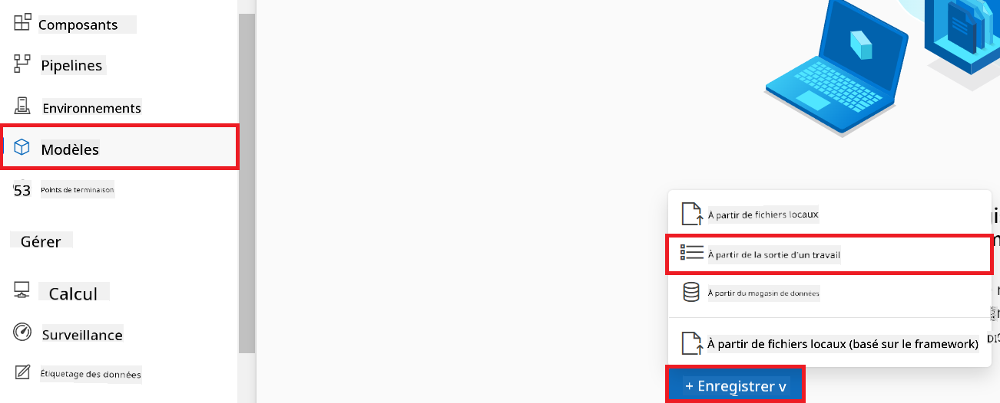

1. Sélectionnez la tâche que vous avez créée.

    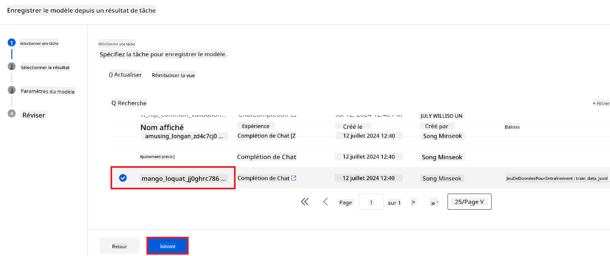

1. Cliquez sur **Next**.

1. Réglez **Model type** sur **MLflow**.

1. Assurez-vous que **Job output** est sélectionné ; cela devrait être automatiquement le cas.

    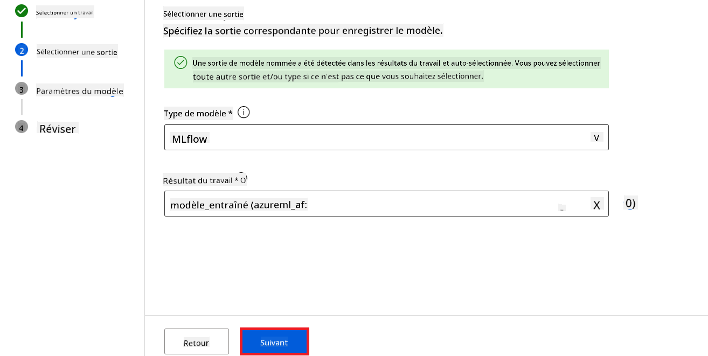

2. Cliquez sur **Next**.

3. Cliquez sur **Register**.

    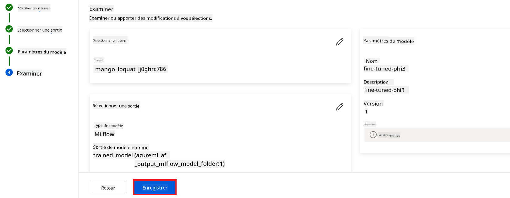

4. Vous pouvez consulter votre modèle enregistré en naviguant dans le menu **Models** depuis le menu latéral gauche.

    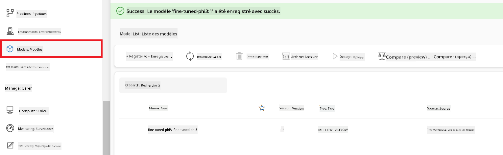

#### Déployer le modèle ajusté

1. Accédez à l'espace de travail Azure Machine Learning que vous avez créé.

1. Sélectionnez **Endpoints** dans le menu latéral gauche.

1. Sélectionnez **Real-time endpoints** dans le menu de navigation.

    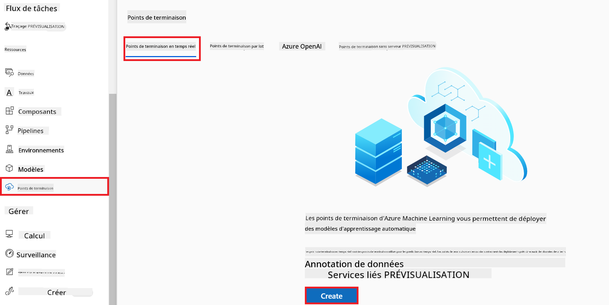

1. Cliquez sur **Create**.

1. Sélectionnez le modèle enregistré que vous avez créé.

    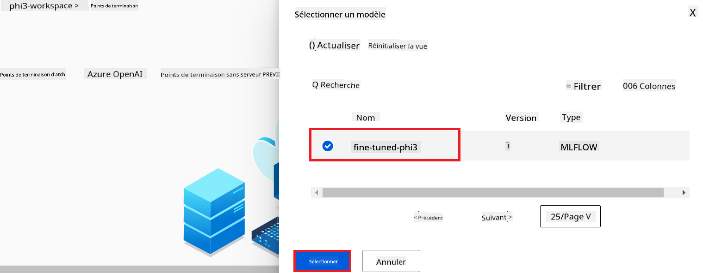

1. Cliquez sur **Select**.

1. Effectuez les actions suivantes :

    - Réglez la **Machine virtuelle** sur *Standard_NC6s_v3*.
    - Choisissez le **Nombre d'instances** à utiliser, par exemple, *1*.
    - Réglez le **Endpoint** sur **New** pour créer un point de terminaison.
    - Entrez un **Nom de point de terminaison**. Il doit être unique.
    - Entrez un **Nom de déploiement**. Il doit être unique.

    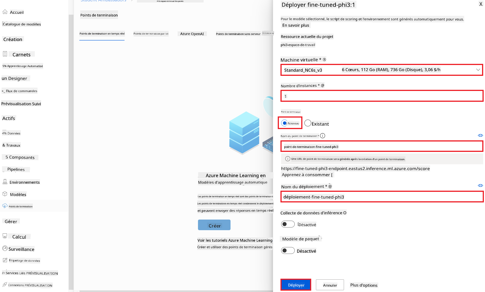

1. Cliquez sur **Deploy**.

> [!WARNING]
> Pour éviter des frais supplémentaires sur votre compte, veillez à supprimer le point de terminaison créé dans l'espace de travail Azure Machine Learning.
>

#### Vérifier l'état du déploiement dans l'espace de travail Azure Machine Learning

1. Accédez à l'espace de travail Azure Machine Learning que vous avez créé.

1. Sélectionnez **Endpoints** dans le menu latéral gauche.

1. Sélectionnez le point de terminaison que vous avez créé.

    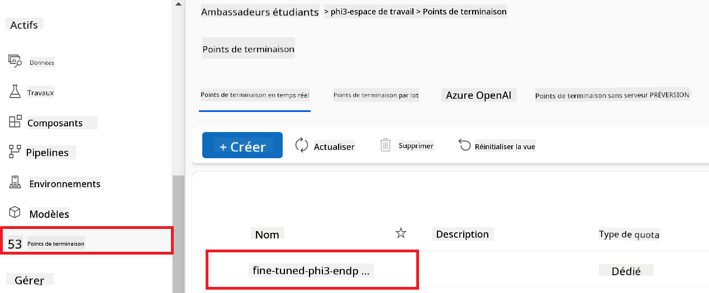

1. Sur cette page, vous pouvez gérer les points de terminaison pendant le processus de déploiement.

> [!NOTE]
> Une fois le déploiement terminé, assurez-vous que **Live traffic** est réglé sur **100%**. Si ce n'est pas le cas, sélectionnez **Update traffic** pour ajuster les paramètres de trafic. Notez que vous ne pouvez pas tester le modèle si le trafic est réglé sur 0%.
>
> 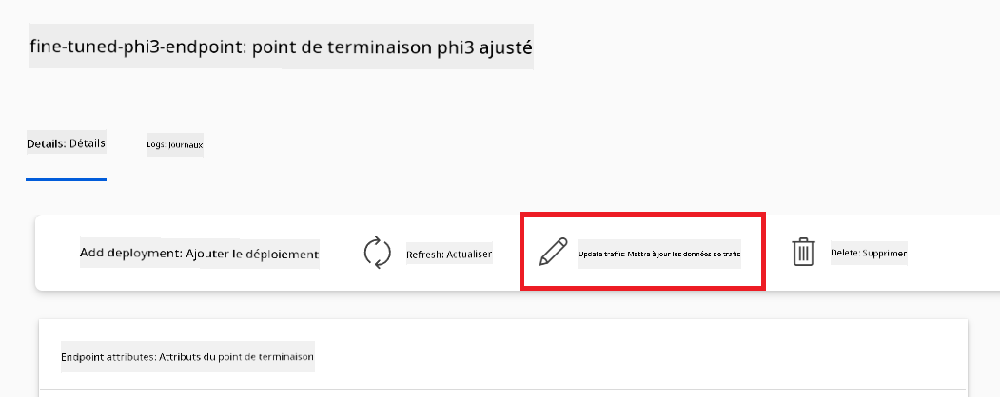
>

## Scénario 3 : Intégrer à Prompt flow et interagir avec votre modèle personnalisé dans Azure AI Foundry

### Intégrer le modèle personnalisé Phi-3 avec Prompt flow

Après avoir déployé avec succès votre modèle ajusté, vous pouvez maintenant l'intégrer à Prompt Flow pour l'utiliser dans des applications en temps réel, permettant une variété de tâches interactives avec votre modèle personnalisé Phi-3.

Dans cet exercice, vous allez :

- Créer un Hub Azure AI Foundry.
- Créer un Projet Azure AI Foundry.
- Créer un Prompt flow.
- Ajouter une connexion personnalisée pour le modèle ajusté Phi-3.
- Configurer Prompt flow pour interagir avec votre modèle personnalisé Phi-3.

> [!NOTE]
> Vous pouvez également intégrer à Prompt flow en utilisant Azure ML Studio. Le même processus d'intégration peut être appliqué dans Azure ML Studio.

#### Créer un Hub Azure AI Foundry

Vous devez créer un Hub avant de créer le Projet. Un Hub agit comme un groupe de ressources, vous permettant d'organiser et de gérer plusieurs Projets au sein d'Azure AI Foundry.

1. Rendez-vous sur [Azure AI Foundry](https://ai.azure.com/?WT.mc_id=aiml-137032-kinfeylo).

1. Sélectionnez **All hubs** dans le menu latéral gauche.

1. Cliquez sur **+ New hub** dans le menu de navigation.

    

1. Effectuez les actions suivantes :

    - Entrez un **Nom de hub**. Il doit être unique.
    - Sélectionnez votre **Abonnement Azure**.
    - Choisissez le **Groupe de ressources** à utiliser (créez-en un nouveau si nécessaire).
    - Sélectionnez la **Localisation** que vous souhaitez utiliser.
    - Réglez **Connect Azure AI Services** à utiliser (créez-en un nouveau si nécessaire).
    - Réglez **Connect Azure AI Search** sur **Skip connecting**.

    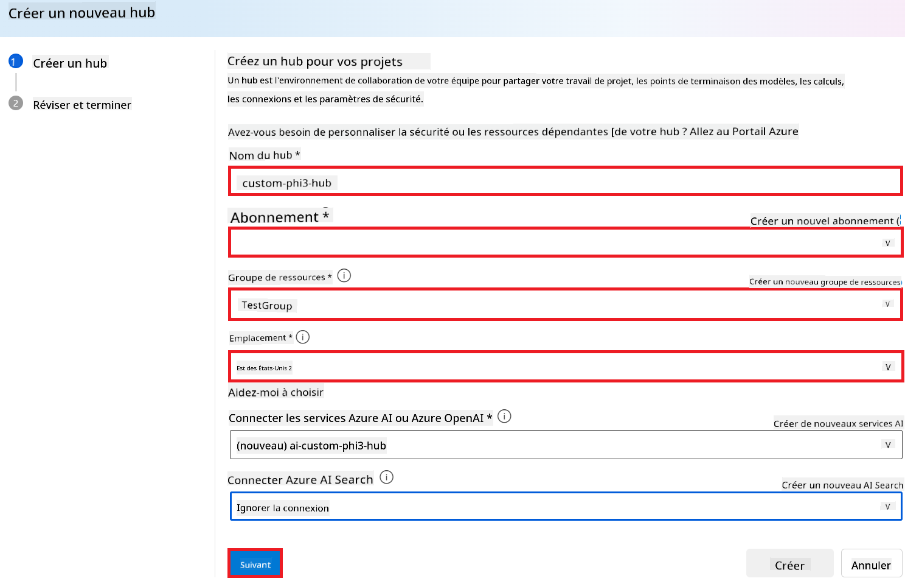

1. Cliquez sur **Next**.

#### Créer un Projet Azure AI Foundry

1. Dans le Hub que vous avez créé, sélectionnez **All projects** dans le menu latéral gauche.

1. Cliquez sur **+ New project** dans le menu de navigation.

    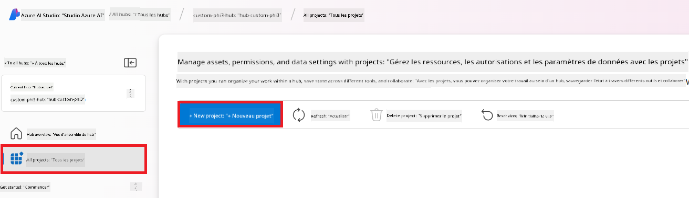

1. Entrez un **Nom de projet**. Il doit être unique.

    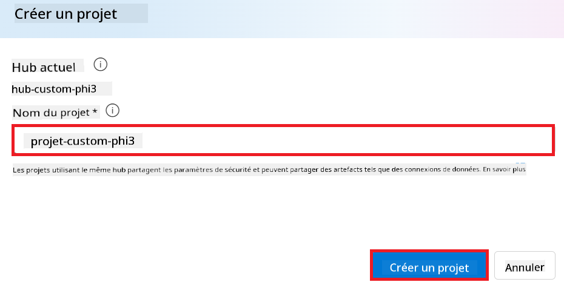

1. Cliquez sur **Create a project**.

#### Ajouter une connexion personnalisée pour le modèle ajusté Phi-3

Pour intégrer votre modèle personnalisé Phi-3 avec Prompt flow, vous devez enregistrer le point de terminaison et la clé du modèle dans une connexion personnalisée. Cette configuration garantit l'accès à votre modèle personnalisé Phi-3 dans Prompt flow.

#### Configurer la clé API et l'URI du point de terminaison du modèle ajusté Phi-3

1. Rendez-vous sur [Azure ML Studio](https://ml.azure.com/home?WT.mc_id=aiml-137032-kinfeylo).

1. Accédez à l'espace de travail Azure Machine Learning que vous avez créé.

1. Sélectionnez **Endpoints** dans le menu latéral gauche.

    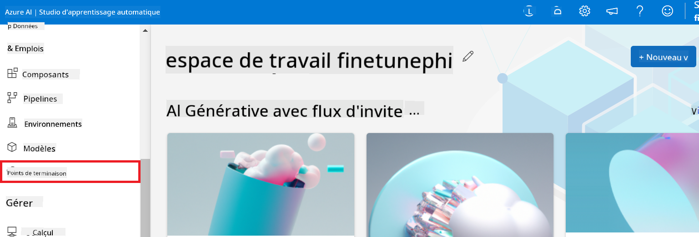

1. Sélectionnez le point de terminaison que vous avez créé.

    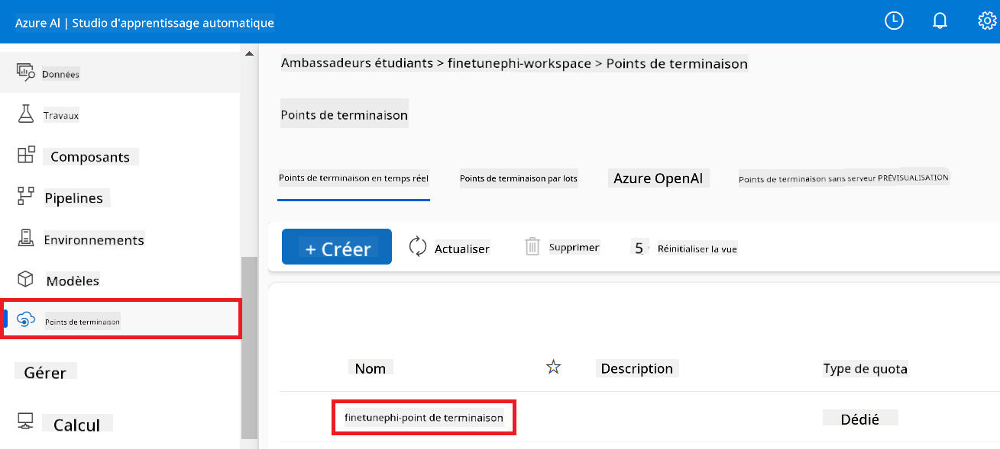

1. Cliquez sur **Consume** dans le menu de navigation.

1. Copiez votre **REST endpoint** et votre **Primary key**.
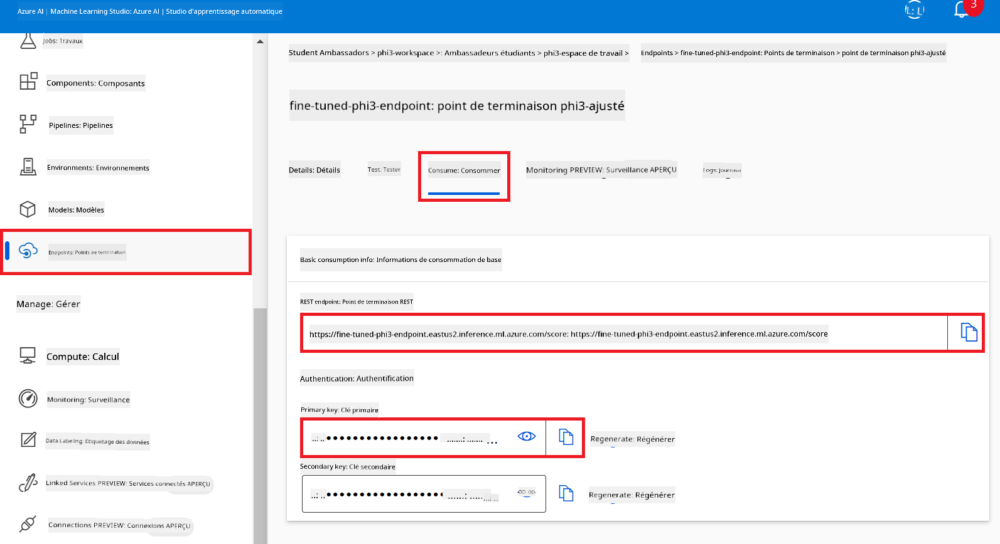

#### Ajouter la connexion personnalisée

1. Visitez [Azure AI Foundry](https://ai.azure.com/?WT.mc_id=aiml-137032-kinfeylo).

1. Accédez au projet Azure AI Foundry que vous avez créé.

1. Dans le projet que vous avez créé, sélectionnez **Paramètres** dans le menu latéral gauche.

1. Sélectionnez **+ Nouvelle connexion**.

    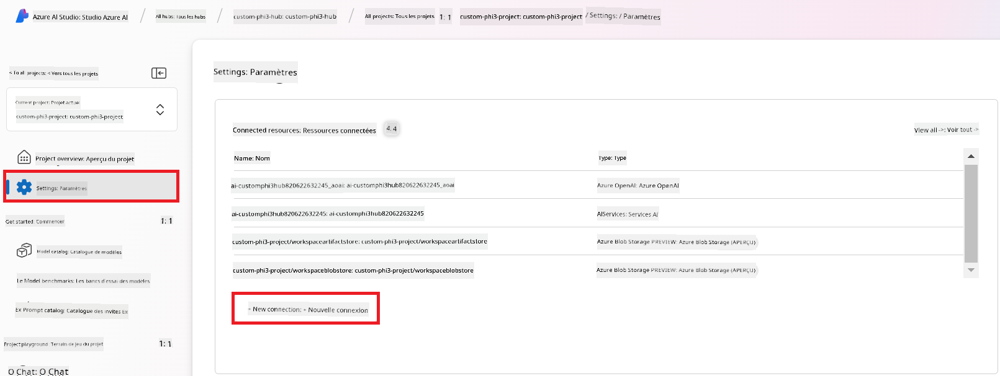

1. Sélectionnez **Clés personnalisées** dans le menu de navigation.

    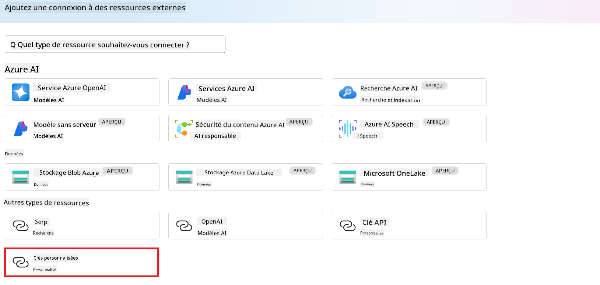

1. Effectuez les tâches suivantes :

    - Sélectionnez **+ Ajouter des paires clé-valeur**.
    - Pour le nom de la clé, entrez **endpoint** et collez le point de terminaison que vous avez copié depuis Azure ML Studio dans le champ de valeur.
    - Sélectionnez à nouveau **+ Ajouter des paires clé-valeur**.
    - Pour le nom de la clé, entrez **key** et collez la clé que vous avez copiée depuis Azure ML Studio dans le champ de valeur.
    - Après avoir ajouté les clés, sélectionnez **est secret** pour empêcher que la clé ne soit exposée.

    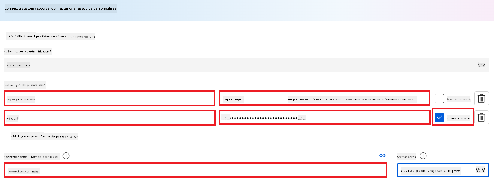

1. Sélectionnez **Ajouter connexion**.

#### Créer un flux Prompt

Vous avez ajouté une connexion personnalisée dans Azure AI Foundry. Passons maintenant à la création d’un flux Prompt en suivant les étapes ci-dessous. Ensuite, vous connecterez ce flux Prompt à la connexion personnalisée pour pouvoir utiliser le modèle ajusté dans le flux Prompt.

1. Accédez au projet Azure AI Foundry que vous avez créé.

1. Sélectionnez **Flux Prompt** dans le menu latéral gauche.

1. Sélectionnez **+ Créer** dans le menu de navigation.

    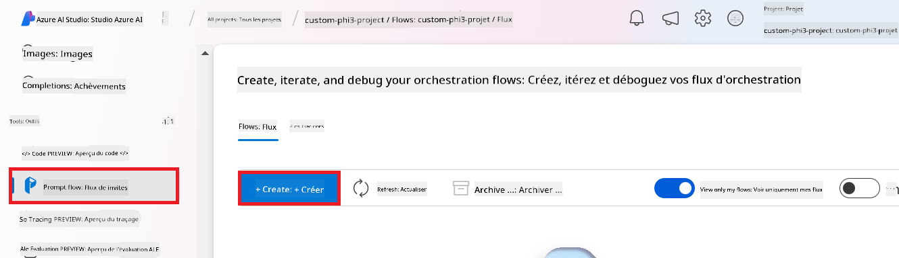

1. Sélectionnez **Flux de chat** dans le menu de navigation.

    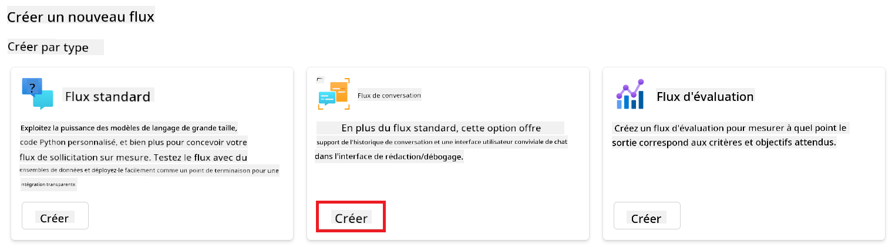

1. Entrez **Nom du dossier** à utiliser.

    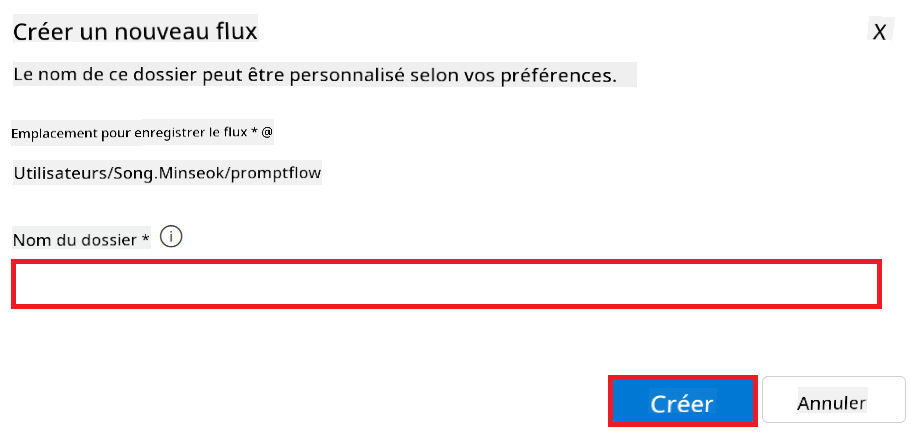

2. Sélectionnez **Créer**.

#### Configurer le flux Prompt pour dialoguer avec votre modèle Phi-3 personnalisé

Vous devez intégrer le modèle Phi-3 ajusté dans un flux Prompt. Cependant, le flux Prompt existant fourni n'est pas conçu à cet effet. Vous devez donc redéfinir le flux Prompt pour permettre l'intégration du modèle personnalisé.

1. Dans le flux Prompt, effectuez les tâches suivantes pour reconstruire le flux existant :

    - Sélectionnez **Mode fichier brut**.
    - Supprimez tout le code existant dans le fichier *flow.dag.yml*.
    - Ajoutez le code suivant au fichier *flow.dag.yml*.

        ```yml
        inputs:
          input_data:
            type: string
            default: "Who founded Microsoft?"

        outputs:
          answer:
            type: string
            reference: ${integrate_with_promptflow.output}

        nodes:
        - name: integrate_with_promptflow
          type: python
          source:
            type: code
            path: integrate_with_promptflow.py
          inputs:
            input_data: ${inputs.input_data}
        ```

    - Sélectionnez **Enregistrer**.

    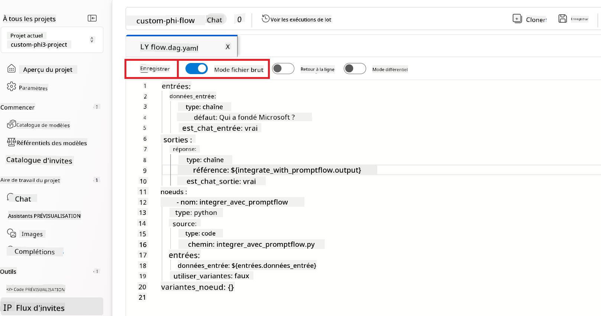

1. Ajoutez le code suivant au fichier *integrate_with_promptflow.py* pour utiliser le modèle Phi-3 personnalisé dans le flux Prompt.

    ```python
    import logging
    import requests
    from promptflow import tool
    from promptflow.connections import CustomConnection

    # Logging setup
    logging.basicConfig(
        format="%(asctime)s - %(levelname)s - %(name)s - %(message)s",
        datefmt="%Y-%m-%d %H:%M:%S",
        level=logging.DEBUG
    )
    logger = logging.getLogger(__name__)

    def query_phi3_model(input_data: str, connection: CustomConnection) -> str:
        """
        Send a request to the Phi-3 model endpoint with the given input data using Custom Connection.
        """

        # "connection" is the name of the Custom Connection, "endpoint", "key" are the keys in the Custom Connection
        endpoint_url = connection.endpoint
        api_key = connection.key

        headers = {
            "Content-Type": "application/json",
            "Authorization": f"Bearer {api_key}"
        }
        data = {
            "input_data": {
                "input_string": [
                    {"role": "user", "content": input_data}
                ],
                "parameters": {
                    "temperature": 0.7,
                    "max_new_tokens": 128
                }
            }
        }
        try:
            response = requests.post(endpoint_url, json=data, headers=headers)
            response.raise_for_status()
            
            # Log the full JSON response
            logger.debug(f"Full JSON response: {response.json()}")

            result = response.json()["output"]
            logger.info("Successfully received response from Azure ML Endpoint.")
            return result
        except requests.exceptions.RequestException as e:
            logger.error(f"Error querying Azure ML Endpoint: {e}")
            raise

    @tool
    def my_python_tool(input_data: str, connection: CustomConnection) -> str:
        """
        Tool function to process input data and query the Phi-3 model.
        """
        return query_phi3_model(input_data, connection)

    ```

    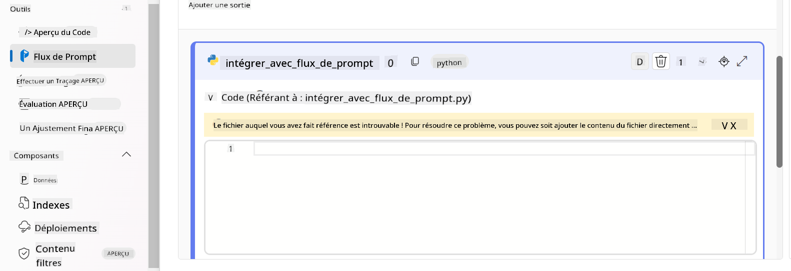

> [!NOTE]
> Pour des informations plus détaillées sur l'utilisation de Prompt flow dans Azure AI Foundry, vous pouvez consulter [Prompt flow dans Azure AI Foundry](https://learn.microsoft.com/azure/ai-studio/how-to/prompt-flow).

1. Sélectionnez **Entrée chat**, **Sortie chat** pour activer le dialogue avec votre modèle.

    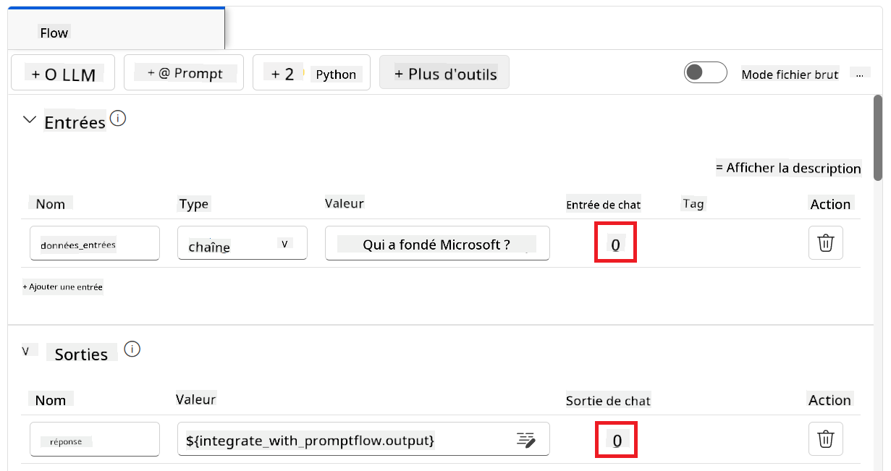

1. Vous êtes maintenant prêt à dialoguer avec votre modèle Phi-3 personnalisé. Dans l'exercice suivant, vous apprendrez à démarrer Prompt flow et à l'utiliser pour dialoguer avec votre modèle ajusté Phi-3.

> [!NOTE]
>
> Le flux reconstruit devrait ressembler à l'image ci-dessous :
>
> 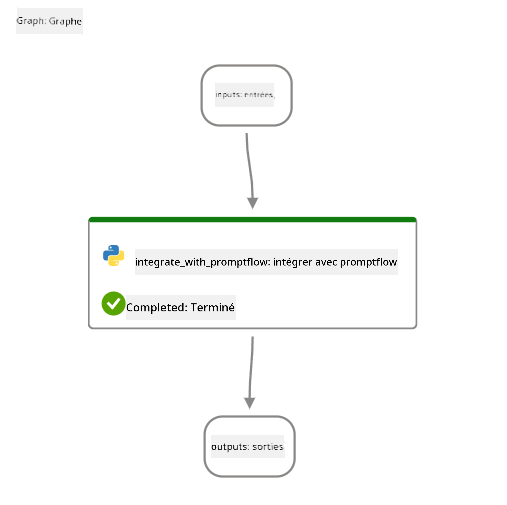
>

### Dialoguer avec votre modèle Phi-3 personnalisé

Maintenant que vous avez ajusté et intégré votre modèle Phi-3 personnalisé avec Prompt flow, vous êtes prêt à commencer à interagir avec lui. Cet exercice vous guidera dans le processus de configuration et de démarrage d’un dialogue avec votre modèle à l’aide de Prompt flow. En suivant ces étapes, vous pourrez exploiter pleinement les capacités de votre modèle Phi-3 ajusté pour diverses tâches et conversations.

- Dialoguez avec votre modèle Phi-3 personnalisé à l’aide de Prompt flow.

#### Démarrer Prompt flow

1. Sélectionnez **Démarrer les sessions de calcul** pour démarrer Prompt flow.

    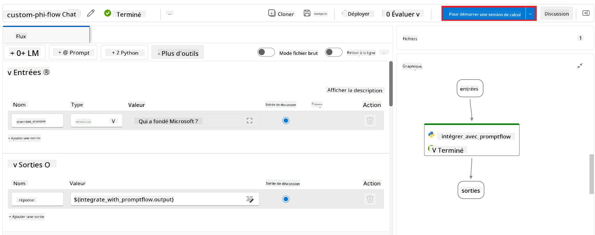

1. Sélectionnez **Valider et analyser l'entrée** pour renouveler les paramètres.

    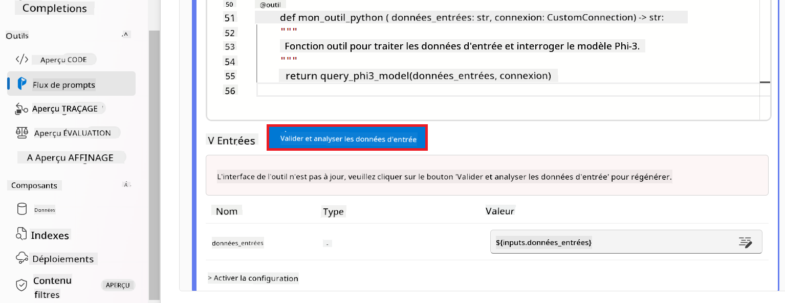

1. Sélectionnez la **Valeur** de la **connexion** vers la connexion personnalisée que vous avez créée. Par exemple, *connection*.

    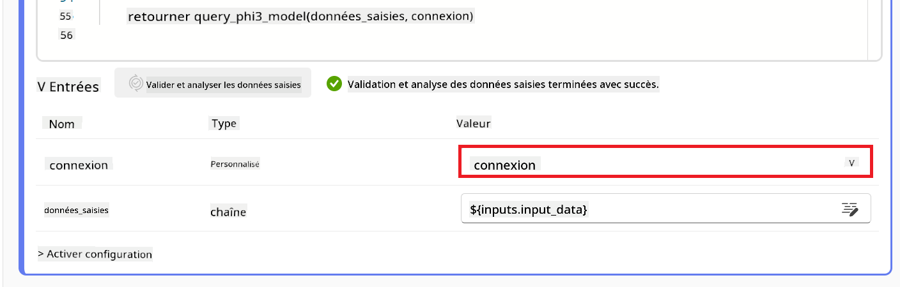

#### Dialoguer avec votre modèle personnalisé

1. Sélectionnez **Chat**.

    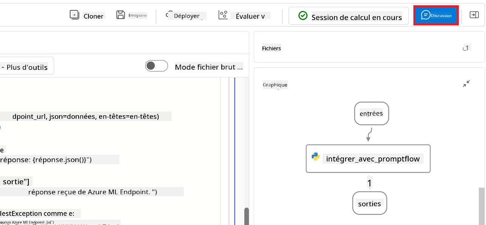

1. Voici un exemple des résultats : Vous pouvez maintenant dialoguer avec votre modèle Phi-3 personnalisé. Il est recommandé de poser des questions basées sur les données utilisées pour l’ajustement.

    

**Avertissement** :  
Ce document a été traduit à l'aide du service de traduction IA [Co-op Translator](https://github.com/Azure/co-op-translator). Bien que nous nous efforcions d'assurer l'exactitude, veuillez noter que les traductions automatisées peuvent contenir des erreurs ou des inexactitudes. Le document original dans sa langue d'origine doit être considéré comme la source faisant autorité. Pour des informations critiques, il est recommandé de faire appel à une traduction humaine professionnelle. Nous déclinons toute responsabilité en cas de malentendus ou d'interprétations erronées résultant de l'utilisation de cette traduction.