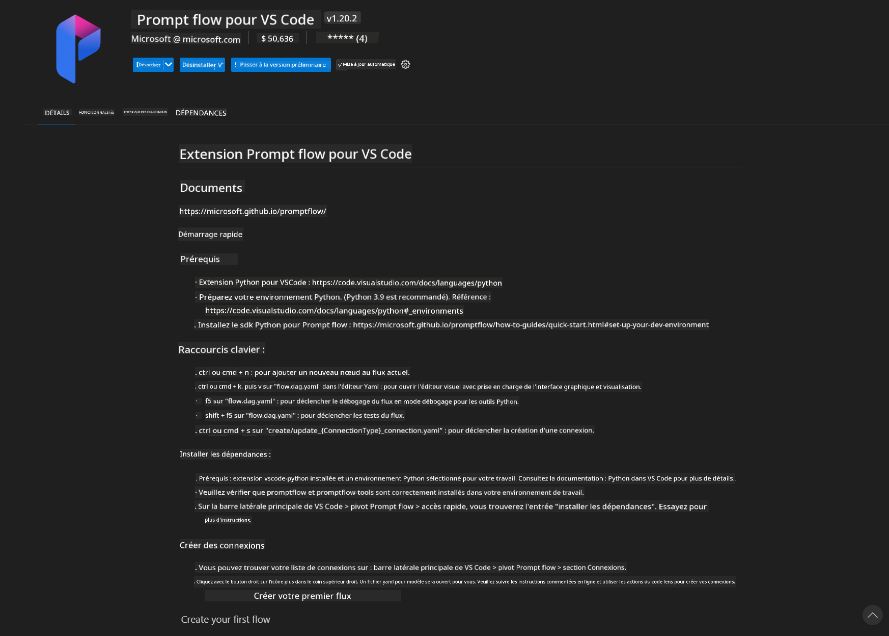
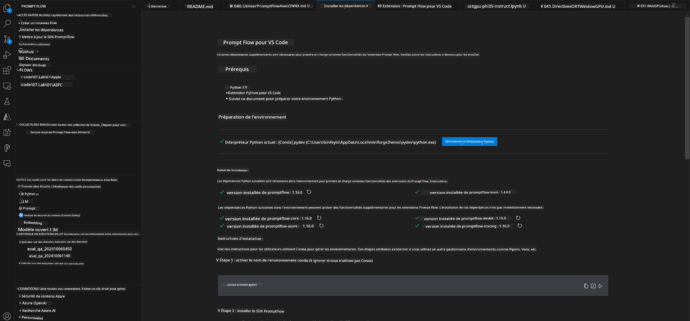
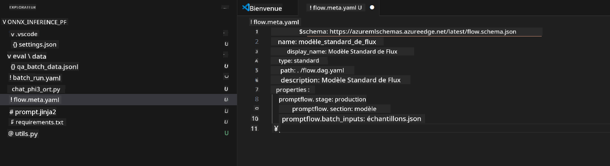
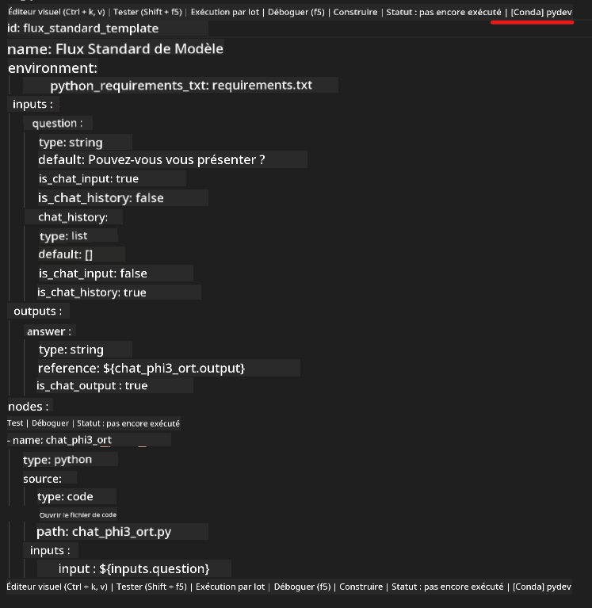
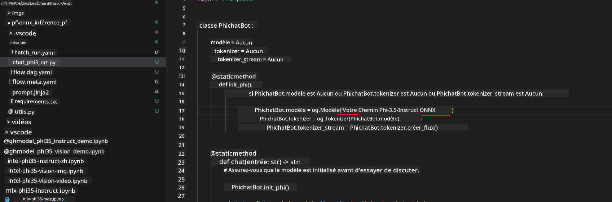
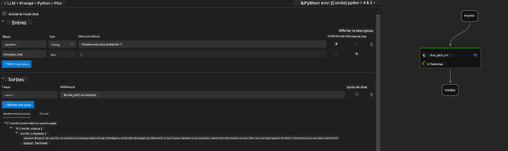
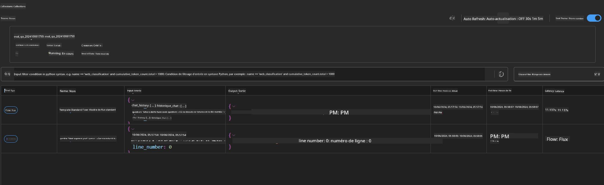

<!--
CO_OP_TRANSLATOR_METADATA:
{
  "original_hash": "92e7dac1e5af0dd7c94170fdaf6860fe",
  "translation_date": "2025-03-27T11:09:09+00:00",
  "source_file": "md\\02.Application\\01.TextAndChat\\Phi3\\UsingPromptFlowWithONNX.md",
  "language_code": "fr"
}
-->
# Utiliser le GPU Windows pour créer une solution Prompt flow avec Phi-3.5-Instruct ONNX

Le document suivant est un exemple de l'utilisation de PromptFlow avec ONNX (Open Neural Network Exchange) pour développer des applications d'IA basées sur les modèles Phi-3.

PromptFlow est une suite d'outils de développement conçue pour simplifier le cycle de développement complet des applications d'IA basées sur les LLM (Large Language Model), allant de l'idéation et du prototypage aux tests et à l'évaluation.

En intégrant PromptFlow avec ONNX, les développeurs peuvent :

- Optimiser les performances du modèle : Utiliser ONNX pour une inférence et un déploiement efficaces des modèles.
- Simplifier le développement : Utiliser PromptFlow pour gérer les flux de travail et automatiser les tâches répétitives.
- Améliorer la collaboration : Faciliter la collaboration entre les membres de l'équipe grâce à un environnement de développement unifié.

**Prompt flow** est une suite d'outils de développement conçue pour simplifier le cycle de développement complet des applications d'IA basées sur les LLM, allant de l'idéation, du prototypage, des tests, de l'évaluation au déploiement en production et à la surveillance. Cela facilite grandement l'ingénierie des prompts et permet de créer des applications LLM de qualité production.

Prompt flow peut se connecter à OpenAI, Azure OpenAI Service et à des modèles personnalisables (Huggingface, LLM/SLM locaux). Nous espérons déployer le modèle ONNX quantifié Phi-3.5 sur des applications locales. Prompt flow peut nous aider à mieux planifier notre activité et à réaliser des solutions locales basées sur Phi-3.5. Dans cet exemple, nous allons combiner la bibliothèque ONNX Runtime GenAI pour compléter la solution Prompt flow basée sur le GPU Windows.

## **Installation**

### **ONNX Runtime GenAI pour GPU Windows**

Lisez cette directive pour configurer ONNX Runtime GenAI pour GPU Windows [cliquez ici](./ORTWindowGPUGuideline.md)

### **Configurer Prompt flow dans VSCode**

1. Installer l'extension VS Code Prompt flow



2. Après avoir installé l'extension VS Code Prompt flow, cliquez sur l'extension et choisissez **Installation dependencies**. Suivez cette directive pour installer le SDK Prompt flow dans votre environnement.



3. Téléchargez [Code Exemple](../../../../../../code/09.UpdateSamples/Aug/pf/onnx_inference_pf) et utilisez VS Code pour ouvrir cet exemple.



4. Ouvrez **flow.dag.yaml** pour choisir votre environnement Python.



   Ouvrez **chat_phi3_ort.py** pour modifier l'emplacement de votre modèle Phi-3.5-Instruct ONNX.



5. Exécutez votre prompt flow pour tester.

Ouvrez **flow.dag.yaml** et cliquez sur l'éditeur visuel.


Après avoir cliqué dessus, exécutez-le pour tester.



1. Vous pouvez exécuter un batch dans le terminal pour vérifier plus de résultats.

```bash

pf run create --file batch_run.yaml --stream --name 'Your eval qa name'    

```

Vous pouvez vérifier les résultats dans votre navigateur par défaut.



**Clause de non-responsabilité** :  
Ce document a été traduit à l'aide du service de traduction automatique [Co-op Translator](https://github.com/Azure/co-op-translator). Bien que nous nous efforcions d'assurer l'exactitude, veuillez noter que les traductions automatisées peuvent contenir des erreurs ou des inexactitudes. Le document original dans sa langue native doit être considéré comme la source faisant autorité. Pour des informations critiques, une traduction professionnelle effectuée par un humain est recommandée. Nous ne sommes pas responsables des malentendus ou des interprétations erronées résultant de l'utilisation de cette traduction.