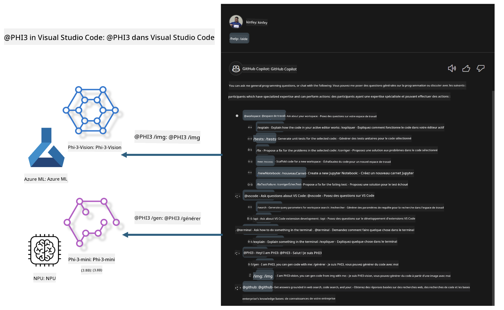

<!--
CO_OP_TRANSLATOR_METADATA:
{
  "original_hash": "00b7a699de8ac405fa821f4c0f7fc0ab",
  "translation_date": "2025-03-27T11:33:49+00:00",
  "source_file": "md\\02.Application\\02.Code\\Phi3\\VSCodeExt\\README.md",
  "language_code": "fr"
}
-->
# **Créez votre propre Chat GitHub Copilot dans Visual Studio Code avec la famille Microsoft Phi-3**

Avez-vous utilisé l'agent de workspace dans GitHub Copilot Chat ? Souhaitez-vous créer un agent de code pour votre propre équipe ? Ce laboratoire pratique vise à combiner le modèle open source pour construire un agent d'entreprise spécialisé dans le code.

## **Fondations**

### **Pourquoi choisir Microsoft Phi-3**

Phi-3 est une série de modèles, incluant phi-3-mini, phi-3-small, et phi-3-medium, basés sur différents paramètres d'entraînement pour la génération de texte, la complétion de dialogues et la génération de code. Il existe également phi-3-vision, basé sur la vision. Ces modèles sont adaptés aux entreprises ou aux équipes souhaitant créer des solutions d'IA générative hors ligne.

Lien recommandé : [https://github.com/microsoft/PhiCookBook/blob/main/md/01.Introduction/01/01.PhiFamily.md](https://github.com/microsoft/PhiCookBook/blob/main/md/01.Introduction/01/01.PhiFamily.md)

### **Microsoft GitHub Copilot Chat**

L'extension GitHub Copilot Chat offre une interface de chat qui vous permet d'interagir avec GitHub Copilot et de recevoir des réponses à des questions liées au code directement dans VS Code, sans avoir à consulter la documentation ou chercher sur des forums en ligne.

Copilot Chat peut utiliser la coloration syntaxique, l'indentation et d'autres fonctionnalités de mise en forme pour clarifier les réponses générées. Selon le type de question posée, la réponse peut inclure des liens vers le contexte utilisé par Copilot, tels que des fichiers source ou de la documentation, ou encore des boutons pour accéder à des fonctionnalités de VS Code.

- Copilot Chat s'intègre dans votre flux de développement et vous assiste là où vous en avez besoin :

- Démarrez une conversation de chat en ligne directement depuis l'éditeur ou le terminal pour obtenir de l'aide pendant que vous codez.

- Utilisez la vue Chat pour avoir un assistant IA à vos côtés à tout moment.

- Lancez Quick Chat pour poser une question rapide et reprendre immédiatement votre travail.

Vous pouvez utiliser GitHub Copilot Chat dans divers scénarios, tels que :

- Répondre à des questions sur la meilleure façon de résoudre un problème de code.

- Expliquer le code écrit par quelqu'un d'autre et proposer des améliorations.

- Proposer des corrections de code.

- Générer des cas de test unitaires.

- Générer de la documentation pour le code.

Lien recommandé : [https://code.visualstudio.com/docs/copilot/copilot-chat](https://code.visualstudio.com/docs/copilot/copilot-chat?WT.mc_id=aiml-137032-kinfeylo)

### **Microsoft GitHub Copilot Chat @workspace**

Faire référence à **@workspace** dans Copilot Chat vous permet de poser des questions sur l'ensemble de votre base de code. En fonction de la question, Copilot récupère intelligemment les fichiers et symboles pertinents, qu'il utilise ensuite dans ses réponses sous forme de liens et d'exemples de code.

Pour répondre à votre question, **@workspace** explore les mêmes sources qu'un développeur utiliserait pour naviguer dans une base de code dans VS Code :

- Tous les fichiers du workspace, à l'exception de ceux ignorés par un fichier .gitignore.

- La structure des répertoires avec les noms des dossiers et fichiers imbriqués.

- L'index de recherche de code de GitHub, si le workspace est un dépôt GitHub indexé par la recherche de code.

- Les symboles et définitions dans le workspace.

- Le texte actuellement sélectionné ou visible dans l'éditeur actif.

Note : .gitignore est ignoré si vous avez ouvert un fichier ou sélectionné du texte dans un fichier ignoré.

Lien recommandé : [https://code.visualstudio.com/docs/copilot/copilot-chat](https://code.visualstudio.com/docs/copilot/workspace-context?WT.mc_id=aiml-137032-kinfeylo)

## **En savoir plus sur ce laboratoire**

GitHub Copilot a considérablement amélioré l'efficacité de programmation des entreprises, et chaque entreprise souhaite personnaliser les fonctionnalités de GitHub Copilot en fonction de ses besoins. De nombreuses entreprises ont créé des Extensions similaires à GitHub Copilot en fonction de leurs propres scénarios métier et des modèles open source. Pour les entreprises, des Extensions personnalisées sont plus faciles à contrôler, mais cela peut affecter l'expérience utilisateur. Après tout, GitHub Copilot est plus performant pour gérer des scénarios généraux et spécialisés. Si l'expérience utilisateur reste cohérente, il serait idéal de personnaliser l'Extension pour l'entreprise. GitHub Copilot Chat fournit des APIs pertinentes permettant aux entreprises d'étendre l'expérience de Chat. Maintenir une expérience cohérente tout en ayant des fonctions personnalisées offre une meilleure expérience utilisateur.

Ce laboratoire utilise principalement le modèle Phi-3 combiné avec un NPU local et un hybride Azure pour construire un Agent personnalisé dans GitHub Copilot Chat ***@PHI3*** afin d'aider les développeurs d'entreprise à générer du code ***(@PHI3 /gen)*** et à générer du code à partir d'images ***(@PHI3 /img)***.

### ***Remarque :*** 

Ce laboratoire est actuellement implémenté sur l'AIPC des processeurs Intel et Apple Silicon. Nous continuerons à mettre à jour la version Qualcomm de NPU.

## **Laboratoire**

| Nom | Description | AIPC | Apple |
| ------------ | ----------- | -------- |-------- |
| Lab0 - Installations(✅) | Configurer et installer les environnements et outils nécessaires | [Go](./HOL/AIPC/01.Installations.md) |[Go](./HOL/Apple/01.Installations.md) |
| Lab1 - Exécuter Prompt flow avec Phi-3-mini (✅) | Combiné avec AIPC / Apple Silicon, utilisant un NPU local pour créer une génération de code via Phi-3-mini | [Go](./HOL/AIPC/02.PromptflowWithNPU.md) |  [Go](./HOL/Apple/02.PromptflowWithMLX.md) |
| Lab2 - Déployer Phi-3-vision sur Azure Machine Learning Service(✅) | Générer du code en déployant le Model Catalog - Phi-3-vision image d'Azure Machine Learning Service | [Go](./HOL/AIPC/03.DeployPhi3VisionOnAzure.md) |[Go](./HOL/Apple/03.DeployPhi3VisionOnAzure.md) |
| Lab3 - Créer un agent @phi-3 dans GitHub Copilot Chat(✅)  | Créer un agent Phi-3 personnalisé dans GitHub Copilot Chat pour effectuer la génération de code, la génération graphique, RAG, etc. | [Go](./HOL/AIPC/04.CreatePhi3AgentInVSCode.md) | [Go](./HOL/Apple/04.CreatePhi3AgentInVSCode.md) |
| Code Exemple (✅)  | Télécharger le code exemple | [Go](../../../../../../../code/07.Lab/01/AIPC) | [Go](../../../../../../../code/07.Lab/01/Apple) |

## **Ressources**

1. Phi-3 Cookbook [https://github.com/microsoft/Phi-3CookBook](https://github.com/microsoft/Phi-3CookBook)

2. En savoir plus sur GitHub Copilot [https://learn.microsoft.com/training/paths/copilot/](https://learn.microsoft.com/training/paths/copilot/?WT.mc_id=aiml-137032-kinfeylo)

3. En savoir plus sur GitHub Copilot Chat [https://learn.microsoft.com/training/paths/accelerate-app-development-using-github-copilot/](https://learn.microsoft.com/training/paths/accelerate-app-development-using-github-copilot/?WT.mc_id=aiml-137032-kinfeylo)

4. En savoir plus sur l'API de GitHub Copilot Chat [https://code.visualstudio.com/api/extension-guides/chat](https://code.visualstudio.com/api/extension-guides/chat?WT.mc_id=aiml-137032-kinfeylo)

5. En savoir plus sur Azure AI Foundry [https://learn.microsoft.com/training/paths/create-custom-copilots-ai-studio/](https://learn.microsoft.com/training/paths/create-custom-copilots-ai-studio/?WT.mc_id=aiml-137032-kinfeylo)

6. En savoir plus sur le Model Catalog d'Azure AI Foundry [https://learn.microsoft.com/azure/ai-studio/how-to/model-catalog-overview](https://learn.microsoft.com/azure/ai-studio/how-to/model-catalog-overview)

**Avertissement** :  
Ce document a été traduit à l'aide du service de traduction automatique [Co-op Translator](https://github.com/Azure/co-op-translator). Bien que nous fassions de notre mieux pour garantir l'exactitude, veuillez noter que les traductions automatiques peuvent contenir des erreurs ou des inexactitudes. Le document original dans sa langue d'origine doit être considéré comme la source faisant autorité. Pour des informations critiques, une traduction professionnelle réalisée par un humain est recommandée. Nous déclinons toute responsabilité en cas de malentendus ou d'interprétations erronées découlant de l'utilisation de cette traduction.