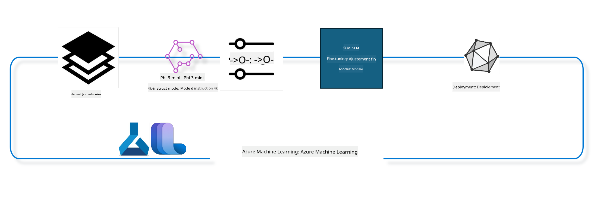

<!--
CO_OP_TRANSLATOR_METADATA:
{
  "original_hash": "944949f040e61b2ea25b3460f7394fd4",
  "translation_date": "2025-03-27T14:18:14+00:00",
  "source_file": "md\\03.FineTuning\\FineTuning_MLSDK.md",
  "language_code": "fr"
}
-->
## Comment utiliser les composants de chat-completion du registre de système Azure ML pour ajuster un modèle

Dans cet exemple, nous allons effectuer l'ajustement du modèle Phi-3-mini-4k-instruct pour compléter une conversation entre deux personnes en utilisant le dataset ultrachat_200k.



Cet exemple vous montrera comment effectuer un ajustement en utilisant le SDK Azure ML et Python, puis déployer le modèle ajusté sur un endpoint en ligne pour une inférence en temps réel.

### Données d'entraînement

Nous utiliserons le dataset ultrachat_200k. Il s'agit d'une version fortement filtrée du dataset UltraChat qui a été utilisée pour entraîner Zephyr-7B-β, un modèle de chat de pointe avec 7 milliards de paramètres.

### Modèle

Nous utiliserons le modèle Phi-3-mini-4k-instruct pour montrer comment l'utilisateur peut ajuster un modèle pour la tâche de chat-completion. Si vous avez ouvert ce notebook depuis une fiche de modèle spécifique, n'oubliez pas de remplacer le nom du modèle par celui que vous utilisez.

### Tâches

- Choisir un modèle à ajuster.
- Sélectionner et explorer les données d'entraînement.
- Configurer le job d'ajustement.
- Exécuter le job d'ajustement.
- Examiner les métriques d'entraînement et d'évaluation.
- Enregistrer le modèle ajusté.
- Déployer le modèle ajusté pour une inférence en temps réel.
- Nettoyer les ressources.

## 1. Configuration des prérequis

- Installer les dépendances.
- Se connecter à l'espace de travail AzureML. Apprenez-en plus sur la configuration de l'authentification SDK. Remplacez <WORKSPACE_NAME>, <RESOURCE_GROUP> et <SUBSCRIPTION_ID> ci-dessous.
- Se connecter au registre de système AzureML.
- Définir un nom d'expérience facultatif.
- Vérifier ou créer une ressource de calcul.

> [!NOTE]
> Un nœud GPU unique peut avoir plusieurs cartes GPU. Par exemple, un nœud Standard_NC24rs_v3 contient 4 GPU NVIDIA V100 tandis qu'un Standard_NC12s_v3 en contient 2. Consultez la documentation pour plus d'informations. Le nombre de cartes GPU par nœud est défini dans le paramètre gpus_per_node ci-dessous. Définir cette valeur correctement permettra d'utiliser tous les GPU du nœud. Les SKU de GPU recommandés peuvent être trouvés ici et ici.

### Bibliothèques Python

Installez les dépendances en exécutant la cellule ci-dessous. Cette étape n'est pas facultative si vous travaillez dans un nouvel environnement.

```bash
pip install azure-ai-ml
pip install azure-identity
pip install datasets==2.9.0
pip install mlflow
pip install azureml-mlflow
```

### Interaction avec Azure ML

1. Ce script Python est utilisé pour interagir avec le service Azure Machine Learning (Azure ML). Voici un résumé de ses fonctionnalités :

    - Il importe les modules nécessaires des packages azure.ai.ml, azure.identity et azure.ai.ml.entities, ainsi que le module time.

    - Il tente de s'authentifier en utilisant DefaultAzureCredential(), qui offre une expérience d'authentification simplifiée pour commencer rapidement à développer des applications dans le cloud Azure. En cas d'échec, il utilise InteractiveBrowserCredential(), qui propose une invite de connexion interactive.

    - Il essaie ensuite de créer une instance MLClient en utilisant la méthode from_config, qui lit la configuration depuis le fichier de configuration par défaut (config.json). En cas d'échec, il crée une instance MLClient en fournissant manuellement subscription_id, resource_group_name et workspace_name.

    - Il crée une autre instance MLClient, cette fois pour le registre Azure ML nommé "azureml". Ce registre est l'endroit où sont stockés les modèles, pipelines d'ajustement et environnements.

    - Il définit le nom de l'expérience sur "chat_completion_Phi-3-mini-4k-instruct".

    - Il génère un timestamp unique en convertissant le temps actuel (en secondes depuis l'époque, sous forme de nombre flottant) en un entier, puis en une chaîne. Ce timestamp peut être utilisé pour créer des noms et versions uniques.

    ```python
    # Import necessary modules from Azure ML and Azure Identity
    from azure.ai.ml import MLClient
    from azure.identity import (
        DefaultAzureCredential,
        InteractiveBrowserCredential,
    )
    from azure.ai.ml.entities import AmlCompute
    import time  # Import time module
    
    # Try to authenticate using DefaultAzureCredential
    try:
        credential = DefaultAzureCredential()
        credential.get_token("https://management.azure.com/.default")
    except Exception as ex:  # If DefaultAzureCredential fails, use InteractiveBrowserCredential
        credential = InteractiveBrowserCredential()
    
    # Try to create an MLClient instance using the default config file
    try:
        workspace_ml_client = MLClient.from_config(credential=credential)
    except:  # If that fails, create an MLClient instance by manually providing the details
        workspace_ml_client = MLClient(
            credential,
            subscription_id="<SUBSCRIPTION_ID>",
            resource_group_name="<RESOURCE_GROUP>",
            workspace_name="<WORKSPACE_NAME>",
        )
    
    # Create another MLClient instance for the Azure ML registry named "azureml"
    # This registry is where models, fine-tuning pipelines, and environments are stored
    registry_ml_client = MLClient(credential, registry_name="azureml")
    
    # Set the experiment name
    experiment_name = "chat_completion_Phi-3-mini-4k-instruct"
    
    # Generate a unique timestamp that can be used for names and versions that need to be unique
    timestamp = str(int(time.time()))
    ```

## 2. Choisir un modèle de base à ajuster

1. Phi-3-mini-4k-instruct est un modèle léger et de pointe avec 3,8 milliards de paramètres, construit sur les datasets utilisés pour Phi-2. Le modèle appartient à la famille Phi-3, et la version Mini est disponible en deux variantes : 4K et 128K, qui correspondent à la longueur de contexte (en tokens) qu'il peut gérer. Nous devons ajuster le modèle pour notre objectif spécifique afin de l'utiliser. Vous pouvez explorer ces modèles dans le catalogue de modèles de AzureML Studio, en filtrant par la tâche de chat-completion. Dans cet exemple, nous utilisons le modèle Phi-3-mini-4k-instruct. Si vous avez ouvert ce notebook pour un autre modèle, remplacez le nom et la version du modèle en conséquence.

    > [!NOTE]
    > L'identifiant du modèle (model id). Cet identifiant sera transmis comme entrée au job d'ajustement. Il est également disponible sous le champ Asset ID dans la page des détails du modèle dans le catalogue de modèles AzureML Studio.

2. Ce script Python interagit avec le service Azure Machine Learning (Azure ML). Voici un résumé de ses fonctionnalités :

    - Il définit le model_name sur "Phi-3-mini-4k-instruct".

    - Il utilise la méthode get de la propriété models de l'objet registry_ml_client pour récupérer la dernière version du modèle avec le nom spécifié dans le registre Azure ML. La méthode get est appelée avec deux arguments : le nom du modèle et un label spécifiant que la dernière version du modèle doit être récupérée.

    - Il imprime un message dans la console indiquant le nom, la version et l'identifiant du modèle qui sera utilisé pour l'ajustement. La méthode format de la chaîne est utilisée pour insérer le nom, la version et l'identifiant du modèle dans le message. Le nom, la version et l'identifiant du modèle sont accessibles comme propriétés de l'objet foundation_model.

    ```python
    # Set the model name
    model_name = "Phi-3-mini-4k-instruct"
    
    # Get the latest version of the model from the Azure ML registry
    foundation_model = registry_ml_client.models.get(model_name, label="latest")
    
    # Print the model name, version, and id
    # This information is useful for tracking and debugging
    print(
        "\n\nUsing model name: {0}, version: {1}, id: {2} for fine tuning".format(
            foundation_model.name, foundation_model.version, foundation_model.id
        )
    )
    ```

## 3. Créer une ressource de calcul à utiliser avec le job

Le job d'ajustement fonctionne UNIQUEMENT avec une ressource de calcul GPU. La taille de la ressource dépend de la taille du modèle et, dans la plupart des cas, il peut être difficile d'identifier la ressource adéquate pour le job. Dans cette cellule, nous guidons l'utilisateur pour sélectionner la ressource appropriée.

> [!NOTE]
> Les ressources de calcul listées ci-dessous fonctionnent avec la configuration la plus optimisée. Toute modification de la configuration peut entraîner une erreur Cuda Out Of Memory. Dans ce cas, essayez de passer à une ressource de calcul plus grande.

> [!NOTE]
> Lors de la sélection de compute_cluster_size ci-dessous, assurez-vous que la ressource est disponible dans votre groupe de ressources. Si une ressource spécifique n'est pas disponible, vous pouvez faire une demande pour accéder aux ressources de calcul.

### Vérification de la compatibilité du modèle avec l'ajustement

1. Ce script Python interagit avec un modèle Azure Machine Learning (Azure ML). Voici un résumé de ses fonctionnalités :

    - Il importe le module ast, qui fournit des fonctions pour traiter les arbres de la grammaire de syntaxe abstraite de Python.

    - Il vérifie si l'objet foundation_model (qui représente un modèle dans Azure ML) possède un tag nommé finetune_compute_allow_list. Les tags dans Azure ML sont des paires clé-valeur que vous pouvez créer et utiliser pour filtrer et trier les modèles.

    - Si le tag finetune_compute_allow_list est présent, il utilise la fonction ast.literal_eval pour analyser en toute sécurité la valeur du tag (une chaîne) en une liste Python. Cette liste est ensuite attribuée à la variable computes_allow_list. Il imprime ensuite un message indiquant qu'une ressource de calcul doit être créée à partir de la liste.

    - Si le tag finetune_compute_allow_list n'est pas présent, il définit computes_allow_list sur None et imprime un message indiquant que le tag finetune_compute_allow_list ne fait pas partie des tags du modèle.

    - En résumé, ce script vérifie un tag spécifique dans les métadonnées du modèle, convertit la valeur du tag en liste s'il existe, et fournit un retour d'information à l'utilisateur en conséquence.

    ```python
    # Import the ast module, which provides functions to process trees of the Python abstract syntax grammar
    import ast
    
    # Check if the 'finetune_compute_allow_list' tag is present in the model's tags
    if "finetune_compute_allow_list" in foundation_model.tags:
        # If the tag is present, use ast.literal_eval to safely parse the tag's value (a string) into a Python list
        computes_allow_list = ast.literal_eval(
            foundation_model.tags["finetune_compute_allow_list"]
        )  # convert string to python list
        # Print a message indicating that a compute should be created from the list
        print(f"Please create a compute from the above list - {computes_allow_list}")
    else:
        # If the tag is not present, set computes_allow_list to None
        computes_allow_list = None
        # Print a message indicating that the 'finetune_compute_allow_list' tag is not part of the model's tags
        print("`finetune_compute_allow_list` is not part of model tags")
    ```

### Vérification de l'instance de calcul

1. Ce script Python interagit avec le service Azure Machine Learning (Azure ML) et effectue plusieurs vérifications sur une instance de calcul. Voici un résumé de ses fonctionnalités :

    - Il tente de récupérer l'instance de calcul avec le nom stocké dans compute_cluster depuis l'espace de travail Azure ML. Si l'état de provisionnement de l'instance de calcul est "failed", il lève une ValueError.

    - Il vérifie si computes_allow_list n'est pas None. Si ce n'est pas le cas, il convertit toutes les tailles de calcul dans la liste en minuscules et vérifie si la taille de l'instance de calcul actuelle est dans la liste. Si ce n'est pas le cas, il lève une ValueError.

    - Si computes_allow_list est None, il vérifie si la taille de l'instance de calcul est dans une liste de tailles de GPU VM non prises en charge. Si c'est le cas, il lève une ValueError.

    - Il récupère une liste de toutes les tailles de calcul disponibles dans l'espace de travail. Il parcourt ensuite cette liste et, pour chaque taille de calcul, vérifie si son nom correspond à la taille de l'instance de calcul actuelle. Si c'est le cas, il récupère le nombre de GPU pour cette taille de calcul et définit gpu_count_found sur True.

    - Si gpu_count_found est True, il imprime le nombre de GPU dans l'instance de calcul. Si gpu_count_found est False, il lève une ValueError.

    - En résumé, ce script effectue plusieurs vérifications sur une instance de calcul dans un espace de travail Azure ML, notamment en vérifiant son état de provisionnement, sa taille par rapport à une liste d'autorisation ou de refus, et le nombre de GPU qu'elle possède.

    ```python
    # Print the exception message
    print(e)
    # Raise a ValueError if the compute size is not available in the workspace
    raise ValueError(
        f"WARNING! Compute size {compute_cluster_size} not available in workspace"
    )
    
    # Retrieve the compute instance from the Azure ML workspace
    compute = workspace_ml_client.compute.get(compute_cluster)
    # Check if the provisioning state of the compute instance is "failed"
    if compute.provisioning_state.lower() == "failed":
        # Raise a ValueError if the provisioning state is "failed"
        raise ValueError(
            f"Provisioning failed, Compute '{compute_cluster}' is in failed state. "
            f"please try creating a different compute"
        )
    
    # Check if computes_allow_list is not None
    if computes_allow_list is not None:
        # Convert all compute sizes in computes_allow_list to lowercase
        computes_allow_list_lower_case = [x.lower() for x in computes_allow_list]
        # Check if the size of the compute instance is in computes_allow_list_lower_case
        if compute.size.lower() not in computes_allow_list_lower_case:
            # Raise a ValueError if the size of the compute instance is not in computes_allow_list_lower_case
            raise ValueError(
                f"VM size {compute.size} is not in the allow-listed computes for finetuning"
            )
    else:
        # Define a list of unsupported GPU VM sizes
        unsupported_gpu_vm_list = [
            "standard_nc6",
            "standard_nc12",
            "standard_nc24",
            "standard_nc24r",
        ]
        # Check if the size of the compute instance is in unsupported_gpu_vm_list
        if compute.size.lower() in unsupported_gpu_vm_list:
            # Raise a ValueError if the size of the compute instance is in unsupported_gpu_vm_list
            raise ValueError(
                f"VM size {compute.size} is currently not supported for finetuning"
            )
    
    # Initialize a flag to check if the number of GPUs in the compute instance has been found
    gpu_count_found = False
    # Retrieve a list of all available compute sizes in the workspace
    workspace_compute_sku_list = workspace_ml_client.compute.list_sizes()
    available_sku_sizes = []
    # Iterate over the list of available compute sizes
    for compute_sku in workspace_compute_sku_list:
        available_sku_sizes.append(compute_sku.name)
        # Check if the name of the compute size matches the size of the compute instance
        if compute_sku.name.lower() == compute.size.lower():
            # If it does, retrieve the number of GPUs for that compute size and set gpu_count_found to True
            gpus_per_node = compute_sku.gpus
            gpu_count_found = True
    # If gpu_count_found is True, print the number of GPUs in the compute instance
    if gpu_count_found:
        print(f"Number of GPU's in compute {compute.size}: {gpus_per_node}")
    else:
        # If gpu_count_found is False, raise a ValueError
        raise ValueError(
            f"Number of GPU's in compute {compute.size} not found. Available skus are: {available_sku_sizes}."
            f"This should not happen. Please check the selected compute cluster: {compute_cluster} and try again."
        )
    ```

## 4. Choisir le dataset pour ajuster le modèle

1. Nous utilisons le dataset ultrachat_200k. Le dataset comporte quatre divisions, adaptées à l'ajustement supervisé (sft) et au classement de génération (gen). Le nombre d'exemples par division est indiqué comme suit :

    ```bash
    train_sft test_sft  train_gen  test_gen
    207865  23110  256032  28304
    ```

1. Les prochaines cellules montrent une préparation de données de base pour l'ajustement :

### Visualiser quelques lignes de données

Nous voulons que cet exemple s'exécute rapidement, alors sauvegardez les fichiers train_sft et test_sft contenant 5 % des lignes déjà réduites. Cela signifie que le modèle ajusté aura une précision inférieure, il ne doit donc pas être utilisé dans des applications réelles.  
Le script download-dataset.py est utilisé pour télécharger le dataset ultrachat_200k et transformer le dataset en un format consommable par le composant de pipeline d'ajustement. Étant donné que le dataset est volumineux, nous n'avons ici qu'une partie du dataset.

1. Exécuter le script ci-dessous ne télécharge que 5 % des données. Cela peut être augmenté en modifiant le paramètre dataset_split_pc au pourcentage souhaité.

    > [!NOTE]
    > Certains modèles de langage ont différents codes de langue et donc les noms de colonnes dans le dataset doivent refléter cela.

1. Voici un exemple de la structure des données :  
Le dataset de chat-completion est stocké au format parquet, chaque entrée utilisant le schéma suivant :

    - Il s'agit d'un document JSON (JavaScript Object Notation), un format populaire d'échange de données. Voici un résumé de sa structure :

    - "prompt" : Cette clé contient une chaîne représentant une tâche ou une question posée à un assistant IA.

    - "messages" : Cette clé contient un tableau d'objets. Chaque objet représente un message dans une conversation entre un utilisateur et un assistant IA. Chaque objet message a deux clés :

    - "content" : Cette clé contient une chaîne représentant le contenu du message.
    - "role" : Cette clé contient une chaîne représentant le rôle de l'entité qui a envoyé le message, soit "user" soit "assistant".
    - "prompt_id" : Cette clé contient une chaîne représentant un identifiant unique pour le prompt.

1. Dans ce document JSON spécifique, une conversation est représentée où un utilisateur demande à un assistant IA de créer un protagoniste pour une histoire dystopique. L'assistant répond, et l'utilisateur demande ensuite plus de détails. L'assistant accepte de fournir plus de détails. Toute la conversation est associée à un identifiant de prompt spécifique.

    ```python
    {
        // The task or question posed to an AI assistant
        "prompt": "Create a fully-developed protagonist who is challenged to survive within a dystopian society under the rule of a tyrant. ...",
        
        // An array of objects, each representing a message in a conversation between a user and an AI assistant
        "messages":[
            {
                // The content of the user's message
                "content": "Create a fully-developed protagonist who is challenged to survive within a dystopian society under the rule of a tyrant. ...",
                // The role of the entity that sent the message
                "role": "user"
            },
            {
                // The content of the assistant's message
                "content": "Name: Ava\n\n Ava was just 16 years old when the world as she knew it came crashing down. The government had collapsed, leaving behind a chaotic and lawless society. ...",
                // The role of the entity that sent the message
                "role": "assistant"
            },
            {
                // The content of the user's message
                "content": "Wow, Ava's story is so intense and inspiring! Can you provide me with more details.  ...",
                // The role of the entity that sent the message
                "role": "user"
            }, 
            {
                // The content of the assistant's message
                "content": "Certainly! ....",
                // The role of the entity that sent the message
                "role": "assistant"
            }
        ],
        
        // A unique identifier for the prompt
        "prompt_id": "d938b65dfe31f05f80eb8572964c6673eddbd68eff3db6bd234d7f1e3b86c2af"
    }
    ```

### Télécharger les données

1. Ce script Python est utilisé pour télécharger un dataset à l'aide d'un script auxiliaire nommé download-dataset.py. Voici un résumé de ses fonctionnalités :

    - Il importe le module os, qui offre une manière portable d'utiliser des fonctionnalités dépendantes du système d'exploitation.

    - Il utilise la fonction os.system pour exécuter le script download-dataset.py dans le shell avec des arguments spécifiques en ligne de commande. Les arguments spécifient le dataset à télécharger (HuggingFaceH4/ultrachat_200k), le répertoire où le télécharger (ultrachat_200k_dataset), et le pourcentage du dataset à diviser (5). La fonction os.system retourne le statut de sortie de la commande exécutée ; ce statut est stocké dans la variable exit_status.

    - Il vérifie si exit_status n'est pas égal à 0. Dans les systèmes d'exploitation de type Unix, un statut de sortie de 0 indique généralement qu'une commande a réussi, tandis que tout autre nombre indique une erreur. Si exit_status n'est pas égal à 0, il lève une exception avec un message indiquant qu'il y a eu une erreur lors du téléchargement du dataset.

    - En résumé, ce script exécute une commande pour télécharger un dataset à l'aide d'un script auxiliaire et lève une exception si la commande échoue.

    ```python
    # Import the os module, which provides a way of using operating system dependent functionality
    import os
    
    # Use the os.system function to run the download-dataset.py script in the shell with specific command-line arguments
    # The arguments specify the dataset to download (HuggingFaceH4/ultrachat_200k), the directory to download it to (ultrachat_200k_dataset), and the percentage of the dataset to split (5)
    # The os.system function returns the exit status of the command it executed; this status is stored in the exit_status variable
    exit_status = os.system(
        "python ./download-dataset.py --dataset HuggingFaceH4/ultrachat_200k --download_dir ultrachat_200k_dataset --dataset_split_pc 5"
    )
    
    # Check if exit_status is not 0
    # In Unix-like operating systems, an exit status of 0 usually indicates that a command has succeeded, while any other number indicates an error
    # If exit_status is not 0, raise an Exception with a message indicating that there was an error downloading the dataset
    if exit_status != 0:
        raise Exception("Error downloading dataset")
    ```

### Charger les données dans un DataFrame

1. Ce script Python charge un fichier JSON Lines dans un DataFrame pandas et affiche les 5 premières lignes. Voici un résumé de ses fonctionnalités :

    - Il importe la bibliothèque pandas, qui est une bibliothèque puissante pour la manipulation et l'analyse de données.

    - Il définit la largeur maximale des colonnes pour les options d'affichage de pandas à 0. Cela signifie que le texte complet de chaque colonne sera affiché sans troncature lorsque le DataFrame sera imprimé.

    - Il utilise la fonction pd.read_json pour charger le fichier train_sft.jsonl depuis le répertoire ultrachat_200k_dataset dans un DataFrame. L'argument lines=True indique que le fichier est au format JSON Lines, où chaque ligne est un objet JSON distinct.

    - Il utilise la méthode head pour afficher les 5 premières lignes du DataFrame. Si le DataFrame contient moins de 5 lignes, il les affichera toutes.

    - En résumé, ce script charge un fichier JSON Lines dans un DataFrame et affiche les 5 premières lignes avec le texte complet des colonnes.

    ```python
    # Import the pandas library, which is a powerful data manipulation and analysis library
    import pandas as pd
    
    # Set the maximum column width for pandas' display options to 0
    # This means that the full text of each column will be displayed without truncation when the DataFrame is printed
    pd.set_option("display.max_colwidth", 0)
    
    # Use the pd.read_json function to load the train_sft.jsonl file from the ultrachat_200k_dataset directory into a DataFrame
    # The lines=True argument indicates that the file is in JSON Lines format, where each line is a separate JSON object
    df = pd.read_json("./ultrachat_200k_dataset/train_sft.jsonl", lines=True)
    
    # Use the head method to display the first 5 rows of the DataFrame
    # If the DataFrame has less than 5 rows, it will display all of them
    df.head()
    ```

## 5. Soumettre le job d'ajustement en utilisant le modèle et les données comme entrées

Créez le job qui utilise le composant de pipeline chat-completion. Apprenez-en plus sur tous les paramètres pris en charge pour l'ajustement.

### Définir les paramètres d'ajustement

1. Les paramètres d'ajustement peuvent être regroupés en 2 catégories : paramètres d'entraînement et paramètres d'optimisation.

1. Les paramètres d'entraînement définissent les aspects de l'entraînement tels que :

    - L'optimiseur et le scheduler à utiliser.
    - La métrique à optimiser pour l'ajustement.
    - Le nombre d'étapes d'entraînement, la taille des batchs, etc.
    - Les paramètres d'optimisation aident à optimiser la mémoire GPU et à utiliser efficacement les ressources de calcul.

1. Voici quelques paramètres appartenant à cette catégorie. Les paramètres d'optimisation varient pour chaque modèle et sont intégrés au modèle pour gérer ces variations.

    - Activer DeepSpeed et LoRA.
    - Activer l'entraînement en précision mixte.
    - Activer l'entraînement multi-nœuds.

> [!NOTE]
> L'ajustement supervisé peut entraîner une perte d'alignement ou un oubli catastrophique. Nous recommandons de vérifier ce problème et de réaliser une étape d'alignement après l'ajustement.

### Paramètres d'ajustement

1. Ce script Python configure les paramètres pour l'ajustement d'un modèle de machine learning. Voici un résumé de ses fonctionnalités :

    - Il configure les paramètres d'entraînement par défaut tels que le nombre d'époques d'entraînement, les tailles de batch pour l'entraînement et l'évaluation, le taux d'apprentissage, et le type de scheduler pour le taux d'apprentissage.

    - Il configure les paramètres d'optimisation par défaut tels que l'application de Layer-wise Relevance Propagation (LoRA) et DeepSpeed, ainsi que le stage DeepSpeed.

    - Il combine les paramètres d'entraînement et d'optimisation dans un dictionnaire unique appelé finetune_parameters.

    - Il vérifie si le modèle de base possède des paramètres par défaut spécifiques au modèle. Si c'est le cas, il affiche un message d'avertissement et met à jour le dictionnaire finetune_parameters avec ces paramètres par défaut spécifiques au modèle. La fonction ast.literal_eval est utilisée pour convertir les paramètres par défaut spécifiques au modèle d'une chaîne en un dictionnaire Python.

    - Il affiche l'ensemble final des paramètres d'ajustement qui seront utilisés pour l'exécution.

    - En résumé, ce script configure et affiche les paramètres pour l'ajustement d'un modèle de machine learning, avec la possibilité de remplacer les paramètres par défaut par ceux spécifiques au modèle.

    ```python
    # Set up default training parameters such as the number of training epochs, batch sizes for training and evaluation, learning rate, and learning rate scheduler type
    training_parameters = dict(
        num_train_epochs=3,
        per_device_train_batch_size=1,
        per_device_eval_batch_size=1,
        learning_rate=5e-6,
        lr_scheduler_type="cosine",
    )
    
    # Set up default optimization parameters such as whether to apply Layer-wise Relevance Propagation (LoRa) and DeepSpeed, and the DeepSpeed stage
    optimization_parameters = dict(
        apply_lora="true",
        apply_deepspeed="true",
        deepspeed_stage=2,
    )
    
    # Combine the training and optimization parameters into a single dictionary called finetune_parameters
    finetune_parameters = {**training_parameters, **optimization_parameters}
    
    # Check if the foundation_model has any model-specific default parameters
    # If it does, print a warning message and update the finetune_parameters dictionary with these model-specific defaults
    # The ast.literal_eval function is used to convert the model-specific defaults from a string to a Python dictionary
    if "model_specific_defaults" in foundation_model.tags:
        print("Warning! Model specific defaults exist. The defaults could be overridden.")
        finetune_parameters.update(
            ast.literal_eval(  # convert string to python dict
                foundation_model.tags["model_specific_defaults"]
            )
        )
    
    # Print the final set of fine-tuning parameters that will be used for the run
    print(
        f"The following finetune parameters are going to be set for the run: {finetune_parameters}"
    )
    ```

### Pipeline d'entraînement

1. Ce script Python définit une fonction pour générer un nom d'affichage pour un pipeline d'entraînement de machine learning, puis appelle cette fonction pour générer et afficher le nom d'affichage. Voici un résumé de ses fonctionnalités :

1. La fonction get_pipeline_display_name est définie. Cette fonction génère un nom d'affichage basé sur divers paramètres liés au pipeline d'entraînement.

1. À l'intérieur de la fonction, elle calcule la taille totale du batch en multipliant la taille du batch par appareil, le nombre d'étapes d'accumulation de gradients, le nombre de GPU par nœud, et le nombre de nœuds utilisés pour l'ajustement.

1. Elle récupère divers autres paramètres tels que le type de scheduler pour le taux d'apprentissage, si DeepSpeed est appliqué, le stage DeepSpeed, si Layer-wise Relevance Propagation (LoRA) est appli
pipeline d'entraînement basé sur divers paramètres, puis affichant ce nom. ```python
    # Define a function to generate a display name for the training pipeline
    def get_pipeline_display_name():
        # Calculate the total batch size by multiplying the per-device batch size, the number of gradient accumulation steps, the number of GPUs per node, and the number of nodes used for fine-tuning
        batch_size = (
            int(finetune_parameters.get("per_device_train_batch_size", 1))
            * int(finetune_parameters.get("gradient_accumulation_steps", 1))
            * int(gpus_per_node)
            * int(finetune_parameters.get("num_nodes_finetune", 1))
        )
        # Retrieve the learning rate scheduler type
        scheduler = finetune_parameters.get("lr_scheduler_type", "linear")
        # Retrieve whether DeepSpeed is applied
        deepspeed = finetune_parameters.get("apply_deepspeed", "false")
        # Retrieve the DeepSpeed stage
        ds_stage = finetune_parameters.get("deepspeed_stage", "2")
        # If DeepSpeed is applied, include "ds" followed by the DeepSpeed stage in the display name; if not, include "nods"
        if deepspeed == "true":
            ds_string = f"ds{ds_stage}"
        else:
            ds_string = "nods"
        # Retrieve whether Layer-wise Relevance Propagation (LoRa) is applied
        lora = finetune_parameters.get("apply_lora", "false")
        # If LoRa is applied, include "lora" in the display name; if not, include "nolora"
        if lora == "true":
            lora_string = "lora"
        else:
            lora_string = "nolora"
        # Retrieve the limit on the number of model checkpoints to keep
        save_limit = finetune_parameters.get("save_total_limit", -1)
        # Retrieve the maximum sequence length
        seq_len = finetune_parameters.get("max_seq_length", -1)
        # Construct the display name by concatenating all these parameters, separated by hyphens
        return (
            model_name
            + "-"
            + "ultrachat"
            + "-"
            + f"bs{batch_size}"
            + "-"
            + f"{scheduler}"
            + "-"
            + ds_string
            + "-"
            + lora_string
            + f"-save_limit{save_limit}"
            + f"-seqlen{seq_len}"
        )
    
    # Call the function to generate the display name
    pipeline_display_name = get_pipeline_display_name()
    # Print the display name
    print(f"Display name used for the run: {pipeline_display_name}")
    ``` ### Configuration du Pipeline Ce script Python définit et configure un pipeline de machine learning à l'aide du SDK Azure Machine Learning. Voici un aperçu de ses fonctionnalités : 1. Il importe les modules nécessaires du SDK Azure AI ML. 1. Il récupère un composant de pipeline nommé "chat_completion_pipeline" depuis le registre. 1. Il définit un job de pipeline en utilisant `@pipeline` decorator and the function `create_pipeline`. The name of the pipeline is set to `pipeline_display_name`.

1. Inside the `create_pipeline` function, it initializes the fetched pipeline component with various parameters, including the model path, compute clusters for different stages, dataset splits for training and testing, the number of GPUs to use for fine-tuning, and other fine-tuning parameters.

1. It maps the output of the fine-tuning job to the output of the pipeline job. This is done so that the fine-tuned model can be easily registered, which is required to deploy the model to an online or batch endpoint.

1. It creates an instance of the pipeline by calling the `create_pipeline` function.

1. It sets the `force_rerun` setting of the pipeline to `True`, meaning that cached results from previous jobs will not be used.

1. It sets the `continue_on_step_failure` setting of the pipeline to `False`, ce qui signifie que le pipeline s'arrêtera en cas d'échec d'une étape. 1. En résumé, ce script définit et configure un pipeline de machine learning pour une tâche de complétion de chat en utilisant le SDK Azure Machine Learning. ```python
    # Import necessary modules from the Azure AI ML SDK
    from azure.ai.ml.dsl import pipeline
    from azure.ai.ml import Input
    
    # Fetch the pipeline component named "chat_completion_pipeline" from the registry
    pipeline_component_func = registry_ml_client.components.get(
        name="chat_completion_pipeline", label="latest"
    )
    
    # Define the pipeline job using the @pipeline decorator and the function create_pipeline
    # The name of the pipeline is set to pipeline_display_name
    @pipeline(name=pipeline_display_name)
    def create_pipeline():
        # Initialize the fetched pipeline component with various parameters
        # These include the model path, compute clusters for different stages, dataset splits for training and testing, the number of GPUs to use for fine-tuning, and other fine-tuning parameters
        chat_completion_pipeline = pipeline_component_func(
            mlflow_model_path=foundation_model.id,
            compute_model_import=compute_cluster,
            compute_preprocess=compute_cluster,
            compute_finetune=compute_cluster,
            compute_model_evaluation=compute_cluster,
            # Map the dataset splits to parameters
            train_file_path=Input(
                type="uri_file", path="./ultrachat_200k_dataset/train_sft.jsonl"
            ),
            test_file_path=Input(
                type="uri_file", path="./ultrachat_200k_dataset/test_sft.jsonl"
            ),
            # Training settings
            number_of_gpu_to_use_finetuning=gpus_per_node,  # Set to the number of GPUs available in the compute
            **finetune_parameters
        )
        return {
            # Map the output of the fine tuning job to the output of pipeline job
            # This is done so that we can easily register the fine tuned model
            # Registering the model is required to deploy the model to an online or batch endpoint
            "trained_model": chat_completion_pipeline.outputs.mlflow_model_folder
        }
    
    # Create an instance of the pipeline by calling the create_pipeline function
    pipeline_object = create_pipeline()
    
    # Don't use cached results from previous jobs
    pipeline_object.settings.force_rerun = True
    
    # Set continue on step failure to False
    # This means that the pipeline will stop if any step fails
    pipeline_object.settings.continue_on_step_failure = False
    ``` ### Soumettre le Job 1. Ce script Python soumet un job de pipeline de machine learning à un espace de travail Azure Machine Learning et attend ensuite que le job soit terminé. Voici un aperçu de ses fonctionnalités : - Il utilise la méthode create_or_update de l'objet jobs dans workspace_ml_client pour soumettre le job de pipeline. Le pipeline à exécuter est spécifié par pipeline_object, et l'expérience sous laquelle le job est exécuté est spécifiée par experiment_name. - Ensuite, il utilise la méthode stream de l'objet jobs dans workspace_ml_client pour attendre la fin du job de pipeline. Le job à attendre est spécifié par l'attribut name de l'objet pipeline_job. - En résumé, ce script soumet un job de pipeline de machine learning à un espace de travail Azure Machine Learning et attend ensuite la fin du job. ```python
    # Submit the pipeline job to the Azure Machine Learning workspace
    # The pipeline to be run is specified by pipeline_object
    # The experiment under which the job is run is specified by experiment_name
    pipeline_job = workspace_ml_client.jobs.create_or_update(
        pipeline_object, experiment_name=experiment_name
    )
    
    # Wait for the pipeline job to complete
    # The job to wait for is specified by the name attribute of the pipeline_job object
    workspace_ml_client.jobs.stream(pipeline_job.name)
    ``` ## 6. Enregistrer le modèle ajusté dans l'espace de travail Nous allons enregistrer le modèle généré à partir du job d'ajustement. Cela permettra de suivre la filiation entre le modèle ajusté et le job d'ajustement. Le job d'ajustement, quant à lui, suit la filiation avec le modèle de base, les données et le code d'entraînement. ### Enregistrement du modèle ML 1. Ce script Python enregistre un modèle de machine learning qui a été entraîné dans un pipeline Azure Machine Learning. Voici un aperçu de ses fonctionnalités : - Il importe les modules nécessaires du SDK Azure AI ML. - Il vérifie si la sortie trained_model est disponible à partir du job de pipeline en appelant la méthode get de l'objet jobs dans workspace_ml_client et en accédant à son attribut outputs. - Il construit un chemin vers le modèle entraîné en formatant une chaîne avec le nom du job de pipeline et le nom de la sortie ("trained_model"). - Il définit un nom pour le modèle ajusté en ajoutant "-ultrachat-200k" au nom du modèle original et en remplaçant les barres obliques par des tirets. - Il prépare l'enregistrement du modèle en créant un objet Model avec divers paramètres, notamment le chemin vers le modèle, le type de modèle (modèle MLflow), le nom et la version du modèle, ainsi qu'une description du modèle. - Il enregistre le modèle en appelant la méthode create_or_update de l'objet models dans workspace_ml_client avec l'objet Model comme argument. - Il affiche le modèle enregistré. 1. En résumé, ce script enregistre un modèle de machine learning qui a été entraîné dans un pipeline Azure Machine Learning. ```python
    # Import necessary modules from the Azure AI ML SDK
    from azure.ai.ml.entities import Model
    from azure.ai.ml.constants import AssetTypes
    
    # Check if the `trained_model` output is available from the pipeline job
    print("pipeline job outputs: ", workspace_ml_client.jobs.get(pipeline_job.name).outputs)
    
    # Construct a path to the trained model by formatting a string with the name of the pipeline job and the name of the output ("trained_model")
    model_path_from_job = "azureml://jobs/{0}/outputs/{1}".format(
        pipeline_job.name, "trained_model"
    )
    
    # Define a name for the fine-tuned model by appending "-ultrachat-200k" to the original model name and replacing any slashes with hyphens
    finetuned_model_name = model_name + "-ultrachat-200k"
    finetuned_model_name = finetuned_model_name.replace("/", "-")
    
    print("path to register model: ", model_path_from_job)
    
    # Prepare to register the model by creating a Model object with various parameters
    # These include the path to the model, the type of the model (MLflow model), the name and version of the model, and a description of the model
    prepare_to_register_model = Model(
        path=model_path_from_job,
        type=AssetTypes.MLFLOW_MODEL,
        name=finetuned_model_name,
        version=timestamp,  # Use timestamp as version to avoid version conflict
        description=model_name + " fine tuned model for ultrachat 200k chat-completion",
    )
    
    print("prepare to register model: \n", prepare_to_register_model)
    
    # Register the model by calling the create_or_update method of the models object in the workspace_ml_client with the Model object as the argument
    registered_model = workspace_ml_client.models.create_or_update(
        prepare_to_register_model
    )
    
    # Print the registered model
    print("registered model: \n", registered_model)
    ``` ## 7. Déployer le modèle ajusté sur un point de terminaison en ligne Les points de terminaison en ligne fournissent une API REST durable qui peut être utilisée pour intégrer le modèle dans des applications. ### Gérer le point de terminaison 1. Ce script Python crée un point de terminaison en ligne géré dans Azure Machine Learning pour un modèle enregistré. Voici un aperçu de ses fonctionnalités : - Il importe les modules nécessaires du SDK Azure AI ML. - Il définit un nom unique pour le point de terminaison en ligne en ajoutant un timestamp à la chaîne "ultrachat-completion-". - Il prépare la création du point de terminaison en ligne en créant un objet ManagedOnlineEndpoint avec divers paramètres, notamment le nom du point de terminaison, une description du point de terminaison et le mode d'authentification ("key"). - Il crée le point de terminaison en ligne en appelant la méthode begin_create_or_update de workspace_ml_client avec l'objet ManagedOnlineEndpoint comme argument. Ensuite, il attend que l'opération de création soit terminée en appelant la méthode wait. 1. En résumé, ce script crée un point de terminaison en ligne géré dans Azure Machine Learning pour un modèle enregistré. ```python
    # Import necessary modules from the Azure AI ML SDK
    from azure.ai.ml.entities import (
        ManagedOnlineEndpoint,
        ManagedOnlineDeployment,
        ProbeSettings,
        OnlineRequestSettings,
    )
    
    # Define a unique name for the online endpoint by appending a timestamp to the string "ultrachat-completion-"
    online_endpoint_name = "ultrachat-completion-" + timestamp
    
    # Prepare to create the online endpoint by creating a ManagedOnlineEndpoint object with various parameters
    # These include the name of the endpoint, a description of the endpoint, and the authentication mode ("key")
    endpoint = ManagedOnlineEndpoint(
        name=online_endpoint_name,
        description="Online endpoint for "
        + registered_model.name
        + ", fine tuned model for ultrachat-200k-chat-completion",
        auth_mode="key",
    )
    
    # Create the online endpoint by calling the begin_create_or_update method of the workspace_ml_client with the ManagedOnlineEndpoint object as the argument
    # Then wait for the creation operation to complete by calling the wait method
    workspace_ml_client.begin_create_or_update(endpoint).wait()
    ``` > [!NOTE] > Vous pouvez trouver ici la liste des SKU pris en charge pour le déploiement - [Liste des SKU pour les points de terminaison en ligne gérés](https://learn.microsoft.com/azure/machine-learning/reference-managed-online-endpoints-vm-sku-list) ### Déploiement du modèle ML 1. Ce script Python déploie un modèle de machine learning enregistré sur un point de terminaison en ligne géré dans Azure Machine Learning. Voici un aperçu de ses fonctionnalités : - Il importe le module ast, qui fournit des fonctions pour traiter les arbres de la grammaire syntaxique abstraite de Python. - Il définit le type d'instance pour le déploiement sur "Standard_NC6s_v3". - Il vérifie si le tag inference_compute_allow_list est présent dans le modèle de base. Si c'est le cas, il convertit la valeur du tag d'une chaîne en une liste Python et l'assigne à inference_computes_allow_list. Si ce n'est pas le cas, il définit inference_computes_allow_list sur None. - Il vérifie si le type d'instance spécifié figure dans la liste autorisée. Si ce n'est pas le cas, il affiche un message demandant à l'utilisateur de choisir un type d'instance dans la liste autorisée. - Il prépare la création du déploiement en créant un objet ManagedOnlineDeployment avec divers paramètres, notamment le nom du déploiement, le nom du point de terminaison, l'ID du modèle, le type et le nombre d'instances, les paramètres de sonde de vivacité et les paramètres de requête. - Il crée le déploiement en appelant la méthode begin_create_or_update de workspace_ml_client avec l'objet ManagedOnlineDeployment comme argument. Ensuite, il attend que l'opération de création soit terminée en appelant la méthode wait. - Il configure le trafic du point de terminaison pour diriger 100 % du trafic vers le déploiement "demo". - Il met à jour le point de terminaison en appelant la méthode begin_create_or_update de workspace_ml_client avec l'objet endpoint comme argument. Ensuite, il attend que l'opération de mise à jour soit terminée en appelant la méthode result. 1. En résumé, ce script déploie un modèle de machine learning enregistré sur un point de terminaison en ligne géré dans Azure Machine Learning. ```python
    # Import the ast module, which provides functions to process trees of the Python abstract syntax grammar
    import ast
    
    # Set the instance type for the deployment
    instance_type = "Standard_NC6s_v3"
    
    # Check if the `inference_compute_allow_list` tag is present in the foundation model
    if "inference_compute_allow_list" in foundation_model.tags:
        # If it is, convert the tag value from a string to a Python list and assign it to `inference_computes_allow_list`
        inference_computes_allow_list = ast.literal_eval(
            foundation_model.tags["inference_compute_allow_list"]
        )
        print(f"Please create a compute from the above list - {computes_allow_list}")
    else:
        # If it's not, set `inference_computes_allow_list` to `None`
        inference_computes_allow_list = None
        print("`inference_compute_allow_list` is not part of model tags")
    
    # Check if the specified instance type is in the allow list
    if (
        inference_computes_allow_list is not None
        and instance_type not in inference_computes_allow_list
    ):
        print(
            f"`instance_type` is not in the allow listed compute. Please select a value from {inference_computes_allow_list}"
        )
    
    # Prepare to create the deployment by creating a `ManagedOnlineDeployment` object with various parameters
    demo_deployment = ManagedOnlineDeployment(
        name="demo",
        endpoint_name=online_endpoint_name,
        model=registered_model.id,
        instance_type=instance_type,
        instance_count=1,
        liveness_probe=ProbeSettings(initial_delay=600),
        request_settings=OnlineRequestSettings(request_timeout_ms=90000),
    )
    
    # Create the deployment by calling the `begin_create_or_update` method of the `workspace_ml_client` with the `ManagedOnlineDeployment` object as the argument
    # Then wait for the creation operation to complete by calling the `wait` method
    workspace_ml_client.online_deployments.begin_create_or_update(demo_deployment).wait()
    
    # Set the traffic of the endpoint to direct 100% of the traffic to the "demo" deployment
    endpoint.traffic = {"demo": 100}
    
    # Update the endpoint by calling the `begin_create_or_update` method of the `workspace_ml_client` with the `endpoint` object as the argument
    # Then wait for the update operation to complete by calling the `result` method
    workspace_ml_client.begin_create_or_update(endpoint).result()
    ``` ## 8. Tester le point de terminaison avec des données d'exemple Nous allons récupérer des données d'exemple à partir du dataset de test et soumettre ces données au point de terminaison en ligne pour effectuer une inférence. Nous afficherons ensuite les étiquettes scorées à côté des étiquettes de vérité terrain. ### Lire les résultats 1. Ce script Python lit un fichier JSON Lines dans un DataFrame pandas, prend un échantillon aléatoire et réinitialise l'index. Voici un aperçu de ses fonctionnalités : - Il lit le fichier ./ultrachat_200k_dataset/test_gen.jsonl dans un DataFrame pandas. La fonction read_json est utilisée avec l'argument lines=True, car le fichier est au format JSON Lines, où chaque ligne est un objet JSON distinct. - Il prend un échantillon aléatoire d'une ligne du DataFrame. La fonction sample est utilisée avec l'argument n=1 pour spécifier le nombre de lignes aléatoires à sélectionner. - Il réinitialise l'index du DataFrame. La fonction reset_index est utilisée avec l'argument drop=True pour supprimer l'index original et le remplacer par un nouvel index avec des valeurs entières par défaut. - Il affiche les deux premières lignes du DataFrame en utilisant la fonction head avec l'argument 2. Cependant, comme le DataFrame ne contient qu'une seule ligne après l'échantillonnage, cela n'affichera que cette ligne. 1. En résumé, ce script lit un fichier JSON Lines dans un DataFrame pandas, prend un échantillon aléatoire d'une ligne, réinitialise l'index et affiche la première ligne. ```python
    # Import pandas library
    import pandas as pd
    
    # Read the JSON Lines file './ultrachat_200k_dataset/test_gen.jsonl' into a pandas DataFrame
    # The 'lines=True' argument indicates that the file is in JSON Lines format, where each line is a separate JSON object
    test_df = pd.read_json("./ultrachat_200k_dataset/test_gen.jsonl", lines=True)
    
    # Take a random sample of 1 row from the DataFrame
    # The 'n=1' argument specifies the number of random rows to select
    test_df = test_df.sample(n=1)
    
    # Reset the index of the DataFrame
    # The 'drop=True' argument indicates that the original index should be dropped and replaced with a new index of default integer values
    # The 'inplace=True' argument indicates that the DataFrame should be modified in place (without creating a new object)
    test_df.reset_index(drop=True, inplace=True)
    
    # Display the first 2 rows of the DataFrame
    # However, since the DataFrame only contains one row after the sampling, this will only display that one row
    test_df.head(2)
    ``` ### Créer un objet JSON 1. Ce script Python crée un objet JSON avec des paramètres spécifiques et l'enregistre dans un fichier. Voici un aperçu de ses fonctionnalités : - Il importe le module json, qui fournit des fonctions pour travailler avec des données JSON. - Il crée un dictionnaire parameters avec des clés et des valeurs représentant des paramètres pour un modèle de machine learning. Les clés sont "temperature", "top_p", "do_sample" et "max_new_tokens", et leurs valeurs respectives sont 0.6, 0.9, True et 200. - Il crée un autre dictionnaire test_json avec deux clés : "input_data" et "params". La valeur de "input_data" est un autre dictionnaire avec les clés "input_string" et "parameters". La valeur de "input_string" est une liste contenant le premier message du DataFrame test_df. La valeur de "parameters" est le dictionnaire parameters créé précédemment. La valeur de "params" est un dictionnaire vide. - Il ouvre un fichier nommé sample_score.json ```python
    # Import the json module, which provides functions to work with JSON data
    import json
    
    # Create a dictionary `parameters` with keys and values that represent parameters for a machine learning model
    # The keys are "temperature", "top_p", "do_sample", and "max_new_tokens", and their corresponding values are 0.6, 0.9, True, and 200 respectively
    parameters = {
        "temperature": 0.6,
        "top_p": 0.9,
        "do_sample": True,
        "max_new_tokens": 200,
    }
    
    # Create another dictionary `test_json` with two keys: "input_data" and "params"
    # The value of "input_data" is another dictionary with keys "input_string" and "parameters"
    # The value of "input_string" is a list containing the first message from the `test_df` DataFrame
    # The value of "parameters" is the `parameters` dictionary created earlier
    # The value of "params" is an empty dictionary
    test_json = {
        "input_data": {
            "input_string": [test_df["messages"][0]],
            "parameters": parameters,
        },
        "params": {},
    }
    
    # Open a file named `sample_score.json` in the `./ultrachat_200k_dataset` directory in write mode
    with open("./ultrachat_200k_dataset/sample_score.json", "w") as f:
        # Write the `test_json` dictionary to the file in JSON format using the `json.dump` function
        json.dump(test_json, f)
    ``` ### Appeler le point de terminaison 1. Ce script Python appelle un point de terminaison en ligne dans Azure Machine Learning pour scorer un fichier JSON. Voici un aperçu de ses fonctionnalités : - Il utilise la méthode invoke de la propriété online_endpoints de l'objet workspace_ml_client. Cette méthode permet d'envoyer une requête à un point de terminaison en ligne et d'obtenir une réponse. - Il spécifie le nom du point de terminaison et du déploiement avec les arguments endpoint_name et deployment_name. Dans ce cas, le nom du point de terminaison est stocké dans la variable online_endpoint_name et le nom du déploiement est "demo". - Il spécifie le chemin du fichier JSON à scorer avec l'argument request_file. Dans ce cas, le fichier est ./ultrachat_200k_dataset/sample_score.json. - Il stocke la réponse du point de terminaison dans la variable response. - Il affiche la réponse brute. 1. En résumé, ce script appelle un point de terminaison en ligne dans Azure Machine Learning pour scorer un fichier JSON et affiche la réponse. ```python
    # Invoke the online endpoint in Azure Machine Learning to score the `sample_score.json` file
    # The `invoke` method of the `online_endpoints` property of the `workspace_ml_client` object is used to send a request to an online endpoint and get a response
    # The `endpoint_name` argument specifies the name of the endpoint, which is stored in the `online_endpoint_name` variable
    # The `deployment_name` argument specifies the name of the deployment, which is "demo"
    # The `request_file` argument specifies the path to the JSON file to be scored, which is `./ultrachat_200k_dataset/sample_score.json`
    response = workspace_ml_client.online_endpoints.invoke(
        endpoint_name=online_endpoint_name,
        deployment_name="demo",
        request_file="./ultrachat_200k_dataset/sample_score.json",
    )
    
    # Print the raw response from the endpoint
    print("raw response: \n", response, "\n")
    ``` ## 9. Supprimer le point de terminaison en ligne 1. N'oubliez pas de supprimer le point de terminaison en ligne, sinon le compteur de facturation continuera de tourner pour les ressources utilisées par le point de terminaison. Cette ligne de code Python supprime un point de terminaison en ligne dans Azure Machine Learning. Voici un aperçu de ses fonctionnalités : - Il utilise la méthode begin_delete de la propriété online_endpoints de l'objet workspace_ml_client. Cette méthode permet de lancer la suppression d'un point de terminaison en ligne. - Il spécifie le nom du point de terminaison à supprimer avec l'argument name. Dans ce cas, le nom du point de terminaison est stocké dans la variable online_endpoint_name. - Il utilise la méthode wait pour attendre que l'opération de suppression soit terminée. Il s'agit d'une opération bloquante, ce qui signifie qu'elle empêche le script de continuer tant que la suppression n'est pas terminée. - En résumé, cette ligne de code lance la suppression d'un point de terminaison en ligne dans Azure Machine Learning et attend la fin de l'opération. ```python
    # Delete the online endpoint in Azure Machine Learning
    # The `begin_delete` method of the `online_endpoints` property of the `workspace_ml_client` object is used to start the deletion of an online endpoint
    # The `name` argument specifies the name of the endpoint to be deleted, which is stored in the `online_endpoint_name` variable
    # The `wait` method is called to wait for the deletion operation to complete. This is a blocking operation, meaning that it will prevent the script from continuing until the deletion is finished
    workspace_ml_client.online_endpoints.begin_delete(name=online_endpoint_name).wait()
    ```

**Avertissement** :  
Ce document a été traduit à l'aide du service de traduction automatique [Co-op Translator](https://github.com/Azure/co-op-translator). Bien que nous nous efforcions d'assurer l'exactitude, veuillez noter que les traductions automatiques peuvent contenir des erreurs ou des inexactitudes. Le document original dans sa langue d'origine doit être considéré comme la source faisant autorité. Pour des informations critiques, une traduction humaine professionnelle est recommandée. Nous ne sommes pas responsables des malentendus ou des interprétations erronées résultant de l'utilisation de cette traduction.