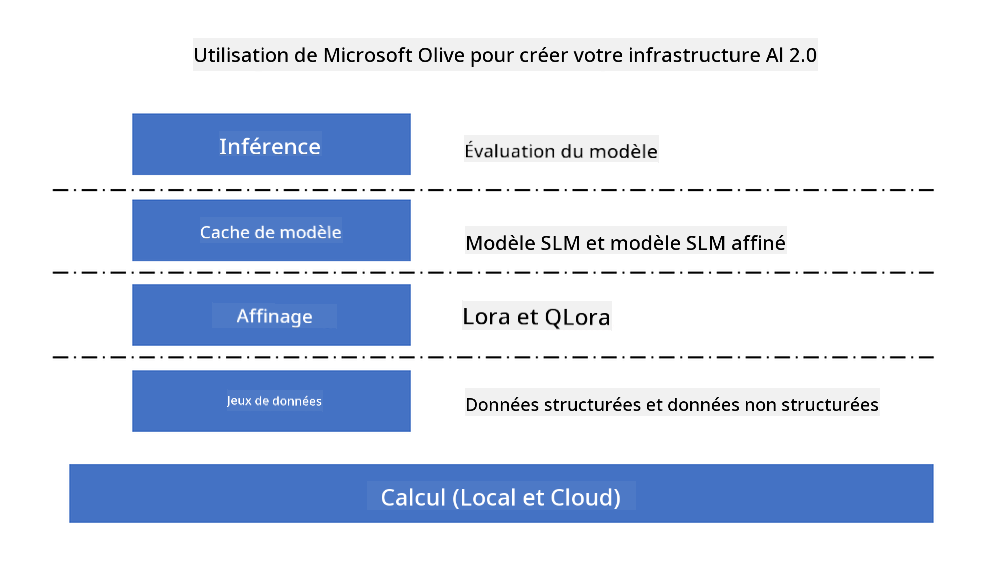
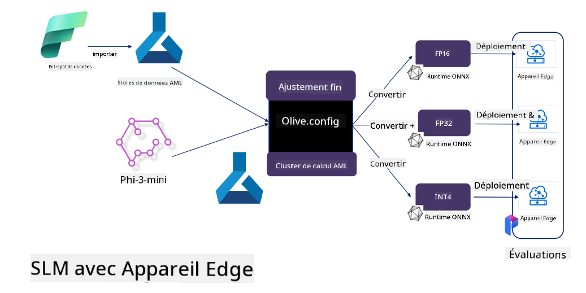

<!--
CO_OP_TRANSLATOR_METADATA:
{
  "original_hash": "5764be88ad2eb4f341e742eb8f14fab1",
  "translation_date": "2025-03-27T14:02:55+00:00",
  "source_file": "md\\03.FineTuning\\FineTuning_MicrosoftOlive.md",
  "language_code": "fr"
}
-->
# **Ajustement de Phi-3 avec Microsoft Olive**

[Olive](https://github.com/microsoft/OLive?WT.mc_id=aiml-138114-kinfeylo) est un outil d'optimisation de modèles conscient du matériel, facile à utiliser, qui regroupe des techniques de pointe dans les domaines de la compression, de l'optimisation et de la compilation des modèles.

Il est conçu pour simplifier le processus d'optimisation des modèles d'apprentissage automatique, en garantissant une utilisation efficace des architectures matérielles spécifiques.

Que vous travailliez sur des applications basées sur le cloud ou sur des appareils en périphérie, Olive vous permet d'optimiser vos modèles de manière simple et efficace.

## Principales fonctionnalités :
- Olive regroupe et automatise les techniques d'optimisation pour des cibles matérielles spécifiques.
- Aucune technique d'optimisation unique ne convient à tous les scénarios, c'est pourquoi Olive permet une extensibilité en permettant aux experts du secteur d'intégrer leurs innovations en matière d'optimisation.

## Réduction de l'effort d'ingénierie :
- Les développeurs doivent souvent apprendre et utiliser plusieurs chaînes d'outils spécifiques aux fournisseurs de matériel pour préparer et optimiser les modèles entraînés en vue de leur déploiement.
- Olive simplifie cette expérience en automatisant les techniques d'optimisation pour le matériel souhaité.

## Solution d'optimisation E2E prête à l'emploi :

En combinant et ajustant des techniques intégrées, Olive offre une solution unifiée pour une optimisation de bout en bout.
Elle prend en compte des contraintes comme la précision et la latence lors de l'optimisation des modèles.

## Utilisation de Microsoft Olive pour l'ajustement

Microsoft Olive est un outil d'optimisation de modèles open source très facile à utiliser, qui couvre à la fois l'ajustement et l'inférence dans le domaine de l'intelligence artificielle générative. Il ne nécessite qu'une configuration simple et, combiné à l'utilisation de petits modèles linguistiques open source et d'environnements d'exécution associés (AzureML / GPU local, CPU, DirectML), il permet de réaliser l'ajustement ou l'inférence du modèle via une optimisation automatique, et de trouver le meilleur modèle à déployer dans le cloud ou sur des appareils en périphérie. Cela permet aux entreprises de construire leurs propres modèles verticaux sectoriels sur site et dans le cloud.



## Ajustement de Phi-3 avec Microsoft Olive 



## Exemple de code et d'utilisation de Phi-3 Olive
Dans cet exemple, vous utiliserez Olive pour :

- Ajuster un adaptateur LoRA afin de classifier des phrases en Tristesse, Joie, Peur, Surprise.
- Fusionner les poids de l'adaptateur dans le modèle de base.
- Optimiser et quantifier le modèle en int4.

[Exemple de code](../../code/03.Finetuning/olive-ort-example/README.md)

### Installation de Microsoft Olive

L'installation de Microsoft Olive est très simple et peut être réalisée pour CPU, GPU, DirectML et Azure ML.

```bash
pip install olive-ai
```

Si vous souhaitez exécuter un modèle ONNX avec un CPU, vous pouvez utiliser

```bash
pip install olive-ai[cpu]
```

Si vous souhaitez exécuter un modèle ONNX avec un GPU, vous pouvez utiliser

```python
pip install olive-ai[gpu]
```

Si vous souhaitez utiliser Azure ML, utilisez

```python
pip install git+https://github.com/microsoft/Olive#egg=olive-ai[azureml]
```

**Remarque**
Exigence système : Ubuntu 20.04 / 22.04 

### **Config.json de Microsoft Olive**

Après l'installation, vous pouvez configurer différents paramètres spécifiques au modèle via le fichier de configuration, y compris les données, le calcul, l'entraînement, le déploiement et la génération de modèles.

**1. Données**

Sur Microsoft Olive, l'entraînement sur des données locales et sur des données cloud est pris en charge, et peut être configuré dans les paramètres.

*Paramètres pour les données locales*

Vous pouvez simplement configurer l'ensemble de données à entraîner pour l'ajustement, généralement au format json, et l'adapter avec le modèle de données. Cela doit être ajusté en fonction des exigences du modèle (par exemple, adapté au format requis par Microsoft Phi-3-mini. Si vous avez d'autres modèles, veuillez vous référer aux formats d'ajustement requis par ces modèles).

```json

    "data_configs": [
        {
            "name": "dataset_default_train",
            "type": "HuggingfaceContainer",
            "load_dataset_config": {
                "params": {
                    "data_name": "json", 
                    "data_files":"dataset/dataset-classification.json",
                    "split": "train"
                }
            },
            "pre_process_data_config": {
                "params": {
                    "dataset_type": "corpus",
                    "text_cols": [
                            "phrase",
                            "tone"
                    ],
                    "text_template": "### Text: {phrase}\n### The tone is:\n{tone}",
                    "corpus_strategy": "join",
                    "source_max_len": 2048,
                    "pad_to_max_len": false,
                    "use_attention_mask": false
                }
            }
        }
    ],
```

**Paramètres pour les sources de données cloud**

En reliant le datastore d'Azure AI Studio / Azure Machine Learning Service, vous pouvez choisir d'introduire différentes sources de données dans Azure AI Studio / Azure Machine Learning Service via Microsoft Fabric et Azure Data pour soutenir l'ajustement des données.

```json

    "data_configs": [
        {
            "name": "dataset_default_train",
            "type": "HuggingfaceContainer",
            "load_dataset_config": {
                "params": {
                    "data_name": "json", 
                    "data_files": {
                        "type": "azureml_datastore",
                        "config": {
                            "azureml_client": {
                                "subscription_id": "Your Azure Subscrition ID",
                                "resource_group": "Your Azure Resource Group",
                                "workspace_name": "Your Azure ML Workspaces name"
                            },
                            "datastore_name": "workspaceblobstore",
                            "relative_path": "Your train_data.json Azure ML Location"
                        }
                    },
                    "split": "train"
                }
            },
            "pre_process_data_config": {
                "params": {
                    "dataset_type": "corpus",
                    "text_cols": [
                            "Question",
                            "Best Answer"
                    ],
                    "text_template": "<|user|>\n{Question}<|end|>\n<|assistant|>\n{Best Answer}\n<|end|>",
                    "corpus_strategy": "join",
                    "source_max_len": 2048,
                    "pad_to_max_len": false,
                    "use_attention_mask": false
                }
            }
        }
    ],
    
```

**2. Configuration de calcul**

Si vous devez travailler localement, vous pouvez directement utiliser les ressources de données locales. Si vous devez utiliser les ressources d'Azure AI Studio / Azure Machine Learning Service, vous devez configurer les paramètres Azure pertinents, comme le nom de la puissance de calcul, etc.

```json

    "systems": {
        "aml": {
            "type": "AzureML",
            "config": {
                "accelerators": ["gpu"],
                "hf_token": true,
                "aml_compute": "Your Azure AI Studio / Azure Machine Learning Service Compute Name",
                "aml_docker_config": {
                    "base_image": "Your Azure AI Studio / Azure Machine Learning Service docker",
                    "conda_file_path": "conda.yaml"
                }
            }
        },
        "azure_arc": {
            "type": "AzureML",
            "config": {
                "accelerators": ["gpu"],
                "aml_compute": "Your Azure AI Studio / Azure Machine Learning Service Compute Name",
                "aml_docker_config": {
                    "base_image": "Your Azure AI Studio / Azure Machine Learning Service docker",
                    "conda_file_path": "conda.yaml"
                }
            }
        }
    },
```

***Remarque***

Comme cela s'exécute via un conteneur sur Azure AI Studio / Azure Machine Learning Service, l'environnement requis doit être configuré. Cela est configuré dans l'environnement conda.yaml.

```yaml

name: project_environment
channels:
  - defaults
dependencies:
  - python=3.8.13
  - pip=22.3.1
  - pip:
      - einops
      - accelerate
      - azure-keyvault-secrets
      - azure-identity
      - bitsandbytes
      - datasets
      - huggingface_hub
      - peft
      - scipy
      - sentencepiece
      - torch>=2.2.0
      - transformers
      - git+https://github.com/microsoft/Olive@jiapli/mlflow_loading_fix#egg=olive-ai[gpu]
      - --extra-index-url https://aiinfra.pkgs.visualstudio.com/PublicPackages/_packaging/ORT-Nightly/pypi/simple/ 
      - ort-nightly-gpu==1.18.0.dev20240307004
      - --extra-index-url https://aiinfra.pkgs.visualstudio.com/PublicPackages/_packaging/onnxruntime-genai/pypi/simple/
      - onnxruntime-genai-cuda

    

```

**3. Choisir votre SLM**

Vous pouvez utiliser directement le modèle de Hugging Face, ou le combiner avec le catalogue de modèles d'Azure AI Studio / Azure Machine Learning pour sélectionner le modèle à utiliser. Dans l'exemple de code ci-dessous, nous utiliserons Microsoft Phi-3-mini comme exemple.

Si vous avez le modèle localement, vous pouvez utiliser cette méthode

```json

    "input_model":{
        "type": "PyTorchModel",
        "config": {
            "hf_config": {
                "model_name": "model-cache/microsoft/phi-3-mini",
                "task": "text-generation",
                "model_loading_args": {
                    "trust_remote_code": true
                }
            }
        }
    },
```

Si vous souhaitez utiliser un modèle depuis Azure AI Studio / Azure Machine Learning Service, vous pouvez utiliser cette méthode

```json

    "input_model":{
        "type": "PyTorchModel",
        "config": {
            "model_path": {
                "type": "azureml_registry_model",
                "config": {
                    "name": "microsoft/Phi-3-mini-4k-instruct",
                    "registry_name": "azureml-msr",
                    "version": "11"
                }
            },
             "model_file_format": "PyTorch.MLflow",
             "hf_config": {
                "model_name": "microsoft/Phi-3-mini-4k-instruct",
                "task": "text-generation",
                "from_pretrained_args": {
                    "trust_remote_code": true
                }
            }
        }
    },
```

**Remarque :**
Nous devons intégrer Azure AI Studio / Azure Machine Learning Service, donc lors de la configuration du modèle, veuillez vous référer au numéro de version et aux noms associés.

Tous les modèles sur Azure doivent être configurés en PyTorch.MLflow.

Vous devez avoir un compte Hugging Face et lier la clé à la valeur clé d'Azure AI Studio / Azure Machine Learning.

**4. Algorithme**

Microsoft Olive encapsule très bien les algorithmes d'ajustement Lora et QLora. Vous n'avez qu'à configurer certains paramètres pertinents. Ici, je prends QLora comme exemple.

```json
        "lora": {
            "type": "LoRA",
            "config": {
                "target_modules": [
                    "o_proj",
                    "qkv_proj"
                ],
                "double_quant": true,
                "lora_r": 64,
                "lora_alpha": 64,
                "lora_dropout": 0.1,
                "train_data_config": "dataset_default_train",
                "eval_dataset_size": 0.3,
                "training_args": {
                    "seed": 0,
                    "data_seed": 42,
                    "per_device_train_batch_size": 1,
                    "per_device_eval_batch_size": 1,
                    "gradient_accumulation_steps": 4,
                    "gradient_checkpointing": false,
                    "learning_rate": 0.0001,
                    "num_train_epochs": 3,
                    "max_steps": 10,
                    "logging_steps": 10,
                    "evaluation_strategy": "steps",
                    "eval_steps": 187,
                    "group_by_length": true,
                    "adam_beta2": 0.999,
                    "max_grad_norm": 0.3
                }
            }
        },
```

Si vous souhaitez effectuer une conversion de quantification, la branche principale de Microsoft Olive prend déjà en charge la méthode onnxruntime-genai. Vous pouvez la configurer selon vos besoins :

1. Fusionner les poids de l'adaptateur dans le modèle de base.
2. Convertir le modèle en modèle ONNX avec la précision requise via ModelBuilder.

Par exemple, pour convertir en INT4 quantifié :

```json

        "merge_adapter_weights": {
            "type": "MergeAdapterWeights"
        },
        "builder": {
            "type": "ModelBuilder",
            "config": {
                "precision": "int4"
            }
        }
```

**Remarque** 
- Si vous utilisez QLoRA, la conversion de quantification avec ONNXRuntime-genai n'est pas encore prise en charge.

- Il est important de souligner que vous pouvez configurer les étapes ci-dessus selon vos besoins. Il n'est pas nécessaire de tout configurer. Selon vos besoins, vous pouvez directement utiliser les étapes de l'algorithme sans ajustement. Enfin, vous devez configurer les moteurs pertinents.

```json

    "engine": {
        "log_severity_level": 0,
        "host": "aml",
        "target": "aml",
        "search_strategy": false,
        "execution_providers": ["CUDAExecutionProvider"],
        "cache_dir": "../model-cache/models/phi3-finetuned/cache",
        "output_dir" : "../model-cache/models/phi3-finetuned"
    }
```

**5. Ajustement terminé**

Dans la ligne de commande, exécutez dans le répertoire de olive-config.json :

```bash
olive run --config olive-config.json  
```

**Avertissement** :  
Ce document a été traduit à l'aide du service de traduction automatique [Co-op Translator](https://github.com/Azure/co-op-translator). Bien que nous fassions de notre mieux pour garantir l'exactitude, veuillez noter que les traductions automatisées peuvent contenir des erreurs ou des inexactitudes. Le document original dans sa langue d'origine doit être considéré comme la source faisant autorité. Pour des informations critiques, il est recommandé de recourir à une traduction humaine professionnelle. Nous déclinons toute responsabilité en cas de malentendus ou d'interprétations erronées résultant de l'utilisation de cette traduction.