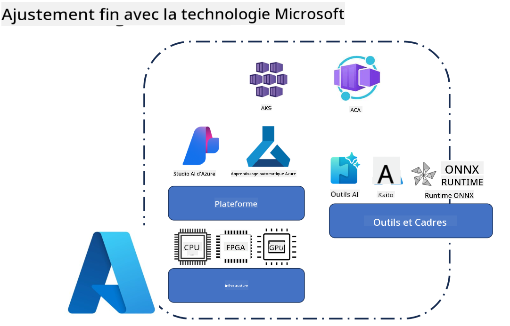
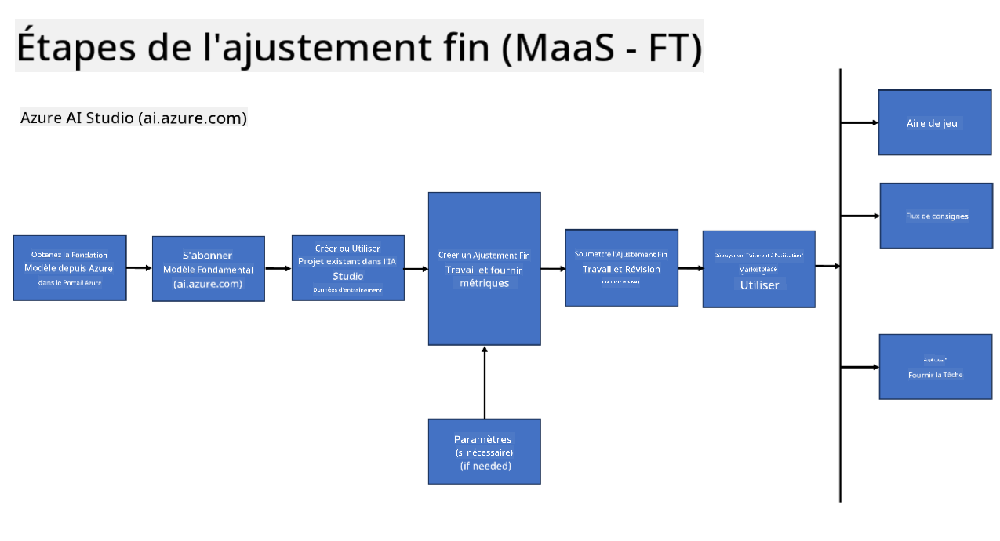
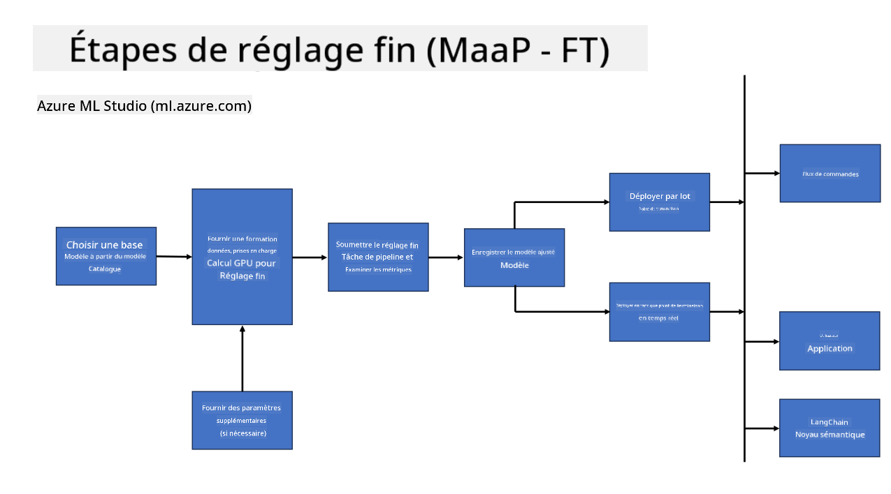
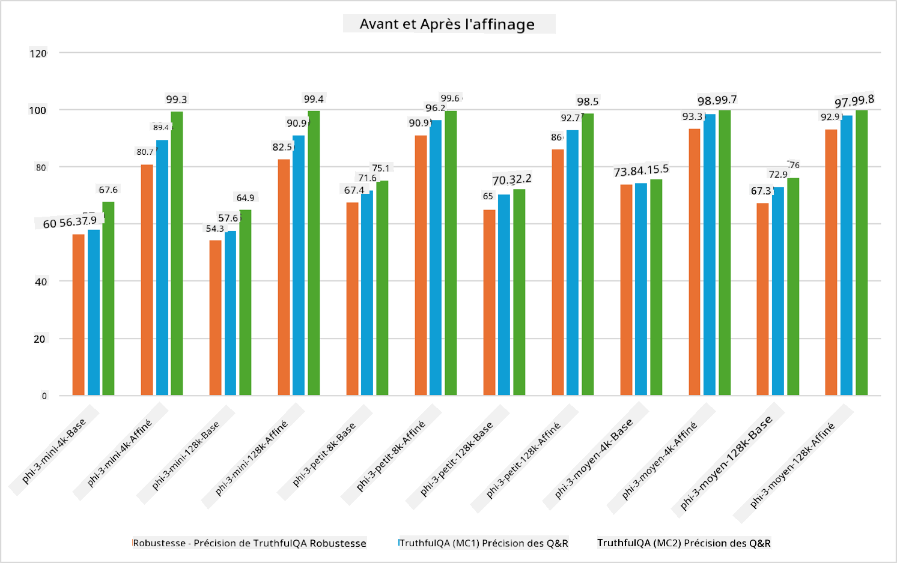

<!--
CO_OP_TRANSLATOR_METADATA:
{
  "original_hash": "cb5648935f63edc17e95ce38f23adc32",
  "translation_date": "2025-03-27T15:12:00+00:00",
  "source_file": "md\\03.FineTuning\\FineTuning_Scenarios.md",
  "language_code": "fr"
}
-->
## Scénarios de Fine Tuning

**Plateforme** Cela inclut diverses technologies telles que Azure AI Foundry, Azure Machine Learning, AI Tools, Kaito, et ONNX Runtime.

**Infrastructure** Cela comprend le CPU et le FPGA, qui sont essentiels pour le processus de fine-tuning. Voici les icônes associées à chacune de ces technologies.

**Outils et Framework** Cela inclut ONNX Runtime et ONNX Runtime. Voici les icônes associées à chacune de ces technologies.  
[Insérer les icônes pour ONNX Runtime et ONNX Runtime]

Le processus de fine-tuning avec les technologies Microsoft implique divers composants et outils. En comprenant et en utilisant ces technologies, nous pouvons affiner efficacement nos applications et créer de meilleures solutions.

## Modèle en tant que Service

Affinez le modèle en utilisant un fine-tuning hébergé, sans avoir besoin de créer et de gérer des ressources de calcul.

Le fine-tuning sans serveur est disponible pour les modèles Phi-3-mini et Phi-3-medium, permettant aux développeurs de personnaliser rapidement et facilement les modèles pour des scénarios cloud et edge sans avoir à gérer des ressources de calcul. Nous avons également annoncé que Phi-3-small est désormais disponible via notre offre Models-as-a-Service, permettant aux développeurs de commencer rapidement et facilement le développement d'IA sans avoir à gérer l'infrastructure sous-jacente.

## Modèle en tant que Plateforme

Les utilisateurs gèrent leurs propres ressources de calcul pour affiner leurs modèles.

[Exemple de Fine Tuning](https://github.com/Azure/azureml-examples/blob/main/sdk/python/foundation-models/system/finetune/chat-completion/chat-completion.ipynb)

## Scénarios de Fine Tuning

| | | | | | | |
|-|-|-|-|-|-|-|
|Scénario|LoRA|QLoRA|PEFT|DeepSpeed|ZeRO|DORA|
|Adapter des LLM pré-entraînés à des tâches ou domaines spécifiques|Oui|Oui|Oui|Oui|Oui|Oui|
|Fine-tuning pour des tâches NLP telles que la classification de texte, la reconnaissance d'entités nommées et la traduction automatique|Oui|Oui|Oui|Oui|Oui|Oui|
|Fine-tuning pour des tâches de QA|Oui|Oui|Oui|Oui|Oui|Oui|
|Fine-tuning pour générer des réponses humaines dans des chatbots|Oui|Oui|Oui|Oui|Oui|Oui|
|Fine-tuning pour générer de la musique, de l'art ou d'autres formes de créativité|Oui|Oui|Oui|Oui|Oui|Oui|
|Réduction des coûts computationnels et financiers|Oui|Oui|Non|Oui|Oui|Non|
|Réduction de l'utilisation de la mémoire|Non|Oui|Non|Oui|Oui|Oui|
|Utilisation de moins de paramètres pour un fine-tuning efficace|Non|Oui|Oui|Non|Non|Oui|
|Forme de parallélisme de données efficace en mémoire, donnant accès à la mémoire GPU agrégée de tous les dispositifs GPU disponibles|Non|Non|Non|Oui|Oui|Oui|

## Exemples de Performances de Fine Tuning

**Avertissement** :  
Ce document a été traduit à l'aide du service de traduction automatisée [Co-op Translator](https://github.com/Azure/co-op-translator). Bien que nous nous efforcions de garantir l'exactitude, veuillez noter que les traductions automatisées peuvent contenir des erreurs ou des inexactitudes. Le document original dans sa langue d'origine doit être considéré comme la source faisant autorité. Pour des informations critiques, il est recommandé de recourir à une traduction humaine professionnelle. Nous déclinons toute responsabilité en cas de malentendus ou d'interprétations erronées résultant de l'utilisation de cette traduction.