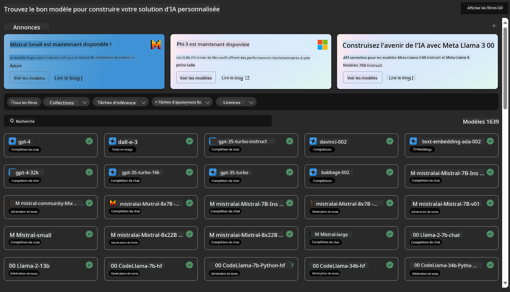
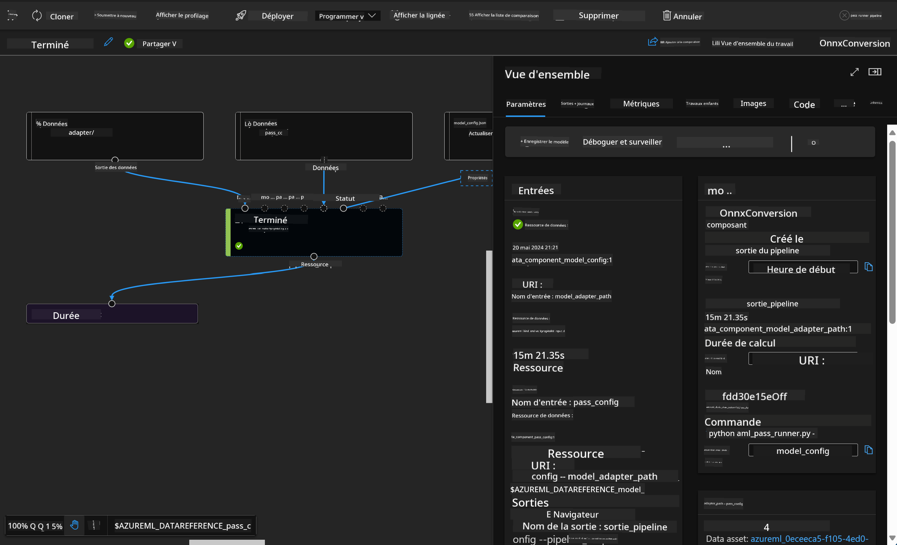

<!--
CO_OP_TRANSLATOR_METADATA:
{
  "original_hash": "7fe541373802e33568e94e13226d463c",
  "translation_date": "2025-03-27T15:43:25+00:00",
  "source_file": "md\\03.FineTuning\\Introduce_AzureML.md",
  "language_code": "fr"
}
-->
# **Présentation du service Azure Machine Learning**

[Azure Machine Learning](https://ml.azure.com?WT.mc_id=aiml-138114-kinfeylo) est un service cloud conçu pour accélérer et gérer le cycle de vie des projets de machine learning (ML).

Les professionnels du ML, les data scientists et les ingénieurs peuvent l'utiliser dans leurs workflows quotidiens pour :

- Entraîner et déployer des modèles.
- Gérer les opérations de machine learning (MLOps).
- Vous pouvez créer un modèle dans Azure Machine Learning ou utiliser un modèle construit sur une plateforme open source comme PyTorch, TensorFlow ou scikit-learn.
- Les outils MLOps vous aident à surveiller, réentraîner et redéployer des modèles.

## À qui s'adresse Azure Machine Learning ?

**Data Scientists et ingénieurs ML**

Ils peuvent utiliser des outils pour accélérer et automatiser leurs workflows quotidiens.  
Azure ML propose des fonctionnalités liées à l'équité, l'explicabilité, le suivi et l'auditabilité.  

**Développeurs d'applications**

Ils peuvent intégrer des modèles dans des applications ou des services de manière fluide.

**Développeurs de plateformes**

Ils ont accès à un ensemble robuste d'outils soutenus par des API durables d'Azure Resource Manager.  
Ces outils permettent de construire des outils avancés pour le ML.

**Entreprises**

En travaillant dans le cloud Microsoft Azure, les entreprises bénéficient d'une sécurité familière et d'un contrôle d'accès basé sur les rôles.  
Configurez des projets pour contrôler l'accès aux données protégées et aux opérations spécifiques.

## Productivité pour toute l'équipe

Les projets de ML nécessitent souvent une équipe aux compétences variées pour les construire et les maintenir.

Azure ML fournit des outils permettant de :
- Collaborer avec votre équipe via des notebooks partagés, des ressources de calcul, des calculs sans serveur, des données et des environnements.
- Développer des modèles avec des fonctionnalités d'équité, d'explicabilité, de suivi et d'auditabilité pour répondre aux exigences de traçabilité et de conformité.
- Déployer rapidement et facilement des modèles ML à grande échelle et les gérer efficacement avec MLOps.
- Exécuter des charges de travail de machine learning partout avec une gouvernance, une sécurité et une conformité intégrées.

## Outils de plateforme compatibles

Tout membre d'une équipe ML peut utiliser ses outils préférés pour accomplir son travail.  
Que vous effectuiez des expériences rapides, un réglage d'hyperparamètres, construisiez des pipelines ou gériez des inférences, vous pouvez utiliser des interfaces familières, notamment :
- Azure Machine Learning Studio
- Python SDK (v2)
- Azure CLI (v2)
- Azure Resource Manager REST APIs

Au fur et à mesure que vous affinez les modèles et collaborez tout au long du cycle de développement, vous pouvez partager et trouver des actifs, des ressources et des métriques dans l'interface utilisateur d'Azure Machine Learning Studio.

## **LLM/SLM dans Azure ML**

Azure ML a ajouté de nombreuses fonctionnalités liées aux LLM/SLM, combinant LLMOps et SLMOps pour créer une plateforme technologique d'intelligence artificielle générative à l'échelle de l'entreprise.

### **Catalogue de modèles**

Les utilisateurs en entreprise peuvent déployer différents modèles en fonction de divers scénarios métier via le Catalogue de modèles et fournir des services sous forme de Model as Service pour permettre aux développeurs ou utilisateurs d'entreprise d'y accéder.

Le Catalogue de modèles dans Azure Machine Learning Studio est le centre où découvrir et utiliser une large gamme de modèles pour créer des applications d'IA générative.  
Le catalogue de modèles propose des centaines de modèles provenant de divers fournisseurs tels que le service Azure OpenAI, Mistral, Meta, Cohere, Nvidia, Hugging Face, y compris des modèles entraînés par Microsoft.  
Les modèles provenant de fournisseurs autres que Microsoft sont des Produits Non-Microsoft, tels que définis dans les Conditions des Produits Microsoft, et soumis aux termes fournis avec le modèle.

### **Pipeline de tâches**

Le cœur d'un pipeline de machine learning est de diviser une tâche complète de machine learning en un workflow en plusieurs étapes.  
Chaque étape est un composant gérable qui peut être développé, optimisé, configuré et automatisé individuellement.  
Les étapes sont connectées par des interfaces bien définies.  
Le service de pipeline Azure Machine Learning orchestre automatiquement toutes les dépendances entre les étapes du pipeline.

Lors du fine-tuning des SLM / LLM, nous pouvons gérer nos données, processus d'entraînement et de génération via Pipeline.

### **Prompt flow**

#### Avantages de l'utilisation de Azure Machine Learning Prompt Flow

Azure Machine Learning Prompt Flow offre une gamme d'avantages qui aident les utilisateurs à passer de l'idéation à l'expérimentation, puis à des applications prêtes pour la production basées sur des LLM :

**Agilité dans l'ingénierie des prompts**

- Expérience interactive d'édition : Azure Machine Learning Prompt Flow fournit une représentation visuelle de la structure du flow, permettant aux utilisateurs de comprendre et naviguer facilement dans leurs projets. Il offre également une expérience de codage semblable à celle des notebooks pour un développement et un débogage efficaces des flows.
- Variantes pour le réglage des prompts : Les utilisateurs peuvent créer et comparer plusieurs variantes de prompts, facilitant un processus de raffinement itératif.
- Évaluation : Les flows d'évaluation intégrés permettent aux utilisateurs d'évaluer la qualité et l'efficacité de leurs prompts et flows.
- Ressources complètes : Azure Machine Learning Prompt Flow inclut une bibliothèque d'outils intégrés, d'exemples et de modèles qui servent de point de départ pour le développement, inspirant la créativité et accélérant le processus.

**Prêt pour l'entreprise dans les applications basées sur des LLM**

- Collaboration : Azure Machine Learning Prompt Flow prend en charge la collaboration en équipe, permettant à plusieurs utilisateurs de travailler ensemble sur des projets d'ingénierie de prompts, de partager leurs connaissances et de maintenir le contrôle des versions.
- Plateforme tout-en-un : Azure Machine Learning Prompt Flow simplifie l'ensemble du processus d'ingénierie des prompts, du développement et de l'évaluation au déploiement et à la surveillance. Les utilisateurs peuvent facilement déployer leurs flows en tant qu'endpoints Azure Machine Learning et surveiller leurs performances en temps réel, garantissant une opération optimale et une amélioration continue.
- Solutions prêtes pour l'entreprise dans Azure Machine Learning : Prompt Flow exploite les solutions robustes d'Azure Machine Learning prêtes pour l'entreprise, fournissant une base sécurisée, évolutive et fiable pour le développement, l'expérimentation et le déploiement des flows.

Avec Azure Machine Learning Prompt Flow, les utilisateurs peuvent exploiter leur agilité dans l'ingénierie des prompts, collaborer efficacement et tirer parti de solutions de niveau entreprise pour réussir le développement et le déploiement d'applications basées sur des LLM.

En combinant la puissance de calcul, les données et les différents composants d'Azure ML, les développeurs en entreprise peuvent facilement créer leurs propres applications d'intelligence artificielle.

**Avertissement** :  
Ce document a été traduit à l'aide du service de traduction automatique [Co-op Translator](https://github.com/Azure/co-op-translator). Bien que nous nous efforcions d'assurer l'exactitude, veuillez noter que les traductions automatisées peuvent contenir des erreurs ou des imprécisions. Le document original dans sa langue d'origine doit être considéré comme la source faisant autorité. Pour des informations critiques, une traduction professionnelle réalisée par un humain est recommandée. Nous ne sommes pas responsables des malentendus ou des interprétations erronées résultant de l'utilisation de cette traduction.