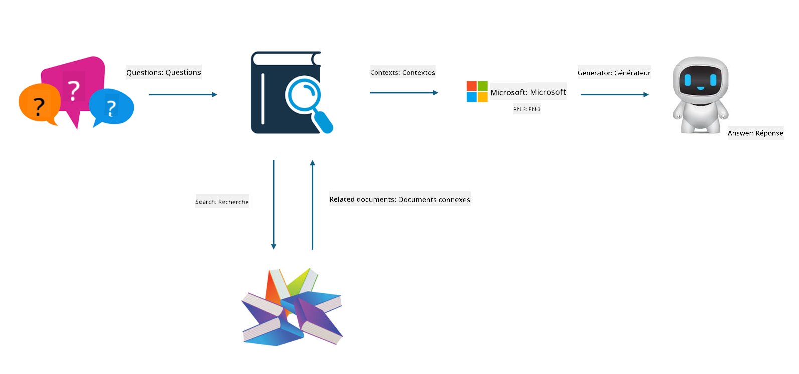
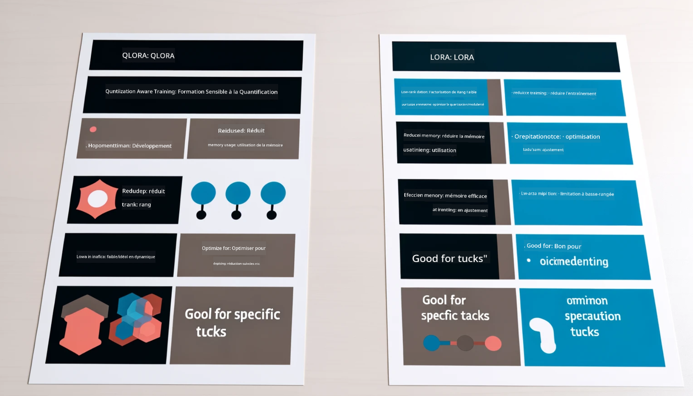

<!--
CO_OP_TRANSLATOR_METADATA:
{
  "original_hash": "743d7e9cb9c4e8ea642d77bee657a7fa",
  "translation_date": "2025-03-27T15:57:51+00:00",
  "source_file": "md\\03.FineTuning\\LetPhi3gotoIndustriy.md",
  "language_code": "fr"
}
-->
# **Faire de Phi-3 un expert de l'industrie**

Pour intégrer le modèle Phi-3 dans une industrie, il est nécessaire d'ajouter des données spécifiques à l'industrie au modèle Phi-3. Deux options s'offrent à nous : RAG (Retrieval Augmented Generation) et Fine Tuning.

## **RAG vs Fine-Tuning**

### **Retrieval Augmented Generation**

RAG combine la récupération de données et la génération de texte. Les données structurées et non structurées de l'entreprise sont stockées dans une base de données vectorielle. Lors d'une recherche de contenu pertinent, un résumé et un contenu appropriés sont extraits pour former un contexte, et les capacités de complétion de texte des modèles LLM/SLM sont utilisées pour générer du contenu.

### **Fine-tuning**

Le Fine-tuning repose sur l'amélioration d'un modèle existant. Il n'est pas nécessaire de repartir de l'algorithme du modèle, mais il faut accumuler continuellement des données. Si vous souhaitez une terminologie et une expression linguistique plus précises dans des applications industrielles, le Fine-tuning est un meilleur choix. Cependant, si vos données changent fréquemment, le Fine-tuning peut devenir complexe.

### **Comment choisir**

1. Si notre réponse nécessite l'intégration de données externes, RAG est le meilleur choix.

2. Si vous avez besoin de produire un savoir industriel stable et précis, le Fine-tuning est une bonne option. RAG privilégie le contenu pertinent, mais il peut parfois manquer de nuances spécialisées.

3. Le Fine-tuning nécessite un ensemble de données de haute qualité, et si les données concernent un domaine restreint, l'impact sera limité. RAG est plus flexible.

4. Le Fine-tuning est une "boîte noire", une sorte de métaphysique, et son mécanisme interne est difficile à comprendre. En revanche, RAG facilite la traçabilité des sources de données, permettant ainsi de corriger efficacement les hallucinations ou erreurs de contenu tout en offrant une meilleure transparence.

### **Scénarios**

1. Pour les industries verticales nécessitant un vocabulaire et des expressions professionnels spécifiques, ***le Fine-tuning*** est le meilleur choix.

2. Pour un système de questions-réponses impliquant la synthèse de différents points de connaissance, ***RAG*** est le meilleur choix.

3. Pour la combinaison d'un flux d'affaires automatisé, ***RAG + Fine-tuning*** est la meilleure option.

## **Comment utiliser RAG**

Une base de données vectorielle est une collection de données stockées sous forme mathématique. Les bases de données vectorielles facilitent la mémorisation des entrées précédentes par les modèles d'apprentissage automatique, permettant leur utilisation dans des cas comme la recherche, les recommandations et la génération de texte. Les données peuvent être identifiées en fonction de métriques de similarité plutôt que de correspondances exactes, permettant aux modèles informatiques de comprendre le contexte des données.

La base de données vectorielle est essentielle pour mettre en œuvre RAG. Nous pouvons convertir des données en stockage vectoriel à l'aide de modèles vectoriels tels que text-embedding-3, jina-ai-embedding, etc.

En savoir plus sur la création d'applications RAG [https://github.com/microsoft/Phi-3CookBook](https://github.com/microsoft/Phi-3CookBook?WT.mc_id=aiml-138114-kinfeylo)

## **Comment utiliser le Fine-tuning**

Les algorithmes couramment utilisés dans le Fine-tuning sont Lora et QLora. Comment choisir ?
- [En savoir plus avec cet exemple de notebook](../../../../code/04.Finetuning/Phi_3_Inference_Finetuning.ipynb)
- [Exemple de script Python pour le Fine-tuning](../../../../code/04.Finetuning/FineTrainingScript.py)

### **Lora et QLora**

LoRA (Low-Rank Adaptation) et QLoRA (Quantized Low-Rank Adaptation) sont des techniques utilisées pour ajuster des modèles de langage de grande taille (LLMs) via le Fine-tuning efficace en paramètres (PEFT). Les techniques PEFT sont conçues pour entraîner les modèles de manière plus efficace que les méthodes traditionnelles.  
LoRA est une technique de Fine-tuning autonome qui réduit l'empreinte mémoire en appliquant une approximation de faible rang à la matrice de mise à jour des poids. Elle offre des temps d'entraînement rapides tout en maintenant des performances proches de celles des méthodes de Fine-tuning traditionnelles.

QLoRA est une version étendue de LoRA qui intègre des techniques de quantification pour réduire encore davantage l'utilisation de la mémoire. QLoRA quantifie la précision des paramètres de poids dans le LLM pré-entraîné à une précision de 4 bits, ce qui est plus économe en mémoire que LoRA. Cependant, l'entraînement avec QLoRA est environ 30 % plus lent que celui avec LoRA en raison des étapes supplémentaires de quantification et de déquantification.

QLoRA utilise LoRA comme un complément pour corriger les erreurs introduites lors de la quantification. QLoRA permet le Fine-tuning de modèles massifs avec des milliards de paramètres sur des GPU relativement petits et accessibles. Par exemple, QLoRA peut affiner un modèle de 70 milliards de paramètres nécessitant 36 GPU avec seulement 2.

**Avertissement** :  
Ce document a été traduit à l'aide du service de traduction automatisée [Co-op Translator](https://github.com/Azure/co-op-translator). Bien que nous nous efforcions d'assurer l'exactitude, veuillez noter que les traductions automatisées peuvent contenir des erreurs ou des imprécisions. Le document original dans sa langue d'origine doit être considéré comme la source faisant autorité. Pour des informations critiques, il est recommandé de recourir à une traduction professionnelle réalisée par un humain. Nous ne sommes pas responsables des malentendus ou des interprétations erronées résultant de l'utilisation de cette traduction.