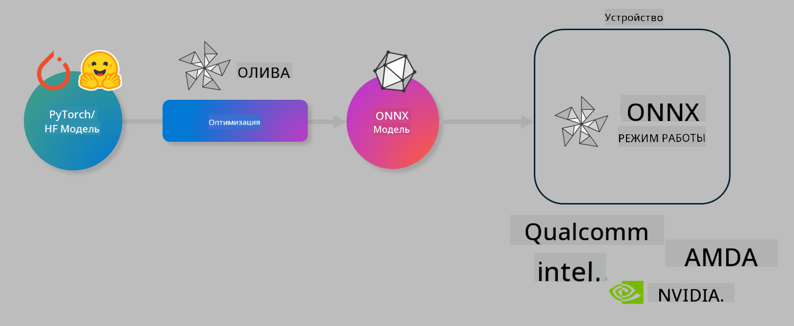

<!--
CO_OP_TRANSLATOR_METADATA:
{
  "original_hash": "6bbe47de3b974df7eea29dfeccf6032b",
  "translation_date": "2025-03-27T03:33:13+00:00",
  "source_file": "code\\03.Finetuning\\olive-lab\\readme.md",
  "language_code": "ru"
}
-->
# Лаборатория. Оптимизация моделей ИИ для локального инференса

## Введение

> [!IMPORTANT]
> Для выполнения этой лабораторной работы требуется **GPU Nvidia A10 или A100** с установленными драйверами и CUDA toolkit (версии 12+).

> [!NOTE]
> Это лабораторная работа длительностью **35 минут**, которая даст вам практическое введение в основные концепции оптимизации моделей для локального инференса с использованием OLIVE.

## Цели обучения

К концу этой лабораторной работы вы научитесь использовать OLIVE для:

- Квантизации модели ИИ с использованием метода AWQ.
- Тонкой настройки модели ИИ для конкретной задачи.
- Генерации адаптеров LoRA (тонко настроенной модели) для эффективного локального инференса на ONNX Runtime.

### Что такое Olive

Olive (*O*NNX *live*) — это инструмент для оптимизации моделей с интерфейсом командной строки, который позволяет развертывать модели для ONNX Runtime +++https://onnxruntime.ai+++ с высоким качеством и производительностью.



Входными данными для Olive обычно являются модели PyTorch или Hugging Face, а выходными — оптимизированные модели ONNX, которые выполняются на устройстве (целевая платформа), работающем на ONNX Runtime. Olive оптимизирует модель для AI-ускорителя целевой платформы (NPU, GPU, CPU), предоставленного такими производителями оборудования, как Qualcomm, AMD, Nvidia или Intel.

Olive выполняет *workflow* — упорядоченную последовательность задач оптимизации моделей, называемых *passes* (проходы). Примеры проходов: сжатие модели, захват графа, квантизация, оптимизация графа. Каждый проход имеет набор параметров, которые можно настроить для достижения наилучших метрик, например, точности и задержки, которые оцениваются соответствующим оценщиком. Olive использует стратегию поиска с алгоритмом автоматической настройки для последовательной оптимизации каждого прохода или группы проходов.

#### Преимущества Olive

- **Снижение затрат времени и усилий** за счет исключения ручных экспериментов методом проб и ошибок с различными техниками оптимизации графов, сжатия и квантизации. Определите свои требования к качеству и производительности, и Olive автоматически найдет для вас лучшую модель.
- **Более 40 встроенных компонентов оптимизации моделей**, охватывающих передовые техники квантизации, сжатия, оптимизации графов и тонкой настройки.
- **Простой интерфейс командной строки** для выполнения типовых задач оптимизации моделей. Например, `olive quantize`, `olive auto-opt`, `olive finetune`.
- Встроенная упаковка и развертывание моделей.
- Поддержка генерации моделей для **многосервисного LoRA**.
- Возможность создания workflows с использованием YAML/JSON для оркестрации задач оптимизации и развертывания моделей.
- Интеграция с **Hugging Face** и **Azure AI**.
- Встроенный механизм **кэширования** для **снижения затрат**.

## Инструкции к лабораторной работе

> [!NOTE]
> Убедитесь, что вы настроили ваш Azure AI Hub, проект и вычислительный ресурс A100, как описано в Лабораторной работе 1.

### Шаг 0: Подключение к вашему Azure AI Compute

Вы подключитесь к Azure AI Compute, используя удаленную функцию в **VS Code.**

1. Откройте настольное приложение **VS Code**:
1. Откройте **палитру команд** с помощью **Shift+Ctrl+P**.
1. В палитре команд найдите **AzureML - remote: Connect to compute instance in New Window**.
1. Следуйте инструкциям на экране для подключения к Compute. Это включает выбор вашей подписки Azure, группы ресурсов, проекта и имени вычислительного ресурса, которые вы настроили в Лабораторной работе 1.
1. После подключения к вашему узлу Azure ML Compute это будет отображено в **нижнем левом углу Visual Code** `><Azure ML: Compute Name`.

### Шаг 1: Клонирование репозитория

В VS Code откройте новый терминал с помощью **Ctrl+J** и клонируйте этот репозиторий:

В терминале вы увидите приглашение:

```
azureuser@computername:~/cloudfiles/code$ 
```
Клонируйте решение:

```bash
cd ~/localfiles
git clone https://github.com/microsoft/phi-3cookbook.git
```

### Шаг 2: Открытие папки в VS Code

Чтобы открыть VS Code в соответствующей папке, выполните следующую команду в терминале. Это откроет новое окно:

```bash
code phi-3cookbook/code/04.Finetuning/Olive-lab
```

Или вы можете открыть папку, выбрав **File** > **Open Folder**.

### Шаг 3: Установка зависимостей

Откройте окно терминала в VS Code на вашем узле Azure AI Compute (подсказка: **Ctrl+J**) и выполните следующие команды для установки зависимостей:

```bash
conda create -n olive-ai python=3.11 -y
conda activate olive-ai
pip install -r requirements.txt
az extension remove -n azure-cli-ml
az extension add -n ml
```

> [!NOTE]
> Установка всех зависимостей займет около ~5 минут.

В этой лабораторной работе вы будете загружать и выгружать модели в каталог моделей Azure AI. Чтобы получить доступ к каталогу моделей, вам нужно войти в Azure, используя:

```bash
az login
```

> [!NOTE]
> Во время входа вам будет предложено выбрать подписку. Убедитесь, что вы выбрали подписку, предоставленную для этой лабораторной работы.

### Шаг 4: Выполнение команд Olive

Откройте окно терминала в VS Code на вашем узле Azure AI Compute (подсказка: **Ctrl+J**) и убедитесь, что активирована среда `olive-ai` conda:

```bash
conda activate olive-ai
```

Далее выполните следующие команды Olive в командной строке.

1. **Изучение данных:** В этом примере вы будете настраивать модель Phi-3.5-Mini для ответов на вопросы, связанные с путешествиями. Код ниже отображает первые несколько записей набора данных в формате JSON lines:

    ```bash
    head data/data_sample_travel.jsonl
    ```
    
1. **Квантизация модели:** Перед обучением модели выполните её квантизацию с помощью следующей команды, которая использует технику под названием Active Aware Quantization (AWQ) +++https://arxiv.org/abs/2306.00978+++. AWQ квантизирует веса модели, учитывая активации, создаваемые во время инференса. Это позволяет учесть реальное распределение данных в активациях, что лучше сохраняет точность модели по сравнению с традиционными методами квантизации весов.

    ```bash
    olive quantize \
       --model_name_or_path microsoft/Phi-3.5-mini-instruct \
       --trust_remote_code \
       --algorithm awq \
       --output_path models/phi/awq \
       --log_level 1
    ```
    
    Процесс квантизации AWQ занимает около **8 минут** и **уменьшает размер модели с ~7.5 ГБ до ~2.5 ГБ**.

    В этой лабораторной работе мы показываем, как использовать модели из Hugging Face (например, `microsoft/Phi-3.5-mini-instruct`). However, Olive also allows you to input models from the Azure AI catalog by updating the `model_name_or_path` argument to an Azure AI asset ID (for example:  `azureml://registries/azureml/models/Phi-3.5-mini-instruct/versions/4`). 

1. **Train the model:** Next, the `olive finetune` для тонкой настройки модели. Выполнение квантизации *до* тонкой настройки вместо после обеспечивает лучшую точность, так как процесс тонкой настройки восстанавливает часть потерь от квантизации.

    ```bash
    olive finetune \
        --method lora \
        --model_name_or_path models/phi/awq \
        --data_files "data/data_sample_travel.jsonl" \
        --data_name "json" \
        --text_template "<|user|>\n{prompt}<|end|>\n<|assistant|>\n{response}<|end|>" \
        --max_steps 100 \
        --output_path ./models/phi/ft \
        --log_level 1
    ```
    
    Тонкая настройка занимает около **6 минут** (100 шагов).

1. **Оптимизация:** После настройки модели оптимизируйте её с помощью команды Olive `auto-opt` command, which will capture the ONNX graph and automatically perform a number of optimizations to improve the model performance for CPU by compressing the model and doing fusions. It should be noted, that you can also optimize for other devices such as NPU or GPU by just updating the `--device` and `--provider` — для целей этой лабораторной работы мы будем использовать CPU.

    ```bash
    olive auto-opt \
       --model_name_or_path models/phi/ft/model \
       --adapter_path models/phi/ft/adapter \
       --device cpu \
       --provider CPUExecutionProvider \
       --use_ort_genai \
       --output_path models/phi/onnx-ao \
       --log_level 1
    ```
    
    Оптимизация занимает около **5 минут**.

### Шаг 5: Быстрое тестирование инференса модели

Чтобы протестировать инференс модели, создайте в вашей папке Python-файл с именем **app.py** и скопируйте в него следующий код:

```python
import onnxruntime_genai as og
import numpy as np

print("loading model and adapters...", end="", flush=True)
model = og.Model("models/phi/onnx-ao/model")
adapters = og.Adapters(model)
adapters.load("models/phi/onnx-ao/model/adapter_weights.onnx_adapter", "travel")
print("DONE!")

tokenizer = og.Tokenizer(model)
tokenizer_stream = tokenizer.create_stream()

params = og.GeneratorParams(model)
params.set_search_options(max_length=100, past_present_share_buffer=False)
user_input = "what is the best thing to see in chicago"
params.input_ids = tokenizer.encode(f"<|user|>\n{user_input}<|end|>\n<|assistant|>\n")

generator = og.Generator(model, params)

generator.set_active_adapter(adapters, "travel")

print(f"{user_input}")

while not generator.is_done():
    generator.compute_logits()
    generator.generate_next_token()

    new_token = generator.get_next_tokens()[0]
    print(tokenizer_stream.decode(new_token), end='', flush=True)

print("\n")
```

Выполните код с помощью:

```bash
python app.py
```

### Шаг 6: Загрузка модели в Azure AI

Загрузка модели в репозиторий моделей Azure AI делает её доступной для других членов вашей команды разработки и обеспечивает контроль версий модели. Для загрузки модели выполните следующую команду:

> [!NOTE]
> Обновите значения `{}` placeholders with the name of your resource group and Azure AI Project Name. 

To find your resource group `` для имени группы ресурсов и проекта Azure AI, затем выполните следующую команду:

```
az ml workspace show
```

Или перейдите на +++ai.azure.com+++ и выберите **management center** > **project** > **overview**.

Обновите заполнители `{}` на имя вашей группы ресурсов и проекта Azure AI.

```bash
az ml model create \
    --name ft-for-travel \
    --version 1 \
    --path ./models/phi/onnx-ao \
    --resource-group {RESOURCE_GROUP_NAME} \
    --workspace-name {PROJECT_NAME}
```

После этого вы сможете увидеть загруженную модель и развернуть её по адресу https://ml.azure.com/model/list.

**Отказ от ответственности**:  
Этот документ был переведен с использованием сервиса автоматического перевода [Co-op Translator](https://github.com/Azure/co-op-translator). Несмотря на наши усилия обеспечить точность, автоматические переводы могут содержать ошибки или неточности. Оригинальный документ на его родном языке следует считать авторитетным источником. Для получения критически важной информации рекомендуется профессиональный перевод человеком. Мы не несем ответственности за недоразумения или неправильные интерпретации, возникающие в результате использования данного перевода.