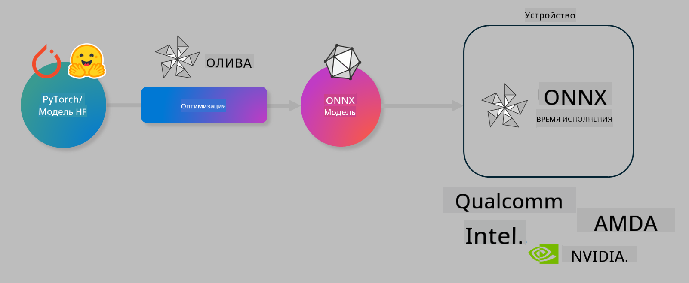

<!--
CO_OP_TRANSLATOR_METADATA:
{
  "original_hash": "6bbe47de3b974df7eea29dfeccf6032b",
  "translation_date": "2025-03-27T03:51:40+00:00",
  "source_file": "code\\04.Finetuning\\olive-lab\\readme.md",
  "language_code": "ru"
}
-->
# Лаборатория. Оптимизация моделей ИИ для выполнения на устройствах

## Введение

> [!IMPORTANT]
> Для выполнения этой лабораторной работы требуется **GPU Nvidia A10 или A100** с установленными драйверами и инструментарием CUDA (версия 12+).

> [!NOTE]
> Эта лабораторная работа рассчитана на **35 минут** и предоставит вам практическое введение в основные концепции оптимизации моделей для выполнения на устройствах с использованием OLIVE.

## Цели обучения

К концу этой лабораторной работы вы сможете использовать OLIVE для:

- Квантизации модели ИИ с использованием метода квантизации AWQ.
- Тонкой настройки модели ИИ для выполнения конкретной задачи.
- Генерации адаптеров LoRA (тонко настроенной модели) для эффективного выполнения на устройствах с использованием ONNX Runtime.

### Что такое Olive

Olive (*O*NNX *live*) — это набор инструментов для оптимизации моделей с интерфейсом CLI, который позволяет внедрять модели для ONNX runtime +++https://onnxruntime.ai+++ с высоким качеством и производительностью.



На вход Olive обычно подается модель PyTorch или Hugging Face, а на выходе получается оптимизированная модель ONNX, которая выполняется на устройстве (целевой платформе) с ONNX runtime. Olive оптимизирует модель для ускорителя ИИ целевой платформы (NPU, GPU, CPU), предоставленного производителем оборудования, таким как Qualcomm, AMD, Nvidia или Intel.

Olive выполняет *рабочий процесс*, который представляет собой упорядоченную последовательность отдельных задач оптимизации модели, называемых *passes*. Примеры задач: сжатие модели, захват графа, квантизация, оптимизация графа. Каждая задача имеет набор параметров, которые можно настроить для достижения лучших метрик, таких как точность и задержка, которые оцениваются соответствующим оценщиком. Olive использует стратегию поиска, применяя алгоритм для автоматической настройки каждой задачи по отдельности или группы задач вместе.

#### Преимущества Olive

- **Снижение трудностей и времени** на ручные эксперименты методом проб и ошибок с различными техниками оптимизации графа, сжатия и квантизации. Задайте свои ограничения по качеству и производительности, и Olive автоматически найдет для вас лучшую модель.
- **40+ встроенных компонентов для оптимизации моделей**, охватывающих передовые методы квантизации, сжатия, оптимизации графа и тонкой настройки.
- **Простой CLI** для выполнения стандартных задач оптимизации моделей, например, olive quantize, olive auto-opt, olive finetune.
- Встроенная упаковка и развертывание моделей.
- Поддержка генерации моделей для **Multi LoRA serving**.
- Конструирование рабочих процессов с использованием YAML/JSON для оркестрации задач оптимизации и развертывания моделей.
- Интеграция с **Hugging Face** и **Azure AI**.
- Встроенный механизм **кэширования** для **снижения затрат**.

## Инструкции к лабораторной работе
> [!NOTE]
> Убедитесь, что вы настроили свой Azure AI Hub и проект, а также подготовили вычислительный ресурс A100, как описано в Лабораторной работе 1.

### Шаг 0: Подключение к Azure AI Compute

Вы подключитесь к Azure AI Compute с использованием функции удаленного доступа в **VS Code.**

1. Откройте приложение **VS Code** на вашем компьютере:
1. Откройте **палитру команд** с помощью **Shift+Ctrl+P**.
1. В палитре команд найдите **AzureML - remote: Connect to compute instance in New Window**.
1. Следуйте инструкциям на экране, чтобы подключиться к вычислительному ресурсу. Это включает выбор вашей подписки Azure, группы ресурсов, проекта и имени вычислительного ресурса, которые вы настроили в Лабораторной работе 1.
1. После подключения к узлу Azure ML Compute информация об этом будет отображаться **в нижнем левом углу Visual Code** `><Azure ML: Compute Name`.

### Шаг 1: Клонирование репозитория

В VS Code откройте новый терминал с помощью **Ctrl+J** и клонируйте этот репозиторий:

В терминале вы увидите приглашение

```
azureuser@computername:~/cloudfiles/code$ 
```
Клонируйте решение

```bash
cd ~/localfiles
git clone https://github.com/microsoft/phi-3cookbook.git
```

### Шаг 2: Открытие папки в VS Code

Чтобы открыть VS Code в нужной папке, выполните следующую команду в терминале, которая откроет новое окно:

```bash
code phi-3cookbook/code/04.Finetuning/Olive-lab
```

Кроме того, вы можете открыть папку, выбрав **Файл** > **Открыть папку**.

### Шаг 3: Зависимости

Откройте окно терминала в VS Code на вашем вычислительном ресурсе Azure AI (подсказка: **Ctrl+J**) и выполните следующие команды для установки зависимостей:

```bash
conda create -n olive-ai python=3.11 -y
conda activate olive-ai
pip install -r requirements.txt
az extension remove -n azure-cli-ml
az extension add -n ml
```

> [!NOTE]
> Установка всех зависимостей займет около **5 минут**.

В этой лабораторной работе вы будете загружать и выгружать модели в каталог моделей Azure AI. Чтобы получить доступ к каталогу моделей, вам нужно войти в Azure, используя:

```bash
az login
```

> [!NOTE]
> Во время входа вам будет предложено выбрать подписку. Убедитесь, что вы выбрали подписку, предоставленную для этой лабораторной работы.

### Шаг 4: Выполнение команд Olive

Откройте окно терминала в VS Code на вашем вычислительном ресурсе Azure AI (подсказка: **Ctrl+J**) и убедитесь, что активирована среда `olive-ai` conda:

```bash
conda activate olive-ai
```

Затем выполните следующие команды Olive в командной строке.

1. **Исследование данных:** В этом примере вы будете тонко настраивать модель Phi-3.5-Mini, чтобы она специализировалась на ответах на вопросы, связанные с путешествиями. Код ниже отображает первые несколько записей набора данных в формате JSON lines:

    ```bash
    head data/data_sample_travel.jsonl
    ```
1. **Квантизация модели:** Перед обучением модели сначала выполните квантизацию с помощью следующей команды, которая использует технику, называемую Active Aware Quantization (AWQ) +++https://arxiv.org/abs/2306.00978+++. AWQ квантизирует веса модели, учитывая активации, создаваемые во время выполнения. Это означает, что процесс квантизации принимает во внимание фактическое распределение данных в активациях, что приводит к лучшему сохранению точности модели по сравнению с традиционными методами квантизации весов.

    ```bash
    olive quantize \
       --model_name_or_path microsoft/Phi-3.5-mini-instruct \
       --trust_remote_code \
       --algorithm awq \
       --output_path models/phi/awq \
       --log_level 1
    ```

    Квантизация AWQ занимает **около 8 минут**, что позволяет **уменьшить размер модели с ~7.5GB до ~2.5GB**.

    В этой лабораторной работе мы покажем, как вводить модели из Hugging Face (например: `microsoft/Phi-3.5-mini-instruct`). However, Olive also allows you to input models from the Azure AI catalog by updating the `model_name_or_path` argument to an Azure AI asset ID (for example:  `azureml://registries/azureml/models/Phi-3.5-mini-instruct/versions/4`). 

1. **Train the model:** Next, the `olive finetune` команда тонко настраивает квантизированную модель. Квантизация модели *до* тонкой настройки, а не после, дает лучшую точность, поскольку процесс тонкой настройки восстанавливает часть потерь от квантизации.

    ```bash
    olive finetune \
        --method lora \
        --model_name_or_path models/phi/awq \
        --data_files "data/data_sample_travel.jsonl" \
        --data_name "json" \
        --text_template "<|user|>\n{prompt}<|end|>\n<|assistant|>\n{response}<|end|>" \
        --max_steps 100 \
        --output_path ./models/phi/ft \
        --log_level 1
    ```

    Тонкая настройка занимает **около 6 минут** (100 шагов).

1. **Оптимизация:** После обучения модели вы оптимизируете ее с помощью команды Olive `auto-opt` command, which will capture the ONNX graph and automatically perform a number of optimizations to improve the model performance for CPU by compressing the model and doing fusions. It should be noted, that you can also optimize for other devices such as NPU or GPU by just updating the `--device` and `--provider` - но для целей этой лабораторной работы мы будем использовать CPU.

    ```bash
    olive auto-opt \
       --model_name_or_path models/phi/ft/model \
       --adapter_path models/phi/ft/adapter \
       --device cpu \
       --provider CPUExecutionProvider \
       --use_ort_genai \
       --output_path models/phi/onnx-ao \
       --log_level 1
    ```

    Оптимизация занимает **около 5 минут**.

### Шаг 5: Быстрое тестирование выполнения модели

Чтобы протестировать выполнение модели, создайте файл Python в вашей папке с именем **app.py** и скопируйте следующий код:

```python
import onnxruntime_genai as og
import numpy as np

print("loading model and adapters...", end="", flush=True)
model = og.Model("models/phi/onnx-ao/model")
adapters = og.Adapters(model)
adapters.load("models/phi/onnx-ao/model/adapter_weights.onnx_adapter", "travel")
print("DONE!")

tokenizer = og.Tokenizer(model)
tokenizer_stream = tokenizer.create_stream()

params = og.GeneratorParams(model)
params.set_search_options(max_length=100, past_present_share_buffer=False)
user_input = "what is the best thing to see in chicago"
params.input_ids = tokenizer.encode(f"<|user|>\n{user_input}<|end|>\n<|assistant|>\n")

generator = og.Generator(model, params)

generator.set_active_adapter(adapters, "travel")

print(f"{user_input}")

while not generator.is_done():
    generator.compute_logits()
    generator.generate_next_token()

    new_token = generator.get_next_tokens()[0]
    print(tokenizer_stream.decode(new_token), end='', flush=True)

print("\n")
```

Выполните код с помощью:

```bash
python app.py
```

### Шаг 6: Загрузка модели в Azure AI

Загрузка модели в репозиторий моделей Azure AI делает модель доступной для других членов вашей команды разработки и также обеспечивает управление версиями модели. Чтобы загрузить модель, выполните следующую команду:

> [!NOTE]
> Обновите `{}` placeholders with the name of your resource group and Azure AI Project Name. 

To find your resource group `"resourceGroup"и имя проекта Azure AI, выполните следующую команду 

```
az ml workspace show
```

Или перейдите на +++ai.azure.com+++ и выберите **центр управления** **проект** **обзор**.

Обновите `{}` заполнители именем вашей группы ресурсов и именем проекта Azure AI.

```bash
az ml model create \
    --name ft-for-travel \
    --version 1 \
    --path ./models/phi/onnx-ao \
    --resource-group {RESOURCE_GROUP_NAME} \
    --workspace-name {PROJECT_NAME}
```
Вы сможете увидеть загруженную модель и развернуть ее на https://ml.azure.com/model/list

**Отказ от ответственности**:  
Этот документ был переведен с использованием сервиса автоматического перевода [Co-op Translator](https://github.com/Azure/co-op-translator). Хотя мы стремимся к точности, пожалуйста, учитывайте, что автоматические переводы могут содержать ошибки или неточности. Оригинальный документ на его родном языке следует считать авторитетным источником. Для получения критически важной информации рекомендуется использовать профессиональный человеческий перевод. Мы не несем ответственности за любые недоразумения или неправильные интерпретации, возникающие в результате использования данного перевода.