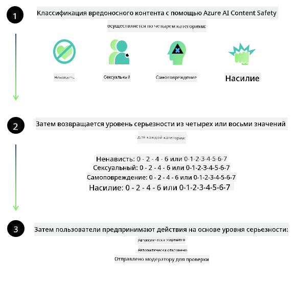
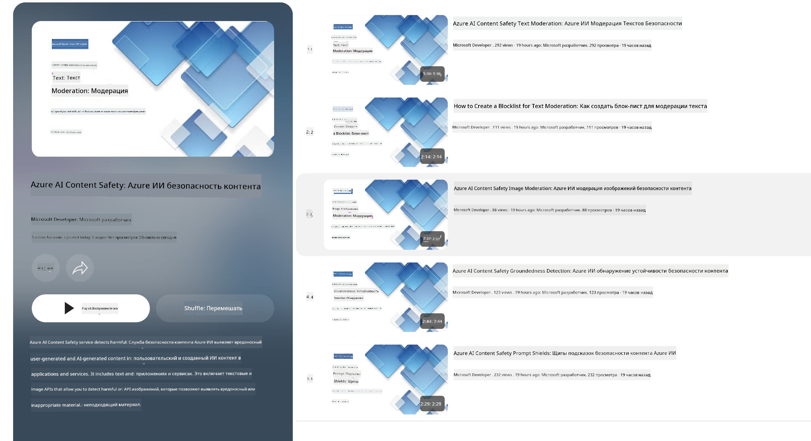

<!--
CO_OP_TRANSLATOR_METADATA:
{
  "original_hash": "c8273672cc57df2be675407a1383aaf0",
  "translation_date": "2025-03-27T05:22:39+00:00",
  "source_file": "md\\01.Introduction\\01\\01.AISafety.md",
  "language_code": "ru"
}
-->
# Безопасность ИИ для моделей Phi

Семейство моделей Phi было разработано в соответствии с [Стандартом ответственного ИИ Microsoft](https://query.prod.cms.rt.microsoft.com/cms/api/am/binary/RE5cmFl), который представляет собой набор требований, основанный на следующих шести принципах: ответственность, прозрачность, справедливость, надежность и безопасность, конфиденциальность и защита, а также инклюзивность, которые формируют [Принципы ответственного ИИ Microsoft](https://www.microsoft.com/ai/responsible-ai).

Как и предыдущие модели Phi, был применен многосторонний подход к оценке безопасности и пост-тренингу безопасности, с дополнительными мерами, учитывающими мультиязычные возможности данного релиза. Наш подход к обучению и оценке безопасности, включая тестирование на разных языках и в различных категориях рисков, описан в [Документе о пост-тренинге безопасности Phi](https://arxiv.org/abs/2407.13833). Хотя модели Phi выигрывают от этого подхода, разработчики должны применять лучшие практики ответственного ИИ, включая картирование, измерение и минимизацию рисков, связанных с их конкретным случаем использования и культурным или языковым контекстом.

## Лучшие практики

Как и другие модели, семейство моделей Phi потенциально может демонстрировать несправедливое, ненадежное или оскорбительное поведение.

Некоторые ограниченные поведения SLM и LLM, о которых следует знать, включают:

- **Качество обслуживания:** Модели Phi в основном обучены на текстах на английском языке. Производительность для языков, отличных от английского, может быть ниже. Варианты английского языка с меньшим представлением в обучающих данных могут показывать более низкую производительность по сравнению со стандартным американским английским.
- **Представление вреда и поддержание стереотипов:** Эти модели могут чрезмерно или недостаточно представлять группы людей, стирать представление некоторых групп или усиливать уничижительные или негативные стереотипы. Несмотря на пост-тренинг безопасности, эти ограничения могут сохраняться из-за различного уровня представления разных групп или наличия примеров негативных стереотипов в обучающих данных, отражающих реальные мировые паттерны и социальные предубеждения.
- **Неподходящий или оскорбительный контент:** Эти модели могут генерировать другие виды неподходящего или оскорбительного контента, что может сделать их использование неподходящим для чувствительных контекстов без дополнительных мер, специфичных для случая использования.
- **Надежность информации:** Языковые модели могут генерировать бессмысленный контент или создавать материал, который может звучать разумно, но является неточным или устаревшим.
- **Ограниченный объем кода:** Большая часть обучающих данных Phi-3 основана на Python и использует общие пакеты, такие как "typing, math, random, collections, datetime, itertools". Если модель генерирует скрипты на Python с использованием других пакетов или скрипты на других языках, настоятельно рекомендуем пользователям вручную проверять все использования API.

Разработчики должны применять лучшие практики ответственного ИИ и несут ответственность за то, чтобы конкретный случай использования соответствовал применимым законам и нормативным актам (например, конфиденциальность, торговля и т. д.).

## Вопросы ответственного ИИ

Как и другие языковые модели, серия моделей Phi потенциально может демонстрировать несправедливое, ненадежное или оскорбительное поведение. Некоторые ограниченные поведения, о которых следует знать, включают:

**Качество обслуживания:** Модели Phi в основном обучены на текстах на английском языке. Производительность для языков, отличных от английского, может быть ниже. Варианты английского языка с меньшим представлением в обучающих данных могут показывать более низкую производительность по сравнению со стандартным американским английским.

**Представление вреда и поддержание стереотипов:** Эти модели могут чрезмерно или недостаточно представлять группы людей, стирать представление некоторых групп или усиливать уничижительные или негативные стереотипы. Несмотря на пост-тренинг безопасности, эти ограничения могут сохраняться из-за различного уровня представления разных групп или наличия примеров негативных стереотипов в обучающих данных, отражающих реальные мировые паттерны и социальные предубеждения.

**Неподходящий или оскорбительный контент:** Эти модели могут генерировать другие виды неподходящего или оскорбительного контента, что может сделать их использование неподходящим для чувствительных контекстов без дополнительных мер, специфичных для случая использования.

**Надежность информации:** Языковые модели могут генерировать бессмысленный контент или создавать материал, который может звучать разумно, но является неточным или устаревшим.

**Ограниченный объем кода:** Большая часть обучающих данных Phi-3 основана на Python и использует общие пакеты, такие как "typing, math, random, collections, datetime, itertools". Если модель генерирует скрипты на Python с использованием других пакетов или скрипты на других языках, настоятельно рекомендуем пользователям вручную проверять все использования API.

Разработчики должны применять лучшие практики ответственного ИИ и несут ответственность за то, чтобы конкретный случай использования соответствовал применимым законам и нормативным актам (например, конфиденциальность, торговля и т. д.). Важные области для рассмотрения включают:

**Распределение:** Модели могут быть неподходящими для сценариев, которые могут существенно повлиять на юридический статус или распределение ресурсов или жизненных возможностей (например, жилье, трудоустройство, кредит и т. д.) без дополнительных оценок и техник устранения предвзятости.

**Сценарии повышенного риска:** Разработчики должны оценивать пригодность использования моделей в сценариях повышенного риска, где несправедливые, ненадежные или оскорбительные результаты могут быть чрезвычайно затратными или приводить к вреду. Это включает предоставление рекомендаций в чувствительных или экспертных областях, где точность и надежность критически важны (например, юридические или медицинские консультации). Дополнительные меры безопасности должны быть реализованы на уровне приложения в зависимости от контекста внедрения.

**Дезинформация:** Модели могут генерировать неточную информацию. Разработчики должны следовать лучшим практикам прозрачности и информировать конечных пользователей о том, что они взаимодействуют с системой ИИ. На уровне приложения разработчики могут создавать механизмы обратной связи и каналы для привязки ответов к контексту, специфичному для случая использования, что известно как генерация с дополнением извлеченной информации (Retrieval Augmented Generation, RAG).

**Генерация вредоносного контента:** Разработчики должны оценивать результаты с учетом их контекста и использовать доступные классификаторы безопасности или пользовательские решения, подходящие для их случая использования.

**Злоупотребление:** Другие формы злоупотребления, такие как мошенничество, спам или создание вредоносного ПО, могут быть возможны, и разработчики должны обеспечить, чтобы их приложения не нарушали применимые законы и нормативные акты.

### Тонкая настройка и безопасность контента ИИ

После тонкой настройки модели настоятельно рекомендуем использовать меры [Безопасности контента Azure AI](https://learn.microsoft.com/azure/ai-services/content-safety/overview) для мониторинга генерируемого контента, выявления и блокировки потенциальных рисков, угроз и проблем качества.

[Безопасность контента Azure AI](https://learn.microsoft.com/azure/ai-services/content-safety/overview) поддерживает как текстовый, так и визуальный контент. Она может быть развернута в облаке, автономных контейнерах и на периферийных/встроенных устройствах.

## Обзор безопасности контента Azure AI

Безопасность контента Azure AI не является универсальным решением; ее можно настроить в соответствии с конкретными политиками бизнеса. Кроме того, ее мультиязычные модели позволяют понимать несколько языков одновременно.

- **Безопасность контента Azure AI**
- **Microsoft Developer**
- **5 видео**

Сервис безопасности контента Azure AI обнаруживает вредоносный контент, созданный пользователями или ИИ, в приложениях и сервисах. Он включает текстовые и визуальные API, которые позволяют выявлять вредоносный или неподходящий материал.

[Плейлист по безопасности контента ИИ](https://www.youtube.com/playlist?list=PLlrxD0HtieHjaQ9bJjyp1T7FeCbmVcPkQ)

**Отказ от ответственности**:  
Этот документ был переведен с использованием службы автоматического перевода [Co-op Translator](https://github.com/Azure/co-op-translator). Хотя мы стремимся к точности, имейте в виду, что автоматические переводы могут содержать ошибки или неточности. Оригинальный документ на его родном языке следует считать авторитетным источником. Для критически важной информации рекомендуется профессиональный перевод человеком. Мы не несем ответственности за любые недоразумения или неправильные интерпретации, возникшие в результате использования данного перевода.