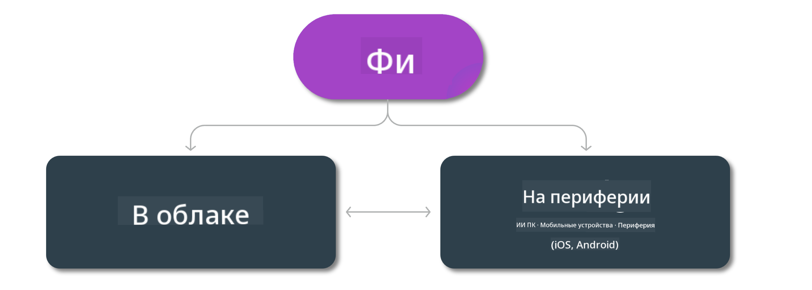

<!--
CO_OP_TRANSLATOR_METADATA:
{
  "original_hash": "777aa0ff38fceecc29a00834f2f7a2f0",
  "translation_date": "2025-03-27T05:33:04+00:00",
  "source_file": "md\\01.Introduction\\01\\01.Edgeandcloud.md",
  "language_code": "ru"
}
-->
# Phi Модели и Доступность на различных платформах

## Сценарии Edge и Cloud

## Доступность моделей и ресурсы

| | | | | | | | | |
|-|-|-|-|-|-|-|-|-|
|Модель|Входные данные|Длина контента|Azure AI (MaaS)|Azure ML (MaaP)|ONNX|Hugging Face|Ollama|Nvidia NIM|
|Phi-3-vision-128k-instruct|Текст+Изображение|128k|[Playground и Развертывание](https://ai.azure.com/explore/models/Phi-3-vision-128k-instruct/version/2/registry/azureml)|[Playground, Развертывание и Тонкая настройка](https://ml.azure.com/registries/azureml/models/Phi-3-vision-128k-instruct/version/2)|[CUDA](https://huggingface.co/microsoft/Phi-3-vision-128k-instruct-onnx-cuda/tree/main),[CPU](https://huggingface.co/microsoft/Phi-3-vision-128k-instruct-onnx-cpu/tree/main), [DirectML](https://huggingface.co/microsoft/Phi-3-vision-128k-instruct-onnx-directml/tree/main)|[Скачать](https://huggingface.co/microsoft/Phi-3-vision-128k-instruct)|-Н/Д-|[NIM API](https://build.nvidia.com/microsoft/phi-3-vision-128k-instruct)|
|Phi-3-mini-4k-instruct|Текст|4k|[Playground и Развертывание](https://aka.ms/phi3-mini-4k-azure-ml)|[Playground, Развертывание](https://aka.ms/phi3-mini-4k-azure-ml) и Тонкая настройка|[CUDA](https://huggingface.co/microsoft/Phi-3-mini-4k-instruct-onnx), [Web](https://huggingface.co/microsoft/Phi-3-mini-4k-instruct-onnx)|[Playground и Скачать](https://huggingface.co/chat/models/microsoft/Phi-3-mini-4k-instruct)|[GGUF](https://huggingface.co/microsoft/Phi-3-mini-4k-instruct-gguf)|[NIM API](https://build.nvidia.com/microsoft/phi-3-mini-4k)|
|Phi-3-mini-128k-instruct|Текст|128k|[Playground и Развертывание](https://ai.azure.com/explore/models/Phi-3-mini-128k-instruct/version/9/registry/azureml)|[Playground, Развертывание](https://ai.azure.com/explore/models/Phi-3-mini-128k-instruct/version/9/registry/azureml) и Тонкая настройка|[CUDA](https://huggingface.co/microsoft/Phi-3-mini-128k-instruct-onnx)|[Скачать](https://huggingface.co/microsoft/Phi-3-mini-128k-instruct-onnx)|-Н/Д-|[NIM API](https://build.nvidia.com/microsoft/phi-3-mini)|
|Phi-3-small-8k-instruct|Текст|8k|[Playground и Развертывание](https://ml.azure.com/registries/azureml/models/Phi-3-small-8k-instruct/version/2)|[Playground, Развертывание](https://ai.azure.com/explore/models/Phi-3-small-8k-instruct/version/2/registry/azureml) и Тонкая настройка|[CUDA](https://huggingface.co/microsoft/Phi-3-small-8k-instruct-onnx-cuda)|[Скачать](https://huggingface.co/microsoft/Phi-3-small-8k-instruct-onnx-cuda)|-Н/Д-|[NIM API](https://build.nvidia.com/microsoft/phi-3-small-8k-instruct?docker=false)|
|Phi-3-small-128k-instruct|Текст|128k|[Playground и Развертывание](https://ai.azure.com/explore/models/Phi-3-small-128k-instruct/version/2/registry/azureml)|[Playground, Развертывание](https://ml.azure.com/registries/azureml/models/Phi-3-small-128k-instruct/version/2) и Тонкая настройка|[CUDA](https://huggingface.co/microsoft/Phi-3-medium-128k-instruct-onnx-cuda)|[Скачать](https://huggingface.co/microsoft/Phi-3-small-128k-instruct)|-Н/Д-|[NIM API](https://build.nvidia.com/microsoft/phi-3-small-128k-instruct?docker=false)|
|Phi-3-medium-4k-instruct|Текст|4k|[Песочница и Развертывание](https://huggingface.co/microsoft/Phi-3-medium-4k-instruct)|[Песочница, Развертывание](https://ml.azure.com/registries/azureml/models/Phi-3-medium-4k-instruct/version/2) и Тонкая настройка|[CUDA](https://huggingface.co/microsoft/Phi-3-medium-4k-instruct-onnx-cuda/tree/main), [CPU](https://huggingface.co/microsoft/Phi-3-medium-4k-instruct-onnx-cpu/tree/main), [DirectML](https://huggingface.co/microsoft/Phi-3-medium-4k-instruct-onnx-directml/tree/main)|[Скачать](https://huggingface.co/microsoft/Phi-3-medium-4k-instruct)|-Н/Д-|[NIM APIs](https://build.nvidia.com/microsoft/phi-3-medium-4k-instruct?docker=false)|
|Phi-3-medium-128k-instruct|Текст|128k|[Песочница и Развертывание](https://ai.azure.com/explore/models/Phi-3-medium-128k-instruct/version/2)|[Песочница, Развертывание](https://ml.azure.com/registries/azureml/models/Phi-3-medium-128k-instruct/version/2) и Тонкая настройка|[CUDA](https://huggingface.co/microsoft/Phi-3-medium-128k-instruct-onnx-cuda/tree/main), [CPU](https://huggingface.co/microsoft/Phi-3-medium-128k-instruct-onnx-cpu/tree/main), [DirectML](https://huggingface.co/microsoft/Phi-3-medium-128k-instruct-onnx-directml/tree/main)|[Скачать](https://huggingface.co/microsoft/Phi-3-medium-128k-instruct)|-Н/Д-|-Н/Д-|

**Отказ от ответственности**:  
Этот документ был переведен с использованием службы автоматического перевода [Co-op Translator](https://github.com/Azure/co-op-translator). Несмотря на наши усилия по обеспечению точности, обратите внимание, что автоматический перевод может содержать ошибки или неточности. Оригинальный документ на его исходном языке следует считать авторитетным источником. Для получения критически важной информации рекомендуется профессиональный перевод человеком. Мы не несем ответственности за любые недоразумения или неверные интерпретации, возникшие в результате использования данного перевода.