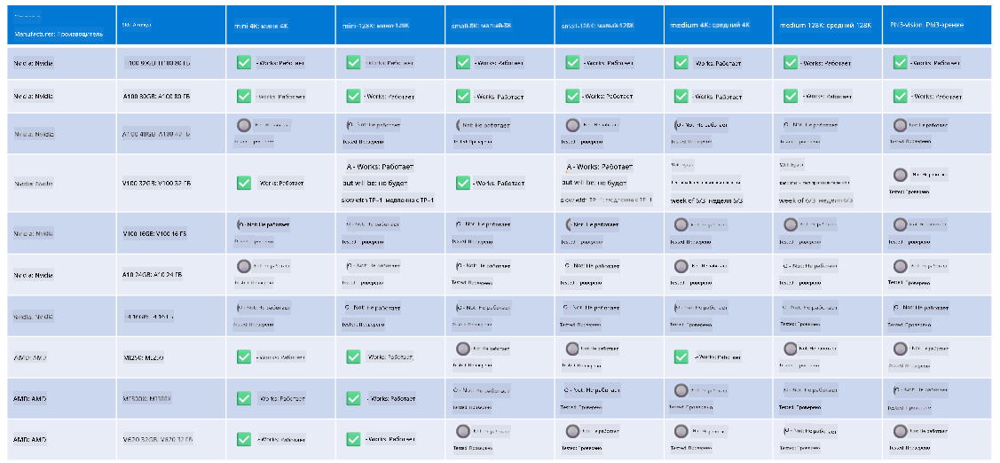

<!--
CO_OP_TRANSLATOR_METADATA:
{
  "original_hash": "8cdc17ce0f10535da30b53d23fe1a795",
  "translation_date": "2025-03-27T05:53:21+00:00",
  "source_file": "md\\01.Introduction\\01\\01.Hardwaresupport.md",
  "language_code": "ru"
}
-->
# Поддержка оборудования Phi

Microsoft Phi оптимизирован для ONNX Runtime и поддерживает Windows DirectML. Он хорошо работает на различных типах оборудования, включая GPU, CPU и даже мобильные устройства.

## Аппаратное обеспечение устройств
Поддерживаемое оборудование включает:

- GPU SKU: RTX 4090 (DirectML)
- GPU SKU: 1 A100 80GB (CUDA)
- CPU SKU: Standard F64s v2 (64 vCPU, 128 GiB памяти)

## Мобильные SKU

- Android - Samsung Galaxy S21
- Apple iPhone 14 или выше с процессором A16/A17

## Спецификация оборудования Phi

- Минимально необходимая конфигурация.
- Windows: GPU с поддержкой DirectX 12 и минимум 4 ГБ общей оперативной памяти

CUDA: NVIDIA GPU с Compute Capability >= 7.02



## Запуск onnxruntime на нескольких GPU

На данный момент доступные модели Phi ONNX рассчитаны только на 1 GPU. Возможно настроить поддержку нескольких GPU для модели Phi, но использование ORT с 2 GPU не гарантирует увеличение пропускной способности по сравнению с двумя отдельными экземплярами ORT. Для получения последних обновлений смотрите [ONNX Runtime](https://onnxruntime.ai/).

На [Build 2024 команда GenAI ONNX](https://youtu.be/WLW4SE8M9i8?si=EtG04UwDvcjunyfC) объявила, что они включили поддержку мульти-экземпляров вместо мульти-GPU для моделей Phi.

В настоящее время это позволяет запускать один экземпляр onnxruntime или onnxruntime-genai с переменной окружения CUDA_VISIBLE_DEVICES, как показано ниже.

```Python
CUDA_VISIBLE_DEVICES=0 python infer.py
CUDA_VISIBLE_DEVICES=1 python infer.py
```

Вы можете изучить Phi подробнее в [Azure AI Foundry](https://ai.azure.com)

**Отказ от ответственности**:  
Этот документ был переведен с использованием сервиса автоматического перевода [Co-op Translator](https://github.com/Azure/co-op-translator). Несмотря на наши усилия обеспечить точность перевода, автоматические переводы могут содержать ошибки или неточности. Оригинальный документ на его исходном языке должен рассматриваться как авторитетный источник. Для получения критически важной информации рекомендуется профессиональный перевод человеком. Мы не несем ответственности за любые недоразумения или неправильные интерпретации, возникшие в результате использования данного перевода.