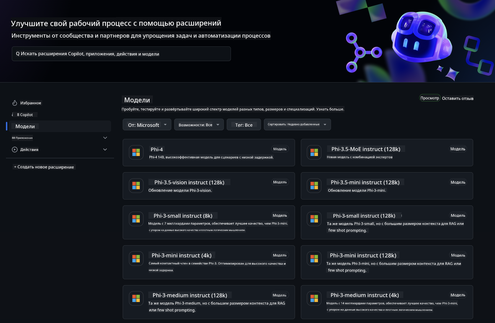
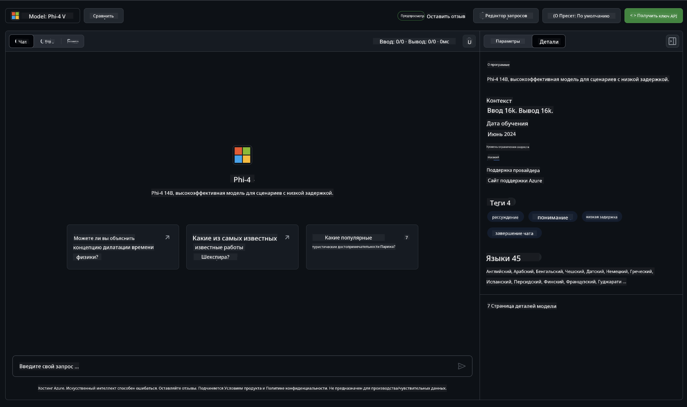
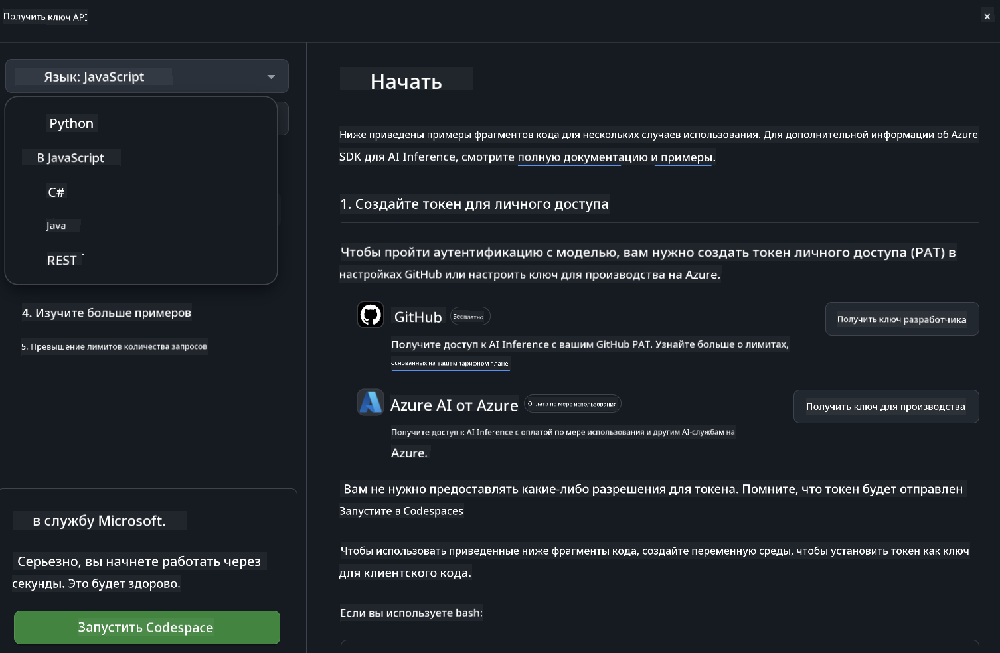
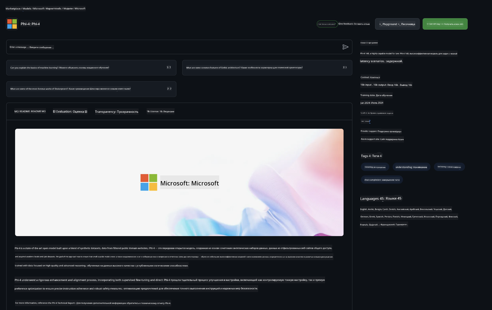

<!--
CO_OP_TRANSLATOR_METADATA:
{
  "original_hash": "fb67a08b9fc911a10ed58081fadef416",
  "translation_date": "2025-03-27T06:18:01+00:00",
  "source_file": "md\\01.Introduction\\02\\02.GitHubModel.md",
  "language_code": "ru"
}
-->
## Семейство Phi в моделях GitHub

Добро пожаловать в [GitHub Models](https://github.com/marketplace/models)! Мы всё подготовили, чтобы вы могли исследовать AI-модели, размещенные на Azure AI.



Для получения дополнительной информации о моделях, доступных в GitHub Models, загляните в [GitHub Model Marketplace](https://github.com/marketplace/models).

## Доступные модели

Каждая модель имеет отдельную песочницу и пример кода.



### Семейство Phi в каталоге моделей GitHub

- [Phi-4](https://github.com/marketplace/models/azureml/Phi-4)

- [Phi-3.5-MoE instruct (128k)](https://github.com/marketplace/models/azureml/Phi-3-5-MoE-instruct)

- [Phi-3.5-vision instruct (128k)](https://github.com/marketplace/models/azureml/Phi-3-5-vision-instruct)

- [Phi-3.5-mini instruct (128k)](https://github.com/marketplace/models/azureml/Phi-3-5-mini-instruct)

- [Phi-3-Medium-128k-Instruct](https://github.com/marketplace/models/azureml/Phi-3-medium-128k-instruct)

- [Phi-3-medium-4k-instruct](https://github.com/marketplace/models/azureml/Phi-3-medium-4k-instruct)

- [Phi-3-mini-128k-instruct](https://github.com/marketplace/models/azureml/Phi-3-mini-128k-instruct)

- [Phi-3-mini-4k-instruct](https://github.com/marketplace/models/azureml/Phi-3-mini-4k-instruct)

- [Phi-3-small-128k-instruct](https://github.com/marketplace/models/azureml/Phi-3-small-128k-instruct)

- [Phi-3-small-8k-instruct](https://github.com/marketplace/models/azureml/Phi-3-small-8k-instruct)

## Начало работы

У нас есть несколько базовых примеров, которые готовы к запуску. Вы найдете их в каталоге с примерами. Если хотите сразу перейти к любимому языку программирования, примеры доступны на следующих языках:

- Python
- JavaScript
- C#
- Java
- cURL

Также есть специальная среда Codespaces для запуска примеров и моделей.



## Пример кода

Ниже приведены фрагменты кода для нескольких сценариев использования. Для получения дополнительной информации о Azure AI Inference SDK смотрите полную документацию и примеры.

## Настройка

1. Создайте персональный токен доступа  
Токен не требует предоставления каких-либо разрешений. Обратите внимание, что токен будет отправлен в сервис Microsoft.

Чтобы использовать приведенные ниже фрагменты кода, создайте переменную окружения, чтобы задать токен в качестве ключа для клиентского кода.

Если вы используете bash:  
```
export GITHUB_TOKEN="<your-github-token-goes-here>"
```  
Если вы используете powershell:  
```
$Env:GITHUB_TOKEN="<your-github-token-goes-here>"
```  

Если вы используете командную строку Windows:  
```
set GITHUB_TOKEN=<your-github-token-goes-here>
```  

## Пример на Python

### Установка зависимостей  
Установите Azure AI Inference SDK с помощью pip (Требуется: Python >=3.8):  
```
pip install azure-ai-inference
```  

### Запуск базового примера кода  

Этот пример демонстрирует базовый вызов API для завершения чата. Используется конечная точка GitHub AI model inference и ваш токен GitHub. Вызов выполняется синхронно.  
```python
import os
from azure.ai.inference import ChatCompletionsClient
from azure.ai.inference.models import SystemMessage, UserMessage
from azure.core.credentials import AzureKeyCredential

endpoint = "https://models.inference.ai.azure.com"
model_name = "Phi-4"
token = os.environ["GITHUB_TOKEN"]

client = ChatCompletionsClient(
    endpoint=endpoint,
    credential=AzureKeyCredential(token),
)

response = client.complete(
    messages=[
        UserMessage(content="I have $20,000 in my savings account, where I receive a 4% profit per year and payments twice a year. Can you please tell me how long it will take for me to become a millionaire? Also, can you please explain the math step by step as if you were explaining it to an uneducated person?"),
    ],
    temperature=0.4,
    top_p=1.0,
    max_tokens=2048,
    model=model_name
)

print(response.choices[0].message.content)
```  

### Запуск многоходового диалога  

Этот пример демонстрирует многоходовой диалог с API завершения чата. При использовании модели для чат-приложения вам нужно будет управлять историей этого диалога и отправлять последние сообщения модели.  
```
import os
from azure.ai.inference import ChatCompletionsClient
from azure.ai.inference.models import AssistantMessage, SystemMessage, UserMessage
from azure.core.credentials import AzureKeyCredential

token = os.environ["GITHUB_TOKEN"]
endpoint = "https://models.inference.ai.azure.com"
# Replace Model_Name
model_name = "Phi-4"

client = ChatCompletionsClient(
    endpoint=endpoint,
    credential=AzureKeyCredential(token),
)

messages = [
    SystemMessage(content="You are a helpful assistant."),
    UserMessage(content="What is the capital of France?"),
    AssistantMessage(content="The capital of France is Paris."),
    UserMessage(content="What about Spain?"),
]

response = client.complete(messages=messages, model=model_name)

print(response.choices[0].message.content)
```  

### Потоковая передача ответа  

Для улучшения пользовательского опыта рекомендуется потоковая передача ответа модели, чтобы первый токен появлялся раньше и вам не приходилось ждать долгих ответов.  
```
import os
from azure.ai.inference import ChatCompletionsClient
from azure.ai.inference.models import SystemMessage, UserMessage
from azure.core.credentials import AzureKeyCredential

token = os.environ["GITHUB_TOKEN"]
endpoint = "https://models.inference.ai.azure.com"
# Replace Model_Name
model_name = "Phi-4"

client = ChatCompletionsClient(
    endpoint=endpoint,
    credential=AzureKeyCredential(token),
)

response = client.complete(
    stream=True,
    messages=[
        SystemMessage(content="You are a helpful assistant."),
        UserMessage(content="Give me 5 good reasons why I should exercise every day."),
    ],
    model=model_name,
)

for update in response:
    if update.choices:
        print(update.choices[0].delta.content or "", end="")

client.close()
```  

## Бесплатное использование и ограничения по скорости для моделей GitHub



[Ограничения по скорости для песочницы и бесплатного использования API](https://docs.github.com/en/github-models/prototyping-with-ai-models#rate-limits) предназначены для того, чтобы помочь вам экспериментировать с моделями и создавать прототипы AI-приложений. Для использования за пределами этих ограничений и масштабирования приложения необходимо предоставить ресурсы из учетной записи Azure и пройти аутентификацию через неё вместо использования персонального токена GitHub. Вам не нужно ничего менять в коде. Используйте эту ссылку, чтобы узнать, как выйти за пределы бесплатного уровня в Azure AI.

### Уведомления

Помните, что при взаимодействии с моделью вы экспериментируете с AI, поэтому возможны ошибки в контенте.

Функция подчиняется различным ограничениям (включая запросы в минуту, запросы в день, токены на запрос и одновременные запросы) и не предназначена для использования в производственных сценариях.

GitHub Models использует Azure AI Content Safety. Эти фильтры нельзя отключить в рамках использования GitHub Models. Если вы решите использовать модели через платный сервис, настройте фильтры контента в соответствии с вашими требованиями.

Этот сервис предоставляется в рамках условий предварительного выпуска GitHub.

**Отказ от ответственности**:  
Этот документ был переведен с использованием сервиса автоматического перевода [Co-op Translator](https://github.com/Azure/co-op-translator). Несмотря на наши усилия обеспечить точность, имейте в виду, что автоматические переводы могут содержать ошибки или неточности. Оригинальный документ на его исходном языке следует считать авторитетным источником. Для получения критически важной информации рекомендуется использовать профессиональный перевод человеком. Мы не несем ответственности за любые недоразумения или неверные интерпретации, возникшие в результате использования этого перевода.