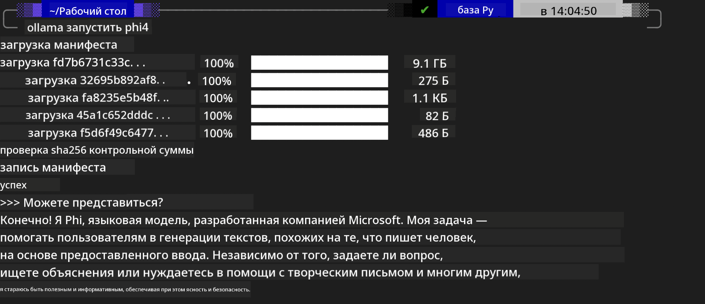
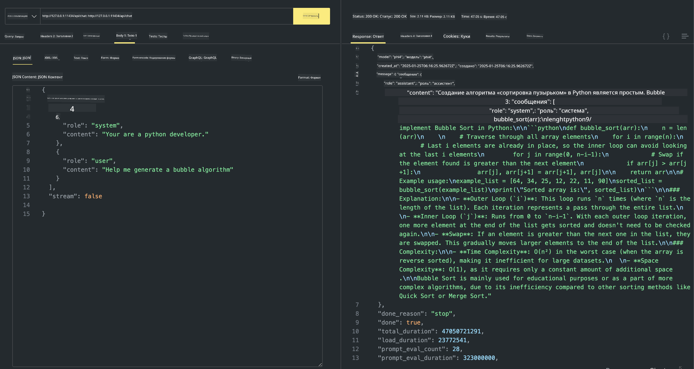

<!--
CO_OP_TRANSLATOR_METADATA:
{
  "original_hash": "0b38834693bb497f96bf53f0d941f9a1",
  "translation_date": "2025-03-27T06:30:20+00:00",
  "source_file": "md\\01.Introduction\\02\\04.Ollama.md",
  "language_code": "ru"
}
-->
## Семейство Phi в Ollama

[Ollama](https://ollama.com) позволяет большему числу людей напрямую развертывать открытые модели LLM или SLM с помощью простых скриптов, а также создавать API для локальных сценариев применения Copilot.

## **1. Установка**

Ollama поддерживает работу на Windows, macOS и Linux. Вы можете установить Ollama по этой ссылке ([https://ollama.com/download](https://ollama.com/download)). После успешной установки вы можете использовать скрипт Ollama для вызова Phi-3 через окно терминала. Все [доступные библиотеки Ollama](https://ollama.com/library) можно посмотреть здесь. Если вы откроете этот репозиторий в Codespace, Ollama уже будет установлен.

```bash

ollama run phi4

```

> [!NOTE]
> Модель будет загружена при первом запуске. Конечно, вы также можете указать заранее скачанную модель Phi-4. В качестве примера возьмем запуск команды в WSL. После успешной загрузки модели вы сможете взаимодействовать с ней прямо через терминал.



## **2. Вызов API phi-4 из Ollama**

Если вы хотите вызвать API Phi-4, созданный Ollama, вы можете использовать эту команду в терминале для запуска сервера Ollama.

```bash

ollama serve

```

> [!NOTE]
> Если вы используете macOS или Linux, обратите внимание, что вы можете столкнуться с ошибкой **"Error: listen tcp 127.0.0.1:11434: bind: address already in use"**. Эта ошибка может появляться при выполнении команды. Вы можете игнорировать ее, так как она обычно указывает на то, что сервер уже запущен, либо остановить и перезапустить Ollama:

**macOS**

```bash

brew services restart ollama

```

**Linux**

```bash

sudo systemctl stop ollama

```

Ollama поддерживает два API: generate и chat. Вы можете вызывать API модели, предоставляемой Ollama, в зависимости от ваших потребностей, отправляя запросы на локальный сервер, работающий на порту 11434.

**Chat**

```bash

curl http://127.0.0.1:11434/api/chat -d '{
  "model": "phi3",
  "messages": [
    {
      "role": "system",
      "content": "Your are a python developer."
    },
    {
      "role": "user",
      "content": "Help me generate a bubble algorithm"
    }
  ],
  "stream": false
  
}'

This is the result in Postman



## Additional Resources

Check the list of available models in Ollama in [their library](https://ollama.com/library).

Pull your model from the Ollama server using this command

```bash
ollama pull phi4
```

Run the model using this command

```bash
ollama run phi4
```

***Note:*** Visit this link [https://github.com/ollama/ollama/blob/main/docs/api.md](https://github.com/ollama/ollama/blob/main/docs/api.md) to learn more

## Calling Ollama from Python

You can use `requests` or `urllib3` to make requests to the local server endpoints used above. However, a popular way to use Ollama in Python is via the [openai](https://pypi.org/project/openai/) SDK, since Ollama provides OpenAI-compatible server endpoints as well.

Here is an example for phi3-mini:

```python
import openai

client = openai.OpenAI(
    base_url="http://localhost:11434/v1",
    api_key="nokeyneeded",
)

response = client.chat.completions.create(
    model="phi4",
    temperature=0.7,
    n=1,
    messages=[
        {"role": "system", "content": "Вы полезный помощник."},
        {"role": "user", "content": "Напишите хайку о голодном коте"},
    ],
)

print("Ответ:")
print(response.choices[0].message.content)
```

## Calling Ollama from JavaScript 

```javascript
// Пример: Резюмирование файла с помощью Phi-4
script({
    model: "ollama:phi4",
    title: "Резюмирование с Phi-4",
    system: ["system"],
})

// Пример резюмирования
const file = def("FILE", env.files)
$`Резюмируйте ${file} в одном абзаце.`
```

## Calling Ollama from C#

Create a new C# Console application and add the following NuGet package:

```bash
dotnet add package Microsoft.SemanticKernel --version 1.34.0
```

Then replace this code in the `Program.cs` file

```csharp
using Microsoft.SemanticKernel;
using Microsoft.SemanticKernel.ChatCompletion;

// добавление сервиса чат-комплитинга с использованием локального сервера Ollama
#pragma warning disable SKEXP0001, SKEXP0003, SKEXP0010, SKEXP0011, SKEXP0050, SKEXP0052
builder.AddOpenAIChatCompletion(
    modelId: "phi4",
    endpoint: new Uri("http://localhost:11434/"),
    apiKey: "non required");

// выполнение простого запроса к сервису чата
string prompt = "Напишите шутку про котят";
var response = await kernel.InvokePromptAsync(prompt);
Console.WriteLine(response.GetValue<string>());
```

Run the app with the command:

```bash
dotnet run

**Отказ от ответственности**:  
Этот документ был переведен с помощью сервиса автоматического перевода [Co-op Translator](https://github.com/Azure/co-op-translator). Хотя мы стремимся к точности, имейте в виду, что автоматические переводы могут содержать ошибки или неточности. Оригинальный документ на его исходном языке следует считать авторитетным источником. Для получения критически важной информации рекомендуется профессиональный перевод человеком. Мы не несем ответственности за недоразумения или неправильные интерпретации, возникшие в результате использования данного перевода.