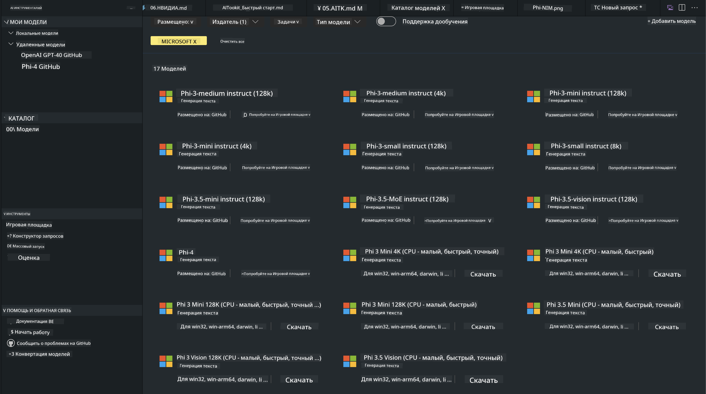
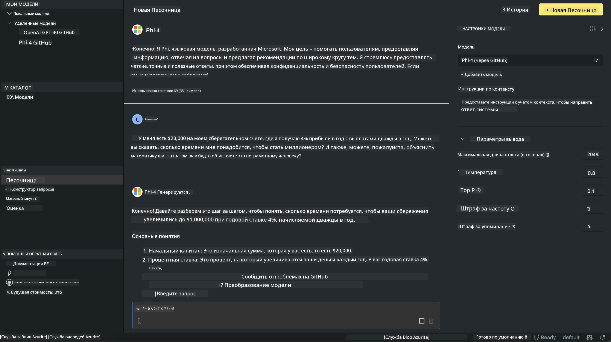

<!--
CO_OP_TRANSLATOR_METADATA:
{
  "original_hash": "4951d458c0b60c02cd1e751b40903877",
  "translation_date": "2025-03-27T06:39:34+00:00",
  "source_file": "md\\01.Introduction\\02\\05.AITK.md",
  "language_code": "ru"
}
-->
# Семейство Phi в AITK

[AI Toolkit для VS Code](https://marketplace.visualstudio.com/items?itemName=ms-windows-ai-studio.windows-ai-studio) упрощает разработку приложений с использованием генеративного ИИ, объединяя передовые инструменты разработки ИИ и модели из каталога Azure AI Foundry, а также других каталогов, таких как Hugging Face. Вы сможете просматривать каталог моделей ИИ, поддерживаемый GitHub Models и Azure AI Foundry Model Catalogs, загружать их локально или удаленно, настраивать, тестировать и использовать в своем приложении.

Предварительная версия AI Toolkit работает локально. Локальное выполнение или настройка зависит от выбранной вами модели, и для этого может понадобиться GPU, например NVIDIA CUDA GPU. Вы также можете запускать модели GitHub напрямую с помощью AITK.

## Начало работы

[Узнайте больше о том, как установить подсистему Windows для Linux](https://learn.microsoft.com/windows/wsl/install?WT.mc_id=aiml-137032-kinfeylo)

и [как изменить дистрибутив по умолчанию](https://learn.microsoft.com/windows/wsl/install#change-the-default-linux-distribution-installed).

[Репозиторий AI Toolkit на GitHub](https://github.com/microsoft/vscode-ai-toolkit/)

- Windows, Linux, macOS
  
- Для настройки на Windows и Linux потребуется Nvidia GPU. Кроме того, **Windows** требует подсистему для Linux с дистрибутивом Ubuntu версии 18.4 или выше. [Узнайте больше о том, как установить подсистему Windows для Linux](https://learn.microsoft.com/windows/wsl/install) и [как изменить дистрибутив по умолчанию](https://learn.microsoft.com/windows/wsl/install#change-the-default-linux-distribution-installed).

### Установка AI Toolkit

AI Toolkit поставляется как [расширение для Visual Studio Code](https://code.visualstudio.com/docs/setup/additional-components#_vs-code-extensions), поэтому сначала нужно установить [VS Code](https://code.visualstudio.com/docs/setup/windows?WT.mc_id=aiml-137032-kinfeylo), а затем загрузить AI Toolkit из [VS Marketplace](https://marketplace.visualstudio.com/items?itemName=ms-windows-ai-studio.windows-ai-studio).  
[AI Toolkit доступен в Visual Studio Marketplace](https://marketplace.visualstudio.com/items?itemName=ms-windows-ai-studio.windows-ai-studio) и может быть установлен, как любое другое расширение для VS Code.

Если вы не знакомы с процессом установки расширений для VS Code, выполните следующие шаги:

### Вход

1. В панели действий VS Code выберите **Extensions**.
2. В строке поиска Extensions введите "AI Toolkit".
3. Выберите "AI Toolkit for Visual Studio Code".
4. Нажмите **Install**.

Теперь вы готовы использовать расширение!

Вам будет предложено войти в GitHub, нажмите "Allow", чтобы продолжить. Вы будете перенаправлены на страницу входа GitHub.

Пожалуйста, войдите в систему и выполните все шаги процесса. После успешного завершения вы будете перенаправлены обратно в VS Code.

После установки расширения в вашей панели действий появится значок AI Toolkit.

Давайте изучим доступные действия!

### Доступные действия

Основная боковая панель AI Toolkit организована в следующие разделы:  

- **Models**  
- **Resources**  
- **Playground**  
- **Fine-tuning**  
- **Evaluation**

Все эти разделы доступны в секции Resources. Чтобы начать, выберите **Model Catalog**.

### Загрузка модели из каталога

После запуска AI Toolkit в боковой панели VS Code вы можете выбрать из следующих опций:



- Найдите поддерживаемую модель в **Model Catalog** и загрузите её локально.
- Проверьте выполнение модели в **Model Playground**.
- Настройте модель локально или удаленно в **Model Fine-tuning**.
- Разместите настроенные модели в облаке через командную палитру AI Toolkit.
- Оцените модели.

> [!NOTE]
>
> **GPU Vs CPU**
>
> Вы заметите, что карточки моделей показывают размер модели, платформу и тип ускорителя (CPU, GPU). Для оптимальной производительности на **устройствах Windows с хотя бы одним GPU** выбирайте версии моделей, которые нацелены только на Windows.
>
> Это гарантирует, что у вас есть модель, оптимизированная для ускорителя DirectML.
>
> Названия моделей имеют формат
>
> - `{model_name}-{accelerator}-{quantization}-{format}`.
>
> Чтобы проверить, есть ли у вас GPU на устройстве Windows, откройте **Диспетчер задач** и затем выберите вкладку **Производительность**. Если у вас есть GPU, они будут указаны под названиями, такими как "GPU 0" или "GPU 1".

### Запуск модели в Playground

После того как все параметры установлены, нажмите **Generate Project**.

После загрузки модели выберите **Load in Playground** на карточке модели в каталоге:

- Инициируйте загрузку модели.
- Установите все необходимые компоненты и зависимости.
- Создайте рабочую область VS Code.



### Использование REST API в вашем приложении

AI Toolkit включает локальный веб-сервер REST API **на порту 5272**, который использует [формат OpenAI chat completions](https://platform.openai.com/docs/api-reference/chat/create).  

Это позволяет тестировать ваше приложение локально без необходимости полагаться на облачные сервисы моделей ИИ. Например, следующий JSON-файл показывает, как настроить тело запроса:

```json
{
    "model": "Phi-4",
    "messages": [
        {
            "role": "user",
            "content": "what is the golden ratio?"
        }
    ],
    "temperature": 0.7,
    "top_p": 1,
    "top_k": 10,
    "max_tokens": 100,
    "stream": true
}
```

Вы можете протестировать REST API с помощью (например) [Postman](https://www.postman.com/) или утилиты CURL (Client URL):

```bash
curl -vX POST http://127.0.0.1:5272/v1/chat/completions -H 'Content-Type: application/json' -d @body.json
```

### Использование клиентской библиотеки OpenAI для Python

```python
from openai import OpenAI

client = OpenAI(
    base_url="http://127.0.0.1:5272/v1/", 
    api_key="x" # required for the API but not used
)

chat_completion = client.chat.completions.create(
    messages=[
        {
            "role": "user",
            "content": "what is the golden ratio?",
        }
    ],
    model="Phi-4",
)

print(chat_completion.choices[0].message.content)
```

### Использование клиентской библиотеки Azure OpenAI для .NET

Добавьте [клиентскую библиотеку Azure OpenAI для .NET](https://www.nuget.org/packages/Azure.AI.OpenAI/) в ваш проект с помощью NuGet:

```bash
dotnet add {project_name} package Azure.AI.OpenAI --version 1.0.0-beta.17
```

Добавьте файл C# с названием **OverridePolicy.cs** в ваш проект и вставьте следующий код:

```csharp
// OverridePolicy.cs
using Azure.Core.Pipeline;
using Azure.Core;

internal partial class OverrideRequestUriPolicy(Uri overrideUri)
    : HttpPipelineSynchronousPolicy
{
    private readonly Uri _overrideUri = overrideUri;

    public override void OnSendingRequest(HttpMessage message)
    {
        message.Request.Uri.Reset(_overrideUri);
    }
}
```

Далее вставьте следующий код в ваш файл **Program.cs**:

```csharp
// Program.cs
using Azure.AI.OpenAI;

Uri localhostUri = new("http://localhost:5272/v1/chat/completions");

OpenAIClientOptions clientOptions = new();
clientOptions.AddPolicy(
    new OverrideRequestUriPolicy(localhostUri),
    Azure.Core.HttpPipelinePosition.BeforeTransport);
OpenAIClient client = new(openAIApiKey: "unused", clientOptions);

ChatCompletionsOptions options = new()
{
    DeploymentName = "Phi-4",
    Messages =
    {
        new ChatRequestSystemMessage("You are a helpful assistant. Be brief and succinct."),
        new ChatRequestUserMessage("What is the golden ratio?"),
    }
};

StreamingResponse<StreamingChatCompletionsUpdate> streamingChatResponse
    = await client.GetChatCompletionsStreamingAsync(options);

await foreach (StreamingChatCompletionsUpdate chatChunk in streamingChatResponse)
{
    Console.Write(chatChunk.ContentUpdate);
}
```

## Настройка моделей с помощью AI Toolkit

- Начните с поиска моделей и Playground.
- Настройка моделей и выполнение с использованием локальных вычислительных ресурсов.
- Удаленная настройка и выполнение с использованием ресурсов Azure.

[Настройка моделей с помощью AI Toolkit](../../03.FineTuning/Finetuning_VSCodeaitoolkit.md)

## Ресурсы вопросов и ответов по AI Toolkit

Пожалуйста, обратитесь к нашей [странице вопросов и ответов](https://github.com/microsoft/vscode-ai-toolkit/blob/main/archive/QA.md) для наиболее распространённых проблем и их решений.

**Отказ от ответственности**:  
Этот документ был переведен с использованием сервиса автоматического перевода [Co-op Translator](https://github.com/Azure/co-op-translator). Несмотря на наши усилия обеспечить точность перевода, обратите внимание, что автоматические переводы могут содержать ошибки или неточности. Оригинальный документ на его родном языке следует считать авторитетным источником. Для критически важной информации рекомендуется профессиональный перевод человеком. Мы не несем ответственности за любые недоразумения или неверные интерпретации, возникшие в результате использования этого перевода.