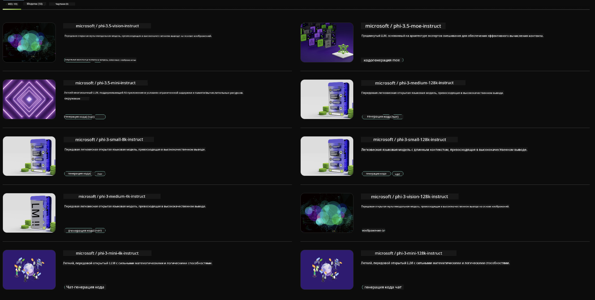

<!--
CO_OP_TRANSLATOR_METADATA:
{
  "original_hash": "7b08e277df2a9307f861ae54bc30c772",
  "translation_date": "2025-03-27T06:48:46+00:00",
  "source_file": "md\\01.Introduction\\02\\06.NVIDIA.md",
  "language_code": "ru"
}
-->
## Семейство Phi в NVIDIA NIM

NVIDIA NIM — это набор простых в использовании микросервисов, предназначенных для ускорения развертывания генеративных моделей ИИ в облаке, дата-центрах и рабочих станциях. NIM классифицируются по семействам моделей и по отдельным моделям. Например, NVIDIA NIM для больших языковых моделей (LLMs) предоставляет возможности передовых LLM для корпоративных приложений, обеспечивая непревзойденную обработку и понимание естественного языка.

NIM упрощает для IT и DevOps команд размещение больших языковых моделей (LLMs) в их собственных управляемых средах, одновременно предоставляя разработчикам API, соответствующие отраслевым стандартам. Это позволяет создавать мощные копилоты, чат-боты и AI-ассистенты, которые могут преобразовать их бизнес. Используя передовые технологии ускорения GPU от NVIDIA и масштабируемое развертывание, NIM предлагает самый быстрый путь к выводу с непревзойденной производительностью.

С помощью NVIDIA NIM вы можете выполнять вывод моделей семейства Phi.



### **Примеры - Phi-3-Vision в NVIDIA NIM**

Представьте, что у вас есть изображение (`demo.png`), и вы хотите сгенерировать Python-код, который обработает это изображение и сохранит его новую версию (`phi-3-vision.jpg`).

Приведенный выше код автоматизирует этот процесс следующим образом:

1. Настраивает окружение и необходимые конфигурации.
2. Создает запрос, который инструктирует модель сгенерировать требуемый Python-код.
3. Отправляет запрос модели и получает сгенерированный код.
4. Извлекает и выполняет сгенерированный код.
5. Отображает оригинальное и обработанное изображения.

Этот подход использует возможности ИИ для автоматизации задач обработки изображений, делая достижение ваших целей проще и быстрее.

[Пример решения кода](../../../../../code/06.E2E/E2E_Nvidia_NIM_Phi3_Vision.ipynb)

Давайте разберем, что делает весь код шаг за шагом:

1. **Установить необходимый пакет**:
    ```python
    !pip install langchain_nvidia_ai_endpoints -U
    ```
    Эта команда устанавливает пакет `langchain_nvidia_ai_endpoints`, гарантируя, что используется последняя версия.

2. **Импортировать необходимые модули**:
    ```python
    from langchain_nvidia_ai_endpoints import ChatNVIDIA
    import getpass
    import os
    import base64
    ```
    Эти импорты добавляют необходимые модули для взаимодействия с NVIDIA AI endpoints, безопасной работы с паролями, взаимодействия с операционной системой и кодирования/декодирования данных в формате base64.

3. **Настроить API-ключ**:
    ```python
    if not os.getenv("NVIDIA_API_KEY"):
        os.environ["NVIDIA_API_KEY"] = getpass.getpass("Enter your NVIDIA API key: ")
    ```
    Этот код проверяет, установлен ли переменная окружения `NVIDIA_API_KEY`. Если нет, он предлагает пользователю ввести API-ключ безопасно.

4. **Определить модель и путь к изображению**:
    ```python
    model = 'microsoft/phi-3-vision-128k-instruct'
    chat = ChatNVIDIA(model=model)
    img_path = './imgs/demo.png'
    ```
    Устанавливает используемую модель, создает экземпляр `ChatNVIDIA` с указанной моделью и определяет путь к файлу изображения.

5. **Создать текстовый запрос**:
    ```python
    text = "Please create Python code for image, and use plt to save the new picture under imgs/ and name it phi-3-vision.jpg."
    ```
    Определяет текстовый запрос, который инструктирует модель сгенерировать Python-код для обработки изображения.

6. **Кодировать изображение в Base64**:
    ```python
    with open(img_path, "rb") as f:
        image_b64 = base64.b64encode(f.read()).decode()
    image = f''
    ```
    Этот код читает файл изображения, кодирует его в base64 и создает HTML-тег изображения с закодированными данными.

7. **Объединить текст и изображение в запрос**:
    ```python
    prompt = f"{text} {image}"
    ```
    Объединяет текстовый запрос и HTML-тег изображения в одну строку.

8. **Сгенерировать код с использованием ChatNVIDIA**:
    ```python
    code = ""
    for chunk in chat.stream(prompt):
        print(chunk.content, end="")
        code += chunk.content
    ```
    Этот код отправляет запрос в `ChatNVIDIA` model and collects the generated code in chunks, printing and appending each chunk to the `code` строку.

9. **Извлечь Python-код из сгенерированного содержимого**:
    ```python
    begin = code.index('```python') + 9
    code = code[begin:]
    end = code.index('```')
    code = code[:end]
    ```
    Извлекает фактический Python-код из сгенерированного содержимого, удаляя форматирование markdown.

10. **Выполнить сгенерированный код**:
    ```python
    import subprocess
    result = subprocess.run(["python", "-c", code], capture_output=True)
    ```
    Выполняет извлеченный Python-код как подпроцесс и захватывает его вывод.

11. **Отобразить изображения**:
    ```python
    from IPython.display import Image, display
    display(Image(filename='./imgs/phi-3-vision.jpg'))
    display(Image(filename='./imgs/demo.png'))
    ```
    Эти строки отображают изображения с использованием модуля `IPython.display`.

**Отказ от ответственности**:  
Этот документ был переведен с использованием AI-сервиса перевода [Co-op Translator](https://github.com/Azure/co-op-translator). Хотя мы стремимся к точности, пожалуйста, учитывайте, что автоматические переводы могут содержать ошибки или неточности. Оригинальный документ на его родном языке должен считаться авторитетным источником. Для получения критически важной информации рекомендуется использовать профессиональный человеческий перевод. Мы не несем ответственности за любые недоразумения или неправильные интерпретации, возникающие в результате использования данного перевода.