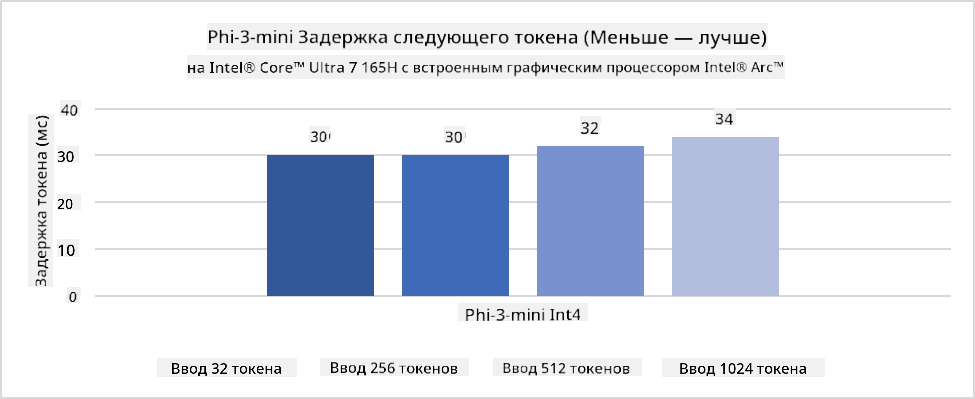
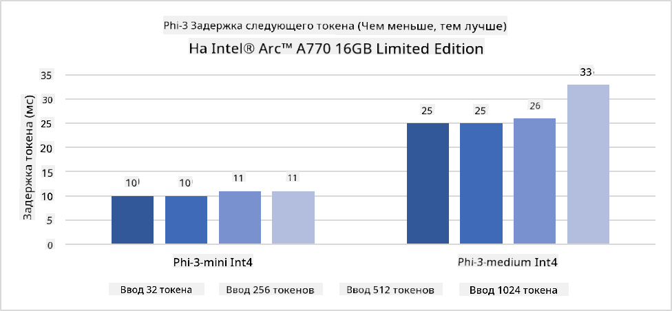
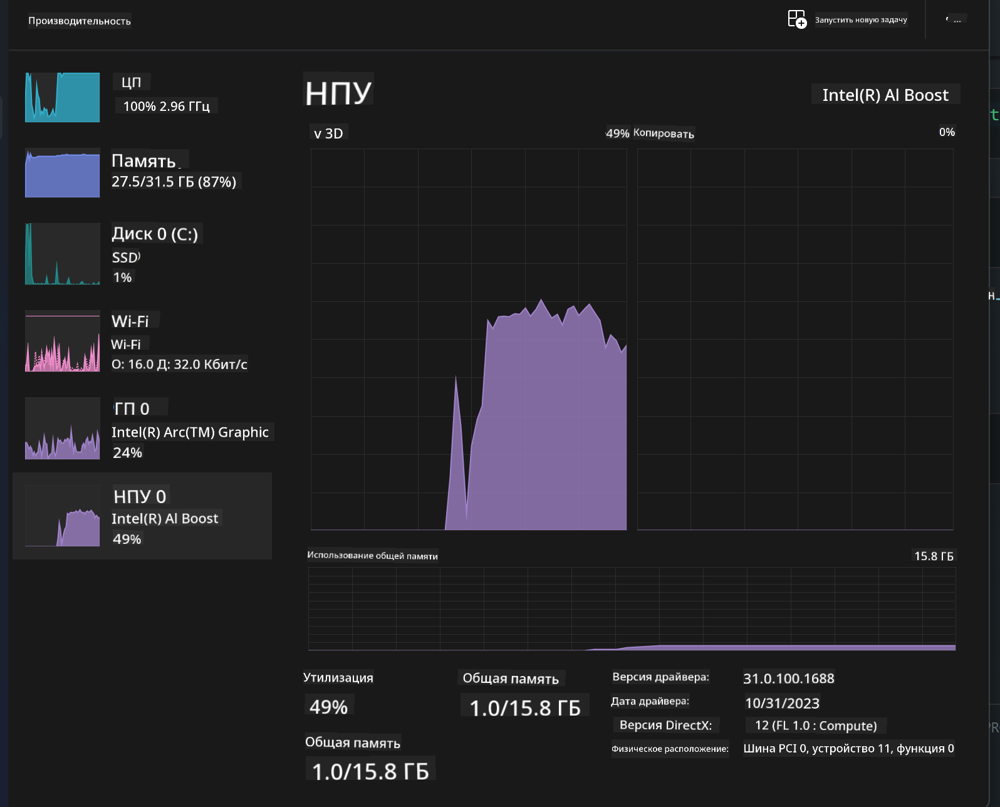
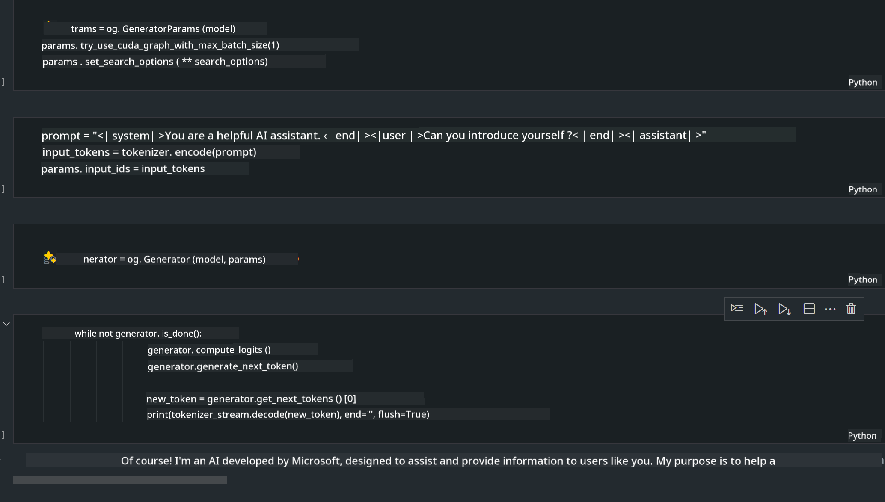
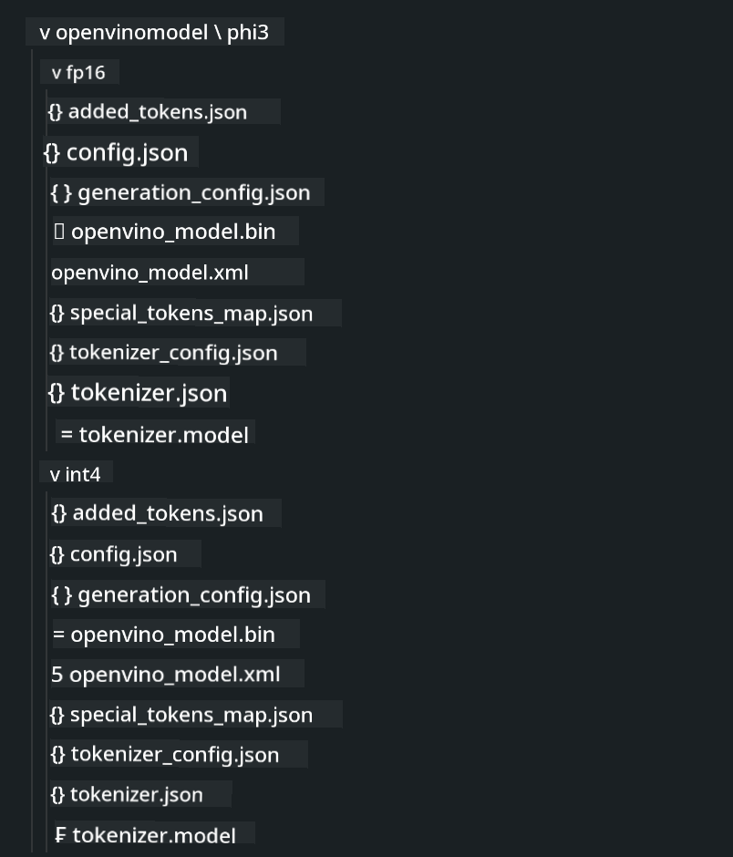
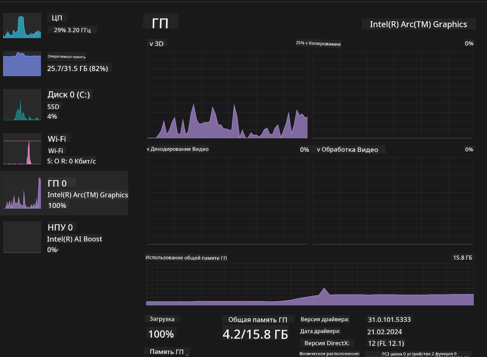

<!--
CO_OP_TRANSLATOR_METADATA:
{
  "original_hash": "e08ce816e23ad813244a09ca34ebb8ac",
  "translation_date": "2025-03-27T06:57:58+00:00",
  "source_file": "md\\01.Introduction\\03\\AIPC_Inference.md",
  "language_code": "ru"
}
-->
# **Inference Phi-3 на AI PC**

С развитием генеративного ИИ и улучшением аппаратных возможностей устройств на краю сети все больше моделей генеративного ИИ можно интегрировать в устройства пользователей по принципу "Принеси свое собственное устройство" (BYOD). AI PC — одно из таких решений. Начиная с 2024 года, Intel, AMD и Qualcomm начали сотрудничество с производителями ПК, чтобы представить AI PC, которые позволяют развертывать локализованные модели генеративного ИИ благодаря аппаратным модификациям. В этом обсуждении мы сосредоточимся на Intel AI PC и рассмотрим, как развернуть Phi-3 на Intel AI PC.

### Что такое NPU

NPU (Neural Processing Unit) — это специализированный процессор или блок обработки на более крупном SoC, предназначенный специально для ускорения операций нейронных сетей и задач ИИ. В отличие от универсальных CPU и GPU, NPU оптимизированы для параллельных вычислений, ориентированных на данные, что делает их чрезвычайно эффективными при обработке мультимедийных данных, таких как видео и изображения, а также данных для нейронных сетей. Они особенно хороши в выполнении задач, связанных с ИИ, таких как распознавание речи, размытие фона в видеозвонках и процессы редактирования фото или видео, такие как обнаружение объектов.

## NPU vs GPU

Хотя многие задачи ИИ и машинного обучения выполняются на GPU, между GPU и NPU есть важное различие.  
GPU известны своими возможностями параллельных вычислений, но не все GPU одинаково эффективны за пределами обработки графики. NPU, напротив, специально созданы для сложных вычислений, связанных с операциями нейронных сетей, что делает их особенно эффективными для задач ИИ.

В итоге, NPU — это математические гении, которые ускоряют вычисления ИИ, играя ключевую роль в новой эре AI PC!

***Этот пример основан на последнем процессоре Intel Core Ultra***

## **1. Использование NPU для выполнения модели Phi-3**

Устройство Intel® NPU — это ускоритель вывода ИИ, интегрированный в клиентские процессоры Intel, начиная с поколения Intel® Core™ Ultra (ранее известного как Meteor Lake). Оно позволяет выполнять задачи искусственных нейронных сетей с высокой энергоэффективностью.





**Библиотека ускорения Intel NPU**

Библиотека ускорения Intel NPU [https://github.com/intel/intel-npu-acceleration-library](https://github.com/intel/intel-npu-acceleration-library) — это библиотека на Python, разработанная для повышения эффективности приложений за счет использования мощности Neural Processing Unit (NPU) Intel для выполнения высокоскоростных вычислений на совместимом оборудовании.

Пример Phi-3-mini на AI PC с процессорами Intel® Core™ Ultra.


Установите библиотеку Python с помощью pip

```bash

   pip install intel-npu-acceleration-library

```

***Примечание*** Проект все еще находится в разработке, но эталонная модель уже достаточно завершена.

### **Запуск Phi-3 с библиотекой ускорения Intel NPU**

Используя ускорение Intel NPU, эта библиотека не влияет на традиционный процесс кодирования. Вам нужно только использовать эту библиотеку для квантования оригинальной модели Phi-3, например FP16, INT8, INT4, такие как 

```python
from transformers import AutoTokenizer, pipeline,TextStreamer
from intel_npu_acceleration_library import NPUModelForCausalLM, int4
from intel_npu_acceleration_library.compiler import CompilerConfig
import warnings

model_id = "microsoft/Phi-3-mini-4k-instruct"

compiler_conf = CompilerConfig(dtype=int4)
model = NPUModelForCausalLM.from_pretrained(
    model_id, use_cache=True, config=compiler_conf, attn_implementation="sdpa"
).eval()

tokenizer = AutoTokenizer.from_pretrained(model_id)

text_streamer = TextStreamer(tokenizer, skip_prompt=True)
```

После успешного квантования продолжите выполнение, чтобы вызвать NPU для запуска модели Phi-3.

```python
generation_args = {
   "max_new_tokens": 1024,
   "return_full_text": False,
   "temperature": 0.3,
   "do_sample": False,
   "streamer": text_streamer,
}

pipe = pipeline(
   "text-generation",
   model=model,
   tokenizer=tokenizer,
)

query = "<|system|>You are a helpful AI assistant.<|end|><|user|>Can you introduce yourself?<|end|><|assistant|>"

with warnings.catch_warnings():
    warnings.simplefilter("ignore")
    pipe(query, **generation_args)
```

При выполнении кода мы можем просматривать состояние работы NPU через Диспетчер задач.



***Примеры*** : [AIPC_NPU_DEMO.ipynb](../../../../../code/03.Inference/AIPC/AIPC_NPU_DEMO.ipynb)

## **2. Использование DirectML + ONNX Runtime для выполнения модели Phi-3**

### **Что такое DirectML**

[DirectML](https://github.com/microsoft/DirectML) — это высокопроизводительная, аппаратно ускоренная библиотека DirectX 12 для машинного обучения. DirectML предоставляет GPU-ускорение для выполнения задач машинного обучения на широком спектре совместимого оборудования и драйверов, включая все GPU, поддерживающие DirectX 12, от таких производителей, как AMD, Intel, NVIDIA и Qualcomm.

Используемый отдельно, API DirectML представляет собой низкоуровневую библиотеку DirectX 12 и подходит для высокопроизводительных приложений с низкой задержкой, таких как фреймворки, игры и другие приложения реального времени. Бесшовная интеграция DirectML с Direct3D 12, а также его низкая нагрузка и согласованность на разных устройствах делают DirectML идеальным для ускорения машинного обучения, когда важны как высокая производительность, так и надежность и предсказуемость результатов на разных устройствах.

***Примечание*** : Последняя версия DirectML уже поддерживает NPU(https://devblogs.microsoft.com/directx/introducing-neural-processor-unit-npu-support-in-directml-developer-preview/)

### DirectML и CUDA с точки зрения возможностей и производительности:

**DirectML** — библиотека машинного обучения, разработанная Microsoft. Она предназначена для ускорения задач машинного обучения на устройствах Windows, включая настольные ПК, ноутбуки и устройства на краю сети.  
- Основана на DX12: DirectML построена на базе DirectX 12 (DX12), что обеспечивает широкий спектр аппаратной поддержки на GPU, включая NVIDIA и AMD.  
- Широкая поддержка: Благодаря DX12, DirectML может работать с любым GPU, поддерживающим DX12, даже с интегрированными GPU.  
- Обработка изображений: DirectML обрабатывает изображения и другие данные с помощью нейронных сетей, что делает ее подходящей для задач, таких как распознавание изображений, обнаружение объектов и других.  
- Простота настройки: Настройка DirectML проста и не требует специфических SDK или библиотек от производителей GPU.  
- Производительность: В некоторых случаях DirectML показывает хорошие результаты и может быть быстрее, чем CUDA, особенно для определенных задач.  
- Ограничения: Однако бывают случаи, когда DirectML может быть медленнее, особенно при больших размерах пакетов float16.  

**CUDA** — это платформа параллельных вычислений и модель программирования от NVIDIA. Она позволяет разработчикам использовать мощность GPU NVIDIA для общих вычислений, включая машинное обучение и научные симуляции.  
- Специфична для NVIDIA: CUDA тесно интегрирована с GPU NVIDIA и специально разработана для них.  
- Высоко оптимизирована: Она обеспечивает отличную производительность для задач, ускоренных с помощью GPU, особенно при использовании GPU NVIDIA.  
- Широко используется: Многие фреймворки и библиотеки машинного обучения (например, TensorFlow и PyTorch) поддерживают CUDA.  
- Настройка: Разработчики могут тонко настраивать параметры CUDA для определенных задач, что может привести к оптимальной производительности.  
- Ограничения: Однако зависимость CUDA от оборудования NVIDIA может быть ограничением, если требуется более широкая совместимость с различными GPU.  

### Выбор между DirectML и CUDA

Выбор между DirectML и CUDA зависит от ваших конкретных задач, доступного оборудования и предпочтений.  
Если вам нужна широкая совместимость и простота настройки, DirectML может быть хорошим выбором. Однако если у вас есть GPU NVIDIA и требуется высоко оптимизированная производительность, CUDA остается сильным вариантом. В итоге, обе технологии имеют свои сильные и слабые стороны, поэтому учитывайте свои требования и доступное оборудование при принятии решения.  

### **Генеративный ИИ с ONNX Runtime**

В эпоху ИИ переносимость моделей ИИ очень важна. ONNX Runtime позволяет легко развертывать обученные модели на различных устройствах. Разработчикам не нужно учитывать фреймворк вывода и можно использовать единый API для выполнения вывода модели. В эпоху генеративного ИИ ONNX Runtime также выполняет оптимизацию кода (https://onnxruntime.ai/docs/genai/). С помощью оптимизированного ONNX Runtime квантованные модели генеративного ИИ можно выполнять на разных терминалах. В генеративном ИИ с ONNX Runtime вы можете выполнять вывод API модели ИИ через Python, C#, C / C++. Конечно, развертывание на iPhone можно осуществить, используя API Generative AI с ONNX Runtime на C++.

[Пример кода](https://github.com/Azure-Samples/Phi-3MiniSamples/tree/main/onnx)

***Компиляция библиотеки генеративного ИИ с ONNX Runtime***

```bash

winget install --id=Kitware.CMake  -e

git clone https://github.com/microsoft/onnxruntime.git

cd .\onnxruntime\

./build.bat --build_shared_lib --skip_tests --parallel --use_dml --config Release

cd ../

git clone https://github.com/microsoft/onnxruntime-genai.git

cd .\onnxruntime-genai\

mkdir ort

cd ort

mkdir include

mkdir lib

copy ..\onnxruntime\include\onnxruntime\core\providers\dml\dml_provider_factory.h ort\include

copy ..\onnxruntime\include\onnxruntime\core\session\onnxruntime_c_api.h ort\include

copy ..\onnxruntime\build\Windows\Release\Release\*.dll ort\lib

copy ..\onnxruntime\build\Windows\Release\Release\onnxruntime.lib ort\lib

python build.py --use_dml


```

**Установка библиотеки**

```bash

pip install .\onnxruntime_genai_directml-0.3.0.dev0-cp310-cp310-win_amd64.whl

```

Это результат выполнения 



***Примеры*** : [AIPC_DirectML_DEMO.ipynb](../../../../../code/03.Inference/AIPC/AIPC_DirectML_DEMO.ipynb)

## **3. Использование Intel OpenVINO для выполнения модели Phi-3**

### **Что такое OpenVINO**

[OpenVINO](https://github.com/openvinotoolkit/openvino) — это открытый инструмент для оптимизации и развертывания моделей глубокого обучения. Он обеспечивает повышенную производительность глубокого обучения для моделей, связанных с визуализацией, аудио и языком, из популярных фреймворков, таких как TensorFlow, PyTorch и других. Начните работу с OpenVINO. OpenVINO также можно использовать в сочетании с CPU и GPU для выполнения модели Phi-3.

***Примечание***: На данный момент OpenVINO не поддерживает NPU.

### **Установка библиотеки OpenVINO**

```bash

 pip install git+https://github.com/huggingface/optimum-intel.git

 pip install git+https://github.com/openvinotoolkit/nncf.git

 pip install openvino-nightly

```

### **Запуск Phi-3 с OpenVINO**

Как и NPU, OpenVINO выполняет вызов генеративных моделей ИИ, запуская квантованные модели. Сначала нам нужно выполнить квантование модели Phi-3 и завершить квантование модели через командную строку с помощью optimum-cli.

**INT4**

```bash

optimum-cli export openvino --model "microsoft/Phi-3-mini-4k-instruct" --task text-generation-with-past --weight-format int4 --group-size 128 --ratio 0.6  --sym  --trust-remote-code ./openvinomodel/phi3/int4

```

**FP16**

```bash

optimum-cli export openvino --model "microsoft/Phi-3-mini-4k-instruct" --task text-generation-with-past --weight-format fp16 --trust-remote-code ./openvinomodel/phi3/fp16

```

конвертированный формат выглядит так:



Загрузите пути к моделям (model_dir), связанные конфигурации (ov_config = {"PERFORMANCE_HINT": "LATENCY", "NUM_STREAMS": "1", "CACHE_DIR": ""}) и устройства с аппаратным ускорением (GPU.0) через OVModelForCausalLM.

```python

ov_model = OVModelForCausalLM.from_pretrained(
     model_dir,
     device='GPU.0',
     ov_config=ov_config,
     config=AutoConfig.from_pretrained(model_dir, trust_remote_code=True),
     trust_remote_code=True,
)

```

При выполнении кода мы можем просматривать состояние работы GPU через Диспетчер задач.



***Примеры*** : [AIPC_OpenVino_Demo.ipynb](../../../../../code/03.Inference/AIPC/AIPC_OpenVino_Demo.ipynb)

### ***Примечание*** : Указанные выше три метода имеют свои преимущества, но для вывода на AI PC рекомендуется использовать ускорение NPU.

**Отказ от ответственности**:  
Этот документ был переведен с использованием сервиса автоматического перевода [Co-op Translator](https://github.com/Azure/co-op-translator). Несмотря на наши усилия обеспечить точность, пожалуйста, имейте в виду, что автоматические переводы могут содержать ошибки или неточности. Оригинальный документ на его исходном языке следует считать авторитетным источником. Для получения критически важной информации рекомендуется профессиональный перевод человеком. Мы не несем ответственности за любые недоразумения или неправильные интерпретации, возникшие в результате использования данного перевода.