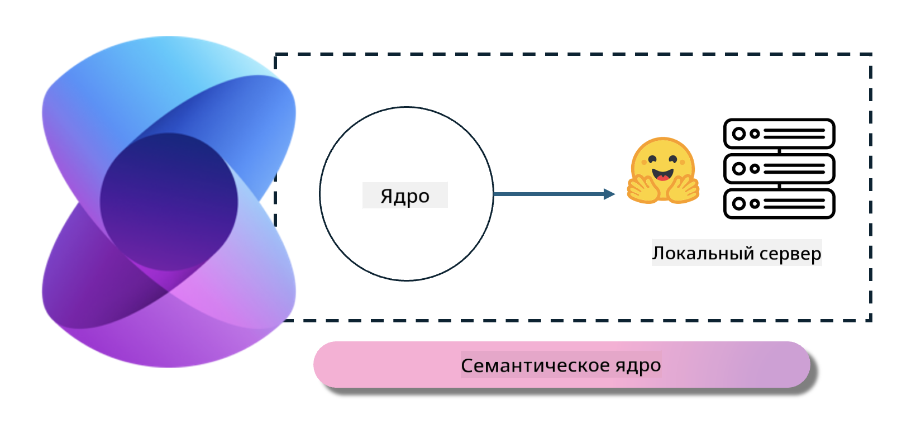
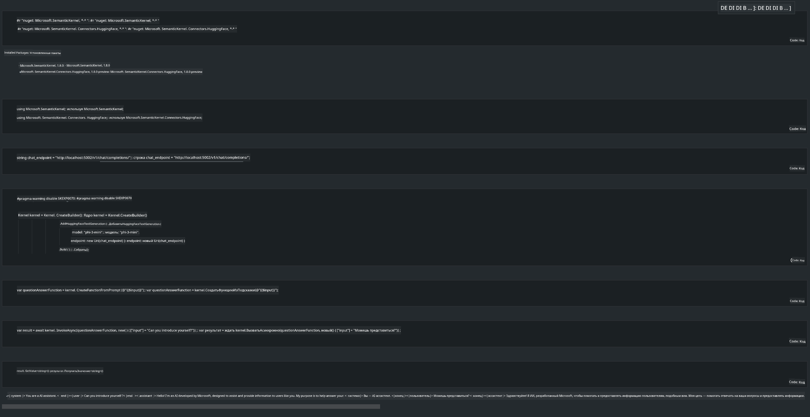

<!--
CO_OP_TRANSLATOR_METADATA:
{
  "original_hash": "bcf5dd7031db0031abdb9dd0c05ba118",
  "translation_date": "2025-03-27T07:42:56+00:00",
  "source_file": "md\\01.Introduction\\03\\Local_Server_Inference.md",
  "language_code": "ru"
}
-->
# **Развертывание Phi-3 на локальном сервере**

Мы можем развернуть Phi-3 на локальном сервере. Пользователи могут выбрать решения [Ollama](https://ollama.com) или [LM Studio](https://llamaedge.com), либо написать собственный код. Вы можете подключить локальные сервисы Phi-3 через [Semantic Kernel](https://github.com/microsoft/semantic-kernel?WT.mc_id=aiml-138114-kinfeylo) или [Langchain](https://www.langchain.com/) для создания приложений Copilot.

## **Использование Semantic Kernel для доступа к Phi-3-mini**

В приложении Copilot мы создаем приложения через Semantic Kernel / LangChain. Этот тип фреймворка приложений обычно совместим с Azure OpenAI Service / моделями OpenAI, а также может поддерживать модели с открытым исходным кодом на Hugging Face и локальные модели. Что делать, если мы хотим использовать Semantic Kernel для доступа к Phi-3-mini? На примере .NET мы можем комбинировать его с Hugging Face Connector в Semantic Kernel. По умолчанию он может соответствовать идентификатору модели на Hugging Face (при первом использовании модель будет загружена с Hugging Face, что занимает много времени). Вы также можете подключиться к развернутому локальному сервису. Сравнивая оба варианта, мы рекомендуем использовать второй, так как он обеспечивает большую степень автономии, особенно в корпоративных приложениях.

На рисунке показано, как доступ к локальным сервисам через Semantic Kernel позволяет легко подключить собственный сервер модели Phi-3-mini. Вот результат выполнения:

***Пример кода*** https://github.com/kinfey/Phi3MiniSamples/tree/main/semantickernel

**Отказ от ответственности**:  
Этот документ был переведен с использованием сервиса автоматического перевода [Co-op Translator](https://github.com/Azure/co-op-translator). Несмотря на наши усилия обеспечить точность, обратите внимание, что автоматический перевод может содержать ошибки или неточности. Оригинальный документ на его родном языке следует считать авторитетным источником. Для получения критически важной информации рекомендуется профессиональный перевод человеком. Мы не несем ответственности за любые недоразумения или неправильные толкования, возникающие в результате использования этого перевода.