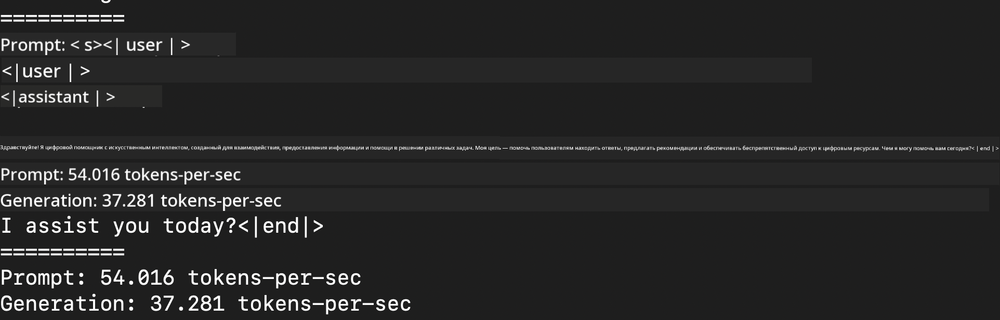
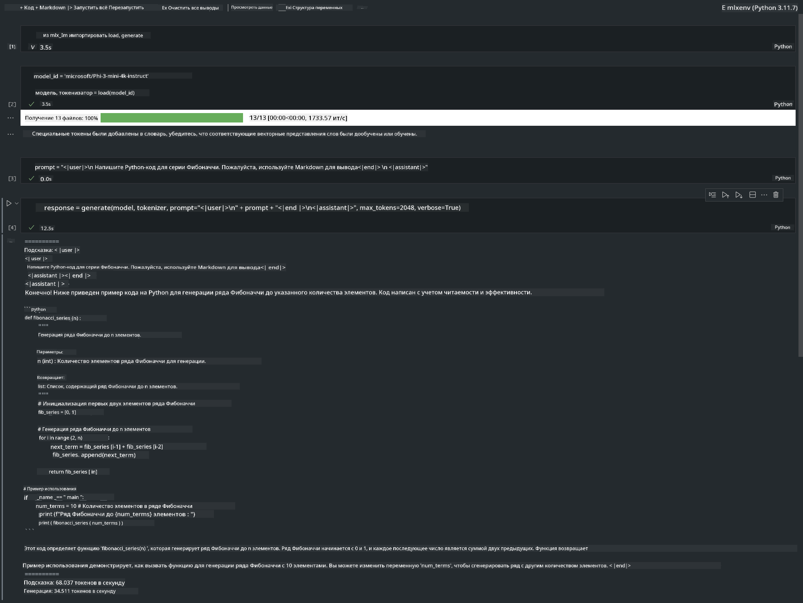

<!--
CO_OP_TRANSLATOR_METADATA:
{
  "original_hash": "dcb656f3d206fc4968e236deec5d4384",
  "translation_date": "2025-03-27T07:49:06+00:00",
  "source_file": "md\\01.Introduction\\03\\MLX_Inference.md",
  "language_code": "ru"
}
-->
# **Inference Phi-3 с использованием Apple MLX Framework**

## **Что такое MLX Framework**

MLX — это массивный фреймворк для исследований в области машинного обучения на процессорах Apple Silicon, разработанный исследователями Apple в области машинного обучения.

MLX создан исследователями машинного обучения для исследователей машинного обучения. Фреймворк разработан таким образом, чтобы быть удобным для пользователя, но при этом эффективным для обучения и развертывания моделей. Концептуально дизайн фреймворка также прост. Мы стремимся сделать его легким для расширения и улучшения, чтобы исследователи могли быстро изучать новые идеи.

LLM-модели могут ускоряться на устройствах Apple Silicon через MLX, и модели можно запускать локально с большим удобством.

## **Использование MLX для инференса Phi-3-mini**

### **1. Настройка окружения MLX**

1. Python 3.11.x  
2. Установите библиотеку MLX  

```bash

pip install mlx-lm

```

### **2. Запуск Phi-3-mini в терминале через MLX**

```bash

python -m mlx_lm.generate --model microsoft/Phi-3-mini-4k-instruct --max-token 2048 --prompt  "<|user|>\nCan you introduce yourself<|end|>\n<|assistant|>"

```

Результат (моё окружение: Apple M1 Max, 64GB):


### **3. Квантование Phi-3-mini через MLX в терминале**

```bash

python -m mlx_lm.convert --hf-path microsoft/Phi-3-mini-4k-instruct

```

***Примечание:*** Модель может быть квантована через mlx_lm.convert, и квантование по умолчанию — INT4. В этом примере Phi-3-mini квантуется до INT4.

Модель можно квантовать через mlx_lm.convert, при этом квантование по умолчанию — INT4. В данном примере Phi-3-mini квантуется до INT4. После квантования она будет сохранена в стандартном каталоге ./mlx_model.

Мы можем протестировать квантованную модель через MLX в терминале.

```bash

python -m mlx_lm.generate --model ./mlx_model/ --max-token 2048 --prompt  "<|user|>\nCan you introduce yourself<|end|>\n<|assistant|>"

```

Результат:



### **4. Запуск Phi-3-mini через MLX в Jupyter Notebook**



***Примечание:*** Пожалуйста, ознакомьтесь с этим примером [по ссылке](../../../../../code/03.Inference/MLX/MLX_DEMO.ipynb)

## **Ресурсы**

1. Узнайте больше о Apple MLX Framework [https://ml-explore.github.io](https://ml-explore.github.io/mlx/build/html/index.html)

2. Репозиторий Apple MLX на GitHub [https://github.com/ml-explore](https://github.com/ml-explore)

**Отказ от ответственности**:  
Этот документ был переведен с помощью сервиса автоматического перевода [Co-op Translator](https://github.com/Azure/co-op-translator). Хотя мы стремимся к точности, пожалуйста, учитывайте, что автоматические переводы могут содержать ошибки или неточности. Оригинальный документ на его родном языке должен считаться авторитетным источником. Для получения критически важной информации рекомендуется профессиональный перевод человеком. Мы не несем ответственности за любые недоразумения или неправильные интерпретации, возникающие в результате использования этого перевода.