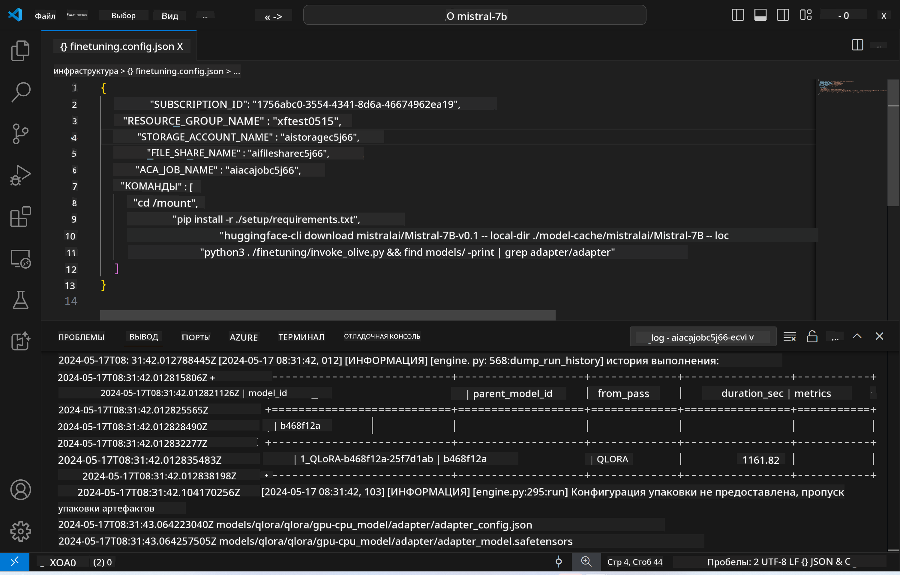
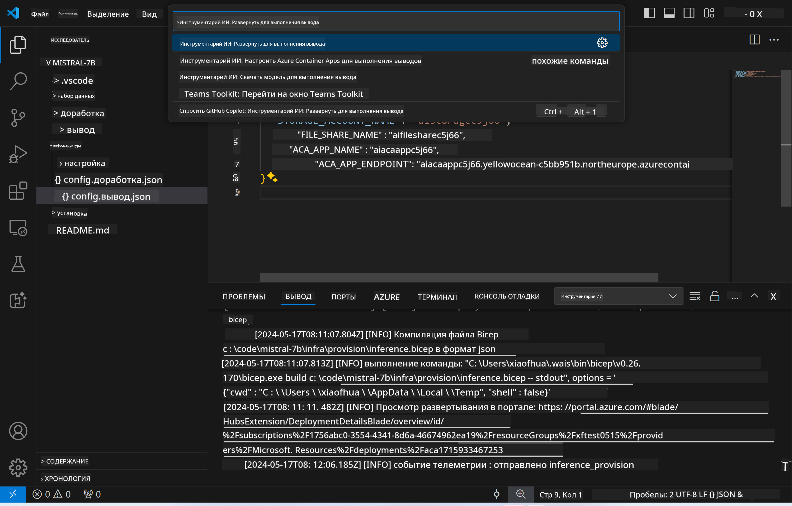
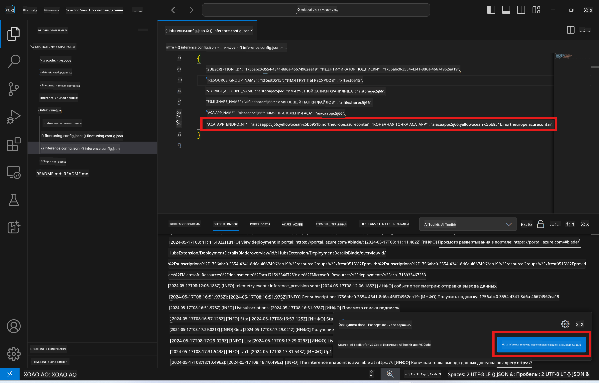

<!--
CO_OP_TRANSLATOR_METADATA:
{
  "original_hash": "a54cd3d65b6963e4e8ce21e143c3ab04",
  "translation_date": "2025-03-27T08:01:23+00:00",
  "source_file": "md\\01.Introduction\\03\\Remote_Interence.md",
  "language_code": "ru"
}
-->
# Удалённое использование модели с тонкой настройкой

После того как адаптеры обучены в удалённой среде, можно использовать простое приложение Gradio для взаимодействия с моделью.



### Настройка ресурсов Azure
Для удалённого использования необходимо настроить ресурсы Azure, выполнив команду `AI Toolkit: Provision Azure Container Apps for inference` через командную палитру. Во время настройки потребуется выбрать вашу подписку Azure и группу ресурсов.  


По умолчанию подписка и группа ресурсов для использования должны совпадать с теми, которые использовались для тонкой настройки. Для использования будет задействована та же среда Azure Container App, а модель и адаптер модели, сохранённые в Azure Files, будут использоваться, как и на этапе тонкой настройки.

## Использование AI Toolkit

### Развёртывание для использования  
Если вам нужно изменить код для использования или перезагрузить модель, выполните команду `AI Toolkit: Deploy for inference`. Это синхронизирует ваш последний код с ACA и перезапустит реплику.  



После успешного завершения развёртывания модель готова к оценке с использованием данного эндпоинта.

### Доступ к API использования

Вы можете получить доступ к API использования, нажав кнопку "*Go to Inference Endpoint*", отображаемую в уведомлении VSCode. Кроме того, веб-эндпоинт API можно найти под `ACA_APP_ENDPOINT` в `./infra/inference.config.json` и в панели вывода.



> **Примечание:** Эндпоинту использования может понадобиться несколько минут для полной готовности.

## Компоненты использования, включённые в шаблон

| Папка | Содержимое |
| ------ | --------- |
| `infra` | Содержит все необходимые конфигурации для удалённых операций. |
| `infra/provision/inference.parameters.json` | Содержит параметры для bicep-шаблонов, используемых для настройки ресурсов Azure для использования. |
| `infra/provision/inference.bicep` | Содержит шаблоны для настройки ресурсов Azure для использования. |
| `infra/inference.config.json` | Конфигурационный файл, созданный командой `AI Toolkit: Provision Azure Container Apps for inference`. Используется как входные данные для других команд удалённой палитры. |

### Использование AI Toolkit для настройки ресурсов Azure
Настройте [AI Toolkit](https://marketplace.visualstudio.com/items?itemName=ms-windows-ai-studio.windows-ai-studio)

Настройка Azure Container Apps для использования` command.

You can find configuration parameters in `./infra/provision/inference.parameters.json` file. Here are the details:
| Parameter | Description |
| --------- |------------ |
| `defaultCommands` | This is the commands to initiate a web API. |
| `maximumInstanceCount` | This parameter sets the maximum capacity of GPU instances. |
| `location` | This is the location where Azure resources are provisioned. The default value is the same as the chosen resource group's location. |
| `storageAccountName`, `fileShareName` `acaEnvironmentName`, `acaEnvironmentStorageName`, `acaAppName`,  `acaLogAnalyticsName` | These parameters are used to name the Azure resources for provision. By default, they will be same to the fine-tuning resource name. You can input a new, unused resource name to create your own custom-named resources, or you can input the name of an already existing Azure resource if you'd prefer to use that. For details, refer to the section [Using existing Azure Resources](../../../../../md/01.Introduction/03). |

### Using Existing Azure Resources

By default, the inference provision use the same Azure Container App Environment, Storage Account, Azure File Share, and Azure Log Analytics that were used for fine-tuning. A separate Azure Container App is created solely for the inference API. 

If you have customized the Azure resources during the fine-tuning step or want to use your own existing Azure resources for inference, specify their names in the `./infra/inference.parameters.json` файл. Затем выполните команду `AI Toolkit: Provision Azure Container Apps for inference` через командную палитру. Это обновит указанные ресурсы и создаст отсутствующие.

Например, если у вас уже есть существующая среда Azure Container, ваш `./infra/finetuning.parameters.json` должен выглядеть следующим образом:

```json
{
    "$schema": "https://schema.management.azure.com/schemas/2019-04-01/deploymentParameters.json#",
    "contentVersion": "1.0.0.0",
    "parameters": {
      ...
      "acaEnvironmentName": {
        "value": "<your-aca-env-name>"
      },
      "acaEnvironmentStorageName": {
        "value": null
      },
      ...
    }
  }
```

### Ручная настройка  
Если вы предпочитаете вручную настраивать ресурсы Azure, вы можете использовать предоставленные bicep-файлы в `./infra/provision` folders. If you have already set up and configured all the Azure resources without using the AI Toolkit command palette, you can simply enter the resource names in the `inference.config.json` файл.

Например:

```json
{
  "SUBSCRIPTION_ID": "<your-subscription-id>",
  "RESOURCE_GROUP_NAME": "<your-resource-group-name>",
  "STORAGE_ACCOUNT_NAME": "<your-storage-account-name>",
  "FILE_SHARE_NAME": "<your-file-share-name>",
  "ACA_APP_NAME": "<your-aca-name>",
  "ACA_APP_ENDPOINT": "<your-aca-endpoint>"
}
```

**Отказ от ответственности**:  
Этот документ был переведен с помощью сервиса автоматического перевода [Co-op Translator](https://github.com/Azure/co-op-translator). Хотя мы стремимся к точности, пожалуйста, учитывайте, что автоматические переводы могут содержать ошибки или неточности. Оригинальный документ на его исходном языке следует считать авторитетным источником. Для получения критически важной информации рекомендуется профессиональный перевод человеком. Мы не несем ответственности за любые недоразумения или неправильные интерпретации, возникающие в результате использования данного перевода.