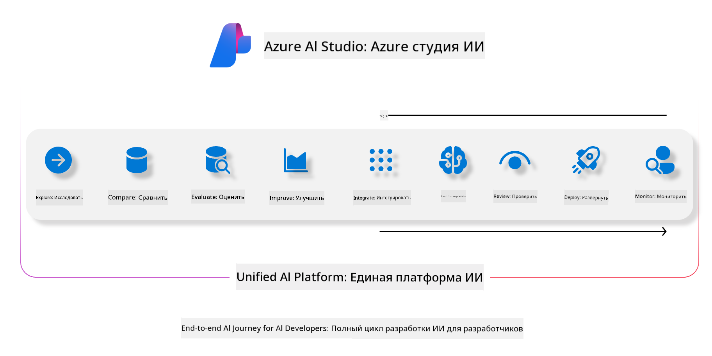
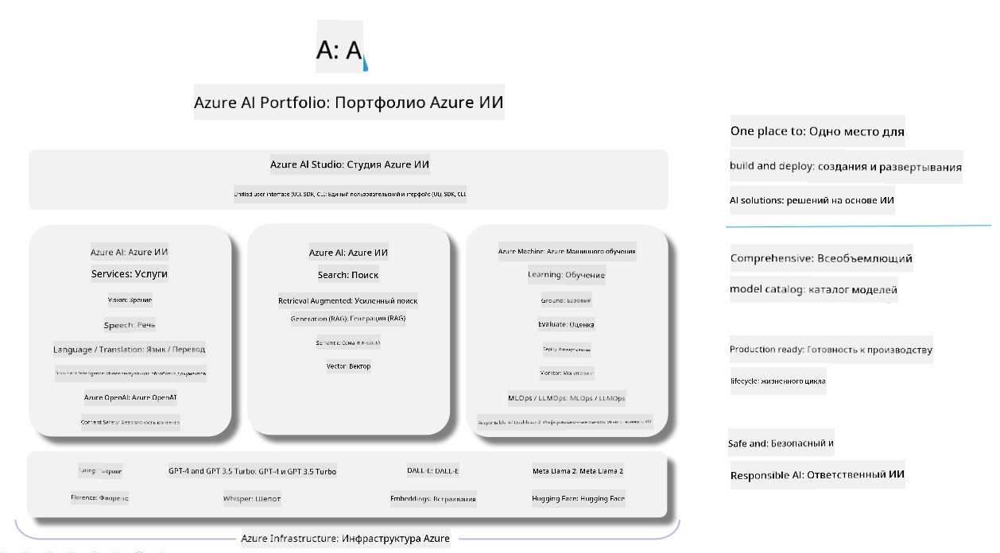

<!--
CO_OP_TRANSLATOR_METADATA:
{
  "original_hash": "7b4235159486df4000e16b7b46ddfec3",
  "translation_date": "2025-03-27T08:51:42+00:00",
  "source_file": "md\\01.Introduction\\05\\AIFoundry.md",
  "language_code": "ru"
}
-->
# **Использование Azure AI Foundry для оценки**

Как оценить ваше приложение с генеративным ИИ с помощью [Azure AI Foundry](https://ai.azure.com?WT.mc_id=aiml-138114-kinfeylo). Независимо от того, оцениваете ли вы одноходовые или многоходовые диалоги, Azure AI Foundry предоставляет инструменты для оценки производительности и безопасности моделей.

## Как оценивать приложения с генеративным ИИ с помощью Azure AI Foundry
Для получения более подробных инструкций обратитесь к [документации Azure AI Foundry](https://learn.microsoft.com/azure/ai-studio/how-to/evaluate-generative-ai-app?WT.mc_id=aiml-138114-kinfeylo).

Вот шаги, чтобы начать:

## Оценка генеративных моделей ИИ в Azure AI Foundry

**Необходимые условия**

- Тестовый набор данных в формате CSV или JSON.
- Развернутая генеративная модель ИИ (например, Phi-3, GPT 3.5, GPT 4 или модели Davinci).
- Среда выполнения с вычислительным экземпляром для проведения оценки.

## Встроенные метрики оценки

Azure AI Foundry позволяет оценивать как одноходовые, так и сложные многоходовые диалоги.  
Для сценариев с использованием Retrieval Augmented Generation (RAG), где модель опирается на конкретные данные, вы можете оценить производительность с помощью встроенных метрик оценки.  
Кроме того, вы можете оценивать общие сценарии одноходового ответа на вопросы (не RAG).

## Создание оценки

В интерфейсе Azure AI Foundry перейдите на страницу Evaluate или Prompt Flow.  
Следуйте мастеру создания оценки, чтобы настроить запуск оценки. Укажите необязательное имя для вашей оценки.  
Выберите сценарий, который соответствует целям вашего приложения.  
Выберите одну или несколько метрик оценки для анализа выходных данных модели.

## Пользовательский процесс оценки (опционально)

Для большей гибкости вы можете настроить пользовательский процесс оценки. Настройте процесс оценки в зависимости от ваших конкретных требований.

## Просмотр результатов

После выполнения оценки вы можете записывать, просматривать и анализировать детализированные метрики оценки в Azure AI Foundry. Это поможет получить представление о возможностях и ограничениях вашего приложения.

**Примечание** Azure AI Foundry в настоящее время находится в публичной предварительной версии, поэтому используйте его для экспериментов и разработки. Для рабочих нагрузок в продакшене рассмотрите другие варианты. Изучите официальную [документацию AI Foundry](https://learn.microsoft.com/azure/ai-studio/?WT.mc_id=aiml-138114-kinfeylo) для получения дополнительных деталей и пошаговых инструкций.

**Отказ от ответственности**:  
Этот документ был переведен с использованием сервиса автоматического перевода [Co-op Translator](https://github.com/Azure/co-op-translator). Несмотря на наше стремление к точности, имейте в виду, что автоматические переводы могут содержать ошибки или неточности. Оригинальный документ на его родном языке должен считаться авторитетным источником. Для получения важной информации рекомендуется профессиональный перевод человеком. Мы не несем ответственности за любые недоразумения или неверные интерпретации, возникшие в результате использования данного перевода.