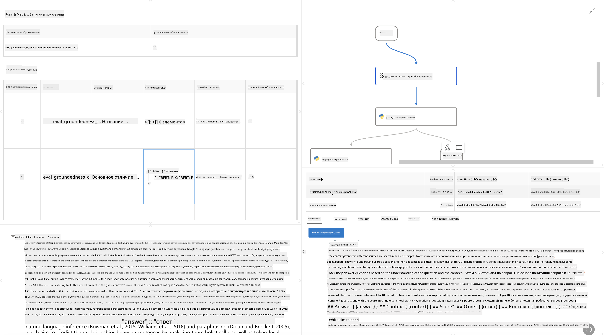

<!--
CO_OP_TRANSLATOR_METADATA:
{
  "original_hash": "3cbe7629d254f1043193b7fe22524d55",
  "translation_date": "2025-03-27T09:00:49+00:00",
  "source_file": "md\\01.Introduction\\05\\Promptflow.md",
  "language_code": "ru"
}
-->
# **Представляем Promptflow**

[Microsoft Prompt Flow](https://microsoft.github.io/promptflow/index.html?WT.mc_id=aiml-138114-kinfeylo) — это визуальный инструмент автоматизации рабочих процессов, который позволяет пользователям создавать автоматизированные процессы с использованием готовых шаблонов и пользовательских коннекторов. Он предназначен для того, чтобы разработчики и бизнес-аналитики могли быстро создавать автоматизированные процессы для задач, таких как управление данными, совместная работа и оптимизация процессов. С помощью Prompt Flow пользователи могут легко подключать различные сервисы, приложения и системы, а также автоматизировать сложные бизнес-процессы.

Microsoft Prompt Flow создан для упрощения полного цикла разработки AI-приложений, основанных на больших языковых моделях (LLMs). Независимо от того, на какой стадии вы находитесь — создание идей, прототипирование, тестирование, оценка или развертывание приложений на базе LLM — Prompt Flow упрощает процесс и помогает создавать приложения с качеством, готовым к производству.

## Основные возможности и преимущества Microsoft Prompt Flow:

**Интерактивный опыт разработки**

Prompt Flow предоставляет визуальное представление структуры вашего процесса, что делает проекты понятными и удобными для навигации.  
Он предлагает опыт разработки, похожий на работу с блокнотами, для эффективного создания и отладки потоков.

**Варианты подсказок и настройка**

Создавайте и сравнивайте несколько вариантов подсказок, чтобы облегчить процесс их итеративной доработки.  
Оценивайте эффективность различных подсказок и выбирайте наиболее успешные.

**Встроенные потоки оценки**

Оценивайте качество и эффективность ваших подсказок и процессов с помощью встроенных инструментов оценки.  
Понимайте, насколько хорошо работают ваши приложения на основе LLM.

**Обширные ресурсы**

Prompt Flow включает библиотеку встроенных инструментов, примеров и шаблонов. Эти ресурсы служат отправной точкой для разработки, вдохновляют и ускоряют процесс.

**Совместная работа и готовность для бизнеса**

Поддерживайте командное взаимодействие, позволяя нескольким пользователям работать вместе над проектами инженерии подсказок.  
Обеспечивайте контроль версий и эффективно делитесь знаниями.  
Упрощайте весь процесс инженерии подсказок — от разработки и оценки до развертывания и мониторинга.

## Оценка в Prompt Flow

В Microsoft Prompt Flow оценка играет ключевую роль в анализе эффективности ваших AI-моделей. Давайте рассмотрим, как можно настроить потоки оценки и метрики в Prompt Flow:

**Понимание оценки в Prompt Flow**

В Prompt Flow поток представляет собой последовательность узлов, которые обрабатывают входные данные и создают выходные. Потоки оценки — это особый тип потоков, предназначенный для анализа эффективности выполнения на основе определенных критериев и целей.

**Основные особенности потоков оценки**

Они обычно запускаются после тестируемого потока, используя его результаты.  
Они вычисляют баллы или метрики для измерения эффективности тестируемого потока.  
Метрики могут включать точность, релевантность или любые другие важные показатели.

### Настройка потоков оценки

**Определение входных данных**

Потоки оценки должны принимать результаты тестируемого выполнения. Определяйте входные данные так же, как и для стандартных потоков.  
Например, если вы оцениваете поток QnA, назовите вход "ответ." Если оцениваете поток классификации, назовите вход "категория." Также могут понадобиться входные данные с эталонными значениями (например, фактические метки).

**Выходные данные и метрики**

Потоки оценки создают результаты, которые измеряют эффективность тестируемого потока.  
Метрики могут быть вычислены с использованием Python или LLM (больших языковых моделей). Используйте функцию log_metric(), чтобы записывать соответствующие метрики.

**Использование настроенных потоков оценки**

Разрабатывайте собственные потоки оценки, адаптированные к вашим задачам и целям.  
Настраивайте метрики в соответствии с вашими целями оценки.  
Применяйте эти настроенные потоки оценки для пакетных запусков для масштабного тестирования.

## Встроенные методы оценки

Prompt Flow также предоставляет встроенные методы оценки.  
Вы можете отправлять пакетные запуски и использовать эти методы для анализа того, насколько хорошо ваш поток работает с большими наборами данных.  
Просматривайте результаты оценки, сравнивайте метрики и вносите изменения по мере необходимости.  
Помните, что оценка важна для обеспечения соответствия AI-моделей желаемым критериям и целям. Ознакомьтесь с официальной документацией для получения подробных инструкций по разработке и использованию потоков оценки в Microsoft Prompt Flow.

В заключение, Microsoft Prompt Flow помогает разработчикам создавать высококачественные приложения на основе LLM, упрощая процесс инженерии подсказок и предоставляя мощную среду разработки. Если вы работаете с LLM, Prompt Flow — это инструмент, который стоит изучить. Ознакомьтесь с [документацией по оценке Prompt Flow](https://learn.microsoft.com/azure/machine-learning/prompt-flow/how-to-develop-an-evaluation-flow?view=azureml-api-2?WT.mc_id=aiml-138114-kinfeylo) для получения подробных инструкций по разработке и использованию потоков оценки в Microsoft Prompt Flow.

**Отказ от ответственности**:  
Этот документ был переведен с использованием сервиса автоматического перевода [Co-op Translator](https://github.com/Azure/co-op-translator). Несмотря на наше стремление к точности, автоматические переводы могут содержать ошибки или неточности. Оригинальный документ на исходном языке следует считать авторитетным источником. Для получения критически важной информации рекомендуется профессиональный перевод человеком. Мы не несем ответственности за любые недоразумения или неправильные интерпретации, возникшие в результате использования данного перевода.