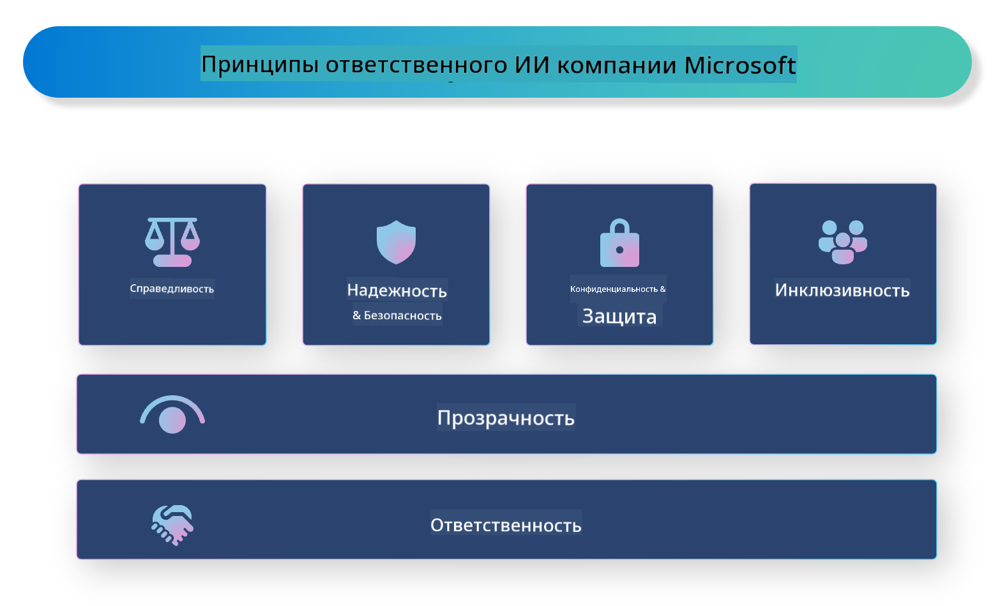

<!--
CO_OP_TRANSLATOR_METADATA:
{
  "original_hash": "805b96b20152936d8f4c587d90d6e06e",
  "translation_date": "2025-03-27T09:11:25+00:00",
  "source_file": "md\\01.Introduction\\05\\ResponsibleAI.md",
  "language_code": "ru"
}
-->
# **Введение в ответственный ИИ**

[Microsoft Responsible AI](https://www.microsoft.com/ai/responsible-ai?WT.mc_id=aiml-138114-kinfeylo) — это инициатива, направленная на помощь разработчикам и организациям в создании ИИ-систем, которые являются прозрачными, заслуживающими доверия и подотчетными. Инициатива предоставляет рекомендации и ресурсы для разработки ответственных ИИ-решений, соответствующих этическим принципам, таким как конфиденциальность, справедливость и прозрачность. Мы также рассмотрим некоторые вызовы и лучшие практики, связанные с созданием ответственных ИИ-систем.

## Обзор Microsoft Responsible AI

**Этические принципы**

Microsoft Responsible AI основывается на наборе этических принципов, таких как конфиденциальность, справедливость, прозрачность, подотчетность и безопасность. Эти принципы разработаны для обеспечения того, чтобы ИИ-системы создавались этично и ответственно.

**Прозрачный ИИ**

Microsoft Responsible AI подчеркивает важность прозрачности в ИИ-системах. Это включает предоставление четких объяснений того, как работают модели ИИ, а также обеспечение публичного доступа к источникам данных и алгоритмам.

**Подотчетный ИИ**

[Microsoft Responsible AI](https://www.microsoft.com/ai/responsible-ai?WT.mc_id=aiml-138114-kinfeylo) способствует разработке подотчетных ИИ-систем, которые могут предоставлять информацию о том, как модели ИИ принимают решения. Это помогает пользователям понимать и доверять результатам работы ИИ.

**Инклюзивность**

ИИ-системы должны быть разработаны так, чтобы приносить пользу всем. Microsoft стремится создавать инклюзивный ИИ, учитывающий разнообразные точки зрения и избегающий предвзятости или дискриминации.

**Надежность и безопасность**

Обеспечение надежности и безопасности ИИ-систем является критически важным. Microsoft сосредотачивается на создании устойчивых моделей, которые работают стабильно и избегают вредных последствий.

**Справедливость в ИИ**

Microsoft Responsible AI признает, что ИИ-системы могут воспроизводить предвзятости, если они обучены на предвзятых данных или алгоритмах. Инициатива предоставляет рекомендации по разработке справедливых ИИ-систем, которые не дискриминируют на основе таких факторов, как раса, пол или возраст.

**Конфиденциальность и безопасность**

Microsoft Responsible AI акцентирует внимание на защите конфиденциальности пользователей и безопасности данных в ИИ-системах. Это включает использование надежного шифрования данных и контроль доступа, а также регулярные аудиты ИИ-систем на наличие уязвимостей.

**Подотчетность и ответственность**

Microsoft Responsible AI продвигает принципы подотчетности и ответственности в разработке и внедрении ИИ. Это включает обеспечение осведомленности разработчиков и организаций о возможных рисках, связанных с ИИ-системами, и принятие мер по их минимизации.

## Лучшие практики создания ответственных ИИ-систем

**Разработка моделей ИИ с использованием разнообразных наборов данных**

Чтобы избежать предвзятости в ИИ-системах, важно использовать разнообразные наборы данных, которые представляют широкий спектр точек зрения и опыта.

**Использование объяснимых методов ИИ**

Объяснимые методы ИИ помогают пользователям понять, как модели ИИ принимают решения, что может повысить доверие к системе.

**Регулярный аудит ИИ-систем на уязвимости**

Регулярные аудиты ИИ-систем помогают выявлять потенциальные риски и уязвимости, требующие устранения.

**Реализация надежного шифрования данных и контроля доступа**

Шифрование данных и контроль доступа помогают защитить конфиденциальность и безопасность пользователей в ИИ-системах.

**Следование этическим принципам в разработке ИИ**

Следование этическим принципам, таким как справедливость, прозрачность и подотчетность, помогает укрепить доверие к ИИ-системам и обеспечить их ответственное создание.

## Использование AI Foundry для ответственного ИИ

[Azure AI Foundry](https://ai.azure.com?WT.mc_id=aiml-138114-kinfeylo) — это мощная платформа, которая позволяет разработчикам и организациям быстро создавать интеллектуальные, передовые, готовые к рынку и ответственные приложения. Вот некоторые ключевые функции и возможности Azure AI Foundry:

**Готовые API и модели**

Azure AI Foundry предоставляет предварительно настроенные и настраиваемые API и модели. Они охватывают широкий спектр задач ИИ, включая генеративный ИИ, обработку естественного языка для диалогов, поиск, мониторинг, перевод, речь, зрение и принятие решений.

**Prompt Flow**

Prompt Flow в Azure AI Foundry позволяет создавать диалоговые ИИ-опыты. Это дает возможность проектировать и управлять диалоговыми потоками, что упрощает создание чат-ботов, виртуальных ассистентов и других интерактивных приложений.

**Методика Retrieval Augmented Generation (RAG)**

RAG — это техника, которая сочетает подходы на основе извлечения данных и генерации. Она улучшает качество создаваемых ответов, используя как существующие знания (извлечение), так и творческую генерацию.

**Оценка и мониторинг метрик для генеративного ИИ**

Azure AI Foundry предоставляет инструменты для оценки и мониторинга генеративных моделей ИИ. Вы можете оценивать их производительность, справедливость и другие важные метрики для обеспечения ответственного развертывания. Кроме того, если вы создали дашборд, вы можете использовать интерфейс без кода в Azure Machine Learning Studio для настройки и создания панели Responsible AI и связанной с ней карты показателей на основе библиотек Python из [Responsible AI Toolbox](https://responsibleaitoolbox.ai/?WT.mc_id=aiml-138114-kinfeylo). Эта карта помогает делиться ключевыми данными о справедливости, важности признаков и других аспектах ответственного развертывания как с техническими, так и с нетехническими заинтересованными сторонами.

Для использования AI Foundry с ответственным ИИ можно следовать следующим лучшим практикам:

**Определите проблему и цели вашей ИИ-системы**

Перед началом разработки важно четко определить проблему или цель, которую ваша ИИ-система должна решить. Это поможет определить данные, алгоритмы и ресурсы, необходимые для создания эффективной модели.

**Сбор и предварительная обработка релевантных данных**

Качество и объем данных, используемых для обучения ИИ-системы, могут существенно влиять на ее производительность. Поэтому важно собирать релевантные данные, очищать их, предварительно обрабатывать и обеспечивать их репрезентативность для решаемой задачи.

**Выбор подходящей оценки**

Существует множество алгоритмов оценки. Важно выбрать наиболее подходящий алгоритм на основе ваших данных и задачи.

**Оценка и интерпретация модели**

После создания модели ИИ важно оценить ее производительность, используя соответствующие метрики, и интерпретировать результаты прозрачно. Это поможет выявить любые предвзятости или ограничения модели и внести необходимые улучшения.

**Обеспечение прозрачности и объяснимости**

ИИ-системы должны быть прозрачными и объяснимыми, чтобы пользователи могли понять, как они работают и как принимаются решения. Это особенно важно для приложений, которые существенно влияют на человеческую жизнь, таких как здравоохранение, финансы и юридические системы.

**Мониторинг и обновление модели**

ИИ-системы должны постоянно мониториться и обновляться, чтобы оставаться точными и эффективными со временем. Это требует постоянного обслуживания, тестирования и повторного обучения модели.

В заключение, Microsoft Responsible AI — это инициатива, направленная на помощь разработчикам и организациям в создании ИИ-систем, которые являются прозрачными, заслуживающими доверия и подотчетными. Помните, что реализация ответственного ИИ крайне важна, и Azure AI Foundry делает это практичным для организаций. Следуя этическим принципам и лучшим практикам, мы можем гарантировать, что ИИ-системы создаются и внедряются ответственно, принося пользу обществу в целом.

**Отказ от ответственности**:  
Этот документ был переведен с использованием сервиса автоматического перевода [Co-op Translator](https://github.com/Azure/co-op-translator). Несмотря на наши усилия обеспечить точность перевода, следует учитывать, что автоматические переводы могут содержать ошибки или неточности. Оригинальный документ на его родном языке должен считаться авторитетным источником. Для получения критически важной информации рекомендуется профессиональный перевод человеком. Мы не несем ответственности за любые недоразумения или неверные интерпретации, возникающие в результате использования данного перевода.