<!--
CO_OP_TRANSLATOR_METADATA:
{
  "original_hash": "ecbd9179a21edbaafaf114d47f09f3e3",
  "translation_date": "2025-03-27T10:21:38+00:00",
  "source_file": "md\\02.Application\\01.TextAndChat\\Phi3\\E2E_Phi-3-FineTuning_PromptFlow_Integration_AIFoundry.md",
  "language_code": "ru"
}
-->
# Настройка и интеграция пользовательских моделей Phi-3 с помощью Prompt flow в Azure AI Foundry

Этот пошаговый пример основан на руководстве "[Настройка и интеграция пользовательских моделей Phi-3 с помощью Prompt Flow в Azure AI Foundry](https://techcommunity.microsoft.com/t5/educator-developer-blog/fine-tune-and-integrate-custom-phi-3-models-with-prompt-flow-in/ba-p/4191726?WT.mc_id=aiml-137032-kinfeylo)" из Microsoft Tech Community. Он описывает процессы настройки, развертывания и интеграции пользовательских моделей Phi-3 с помощью Prompt flow в Azure AI Foundry.  
В отличие от другого примера "[Настройка и интеграция пользовательских моделей Phi-3 с помощью Prompt Flow](./E2E_Phi-3-FineTuning_PromptFlow_Integration.md)", который включает выполнение кода локально, это руководство полностью сосредоточено на настройке и интеграции модели в Azure AI / ML Studio.

## Обзор

В этом пошаговом примере вы узнаете, как настроить модель Phi-3 и интегрировать ее с Prompt flow в Azure AI Foundry. Используя Azure AI / ML Studio, вы создадите рабочий процесс для развертывания и использования пользовательских AI моделей. Этот пример разделен на три сценария:

**Сценарий 1: Настройка ресурсов Azure и подготовка к настройке**

**Сценарий 2: Настройка модели Phi-3 и развертывание в Azure Machine Learning Studio**

**Сценарий 3: Интеграция с Prompt flow и работа с вашей пользовательской моделью в Azure AI Foundry**

Вот обзор этого пошагового примера:

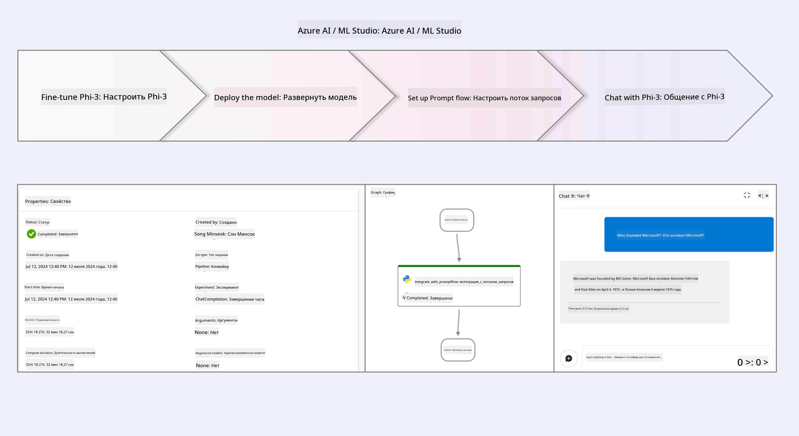

### Содержание

1. **[Сценарий 1: Настройка ресурсов Azure и подготовка к настройке](../../../../../../md/02.Application/01.TextAndChat/Phi3)**
    - [Создание рабочего пространства Azure Machine Learning](../../../../../../md/02.Application/01.TextAndChat/Phi3)
    - [Запрос квот на GPU в подписке Azure](../../../../../../md/02.Application/01.TextAndChat/Phi3)
    - [Добавление назначения роли](../../../../../../md/02.Application/01.TextAndChat/Phi3)
    - [Настройка проекта](../../../../../../md/02.Application/01.TextAndChat/Phi3)
    - [Подготовка набора данных для настройки](../../../../../../md/02.Application/01.TextAndChat/Phi3)

1. **[Сценарий 2: Настройка модели Phi-3 и развертывание в Azure Machine Learning Studio](../../../../../../md/02.Application/01.TextAndChat/Phi3)**
    - [Настройка модели Phi-3](../../../../../../md/02.Application/01.TextAndChat/Phi3)
    - [Развертывание настроенной модели Phi-3](../../../../../../md/02.Application/01.TextAndChat/Phi3)

1. **[Сценарий 3: Интеграция с Prompt flow и работа с вашей пользовательской моделью в Azure AI Foundry](../../../../../../md/02.Application/01.TextAndChat/Phi3)**
    - [Интеграция пользовательской модели Phi-3 с Prompt flow](../../../../../../md/02.Application/01.TextAndChat/Phi3)
    - [Работа с вашей пользовательской моделью Phi-3](../../../../../../md/02.Application/01.TextAndChat/Phi3)

## Сценарий 1: Настройка ресурсов Azure и подготовка к настройке

### Создание рабочего пространства Azure Machine Learning

1. Введите *azure machine learning* в **строке поиска** в верхней части страницы портала и выберите **Azure Machine Learning** из появившихся вариантов.

    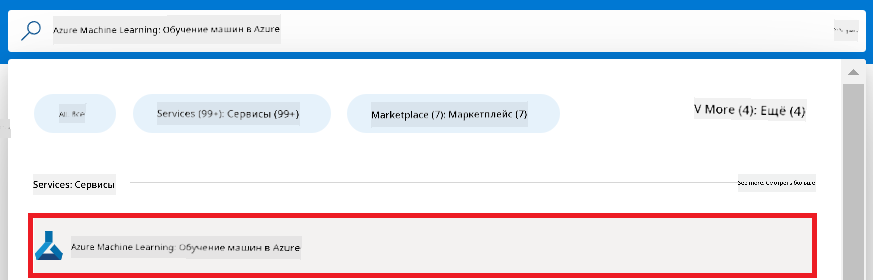

2. Выберите **+ Создать** в меню навигации.

3. Выберите **Новое рабочее пространство** в меню навигации.

    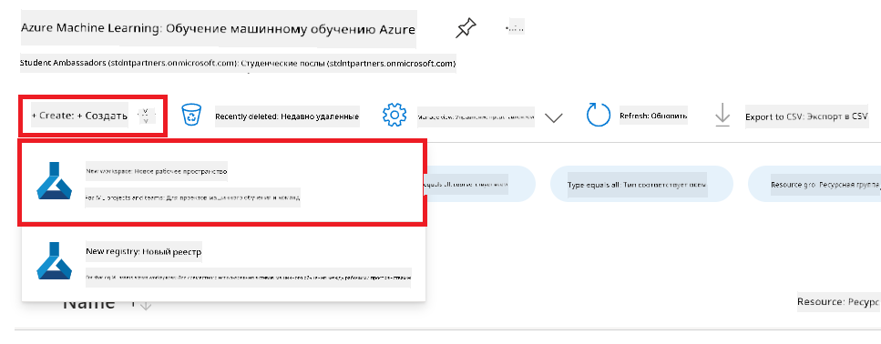

4. Выполните следующие действия:

    - Выберите свою подписку Azure **Subscription**.
    - Выберите **Группу ресурсов** для использования (при необходимости создайте новую).
    - Введите **Имя рабочего пространства**. Оно должно быть уникальным.
    - Выберите **Регион**, который вы хотите использовать.
    - Выберите **Учетную запись хранения** для использования (при необходимости создайте новую).
    - Выберите **Key Vault** для использования (при необходимости создайте новый).
    - Выберите **Application Insights** для использования (при необходимости создайте новый).
    - Выберите **Реестр контейнеров** для использования (при необходимости создайте новый).

    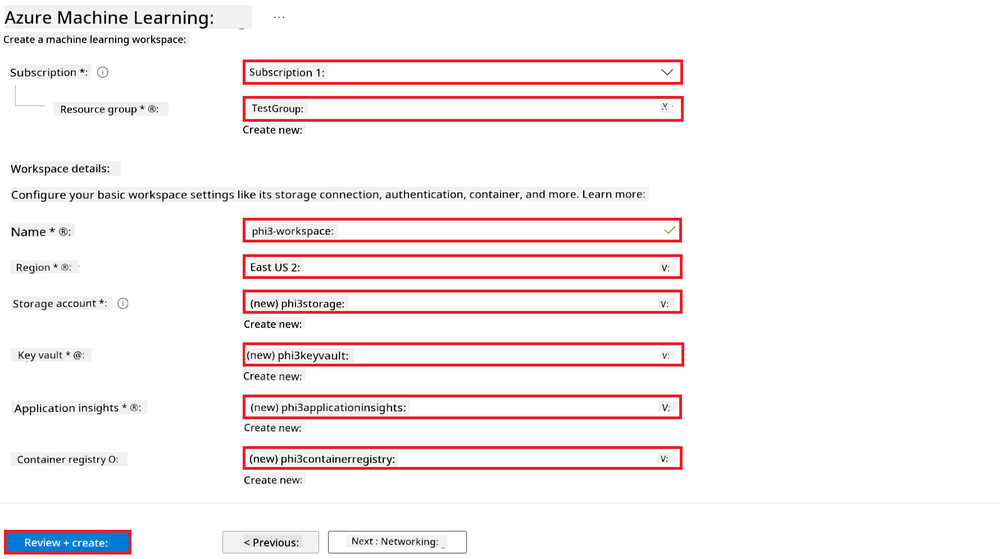

5. Выберите **Обзор + Создать**.

6. Нажмите **Создать**.

### Запрос квот на GPU в подписке Azure

В этом уроке вы узнаете, как настраивать и развертывать модель Phi-3 с использованием GPU. Для настройки вы будете использовать GPU *Standard_NC24ads_A100_v4*, для чего потребуется запрос квоты. Для развертывания вы будете использовать GPU *Standard_NC6s_v3*, для которого также потребуется запрос квоты.

> [!NOTE]
>
> Только подписки Pay-As-You-Go (стандартный тип подписки) подходят для выделения GPU; подписки с льготами в настоящее время не поддерживаются.

1. Перейдите на [Azure ML Studio](https://ml.azure.com/home?wt.mc_id=studentamb_279723).

1. Выполните следующие действия, чтобы запросить квоту для *Standard NCADSA100v4 Family*:

    - Выберите **Квота** в левой панели.
    - Выберите **Семейство виртуальных машин** для использования. Например, выберите **Standard NCADSA100v4 Family Cluster Dedicated vCPUs**, который включает GPU *Standard_NC24ads_A100_v4*.
    - Выберите **Запросить квоту** в меню навигации.

        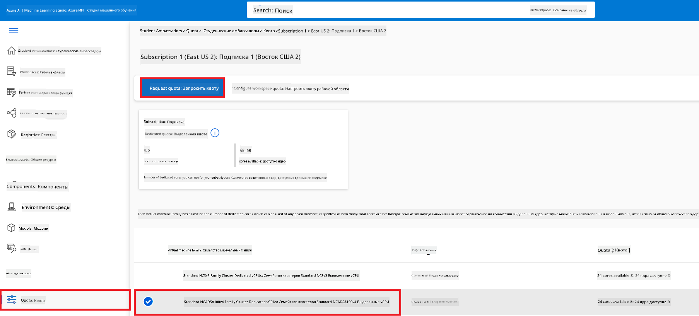

    - На странице запроса квоты введите **Новое ограничение ядер**, которое вы хотите использовать. Например, 24.
    - Нажмите **Отправить**, чтобы запросить квоту GPU.

1. Выполните аналогичные действия, чтобы запросить квоту для *Standard NCSv3 Family*:

    - Выберите **Квота** в левой панели.
    - Выберите **Семейство виртуальных машин** для использования. Например, выберите **Standard NCSv3 Family Cluster Dedicated vCPUs**, который включает GPU *Standard_NC6s_v3*.
    - Нажмите **Запросить квоту** в меню навигации.
    - На странице запроса квоты введите **Новое ограничение ядер**, которое вы хотите использовать. Например, 24.
    - Нажмите **Отправить**, чтобы запросить квоту GPU.

### Добавление назначения роли

Для настройки и развертывания ваших моделей сначала необходимо создать управляемую идентичность пользователя (User Assigned Managed Identity, UAI) и назначить ей соответствующие разрешения. Эта UAI будет использоваться для аутентификации при развертывании.

#### Создание управляемой идентичности пользователя (UAI)

1. Введите *managed identities* в **строке поиска** в верхней части страницы портала и выберите **Managed Identities** из появившихся вариантов.

    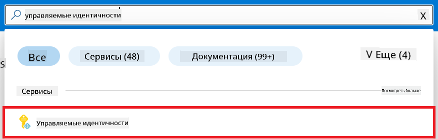

1. Нажмите **+ Создать**.

    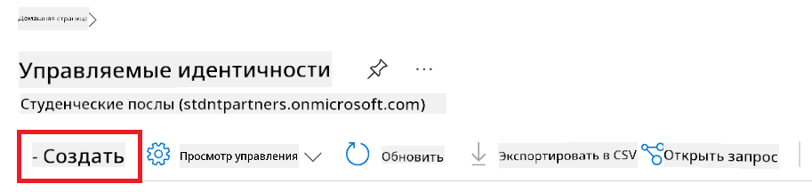

1. Выполните следующие действия:

    - Выберите свою подписку Azure **Subscription**.
    - Выберите **Группу ресурсов** для использования (при необходимости создайте новую).
    - Выберите **Регион**, который вы хотите использовать.
    - Введите **Имя**. Оно должно быть уникальным.

    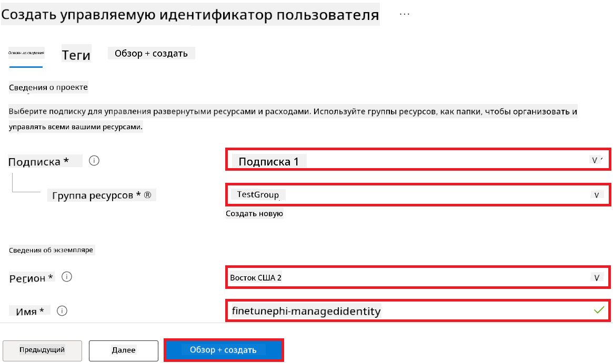

1. Выберите **Обзор + создать**.

1. Нажмите **Создать**.

#### Добавление роли "Сотрудник" к управляемой идентичности

1. Перейдите к ресурсу управляемой идентичности, который вы создали.

1. Выберите **Назначения ролей Azure** в левой панели.

1. Нажмите **+Добавить назначение роли** в меню навигации.

1. На странице назначения роли выполните следующие действия:
    - Установите **Область действия** как **Группа ресурсов**.
    - Выберите свою подписку Azure **Subscription**.
    - Выберите **Группу ресурсов** для использования.
    - Установите **Роль** как **Сотрудник**.

    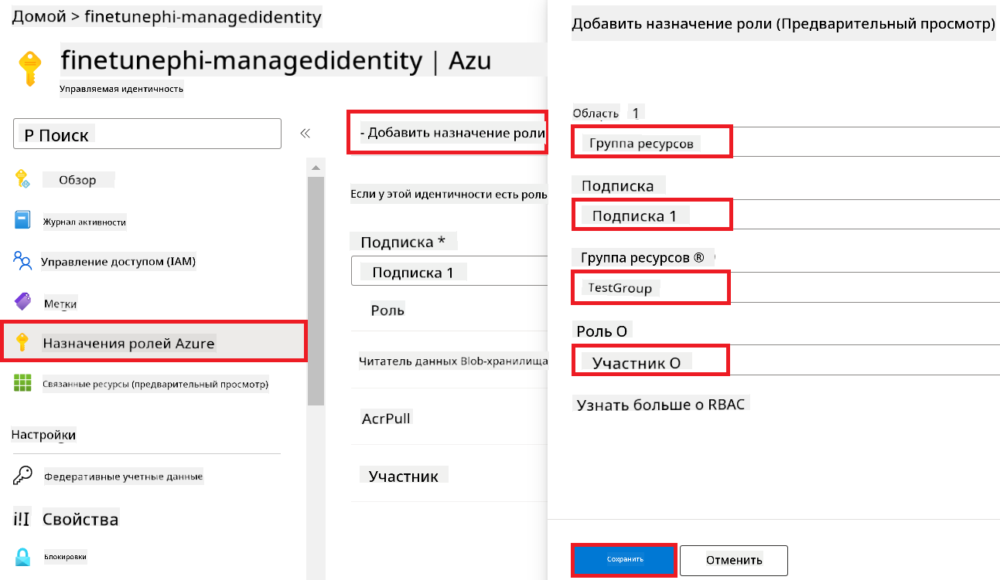

2. Нажмите **Сохранить**.

#### Добавление роли "Читатель данных Blob-хранилища" к управляемой идентичности

1. Введите *storage accounts* в **строке поиска** в верхней части страницы портала и выберите **Storage accounts** из появившихся вариантов.

    

1. Выберите учетную запись хранилища, связанную с рабочим пространством Azure Machine Learning, которое вы создали. Например, *finetunephistorage*.

1. Выполните следующие действия для перехода на страницу добавления назначения роли:

    - Перейдите к учетной записи хранилища Azure, которую вы создали.
    - Выберите **Управление доступом (IAM)** в левой панели.
    - Нажмите **+ Добавить** в меню навигации.
    - Выберите **Добавить назначение роли** в меню навигации.

    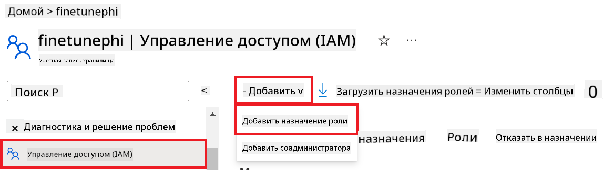

1. На странице назначения роли выполните следующие действия:

    - На странице Роль введите *Storage Blob Data Reader* в **строке поиска** и выберите **Storage Blob Data Reader** из появившихся вариантов.
    - Нажмите **Далее**.
    - На странице Участники выберите **Назначить доступ к** **Managed identity**.
    - Нажмите **+ Выбрать участников**.
    - На странице выбора управляемых идентичностей выберите свою подписку Azure **Subscription**.
    - Выберите **Управляемую идентичность** для назначения.
    - Выберите управляемую идентичность, которую вы создали. Например, *finetunephi-managedidentity*.
    - Нажмите **Выбрать**.

    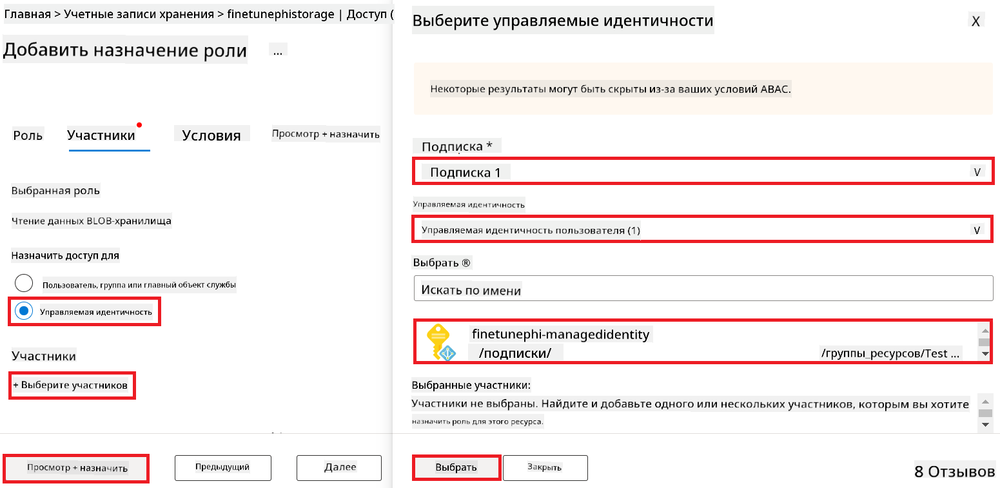

1. Нажмите **Обзор + назначить**.

#### Добавление роли "AcrPull" к управляемой идентичности

1. Введите *container registries* в **строке поиска** в верхней части страницы портала и выберите **Container registries** из появившихся вариантов.

    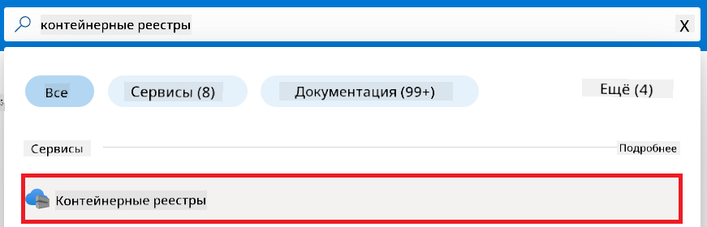

1. Выберите реестр контейнеров, связанный с рабочим пространством Azure Machine Learning. Например, *finetunephicontainerregistry*.

1. Выполните следующие действия для перехода на страницу добавления назначения роли:

    - Выберите **Управление доступом (IAM)** в левой панели.
    - Нажмите **+ Добавить** в меню навигации.
    - Выберите **Добавить назначение роли** в меню навигации.

1. На странице назначения роли выполните следующие действия:

    - На странице Роль введите *AcrPull* в **строке поиска** и выберите **AcrPull** из появившихся вариантов.
    - Нажмите **Далее**.
    - На странице Участники выберите **Назначить доступ к** **Managed identity**.
    - Нажмите **+ Выбрать участников**.
    - На странице выбора управляемых идентичностей выберите свою подписку Azure **Subscription**.
    - Выберите **Управляемую идентичность** для назначения.
    - Выберите управляемую идентичность, которую вы создали. Например, *finetunephi-managedidentity*.
    - Нажмите **Выбрать**.
    - Нажмите **Обзор + назначить**.

### Настройка проекта

Для загрузки наборов данных, необходимых для настройки, вы создадите локальную среду.

В этом упражнении вы:

- Создадите папку для работы.
- Создадите виртуальную среду.
- Установите необходимые пакеты.
- Создадите файл *download_dataset.py* для загрузки набора данных.

#### Создание папки для работы

1. Откройте терминал и введите следующую команду, чтобы создать папку с именем *finetune-phi* в стандартном пути.

    ```console
    mkdir finetune-phi
    ```

2. Введите следующую команду в терминале, чтобы перейти в созданную папку *finetune-phi*.

    ```console
    cd finetune-phi
    ```

#### Создание виртуальной среды

1. Введите следующую команду в терминале, чтобы создать виртуальную среду с именем *.venv*.

    ```console
    python -m venv .venv
    ```

2. Введите следующую команду в терминале, чтобы активировать виртуальную среду.

    ```console
    .venv\Scripts\activate.bat
    ```

> [!NOTE]
> Если все прошло успешно, перед командной строкой вы увидите *(.venv)*.

#### Установка необходимых пакетов

1. Введите следующие команды в терминале, чтобы установить необходимые пакеты.

    ```console
    pip install datasets==2.19.1
    ```

#### Создание `download_dataset.py`

> [!NOTE]
> Полная структура папок:
>
> ```text
> └── YourUserName
> .    └── finetune-phi
> .        └── download_dataset.py
> ```

1. Откройте **Visual Studio Code**.

1. Выберите **Файл** в строке меню.

1. Выберите **Открыть папку**.

1. Выберите папку *finetune-phi*, которую вы создали, расположенную по пути *C:\Users\yourUserName\finetune-phi*.

    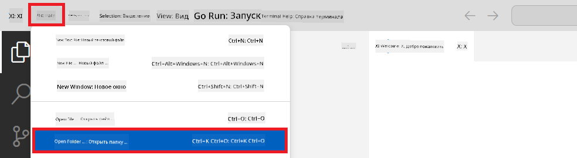

1. В левой панели Visual Studio Code щелкните правой кнопкой мыши и выберите **Создать файл**, чтобы создать новый файл с именем *download_dataset.py*.

    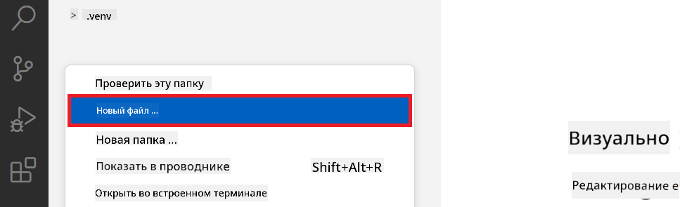

### Подготовка набора данных для настройки

В этом упражнении вы выполните файл *download_dataset.py*, чтобы загрузить набор данных *ultrachat_200k* в вашу локальную среду. Затем вы используете этот набор данных для настройки модели Phi-3 в Azure Machine Learning.

В этом упражнении вы:

- Добавите код в файл *download_dataset.py* для загрузки набора данных.
- Выполните файл *download_dataset.py*, чтобы загрузить набор данных в локальную среду.

#### Загрузка набора данных с помощью *download_dataset.py*

1. Откройте файл *download_dataset.py* в Visual Studio Code.

1. Добавьте следующий код в файл *download_dataset.py*.

    ```python
    import json
    import os
    from datasets import load_dataset

    def load_and_split_dataset(dataset_name, config_name, split_ratio):
        """
        Load and split a dataset.
        """
        # Load the dataset with the specified name, configuration, and split ratio
        dataset = load_dataset(dataset_name, config_name, split=split_ratio)
        print(f"Original dataset size: {len(dataset)}")
        
        # Split the dataset into train and test sets (80% train, 20% test)
        split_dataset = dataset.train_test_split(test_size=0.2)
        print(f"Train dataset size: {len(split_dataset['train'])}")
        print(f"Test dataset size: {len(split_dataset['test'])}")
        
        return split_dataset

    def save_dataset_to_jsonl(dataset, filepath):
        """
        Save a dataset to a JSONL file.
        """
        # Create the directory if it does not exist
        os.makedirs(os.path.dirname(filepath), exist_ok=True)
        
        # Open the file in write mode
        with open(filepath, 'w', encoding='utf-8') as f:
            # Iterate over each record in the dataset
            for record in dataset:
                # Dump the record as a JSON object and write it to the file
                json.dump(record, f)
                # Write a newline character to separate records
                f.write('\n')
        
        print(f"Dataset saved to {filepath}")

    def main():
        """
        Main function to load, split, and save the dataset.
        """
        # Load and split the ULTRACHAT_200k dataset with a specific configuration and split ratio
        dataset = load_and_split_dataset("HuggingFaceH4/ultrachat_200k", 'default', 'train_sft[:1%]')
        
        # Extract the train and test datasets from the split
        train_dataset = dataset['train']
        test_dataset = dataset['test']

        # Save the train dataset to a JSONL file
        save_dataset_to_jsonl(train_dataset, "data/train_data.jsonl")
        
        # Save the test dataset to a separate JSONL file
        save_dataset_to_jsonl(test_dataset, "data/test_data.jsonl")

    if __name__ == "__main__":
        main()

    ```

1. Введите следующую команду в терминале, чтобы выполнить скрипт и загрузить набор данных в локальную среду.

    ```console
    python download_dataset.py
    ```

1. Убедитесь, что наборы данных успешно сохранены в локальном каталоге *finetune-phi/data*.

> [!NOTE]
>
> #### Примечание о размере набора данных и времени настройки
>
> В этом уроке вы используете только 1% набора данных (`split='train[:1%]'`). Это значительно уменьшает объем данных, ускоряя процессы загрузки и настройки. Вы можете настроить процентное значение, чтобы найти баланс между временем обучения и производительностью модели. Использование меньшей части набора данных сокращает время настройки, что делает процесс более управляемым для обучения.

## Сценарий 2: Настройка модели Phi-3 и развертывание в Azure Machine Learning Studio

### Настройка модели Phi-3

В этом упражнении вы настроите модель Phi-3 в Azure Machine Learning Studio.

В этом упражнении вы:

- Создадите вычислительный кластер для настройки.
- Настроите модель Phi-3 в Azure Machine Learning Studio.

#### Создание вычислительного кластера для настройки
1. Посетите [Azure ML Studio](https://ml.azure.com/home?wt.mc_id=studentamb_279723).

1. Выберите **Compute** в левом меню.

1. Выберите **Compute clusters** в навигационном меню.

1. Нажмите **+ New**.

    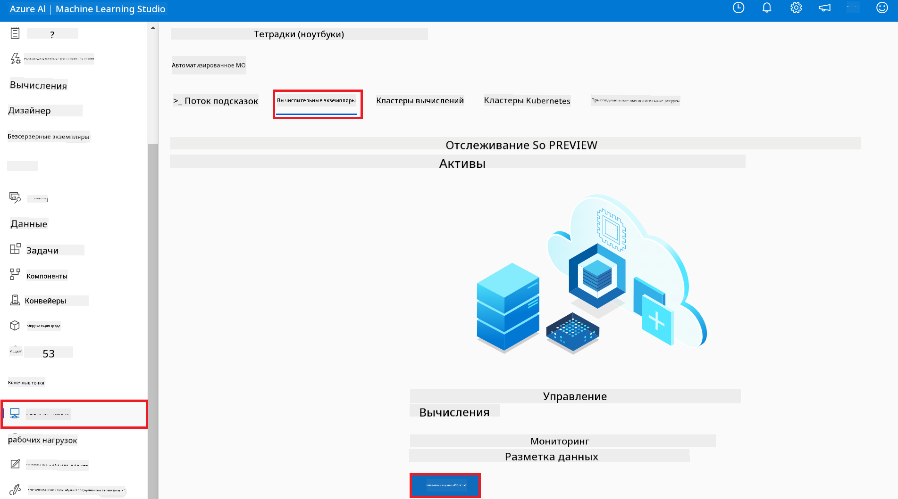

1. Выполните следующие действия:

    - Выберите **Region**, который хотите использовать.
    - Установите **Virtual machine tier** на **Dedicated**.
    - Установите **Virtual machine type** на **GPU**.
    - Установите фильтр **Virtual machine size** на **Select from all options**.
    - Выберите **Virtual machine size** как **Standard_NC24ads_A100_v4**.

    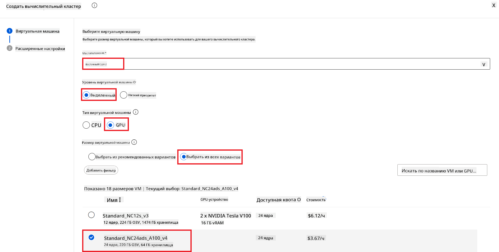

1. Нажмите **Next**.

1. Выполните следующие действия:

    - Введите **Compute name**. Оно должно быть уникальным.
    - Установите **Minimum number of nodes** на **0**.
    - Установите **Maximum number of nodes** на **1**.
    - Установите **Idle seconds before scale down** на **120**.

    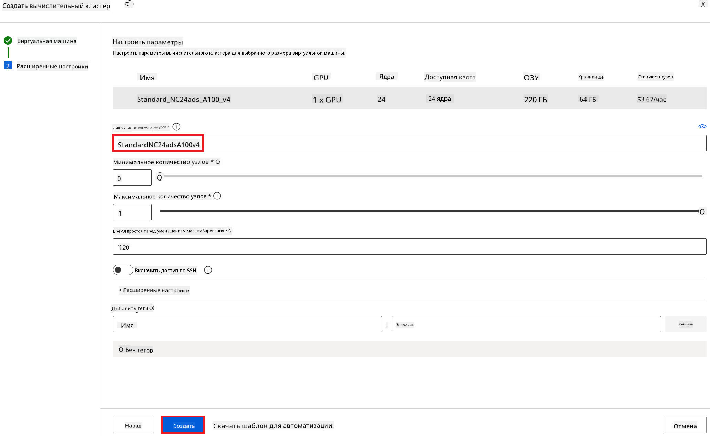

1. Нажмите **Create**.

#### Настройка модели Phi-3

1. Посетите [Azure ML Studio](https://ml.azure.com/home?wt.mc_id=studentamb_279723).

1. Выберите рабочую область Azure Machine Learning, которую вы создали.

    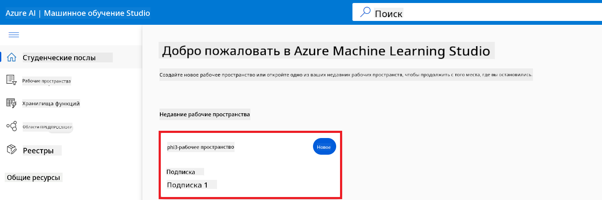

1. Выполните следующие действия:

    - Выберите **Model catalog** в левом меню.
    - Введите *phi-3-mini-4k* в **строке поиска** и выберите **Phi-3-mini-4k-instruct** из появившихся вариантов.

    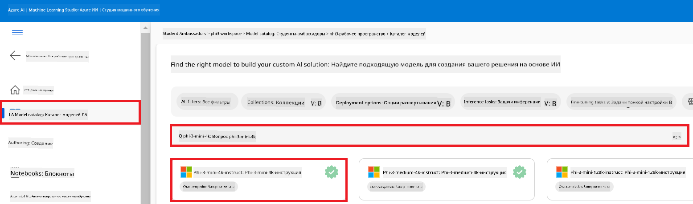

1. Выберите **Fine-tune** в навигационном меню.

    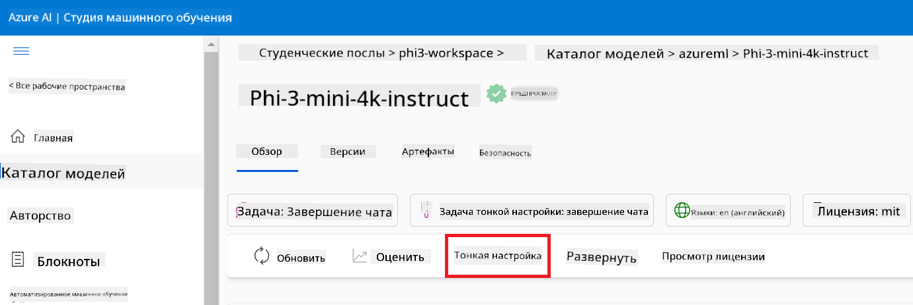

1. Выполните следующие действия:

    - Установите **Select task type** на **Chat completion**.
    - Нажмите **+ Select data**, чтобы загрузить **Training data**.
    - Установите тип загрузки данных для валидации на **Provide different validation data**.
    - Нажмите **+ Select data**, чтобы загрузить **Validation data**.

    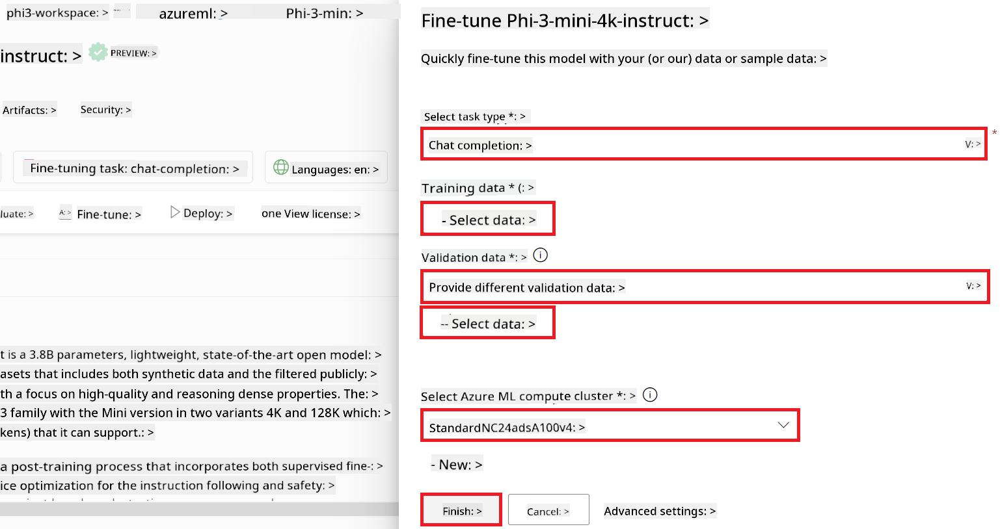

    > [!TIP]
    >
    > Вы можете выбрать **Advanced settings**, чтобы настроить параметры, такие как **learning_rate** и **lr_scheduler_type**, для оптимизации процесса настройки в соответствии с вашими потребностями.

1. Нажмите **Finish**.

1. В этом упражнении вы успешно настроили модель Phi-3 с использованием Azure Machine Learning. Обратите внимание, что процесс настройки может занять значительное время. После запуска задания настройки необходимо дождаться его завершения. Вы можете отслеживать статус задания настройки, перейдя на вкладку Jobs в левой части вашей рабочей области Azure Machine Learning. В следующей серии вы развернете настроенную модель и интегрируете ее с Prompt Flow.

    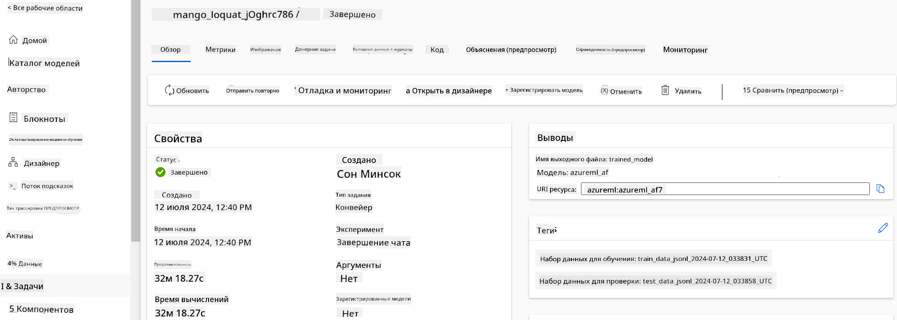

### Развертывание настроенной модели Phi-3

Чтобы интегрировать настроенную модель Phi-3 с Prompt Flow, необходимо развернуть модель для обеспечения доступа к ней в режиме реального времени. Этот процесс включает регистрацию модели, создание онлайн-эндоинта и развертывание модели.

В этом упражнении вы:

- Зарегистрируете настроенную модель в рабочей области Azure Machine Learning.
- Создадите онлайн-эндоинт.
- Развернете зарегистрированную настроенную модель Phi-3.

#### Регистрация настроенной модели

1. Посетите [Azure ML Studio](https://ml.azure.com/home?wt.mc_id=studentamb_279723).

1. Выберите рабочую область Azure Machine Learning, которую вы создали.

    

1. Выберите **Models** в левом меню.
1. Нажмите **+ Register**.
1. Выберите **From a job output**.

    

1. Выберите задание, которое вы создали.

    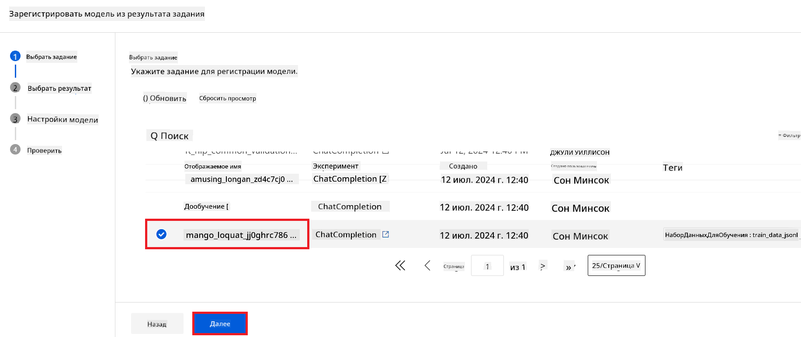

1. Нажмите **Next**.

1. Установите **Model type** на **MLflow**.

1. Убедитесь, что **Job output** уже выбран автоматически.

    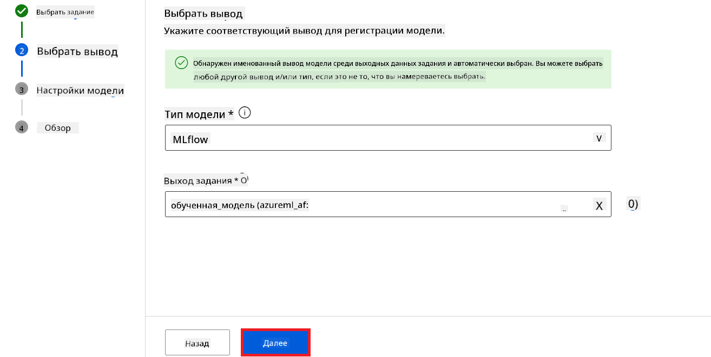

2. Нажмите **Next**.

3. Нажмите **Register**.

    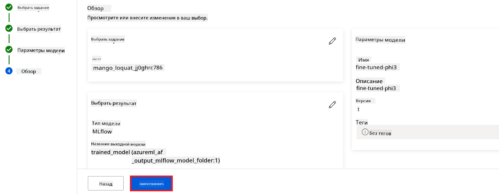

4. Вы можете просмотреть зарегистрированную модель, перейдя в меню **Models** в левом меню.

    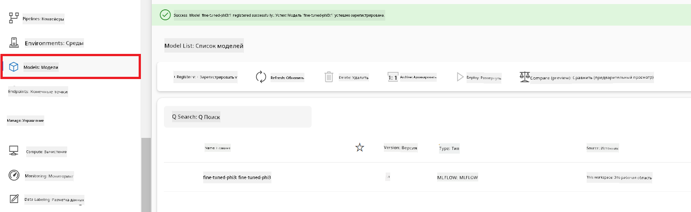

#### Развертывание настроенной модели

1. Перейдите в рабочую область Azure Machine Learning, которую вы создали.

1. Выберите **Endpoints** в левом меню.

1. Выберите **Real-time endpoints** в навигационном меню.

    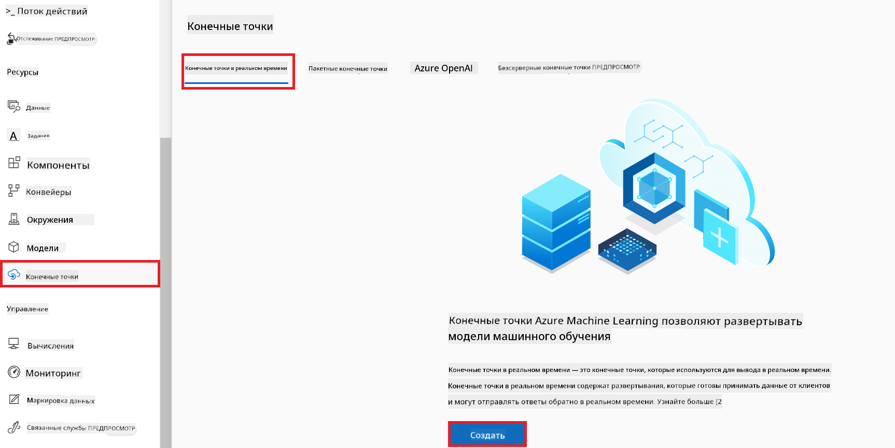

1. Нажмите **Create**.

1. Выберите зарегистрированную модель, которую вы создали.

    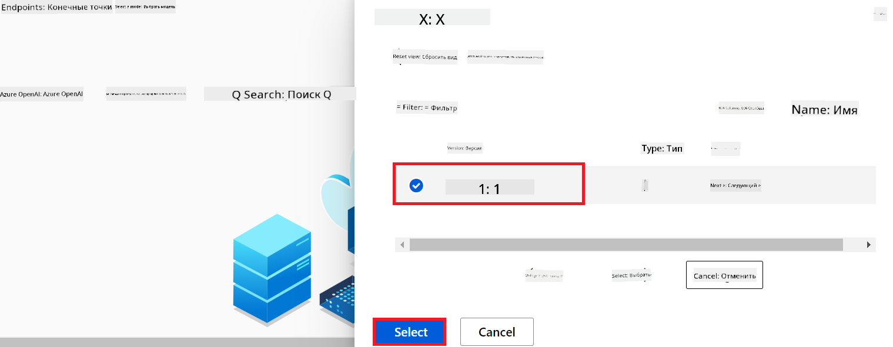

1. Нажмите **Select**.

1. Выполните следующие действия:

    - Установите **Virtual machine** на *Standard_NC6s_v3*.
    - Выберите **Instance count**, например, *1*.
    - Установите **Endpoint** на **New**, чтобы создать эндпоинт.
    - Введите **Endpoint name**. Оно должно быть уникальным.
    - Введите **Deployment name**. Оно должно быть уникальным.

    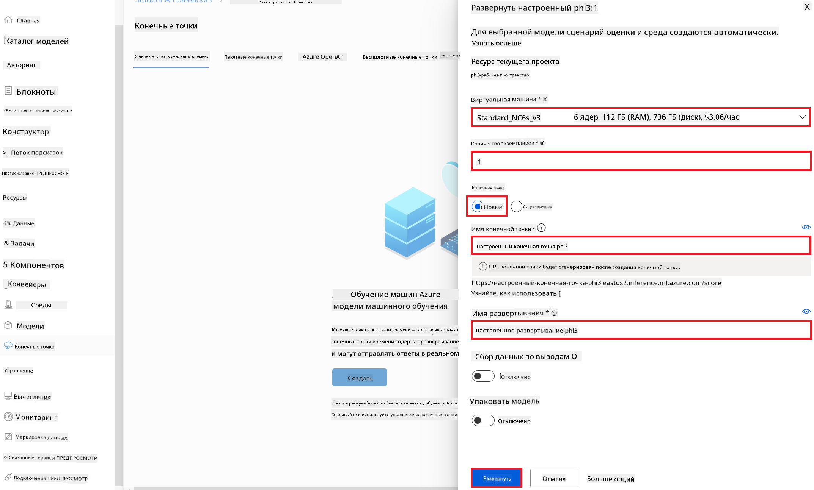

1. Нажмите **Deploy**.

> [!WARNING]
> Чтобы избежать дополнительных расходов, убедитесь, что вы удалили созданный эндпоинт в рабочей области Azure Machine Learning.
>

#### Проверка статуса развертывания в рабочей области Azure Machine Learning

1. Перейдите в рабочую область Azure Machine Learning, которую вы создали.

1. Выберите **Endpoints** в левом меню.

1. Выберите созданный эндпоинт.

    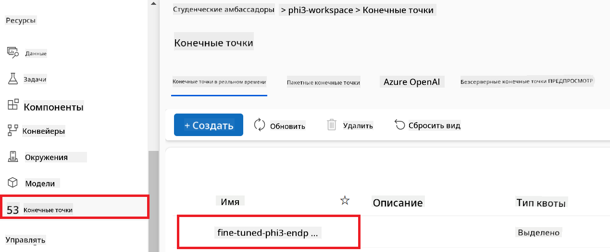

1. На этой странице вы можете управлять эндпоинтами во время процесса развертывания.

> [!NOTE]
> После завершения развертывания убедитесь, что **Live traffic** установлен на **100%**. Если это не так, выберите **Update traffic**, чтобы настроить параметры трафика. Обратите внимание, что вы не сможете протестировать модель, если трафик установлен на 0%.
>
> 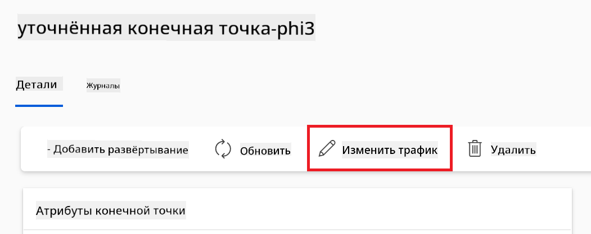
>

## Сценарий 3: Интеграция с Prompt flow и взаимодействие с вашей кастомной моделью в Azure AI Foundry

### Интеграция кастомной модели Phi-3 с Prompt flow

После успешного развертывания вашей настроенной модели вы можете интегрировать ее с Prompt Flow, чтобы использовать модель в приложениях реального времени, выполняя различные интерактивные задачи с вашей кастомной моделью Phi-3.

В этом упражнении вы:

- Создадите Hub в Azure AI Foundry.
- Создадите проект в Azure AI Foundry.
- Создадите Prompt Flow.
- Добавите кастомное подключение для настроенной модели Phi-3.
- Настроите Prompt Flow для взаимодействия с вашей кастомной моделью Phi-3.

> [!NOTE]
> Вы также можете интегрировать с Prompt Flow, используя Azure ML Studio. Этот же процесс интеграции применим к Azure ML Studio.

#### Создание Hub в Azure AI Foundry

Перед созданием проекта необходимо создать Hub. Hub действует как группа ресурсов, позволяя организовывать и управлять несколькими проектами в Azure AI Foundry.

1. Посетите [Azure AI Foundry](https://ai.azure.com/?WT.mc_id=aiml-137032-kinfeylo).

1. Выберите **All hubs** в левом меню.

1. Нажмите **+ New hub** в навигационном меню.

    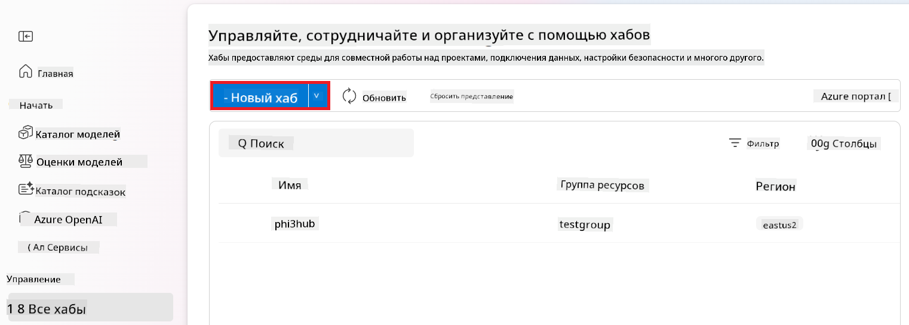

1. Выполните следующие действия:

    - Введите **Hub name**. Оно должно быть уникальным.
    - Выберите вашу подписку Azure **Subscription**.
    - Выберите **Resource group** для использования (создайте новую, если нужно).
    - Выберите **Location**, который хотите использовать.
    - Выберите **Connect Azure AI Services** для использования (создайте новый, если нужно).
    - Установите **Connect Azure AI Search** на **Skip connecting**.

    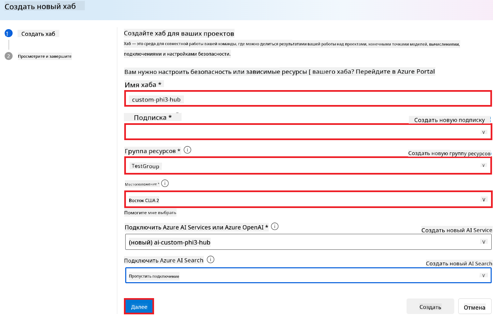

1. Нажмите **Next**.

#### Создание проекта в Azure AI Foundry

1. В созданном вами Hub выберите **All projects** в левом меню.

1. Нажмите **+ New project** в навигационном меню.

    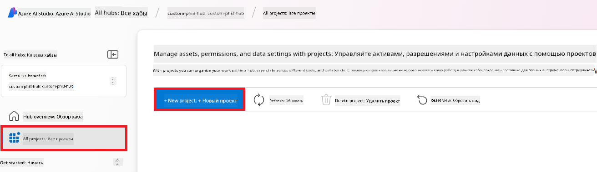

1. Введите **Project name**. Оно должно быть уникальным.

    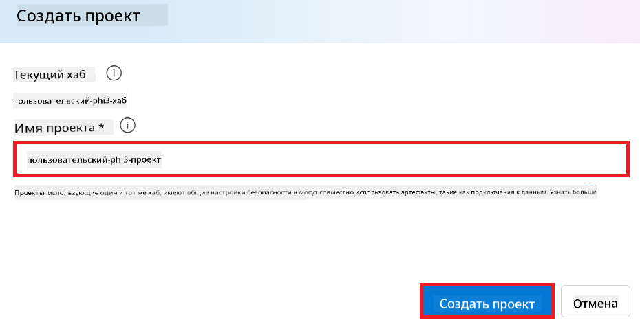

1. Нажмите **Create a project**.

#### Добавление кастомного подключения для настроенной модели Phi-3

Чтобы интегрировать вашу кастомную модель Phi-3 с Prompt Flow, необходимо сохранить эндпоинт и ключ модели в кастомном подключении. Эта настройка обеспечивает доступ к вашей кастомной модели Phi-3 в Prompt Flow.

#### Установка api key и endpoint uri для настроенной модели Phi-3

1. Посетите [Azure ML Studio](https://ml.azure.com/home?WT.mc_id=aiml-137032-kinfeylo).

1. Перейдите в рабочую область Azure Machine Learning, которую вы создали.

1. Выберите **Endpoints** в левом меню.

    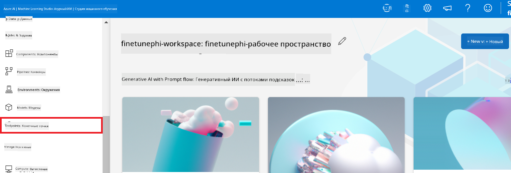

1. Выберите созданный вами эндпоинт.

    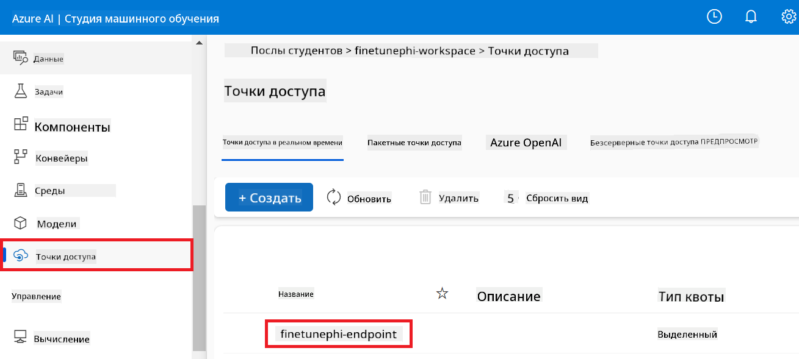

1. Выберите **Consume** в навигационном меню.

1. Скопируйте ваш **REST endpoint** и **Primary key**.
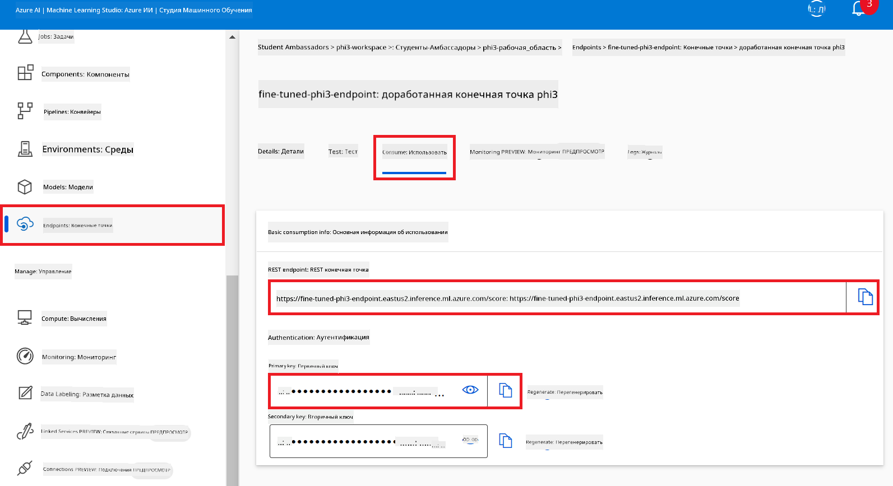

#### Добавление пользовательского подключения

1. Перейдите на [Azure AI Foundry](https://ai.azure.com/?WT.mc_id=aiml-137032-kinfeylo).

1. Откройте проект Azure AI Foundry, который вы создали.

1. В созданном проекте выберите **Settings** на левой панели.

1. Нажмите **+ New connection**.

    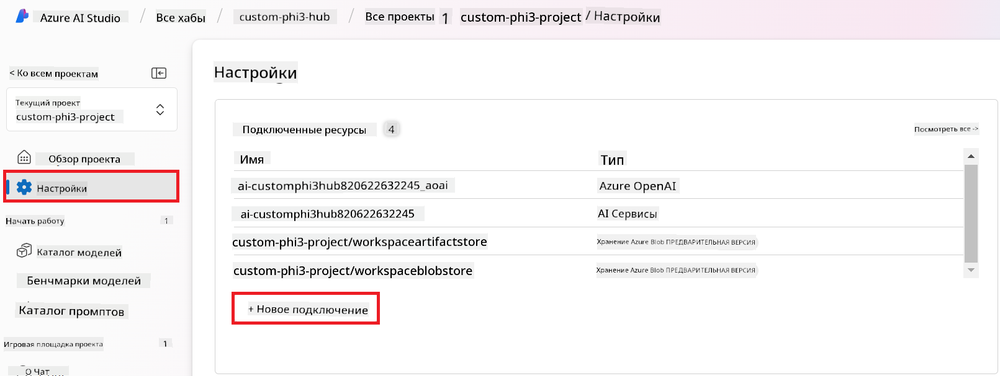

1. Выберите **Custom keys** в меню навигации.

    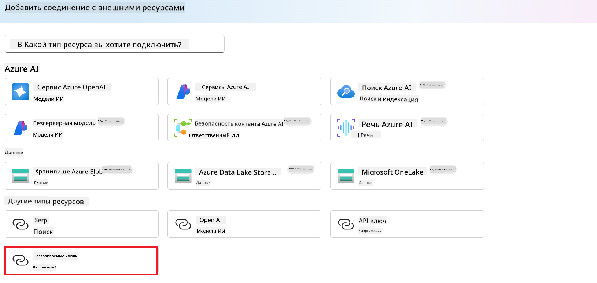

1. Выполните следующие действия:

    - Нажмите **+ Add key value pairs**.
    - В поле имени ключа введите **endpoint** и вставьте скопированный из Azure ML Studio endpoint в поле значения.
    - Снова нажмите **+ Add key value pairs**.
    - В поле имени ключа введите **key** и вставьте скопированный из Azure ML Studio ключ в поле значения.
    - После добавления ключей выберите **is secret**, чтобы скрыть ключ.

    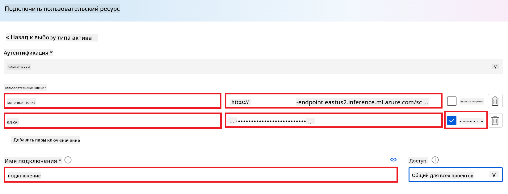

1. Нажмите **Add connection**.

#### Создание Prompt flow

Вы добавили пользовательское подключение в Azure AI Foundry. Теперь давайте создадим Prompt flow, следуя приведенным шагам. Затем вы подключите этот Prompt flow к пользовательскому подключению, чтобы использовать дообученную модель в Prompt flow.

1. Откройте проект Azure AI Foundry, который вы создали.

1. Выберите **Prompt flow** на левой панели.

1. Нажмите **+ Create** в меню навигации.

    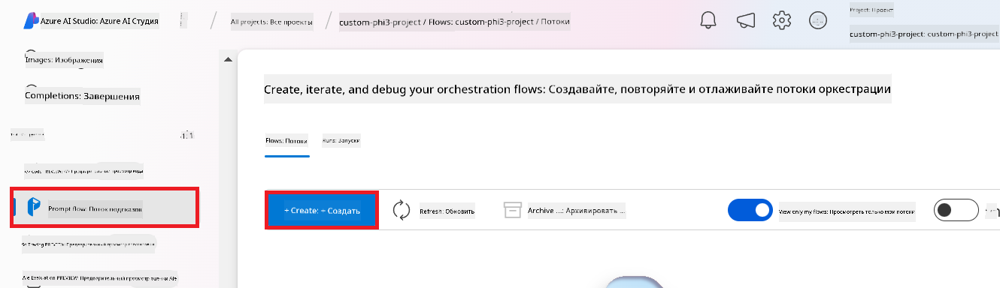

1. Выберите **Chat flow** в меню навигации.

    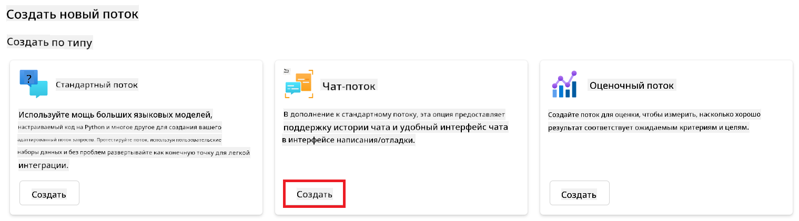

1. Введите **Folder name**, который вы хотите использовать.

    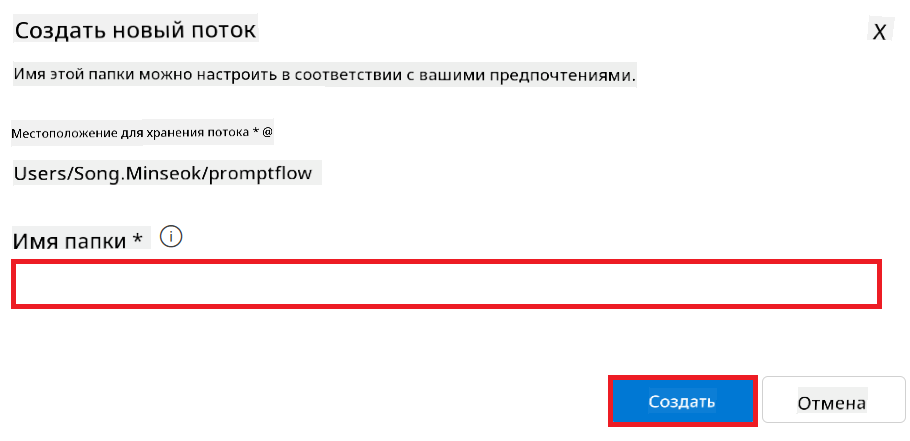

2. Нажмите **Create**.

#### Настройка Prompt flow для работы с вашей пользовательской моделью Phi-3

Вам необходимо интегрировать дообученную модель Phi-3 в Prompt flow. Однако существующий Prompt flow не предназначен для этой цели. Поэтому вам нужно изменить Prompt flow, чтобы интегрировать пользовательскую модель.

1. В Prompt flow выполните следующие действия для изменения существующего потока:

    - Выберите **Raw file mode**.
    - Удалите весь существующий код в файле *flow.dag.yml*.
    - Добавьте следующий код в файл *flow.dag.yml*.

        ```yml
        inputs:
          input_data:
            type: string
            default: "Who founded Microsoft?"

        outputs:
          answer:
            type: string
            reference: ${integrate_with_promptflow.output}

        nodes:
        - name: integrate_with_promptflow
          type: python
          source:
            type: code
            path: integrate_with_promptflow.py
          inputs:
            input_data: ${inputs.input_data}
        ```

    - Нажмите **Save**.

    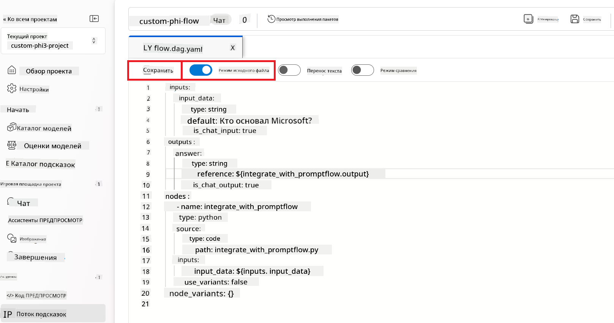

1. Добавьте следующий код в файл *integrate_with_promptflow.py*, чтобы использовать пользовательскую модель Phi-3 в Prompt flow.

    ```python
    import logging
    import requests
    from promptflow import tool
    from promptflow.connections import CustomConnection

    # Logging setup
    logging.basicConfig(
        format="%(asctime)s - %(levelname)s - %(name)s - %(message)s",
        datefmt="%Y-%m-%d %H:%M:%S",
        level=logging.DEBUG
    )
    logger = logging.getLogger(__name__)

    def query_phi3_model(input_data: str, connection: CustomConnection) -> str:
        """
        Send a request to the Phi-3 model endpoint with the given input data using Custom Connection.
        """

        # "connection" is the name of the Custom Connection, "endpoint", "key" are the keys in the Custom Connection
        endpoint_url = connection.endpoint
        api_key = connection.key

        headers = {
            "Content-Type": "application/json",
            "Authorization": f"Bearer {api_key}"
        }
        data = {
            "input_data": {
                "input_string": [
                    {"role": "user", "content": input_data}
                ],
                "parameters": {
                    "temperature": 0.7,
                    "max_new_tokens": 128
                }
            }
        }
        try:
            response = requests.post(endpoint_url, json=data, headers=headers)
            response.raise_for_status()
            
            # Log the full JSON response
            logger.debug(f"Full JSON response: {response.json()}")

            result = response.json()["output"]
            logger.info("Successfully received response from Azure ML Endpoint.")
            return result
        except requests.exceptions.RequestException as e:
            logger.error(f"Error querying Azure ML Endpoint: {e}")
            raise

    @tool
    def my_python_tool(input_data: str, connection: CustomConnection) -> str:
        """
        Tool function to process input data and query the Phi-3 model.
        """
        return query_phi3_model(input_data, connection)

    ```

    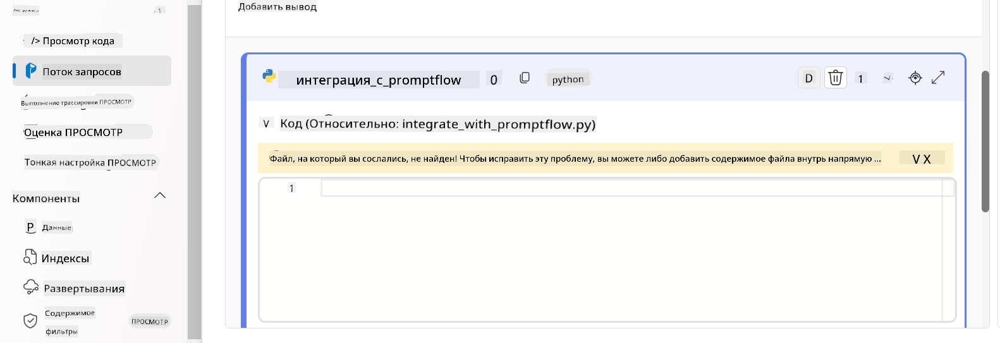

> [!NOTE]
> Для более подробной информации о работе с Prompt flow в Azure AI Foundry вы можете обратиться к [Prompt flow in Azure AI Foundry](https://learn.microsoft.com/azure/ai-studio/how-to/prompt-flow).

1. Выберите **Chat input**, **Chat output**, чтобы включить возможность общения с вашей моделью.

    

1. Теперь вы готовы к общению с вашей пользовательской моделью Phi-3. В следующем упражнении вы узнаете, как запустить Prompt flow и использовать его для общения с вашей дообученной моделью Phi-3.

> [!NOTE]
>
> Изменённый поток должен выглядеть как на изображении ниже:
>
> 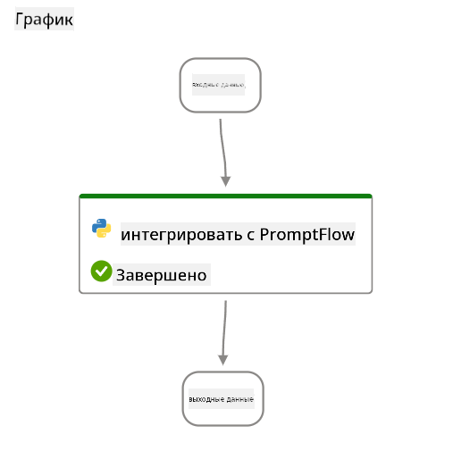
>

### Общение с вашей пользовательской моделью Phi-3

Теперь, когда вы дообучили и интегрировали свою пользовательскую модель Phi-3 с Prompt flow, вы готовы начать взаимодействие с ней. Это упражнение поможет вам настроить и запустить общение с вашей моделью с помощью Prompt flow. Следуя этим шагам, вы сможете полностью использовать возможности вашей дообученной модели Phi-3 для различных задач и диалогов.

- Общайтесь с вашей пользовательской моделью Phi-3, используя Prompt flow.

#### Запуск Prompt flow

1. Выберите **Start compute sessions**, чтобы запустить Prompt flow.

    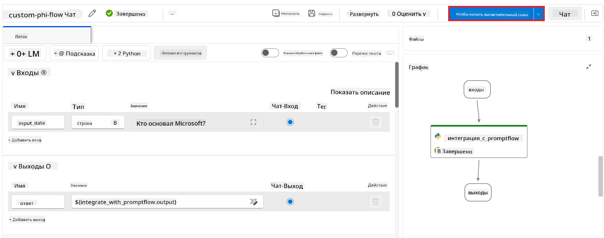

1. Нажмите **Validate and parse input**, чтобы обновить параметры.

    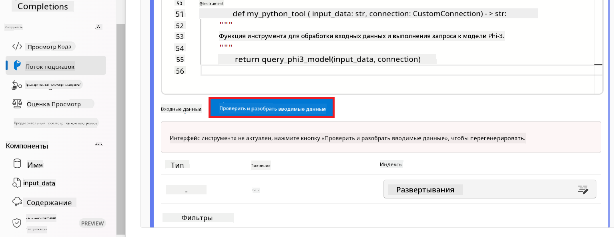

1. Выберите **Value** для **connection**, чтобы подключиться к созданному вами пользовательскому подключению. Например, *connection*.

    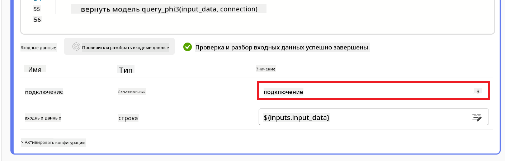

#### Общение с вашей пользовательской моделью

1. Выберите **Chat**.

    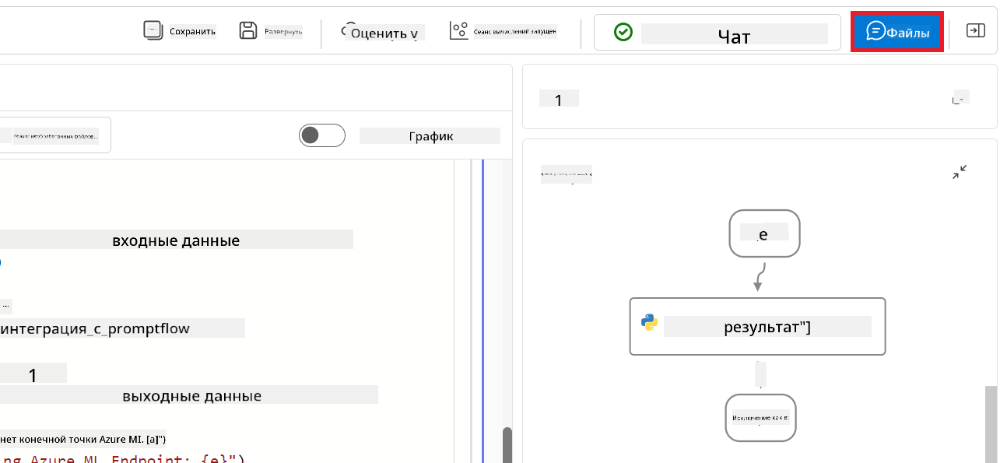

1. Пример результата: Теперь вы можете общаться с вашей пользовательской моделью Phi-3. Рекомендуется задавать вопросы на основе данных, использованных для дообучения.

    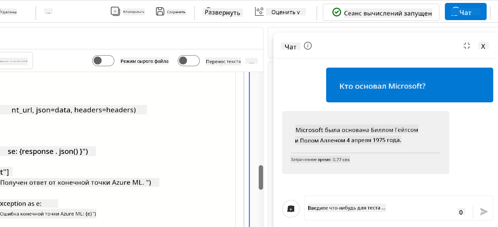

**Отказ от ответственности**:  
Этот документ был переведен с использованием сервиса автоматического перевода [Co-op Translator](https://github.com/Azure/co-op-translator). Несмотря на наше стремление к точности, пожалуйста, учитывайте, что автоматические переводы могут содержать ошибки или неточности. Оригинальный документ на исходном языке следует считать авторитетным источником. Для получения критически важной информации рекомендуется использовать профессиональный перевод, выполненный человеком. Мы не несем ответственности за любые недоразумения или неправильные интерпретации, возникшие в результате использования данного перевода.