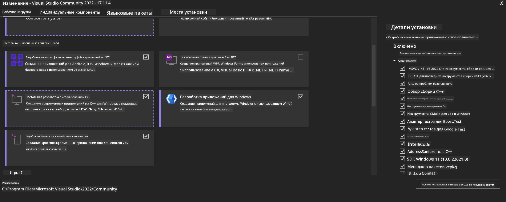
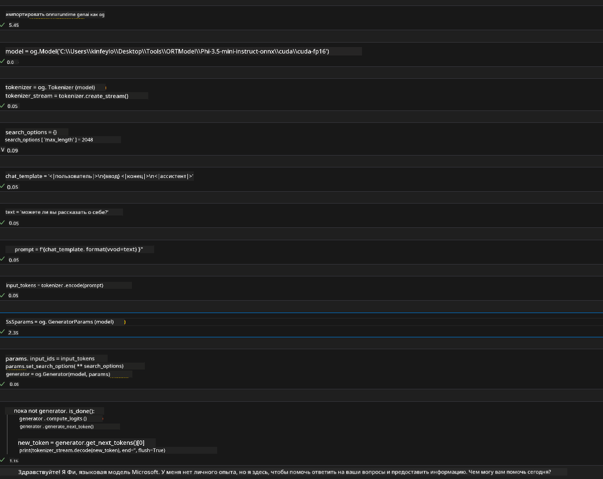
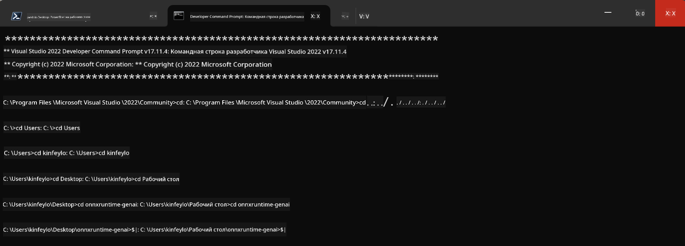

<!--
CO_OP_TRANSLATOR_METADATA:
{
  "original_hash": "b066fc29c1b2129df84e027cb75119ce",
  "translation_date": "2025-03-27T10:59:58+00:00",
  "source_file": "md\\02.Application\\01.TextAndChat\\Phi3\\ORTWindowGPUGuideline.md",
  "language_code": "ru"
}
-->
# **Руководство по OnnxRuntime GenAI Windows GPU**

Это руководство содержит шаги по настройке и использованию ONNX Runtime (ORT) с GPU на Windows. Оно предназначено для того, чтобы помочь вам использовать ускорение GPU для ваших моделей, повышая их производительность и эффективность.

Документ включает инструкции по следующим аспектам:

- Настройка окружения: Указания по установке необходимых зависимостей, таких как CUDA, cuDNN и ONNX Runtime.
- Конфигурация: Как настроить окружение и ONNX Runtime для эффективного использования ресурсов GPU.
- Советы по оптимизации: Рекомендации по настройке параметров GPU для достижения максимальной производительности.

### **1. Python 3.10.x /3.11.8**

   ***Примечание*** Рекомендуется использовать [miniforge](https://github.com/conda-forge/miniforge/releases/latest/download/Miniforge3-Windows-x86_64.exe) как ваше окружение Python.

   ```bash

   conda create -n pydev python==3.11.8

   conda activate pydev

   ```

   ***Напоминание*** Если у вас уже установлены библиотеки Python ONNX, их нужно удалить.

### **2. Установка CMake с помощью winget**


   ```bash

   winget install -e --id Kitware.CMake

   ```

### **3. Установка Visual Studio 2022 - Разработка для рабочего стола с C++**

   ***Примечание*** Если вы не планируете компилировать, этот шаг можно пропустить.



### **4. Установка драйвера NVIDIA**

1. **Драйвер NVIDIA GPU**  [https://www.nvidia.com/en-us/drivers/](https://www.nvidia.com/en-us/drivers/)

2. **NVIDIA CUDA 12.4** [https://developer.nvidia.com/cuda-12-4-0-download-archive](https://developer.nvidia.com/cuda-12-4-0-download-archive)

3. **NVIDIA CUDNN 9.4**  [https://developer.nvidia.com/cudnn-downloads](https://developer.nvidia.com/cudnn-downloads)

***Напоминание*** Используйте настройки по умолчанию при установке.

### **5. Настройка окружения NVIDIA**

Скопируйте библиотеки, бинарные файлы и заголовки NVIDIA CUDNN 9.4 в соответствующие папки NVIDIA CUDA 12.4.

- Скопируйте файлы из *'C:\Program Files\NVIDIA\CUDNN\v9.4\bin\12.6'* в *'C:\Program Files\NVIDIA GPU Computing Toolkit\CUDA\v12.4\bin*.

- Скопируйте файлы из *'C:\Program Files\NVIDIA\CUDNN\v9.4\include\12.6'* в *'C:\Program Files\NVIDIA GPU Computing Toolkit\CUDA\v12.4\include*.

- Скопируйте файлы из *'C:\Program Files\NVIDIA\CUDNN\v9.4\lib\12.6'* в *'C:\Program Files\NVIDIA GPU Computing Toolkit\CUDA\v12.4\lib\x64'*.

### **6. Скачивание Phi-3.5-mini-instruct-onnx**


   ```bash

   winget install -e --id Git.Git

   winget install -e --id GitHub.GitLFS

   git lfs install

   git clone https://huggingface.co/microsoft/Phi-3.5-mini-instruct-onnx

   ```

### **7. Запуск InferencePhi35Instruct.ipynb**

   Откройте [Notebook](../../../../../../code/09.UpdateSamples/Aug/ortgpu-phi35-instruct.ipynb) и выполните его.



### **8. Компиляция ORT GenAI GPU**

   ***Примечание*** 
   
   1. Сначала удалите все библиотеки, связанные с onnx, onnxruntime и onnxruntime-genai.

   
   ```bash

   pip list 
   
   ```

   Затем удалите все библиотеки onnxruntime, например:

   
   ```bash

   pip uninstall onnxruntime

   pip uninstall onnxruntime-genai

   pip uninstall onnxruntume-genai-cuda
   
   ```

   2. Проверьте поддержку расширений Visual Studio.

   Убедитесь, что папка C:\Program Files\NVIDIA GPU Computing Toolkit\CUDA\v12.4\extras содержит C:\Program Files\NVIDIA GPU Computing Toolkit\CUDA\v12.4\extras\visual_studio_integration. 
   
   Если папка отсутствует, проверьте другие папки драйвера CUDA toolkit и скопируйте папку visual_studio_integration и ее содержимое в C:\Program Files\NVIDIA GPU Computing Toolkit\CUDA\v12.4\extras\visual_studio_integration.

   - Если вы не планируете компилировать, этот шаг можно пропустить.

   ```bash

   git clone https://github.com/microsoft/onnxruntime-genai

   ```

   - Скачайте [https://github.com/microsoft/onnxruntime/releases/download/v1.19.2/onnxruntime-win-x64-gpu-1.19.2.zip](https://github.com/microsoft/onnxruntime/releases/download/v1.19.2/onnxruntime-win-x64-gpu-1.19.2.zip).

   - Распакуйте onnxruntime-win-x64-gpu-1.19.2.zip, переименуйте папку в **ort** и скопируйте ее в onnxruntime-genai.

   - Используя Windows Terminal, откройте Командную строку разработчика для VS 2022 и перейдите в папку onnxruntime-genai.



   - Скомпилируйте с использованием вашего окружения Python.

   
   ```bash

   cd onnxruntime-genai

   python build.py --use_cuda  --cuda_home "C:\Program Files\NVIDIA GPU Computing Toolkit\CUDA\v12.4" --config Release
 

   cd build/Windows/Release/Wheel

   pip install .whl

   ```

**Отказ от ответственности**:  
Этот документ был переведен с использованием сервиса автоматического перевода [Co-op Translator](https://github.com/Azure/co-op-translator). Несмотря на наши усилия обеспечить точность, имейте в виду, что автоматические переводы могут содержать ошибки или неточности. Оригинальный документ на его исходном языке следует считать авторитетным источником. Для получения критически важной информации рекомендуется профессиональный перевод человеком. Мы не несем ответственности за любые недоразумения или неправильные интерпретации, возникшие в результате использования данного перевода.