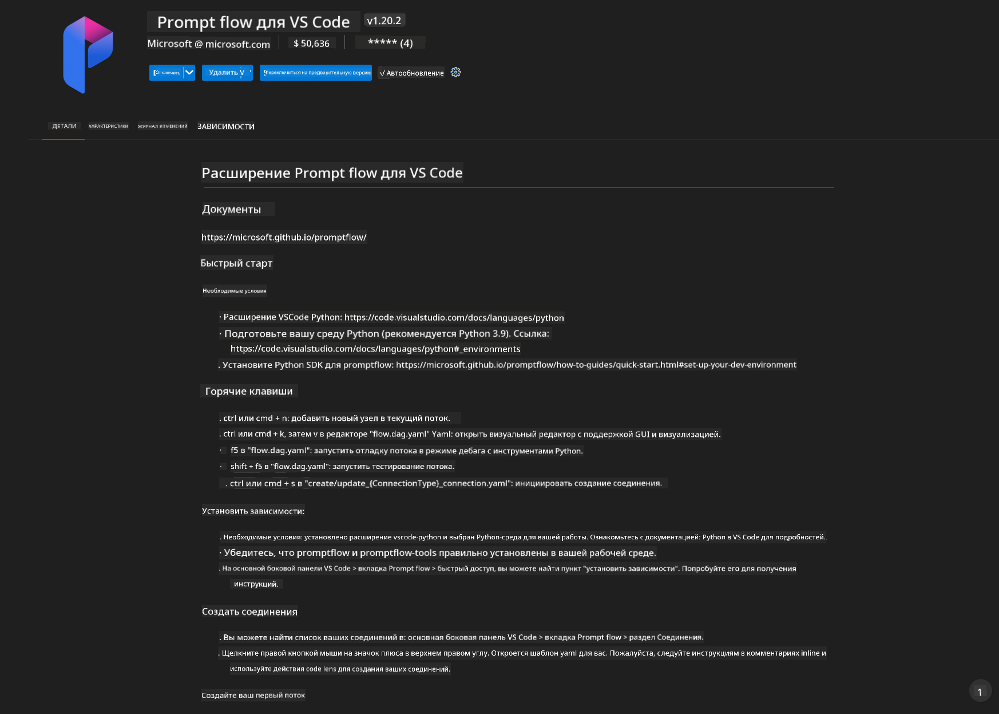
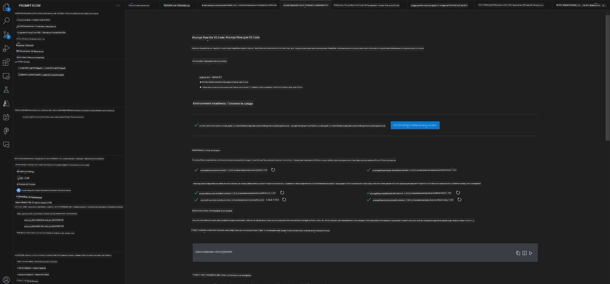
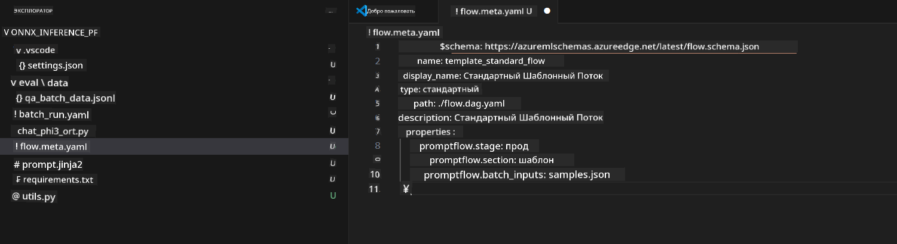
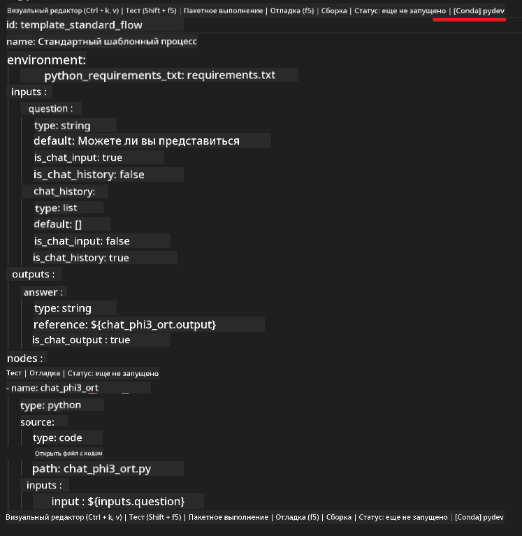
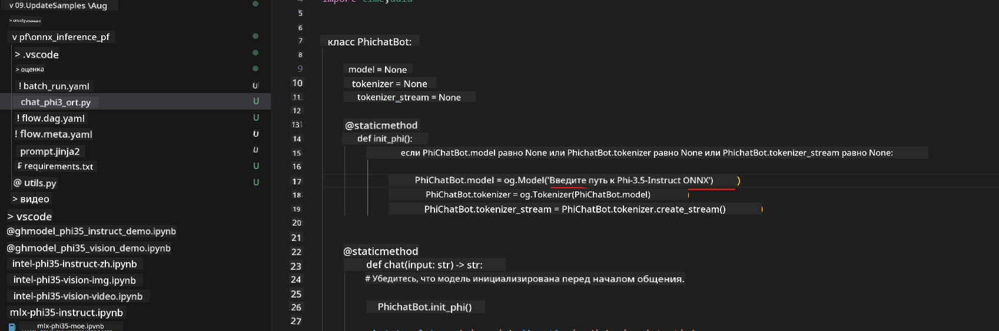
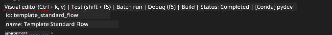
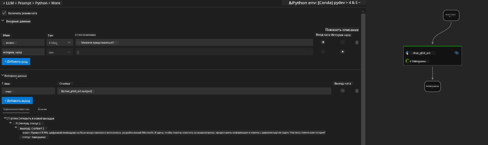
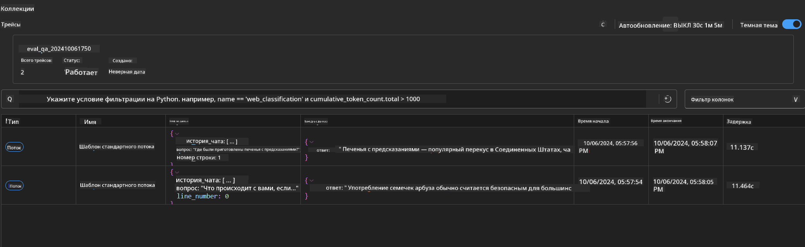

<!--
CO_OP_TRANSLATOR_METADATA:
{
  "original_hash": "92e7dac1e5af0dd7c94170fdaf6860fe",
  "translation_date": "2025-03-27T11:12:16+00:00",
  "source_file": "md\\02.Application\\01.TextAndChat\\Phi3\\UsingPromptFlowWithONNX.md",
  "language_code": "ru"
}
-->
# Использование Windows GPU для создания решения Prompt Flow с Phi-3.5-Instruct ONNX

Этот документ представляет собой пример использования PromptFlow с ONNX (Open Neural Network Exchange) для разработки AI-приложений на основе моделей Phi-3.

PromptFlow — это набор инструментов для разработки, предназначенный для упрощения полного цикла разработки AI-приложений на основе LLM (Large Language Model), начиная от идеи и прототипирования до тестирования и оценки.

Интеграция PromptFlow с ONNX позволяет разработчикам:

- **Оптимизировать производительность модели:** Использовать ONNX для эффективного вывода и развертывания моделей.
- **Упростить разработку:** Управлять рабочим процессом и автоматизировать повторяющиеся задачи с помощью PromptFlow.
- **Улучшить сотрудничество:** Обеспечить более тесное взаимодействие между членами команды за счет единой среды разработки.

**Prompt flow** — это набор инструментов для разработки, который упрощает полный цикл разработки AI-приложений на основе LLM: от идеи, прототипирования, тестирования и оценки до развертывания в производстве и мониторинга. Он значительно облегчает работу с инженерией запросов и позволяет создавать приложения LLM производственного качества.

Prompt flow может подключаться к OpenAI, Azure OpenAI Service и настраиваемым моделям (Huggingface, локальные LLM/SLM). Мы надеемся развернуть квантованную модель ONNX Phi-3.5 для локальных приложений. Prompt flow может помочь нам лучше спланировать наш бизнес и реализовать локальные решения на основе Phi-3.5. В этом примере мы будем использовать библиотеку ONNX Runtime GenAI для создания решения Prompt flow на основе Windows GPU.

## **Установка**

### **ONNX Runtime GenAI для Windows GPU**

Ознакомьтесь с этим руководством для настройки ONNX Runtime GenAI для Windows GPU [нажмите здесь](./ORTWindowGPUGuideline.md).

### **Настройка Prompt flow в VSCode**

1. Установите расширение Prompt flow для VS Code.



2. После установки расширения Prompt flow для VS Code нажмите на расширение и выберите **Installation dependencies**, следуя этому руководству, чтобы установить SDK Prompt flow в вашу среду.



3. Скачайте [Пример кода](../../../../../../code/09.UpdateSamples/Aug/pf/onnx_inference_pf) и откройте его в VS Code.



4. Откройте **flow.dag.yaml**, чтобы выбрать вашу Python-среду.



   Откройте **chat_phi3_ort.py**, чтобы указать местоположение вашей модели Phi-3.5-Instruct ONNX.



5. Запустите ваш Prompt flow для тестирования.

Откройте **flow.dag.yaml** и нажмите на визуальный редактор.



После этого нажмите "Run", чтобы протестировать.



1. Вы можете запустить пакет в терминале, чтобы проверить больше результатов.

```bash

pf run create --file batch_run.yaml --stream --name 'Your eval qa name'    

```

Вы можете просмотреть результаты в вашем браузере по умолчанию.



**Отказ от ответственности**:  
Этот документ был переведен с использованием сервиса автоматического перевода [Co-op Translator](https://github.com/Azure/co-op-translator). Хотя мы стремимся к точности, пожалуйста, учитывайте, что автоматические переводы могут содержать ошибки или неточности. Оригинальный документ на его родном языке следует считать авторитетным источником. Для получения критически важной информации рекомендуется профессиональный перевод человеком. Мы не несем ответственности за любые недоразумения или неправильные интерпретации, возникающие в результате использования данного перевода.