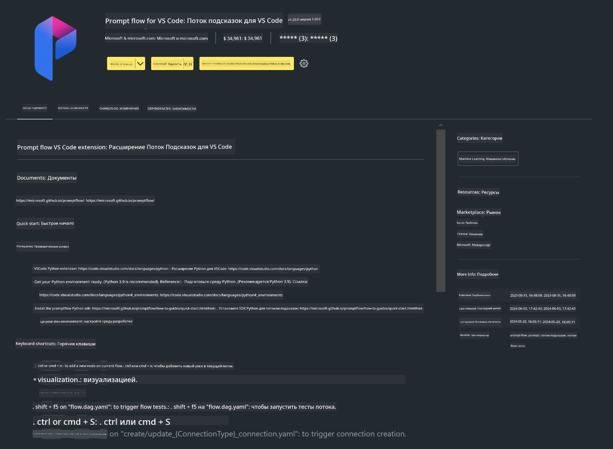

<!--
CO_OP_TRANSLATOR_METADATA:
{
  "original_hash": "a4ef39027902e82f2c33d568d2a2259a",
  "translation_date": "2025-03-27T11:49:11+00:00",
  "source_file": "md\\02.Application\\02.Code\\Phi3\\VSCodeExt\\HOL\\AIPC\\01.Installations.md",
  "language_code": "ru"
}
-->
# **Лаборатория 0 - Установка**

Когда мы заходим в лабораторию, необходимо настроить соответствующую среду:


### **1. Python 3.11+**

Рекомендуется использовать miniforge для настройки вашей среды Python.

Для настройки miniforge, пожалуйста, обратитесь к [https://github.com/conda-forge/miniforge](https://github.com/conda-forge/miniforge)

После настройки miniforge выполните следующую команду в Power Shell

```bash

conda create -n pyenv python==3.11.8 -y

conda activate pyenv

```


### **2. Установка Prompt flow SDK**

В Лаборатории 1 мы используем Prompt flow, поэтому необходимо настроить Prompt flow SDK.

```bash

pip install promptflow --upgrade

```

Вы можете проверить Prompt flow SDK с помощью этой команды

```bash

pf --version

```


### **3. Установка расширения Prompt flow для Visual Studio Code**




### **4. Библиотека ускорения Intel NPU**

Процессоры нового поколения от Intel поддерживают NPU. Если вы хотите использовать NPU для локального выполнения LLMs / SLMs, вы можете воспользоваться ***Intel NPU Acceleration Library***. Чтобы узнать больше, ознакомьтесь с [https://github.com/microsoft/PhiCookBook/blob/main/md/01.Introduction/03/AIPC_Inference.md](https://github.com/microsoft/PhiCookBook/blob/main/md/01.Introduction/03/AIPC_Inference.md).

Установите библиотеку Intel NPU Acceleration Library в bash

```bash

pip install intel-npu-acceleration-library

```

***Примечание***: Обратите внимание, что эта библиотека поддерживает transformers ***4.40.2***, пожалуйста, убедитесь в версии.


### **5. Другие библиотеки Python**

Создайте requirements.txt и добавьте следующий контент

```txt

notebook
numpy 
scipy 
scikit-learn 
matplotlib 
pandas 
pillow 
graphviz

```


### **6. Установка NVM**

Установите nvm в Powershell 

```bash

winget install -e --id CoreyButler.NVMforWindows

```

Установите nodejs версии 18.20

```bash

nvm install 18.20.0

nvm use 18.20.0

```


### **7. Установка поддержки разработки для Visual Studio Code**

```bash

npm install --global yo generator-code

```

Поздравляем! Вы успешно настроили SDK. Далее переходите к практическим шагам.

**Отказ от ответственности**:  
Этот документ был переведен с использованием сервиса автоматического перевода [Co-op Translator](https://github.com/Azure/co-op-translator). Хотя мы стремимся к точности, пожалуйста, учитывайте, что автоматические переводы могут содержать ошибки или неточности. Оригинальный документ на его родном языке следует считать авторитетным источником. Для критически важной информации рекомендуется профессиональный перевод человеком. Мы не несем ответственности за любые недоразумения или неправильные интерпретации, возникшие в результате использования данного перевода.