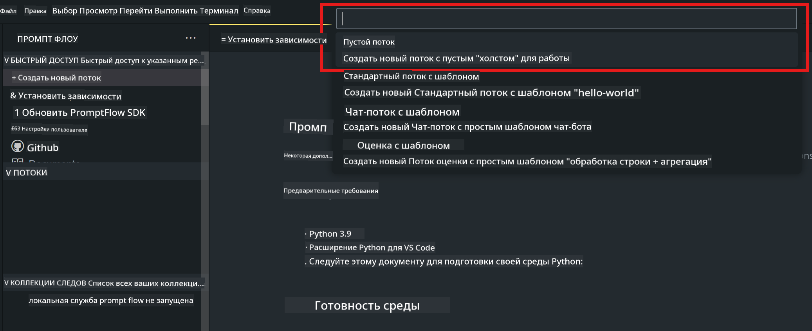
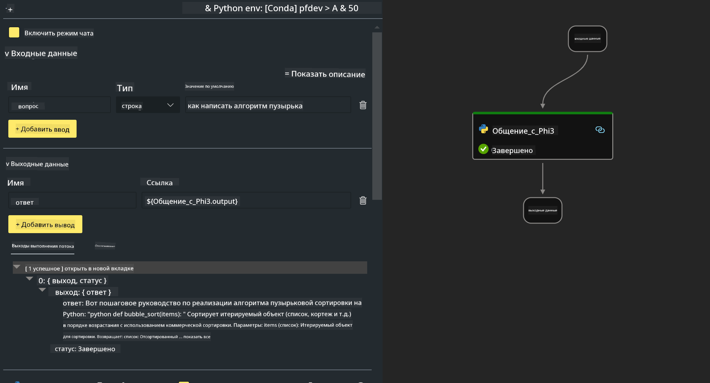

<!--
CO_OP_TRANSLATOR_METADATA:
{
  "original_hash": "3dbbf568625b1ee04b354c2dc81d3248",
  "translation_date": "2025-03-27T12:19:54+00:00",
  "source_file": "md\\02.Application\\02.Code\\Phi3\\VSCodeExt\\HOL\\Apple\\02.PromptflowWithMLX.md",
  "language_code": "ru"
}
-->
# **Лабораторная работа 2 - Запуск Prompt flow с Phi-3-mini в AIPC**

## **Что такое Prompt flow**

Prompt flow — это набор инструментов разработки, предназначенных для упрощения полного цикла разработки AI-приложений на основе LLM, начиная от идей и прототипирования, тестирования, оценки, до развертывания в производстве и мониторинга. Он значительно облегчает инженеринг запросов и позволяет создавать приложения на основе LLM с качеством, соответствующим производственным стандартам.

С помощью Prompt flow вы сможете:

- Создавать потоки, связывающие LLM, запросы, код на Python и другие инструменты в исполняемый рабочий процесс.

- Легко отлаживать и итеративно дорабатывать свои потоки, особенно взаимодействие с LLM.

- Оценивать свои потоки, рассчитывать метрики качества и производительности на больших наборах данных.

- Интегрировать тестирование и оценку в вашу CI/CD систему, чтобы гарантировать качество потока.

- Развертывать свои потоки на выбранной платформе или легко интегрировать их в кодовую базу вашего приложения.

- (Необязательно, но настоятельно рекомендуется) Сотрудничать с вашей командой, используя облачную версию Prompt flow в Azure AI.


## **Создание потоков генерации кода на Apple Silicon**

***Примечание***: Если вы не завершили установку среды, посетите [Lab 0 - Installations](./01.Installations.md)

1. Откройте расширение Prompt flow в Visual Studio Code и создайте пустой проект потока.



2. Добавьте параметры входных и выходных данных и добавьте код на Python как новый поток.



Вы можете использовать эту структуру (flow.dag.yaml) для построения своего потока:

```yaml

inputs:
  prompt:
    type: string
    default: Write python code for Fibonacci serie. Please use markdown as output
outputs:
  result:
    type: string
    reference: ${gen_code_by_phi3.output}
nodes:
- name: gen_code_by_phi3
  type: python
  source:
    type: code
    path: gen_code_by_phi3.py
  inputs:
    prompt: ${inputs.prompt}


```

3. Квантификация phi-3-mini

Мы стремимся к более эффективному запуску SLM на локальных устройствах. Обычно модель квантифицируют (INT4, FP16, FP32).

```bash

python -m mlx_lm.convert --hf-path microsoft/Phi-3-mini-4k-instruct

```

**Примечание:** папка по умолчанию — mlx_model.

4. Добавьте код в ***Chat_With_Phi3.py***.

```python


from promptflow import tool

from mlx_lm import load, generate


# The inputs section will change based on the arguments of the tool function, after you save the code
# Adding type to arguments and return value will help the system show the types properly
# Please update the function name/signature per need
@tool
def my_python_tool(prompt: str) -> str:

    model_id = './mlx_model_phi3_mini'

    model, tokenizer = load(model_id)

    # <|user|>\nWrite python code for Fibonacci serie. Please use markdown as output<|end|>\n<|assistant|>

    response = generate(model, tokenizer, prompt="<|user|>\n" + prompt  + "<|end|>\n<|assistant|>", max_tokens=2048, verbose=True)

    return response


```

4. Вы можете протестировать поток через Debug или Run, чтобы проверить, корректно ли выполняется генерация кода.


5. Запустите поток как API разработки в терминале.

```

pf flow serve --source ./ --port 8080 --host localhost   

```

Вы можете протестировать его в Postman или Thunder Client.


### **Примечания**

1. Первый запуск занимает много времени. Рекомендуется скачать модель phi-3 через Hugging Face CLI.

2. Учитывая ограниченную вычислительную мощность Intel NPU, рекомендуется использовать Phi-3-mini-4k-instruct.

3. Мы используем ускорение Intel NPU для квантификации конверсии INT4, но если вы перезапускаете сервис, необходимо удалить кэш и папки nc_workshop.


## **Ресурсы**

1. Узнайте больше о Promptflow [https://microsoft.github.io/promptflow/](https://microsoft.github.io/promptflow/)

2. Узнайте больше об ускорении Intel NPU [https://github.com/intel/intel-npu-acceleration-library](https://github.com/intel/intel-npu-acceleration-library)

3. Пример кода, загрузите [Пример кода локального агента NPU](../../../../../../../../../code/07.Lab/01/AIPC/local-npu-agent)

**Отказ от ответственности**:  
Этот документ был переведен с использованием сервиса автоматического перевода [Co-op Translator](https://github.com/Azure/co-op-translator). Хотя мы стремимся к точности, пожалуйста, учитывайте, что автоматические переводы могут содержать ошибки или неточности. Оригинальный документ на его родном языке следует считать авторитетным источником. Для критически важной информации рекомендуется профессиональный перевод человеком. Мы не несем ответственности за недоразумения или неправильные интерпретации, возникшие в результате использования этого перевода.