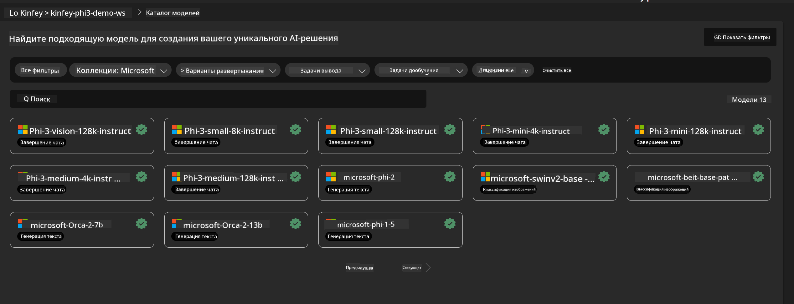
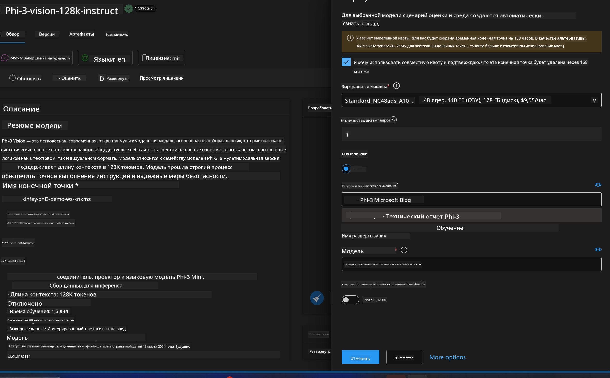
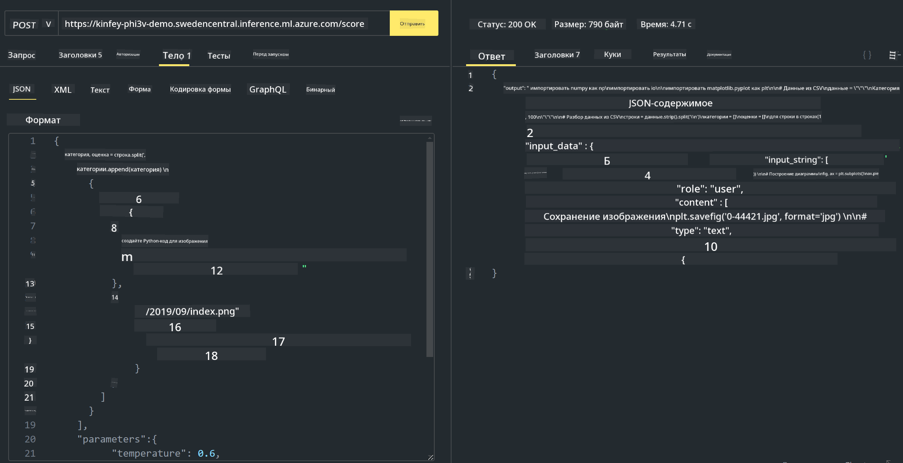

<!--
CO_OP_TRANSLATOR_METADATA:
{
  "original_hash": "20cb4e6ac1686248e8be913ccf6c2bc2",
  "translation_date": "2025-03-27T12:26:02+00:00",
  "source_file": "md\\02.Application\\02.Code\\Phi3\\VSCodeExt\\HOL\\Apple\\03.DeployPhi3VisionOnAzure.md",
  "language_code": "ru"
}
-->
# **Лабораторная работа 3 - Развертывание Phi-3-Vision на Azure Machine Learning Service**

Мы используем NPU для завершения производственного развертывания локального кода, а затем хотим внедрить возможность использования PHI-3-VISION для генерации кода из изображений.

В этом руководстве мы быстро создадим сервис Phi-3 Vision в виде модели как услуги (Model As Service) на платформе Azure Machine Learning Service.

***Note***: Phi-3 Vision требует вычислительных ресурсов для быстрого создания контента. Нам необходимы облачные вычислительные мощности для достижения этой цели.

### **1. Создание Azure Machine Learning Service**

Нам нужно создать Azure Machine Learning Service в Azure Portal. Если вы хотите узнать, как это сделать, посетите следующую ссылку: [https://learn.microsoft.com/azure/machine-learning/quickstart-create-resources?view=azureml-api-2](https://learn.microsoft.com/azure/machine-learning/quickstart-create-resources?view=azureml-api-2)

### **2. Выбор Phi-3 Vision в Azure Machine Learning Service**



### **3. Развертывание Phi-3-Vision в Azure**



### **4. Тестирование конечной точки в Postman**



***Note***

1. Передаваемые параметры должны включать Authorization, azureml-model-deployment и Content-Type. Необходимо проверить информацию о развертывании, чтобы получить эти данные.

2. Для передачи параметров Phi-3-Vision требуется передать ссылку на изображение. Пожалуйста, ознакомьтесь с методом GPT-4-Vision для передачи параметров, например:

```json

{
  "input_data":{
    "input_string":[
      {
        "role":"user",
        "content":[ 
          {
            "type": "text",
            "text": "You are a Python coding assistant.Please create Python code for image "
          },
          {
              "type": "image_url",
              "image_url": {
                "url": "https://ajaytech.co/wp-content/uploads/2019/09/index.png"
              }
          }
        ]
      }
    ],
    "parameters":{
          "temperature": 0.6,
          "top_p": 0.9,
          "do_sample": false,
          "max_new_tokens": 2048
    }
  }
}

```

3. Вызов метода **/score** осуществляется с использованием метода Post.

**Поздравляем!** Вы успешно завершили быстрое развертывание PHI-3-VISION и опробовали способ использования изображений для генерации кода. Далее мы можем создавать приложения, комбинируя возможности NPU и облака.

**Отказ от ответственности**:  
Этот документ был переведен с использованием сервиса автоматического перевода [Co-op Translator](https://github.com/Azure/co-op-translator). Хотя мы стремимся к точности, имейте в виду, что автоматические переводы могут содержать ошибки или неточности. Оригинальный документ на его родном языке следует считать авторитетным источником. Для критически важной информации рекомендуется профессиональный перевод человеком. Мы не несем ответственности за любые недоразумения или неправильные толкования, возникшие в результате использования данного перевода.